This article is the transcript of a talk (FR) I gave for the HitchHack in May 2022, kudos for the staff!

Event: https://hack2g2.fr/hitchhack-2022/ 

Slides: https://docs.google.com/presentation/d/1bkrkAJLuDjfZfsf-9A62rygWe6zR_uiOq_Yd_8X_NGY



---

Like previous conference-related articles, this one will sound more like a transcript than a regular "technical & in depth presentation".

Read the slides first, their explanation will be written below.

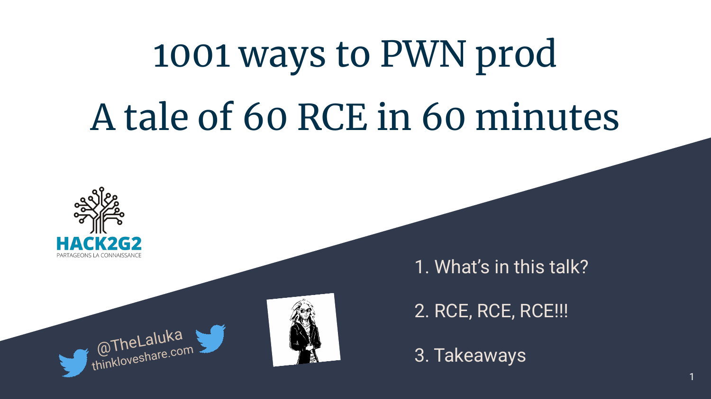

# 1. What's in this talk ?

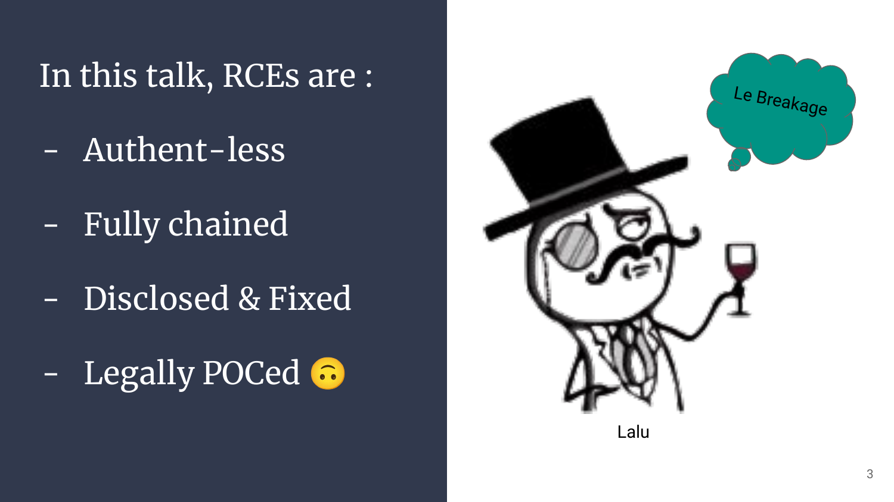

Every vulnerability introduced during this talk will respect the following criteria:

- It won't require any initial information, no vpn, no credential, no internal knowledge
- It will go from zero to hero. From `None` to `Shell`
- Every vulnerability have been reported and fixed
- All this work has been done within a legal frame, being it bug-bounty, professional work, or home-made open-source research

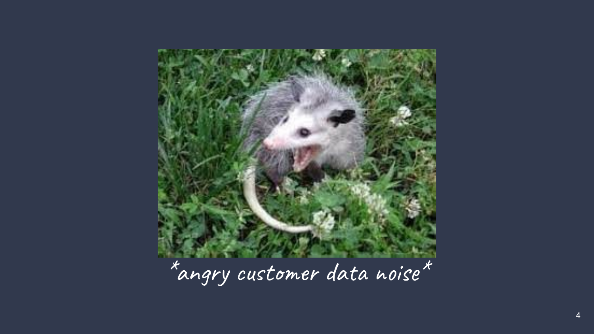

To prevent any sensitive information leak, these slides have been `made from scratch`. It's not even "anonymized" as all its media-content, images, and pictures have been picked randomly on the internet to have illustrations, or are local setups screenshots.

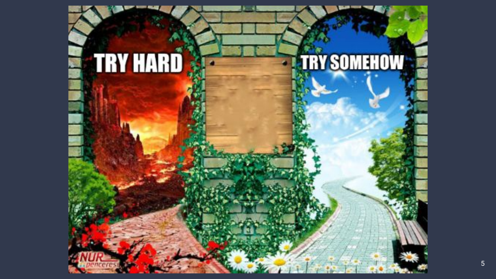

During the initial talk, as I knew this talk was going to be really dense for that much content in one hour, I gave the choice to the public to pick between a Full talk (`TRY HARD`) and a lighter one (`TRY SOMEHOW`) where only the most interesting paths would have been covered.

And it made me `very happy` when `more than 90% of you raised their hand for the TRY HARD mode`! 🥰

That being said, if you want to focus only on the most interesting exploit chains, they are denoted by a fire emoji on their top right corner.

# 2. RCE, RCE, RCE!!!

As we'll now go through a very long list of issues, I'll just go straight to the point, without using "first, then, therefore, blabla, ..." :)

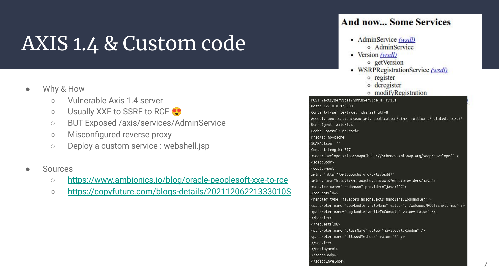

**Case 1**: We're given an old AXIS 1.4 server, meaning a huge underlying huge Java codebase. Usually, Java means XXE to "something great", but here, due to a reverse proxy misconfiguration, the server thinks we're reaching it from and to the loopback, therefore, we are given the `AdminService` endpoint which can be used to deploy new services. It's so powerful we don't even need to dig deeper! :D

From this, we just have to follow any [already existing documentation](https://axis.apache.org/axis/java/install.html) (even non-offensive one) to deploy a jsp file (here a webshell), and `woosh`! :)

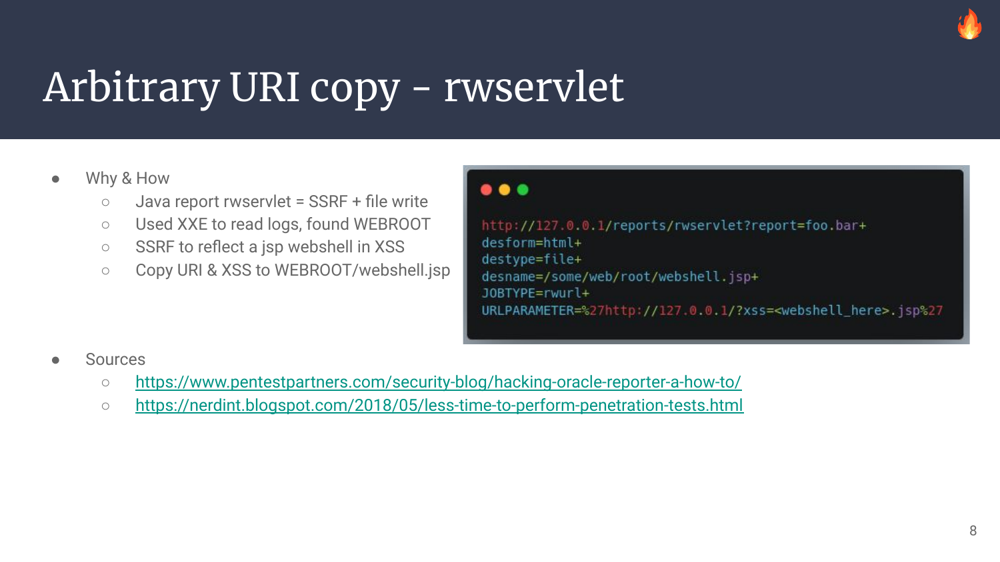

**Case 2**: After some initial recon, I stumbled upon a Java RWServlet. I didn't know anything about this one, but after some time digging, it seems to allow an arbitrary URI copy with some restrictions. 

Many paths could have been taken, probably some easier than the one I took, but I was still new at this, so here's what I tried!

As it seemed that no useful file was present on the filesystem, it would be easier to copy a webshell from the internet to the local filesystem. One painful thing though is that I wasn't receiving the initial request, so nothing was written on the destination either. This is why I used the source of the copy as an SSRF to scan the server's loopback. Once an http server was found, enumerate its paths, then its parameters to finally spawn an xss (actually, more or a "bad chars are reflected" issue) to have the SSRF to actually trigger the XSS on the loopback, reflect a JSP webshell on the webpage, and then have it copied to the webroot. And then? `Woosh`, shell!

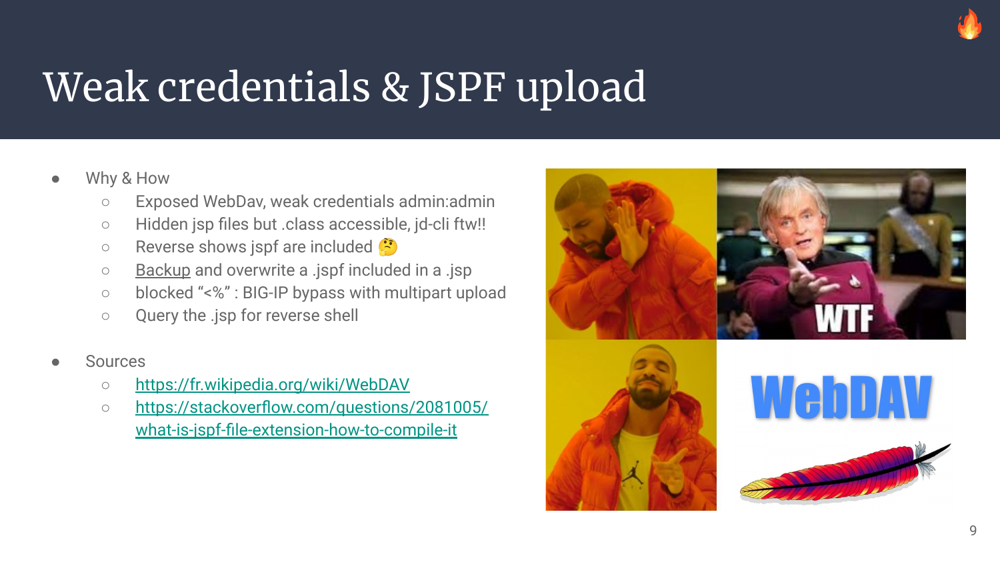

**Case 3**: After some enumeration, the server seems to respond to the WebDAV protocol, allowing modification of a remote filesystem through HTTP. It even suffers from weak/default credentials, el famoso `admin:admin`. Ok, so we're able to read some files, and write some as well! Sadly, it seems that all the .jsp are both hidden and non-writable.

We're still able to read the .class, and a yet-unknown to me .jspf file! After some time reversing the files ([jd-cli](https://github.com/intoolswetrust/jd-cli) on the .class files & bytecode) and grepping around, it seems that .jspf are just .jsp fragments that can both be included and compiled.

First, I attempted to overwrite a .class but it wasn't reloaded. Then, I tried to backup & overwrite a .jspf, which worked (the upload) after quite some time spent on bypassing a BIG-IP web-app firewall, kudos to my colleagues on this one, I had really little experience related to waf bypasses.

Once the .jspf was written, we only had left to find the right code path to get it included again, and trigger our jsp(f) webshell. Yay!

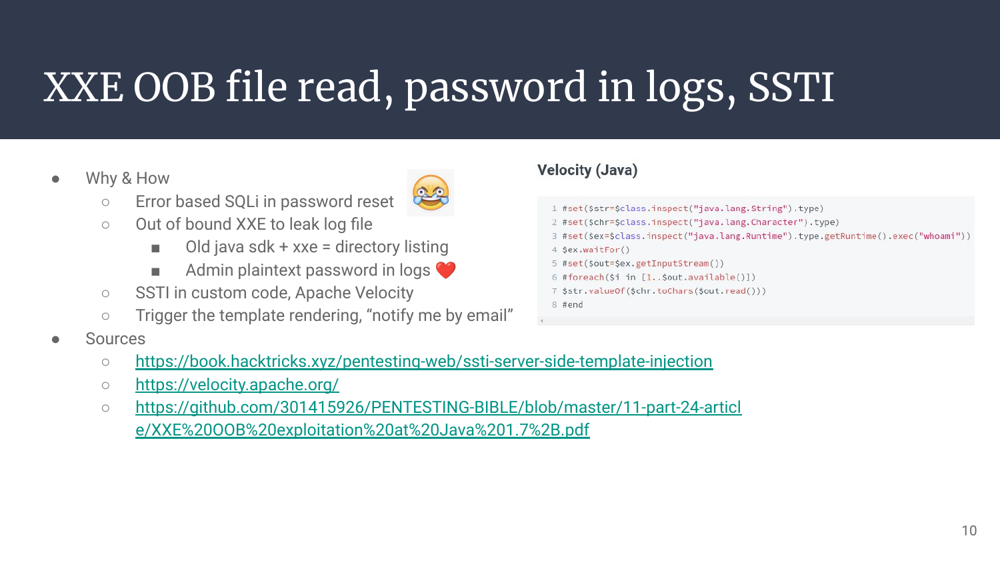

**Case 4**: We're gently offered an SQL injection in the password-reset feature. But no hash can be cracked :(

Luckily the Java app also contains an XXE that allows us to (with an Out Of Bound trick, dtd files) read the files, helped by the fact that old Java SDKs will list a directory when asked to do so.
Luckily, an admin account with its plaintext credentials was waiting for us in the logs.

We've then been able to connect to the application's main admin panel, browse a little to find an email templating feature relying on [Velocity](https://velocity.apache.org/). It was then a matter of time to exploit the SSTI, trigger an email notification, and spawn another shell!

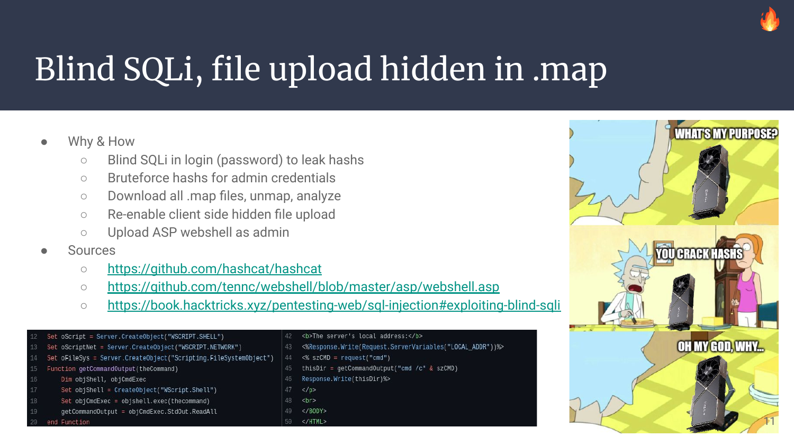

**Case 5**: We also start this one with a blind SQL injection in the login form. In the password field. Again... Anyway, we leaked the hashes! Soon enough, we crack admin credentials, but... Where's the login-feature?

Thankfully, the .map files were still present, so it was possible to recover the clear & commented version of all Javascript sources with [unmap](https://github.com/chbrown/unmap). The application we had was only the customer version, but by re-enabling some Javascript blobs, we had the fully featured app! We then logged-in as an admin, and found an ASP file upload feature, no waf, yes shell!

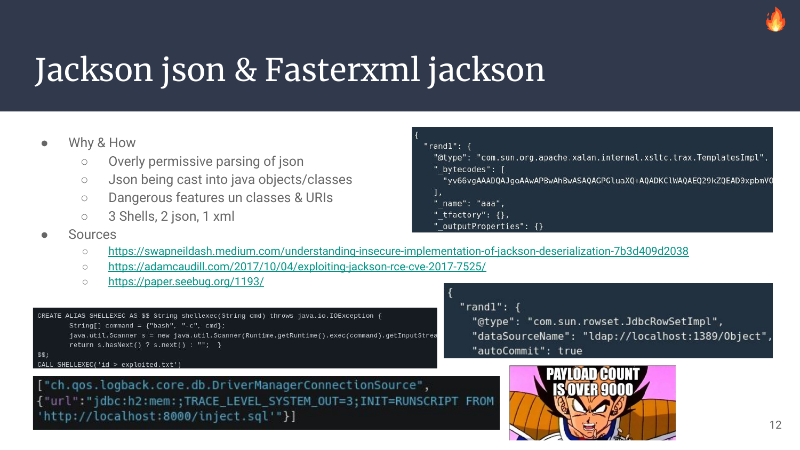

**Case 6-8**: Many Java applications rely on a library named Jackson. There's another flavor named Fasterxml-Jackson, so with these two libraries, it is possible to Serialize/Unserialize json and xml formats with `rich content`. So... Let's be rich?

The main issue with these libraries is that with some tweaking or old versions, they will allow Java classes to be loaded. But being arbitrary or restricted, there have been many way to chain them (similar to Java gadgets) and execute code! On our end, 2 have been exploited with json payloads, one with xml, and most of them were variants of already known classes, or recent n-days :)

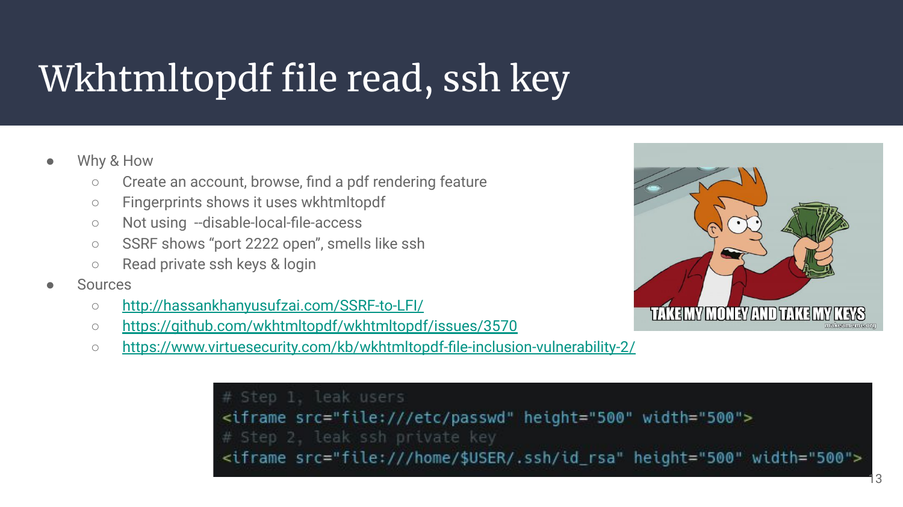

**Case 7**: The application welcomes us with an account creation feature. Account which we create, and use to browse the app until we find a cool pdf rendering feature. Some fingerprinting (xss to draw canva, ssrf to leak user-agent) shows us that it's using Wkhtmltopdf!

It was already public back then that using this software without the option `--disable-local-file-access` would provide access to the filesystem. Yet this option wasn't used. *Sigh*. Please implement safe-by-default options, not opt-in ones.

Reading the filesystem gave us ssh keys within their default path `~/.ssh/id_rsa`, and we let the SSRF internal port scan run for a while. The port 2222 was open! And yes, I forgot to run nmap so SSRF was definitely way more than what we needed.

The port 2222 was also exposed externally, so we just used the ssh feature to walk in! :)

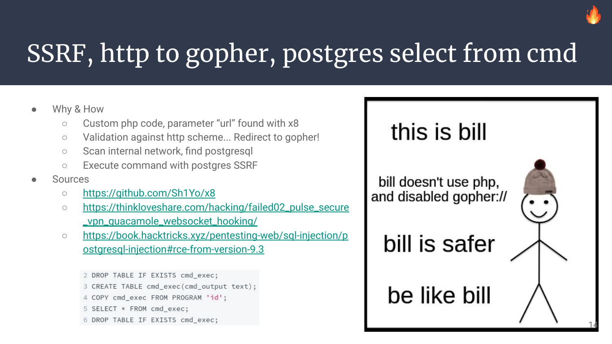

**Case 8**: This one is a custom php application. We crawl it, and then spend some time fuzzing the GET & POST parameters to finally find an unshown parameter: url.

Without much surprise, this leads us to an SSRF which was only accepting the http scheme. One cool thing though is that some redirections were followed, including `gopher` ones.. :)

The SSRF was then used to enumerate the opened ports on the loopback, find a `PostgreSQL`, and send it the right bytes with the gopher SSRF to "COPY * FROM PROGRAM ...". Thanks `psql`! <3

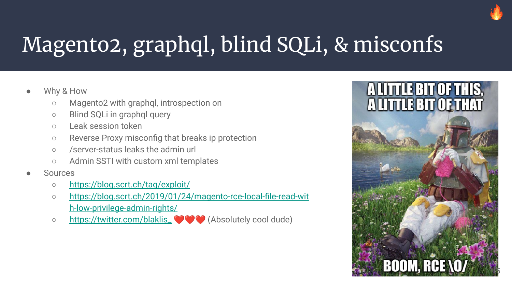

**Case 9**: Hey, nice e-shop you have here! It would be a shame if it had... Bugs? Features? Both?

A quick ffuf scan reveals a `graphql` endpoint that has its introspection enabled, so we quickly jump on the google-chrome extension "Altair GraphQL Client" and enable its discovery module. Then... Send simple and double quotes to every damn field, query as much data as possible, to finally be acknowledged by a single SQL error in the responses. Yup, SQLi there is.

We then use the SQL injection to leak session tokens (hashes were using Argon 2 which wasn't (isn't?) even implemented yet in [Hashcat](https://github.com/hashcat/hashcat), lazy-time here). We shouldn't be able to login to the application with solely this session token, as every token is binded to a specific source IP. But here again we're lucky, as a reverse-proxy misconfiguration is also present! It doesn't rewrite the source ip when the application is reached, therefore every single person (and thus token) is binded to the internal IP of the reverse proxy itself. We used the leaked token to browse the application with admin rights! :D

Also, Magento2 admin-login urls are usually secret & non-bruteforcable. But ANOTHER misconfig was exposing a `/server-status` endpoint leaking the secret interface. WoOOps.

There have been many cases of Server Side Template Injection within magento2, so that's where we spend most of the time. And with some help from our cool-dude [@Blaklis_](https://twitter.com/Blaklis_) it has been possible to make it work in time. No extra detail here until the PoCs are disclosed some day.. 🙃

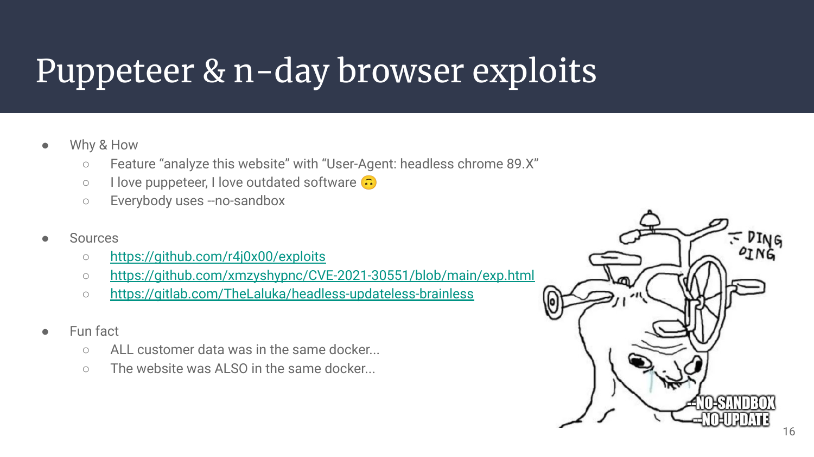

**Case 10**: This one comes from a company which I contacted on twitter, explaining that I "had some concerns about X feature and wanted to dig deeper". They happily answered that tests were allowed and even welcomed, this was way better than I expected!

The application was a frontend, passing calls to an api-focused nodejs backend, that was using puppeteer to fetch various hosts. It was possible to control one of these hosts, which while listening, captured an old User-Agent: headless chrome 89.XXXX.XX. Yay!

I'm not good (at all|yet - pick one) at browser exploitation. But I'm also educated-enough to copy random code from the internet! Which is exactly what I did, testing on a local dockerized version of an outdated google chrome. By using a known CVE & exploit it was possible to jump on a shell code, this one generated with `msfvenom` (hate if you like, it just W09K5). It is also really convenient to use a `0xCC` before your shellcode to confirm that you're actually reaching the right offset. Here, `0xCC` triggers a SIG_TRAP instead of a SIG_SEVG. Then `--no-sandbox`, then reverse shell, then profit.

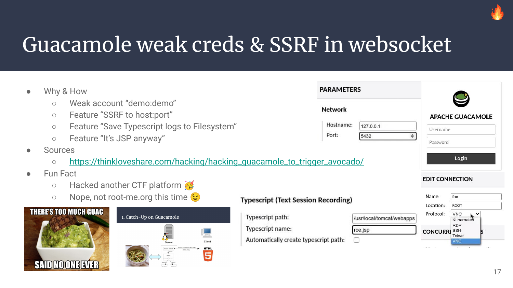

**Case 11**: This one comes from a Hack'n'Learn platform, no name disclosed as they asked kindly to not disclose their identity, which is totally ok! ;)

It all starts with default credentials randomly typed manually (boredom..) on the login interface. I found out later that the most used default login/pass for guacamole is `guacadmin:guacadmin`. Luck does matter!

Apache Guacamole is a protocol gateway that allows us (among many other features) to "netcat" into something (Like a steroid version of SSRF), but it also allows us to log (understand write) the content we type to the local filesystem. Filesystem that contains many .JSP files... What if we write our own? Then we can even reach it internally with the right hostname? Yay!

More on this on a previous article: [Hacking Guacamole To Trigger Avocado](https://thinkloveshare.com/hacking/hacking_guacamole_to_trigger_avocado/)

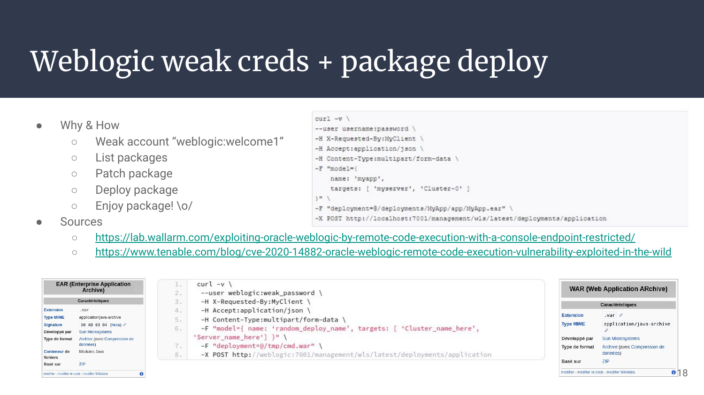

**Case 12**: WebLogic is a THICC software. It contains A LOT of code, and TONS of features. Which usually means forgotten issues, missing hardening, old-load-bearing pieces of code.

Here? Welp, just another weak credential that leads to direct RCE by uploading an attacker-controlled package. It doesn't always have to be hard, does it? I mean, compiling the package WAS actually hard...

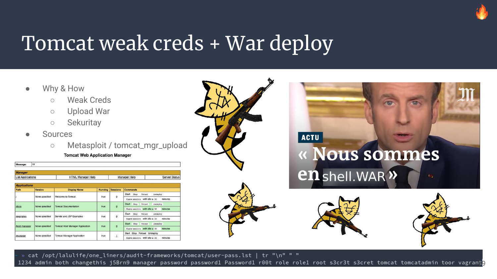

**Case 13-14**: Some software try really hard to distinguish the administrative work that must be done through the command line interface, and the web-admin tasks that are needed to customize the application content. Tomcat does exactly not that. It feels more like "If you're an admin, do your thing, I won't judge you bud!". So we try credentials. And sometimes they work. And we upload a war. And we get a shell. And we're happy.

Sometimes it's not that easy, tomcat credentials are there, somewhere, but strong enough to not fall that easily. We'll get to them soon! :]

Kudos to [@Nishacid](https://twitter.com/Nishacid) for the Tomcat fighters! :D

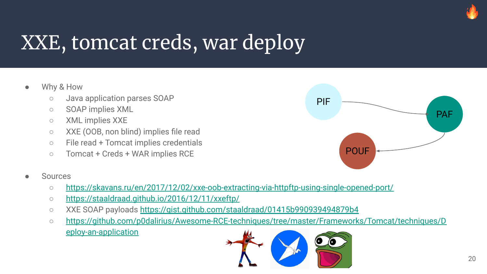

**Case 15**: One more Java application, this time it offers SOAP endpoints, which once again involves xml parsing. Java & xml once again implies XXE, which screams for another OOB technique to give us the ability to read anything on the filesystem. From this, we list directories until we find Tomcat's users.xml file which also contains their password, in either clear or hashed form. Both can lead to RCE, in a more or less direct way!

If you ever need to find how to RCE a specific application with a known admin-to-rce path, remember to check [@podalirius_](https://twitter.com/podalirius_)'s repo - [Awesome-RCE-techniques](https://github.com/p0dalirius/Awesome-RCE-techniques)

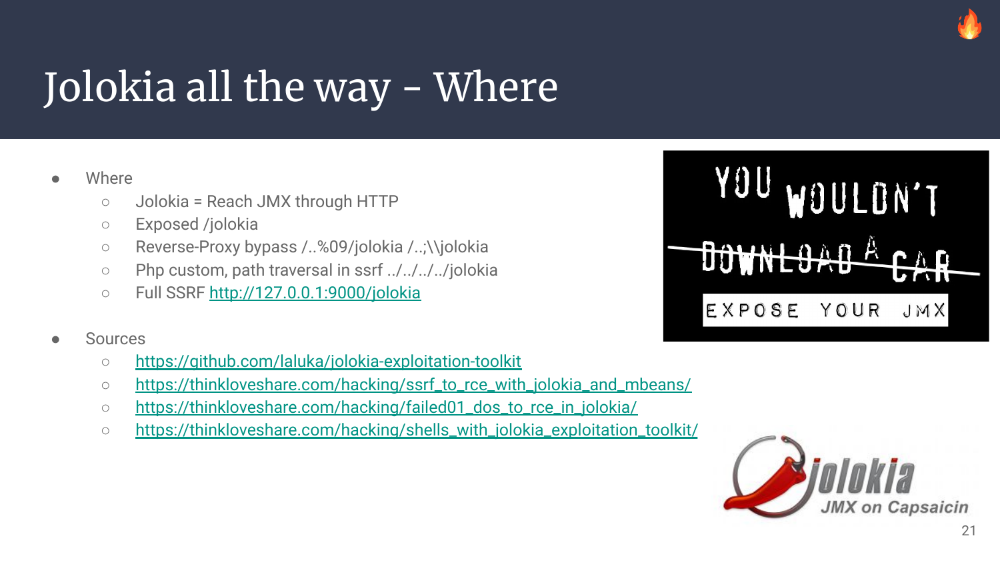

I already wrote a couple of articles about Jolokia. This is a very powerful way to interact with JMX through HTTP. And it's often forgotten, or even enabled by default, which is.. Scary!

You can find them in many places, being it through HTTP, SSRF, path traversal in URI (half-ssrf?), with reverse proxies url bypass, with IP spoofing, and much more! And when we reach JMX, it's most of the time Game Over as there are tons of features, like... Quirky admin features. There's a whole wonderful world in there!

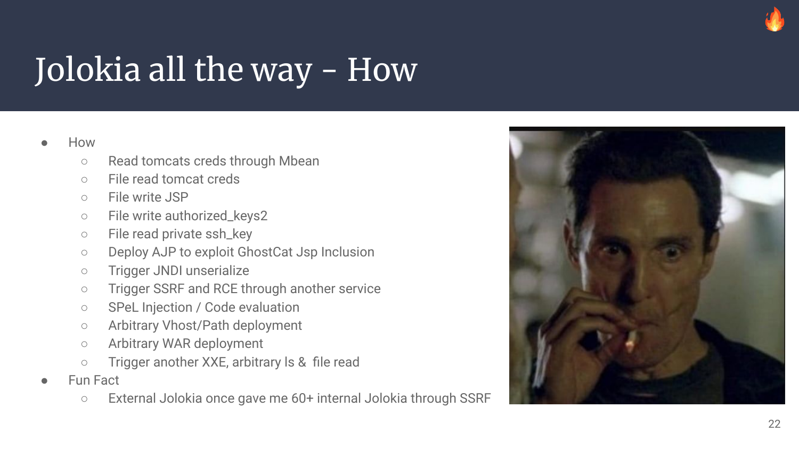

**Case 16**: It is possible to read Tomcat credentials right from a MBean, waiting peacefully in the memory (yes, in RAM, in clean).

**Case 17**: Read Tomcat (or anything useful) credentials with one of the many file-read gadgets.

**Case 18**: Write a JSP webshell somewhere, it's already a Java app, let's make good use of it!

**Case 19-20**: Write an authorized_keys2 (to prevent overwriting authorized_keys) to then ssh to the victim machine if it's available! The other way round works as well, read a private ssh key and Voilà! 

**Case 21**: Deploy an AJP vhost with an old version of Tomcat to exploit GhostCat and have any uploaded file evaled independent from its extension.

**Case 22**: Trigger a JNDI unserialization, there are actually at least 4 ways to accomplish this.

**Case 23**: Trigger a GET or POST SSRF to any other internal service to exploit another internal component. (Thing about cloud metadata urls :3 )

**Case 24**: Direct remote code execution through gadgets parsing SPeL code.

**Case 25**: Deploy another read/write vhost and chain it with a file write with controlled extension.

**Case 26**: Deploy an arbitrary WAR with Tomcat specific features. Write a polyglot war if needed!!

**Case 27**: Trigger an internal XXE to acquire the arbitrary "ls" and regular file read without Mbean-gadget.

There are probably even more gadgets now: [Jolokia Exploitation Toolkit](https://github.com/laluka/jolokia-exploitation-toolkit)

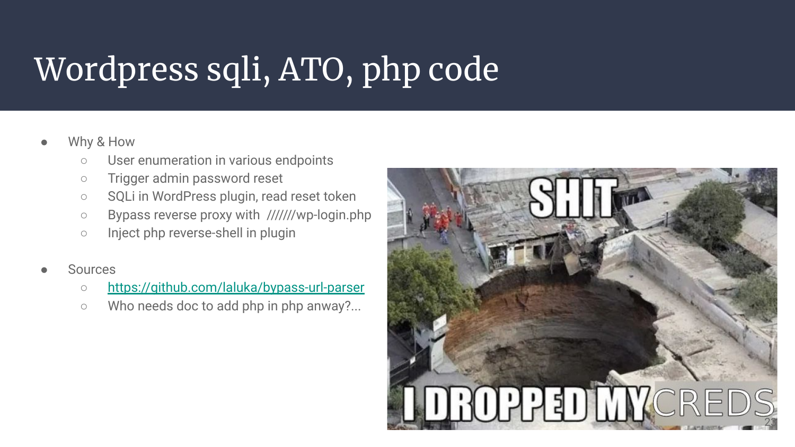

**Case 28**: Some paths are really well known. This is one of them where you start with a wordpress, which like every other wordpress will gently give you its users, authors, admins. Then after some time fuzzing, a plugin contains an SQLi, and after some time digging, you're either able to crack one hash, or guess one. If not, you're still able to trigger a password-reset token and read it later on with the SQL injection. Here, the reset (and login) feature was blocked by the application firewall, but it was still possible to access it by adding multiple slashes in the basepath.

Once done, we change the password, login as an admin, edit the php code of one of the used themes, and trigger the newly-inserted php code execution.

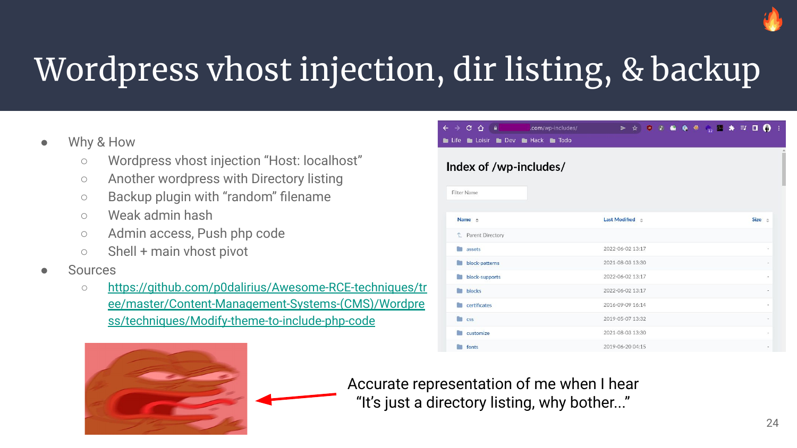

**Case 29**: One more day, one more wordpress. This one offers multiple hosts on the same IP. While enumerating those, it seems that localhost works as well, which is odd. Later on, we realize that this specific vhost has directory listing enabled, with listable and downloadable backups. That contains... Hashes!

Hashcat, login to the localhost vhost, tweak the plugins, enjoy the shell.. :) 

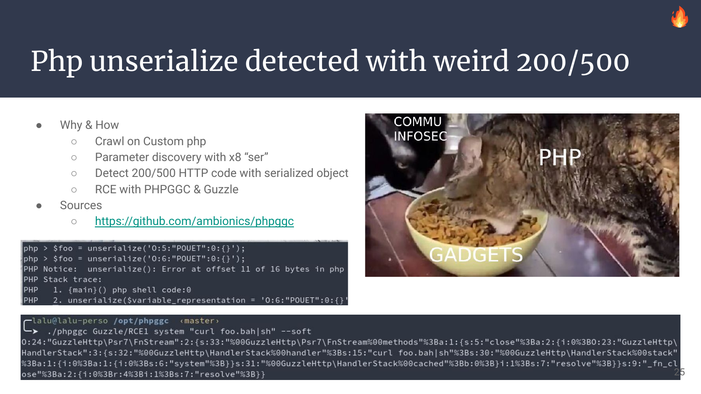

**Case 30**: Crawling a custom php website, and later on fuzzing with a custom list of GET/POST parameters. The parameter "ser" seems to be used, but it would be weally surprising that it's actually related to serialization... Oh, well, it is, as observed with two php objects with different HTTP codes returned. Alright, let's send them our best `forEach` loop with [phpggc](https://github.com/ambionics/phpggc) and hope for the best. And the best came! :D

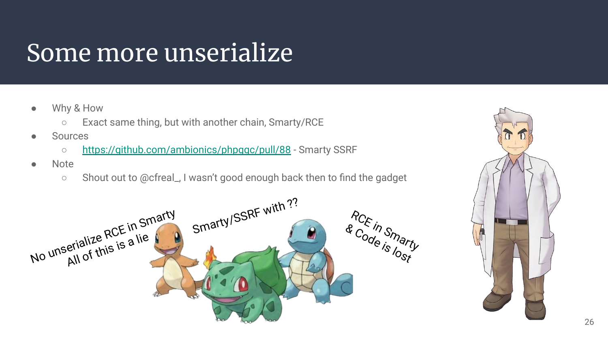

**Case 31**: Just like the previous vulnerability, custom php code, using Smarty for page templating. One funny detail is that I'm pretty sure we used a gadget that gave us a direct RCE, but I couldn't find it back, and I see no PR nor old-code related to it within phpggc, we either lost it, or dreamt of it... Both ways, this wasn't my finding but [@cfreal_](https://twitter.com/cfreal_)'s one, helping, and efficient as hell, like he always is.

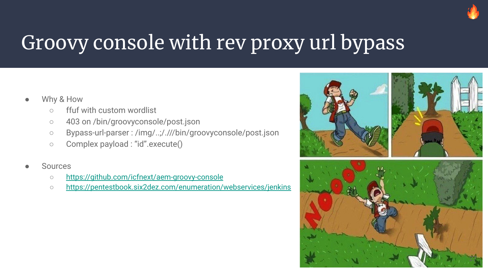

**Case 32**: We start with one more ffuf-based path fuzzing, this time it yells an endpoint I'm not familiar with, groovyconsole? Reminds me of a Java thing but not 100% sure... It responds with a 403 Forbidden, but with some url bypass trickery, it works like a charm, and the first groovy payload taken from the doc worked, so yes, this was a nice week!

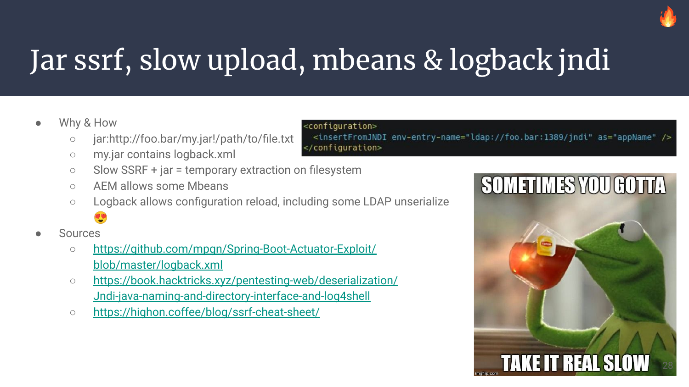

**Case 33**: This one was quite tricky, but fun as hell, it really felt like an unintended way during a CTF.

So you have an SSRF but can find no cool internal endpoint. You have interaction with some MBeans through AEM's features, but the one you focus on (JNDI injection sink) only works with local files, but there is no file-upload within the app. Feels yay & nay at the same time, so close yet so far!

One way to circumvent these issues in order to chain all these bugs was to use the SSRF with the JAR scheme and its /baz.jar!foo.bar suffix to have the content of the file extracted. In addition to this, the server that hosts our jar must send "ghost data" at the end, or find a way to slow the upload to keep the files extracted on the backend. Then, with the MBeans we have, reload the logback (a Java logger) configuration by pointing at the currently existing temporary file, and force the server to emit a call to ldap:// with will contain serialize Java objects, and if we're lucky the right gadgets will also be in the classpath! And lucky we were.

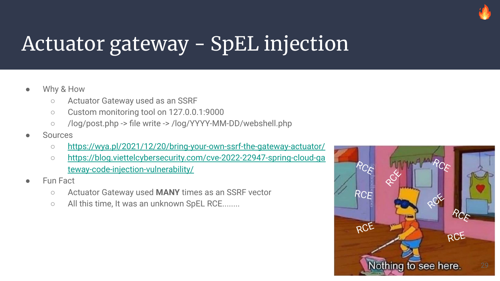

**Case 34**: Actuator Gateway is another tool one can expose through their Java actuator enabler. It allows instrumentation and monitoring for many internal http & server related components.

On the offensive side, we've been using it as a "Bring Your Own SSRF" for ages by defining a route, reaching it, and changing its definition again. It was easily doable to enumerate the whole loopback. BUT a few years later, we're all taught that this was in fact a direct remote code execution with SPeL code injection. We were just all blind to it, assuming this software had already been assessed too many times.. Oof.

For this time still, we used it as a full read SSRF to an internal php logging server where we could post files, achieve a file write, and then use the SSRF again to trigger the newly created php webshell.

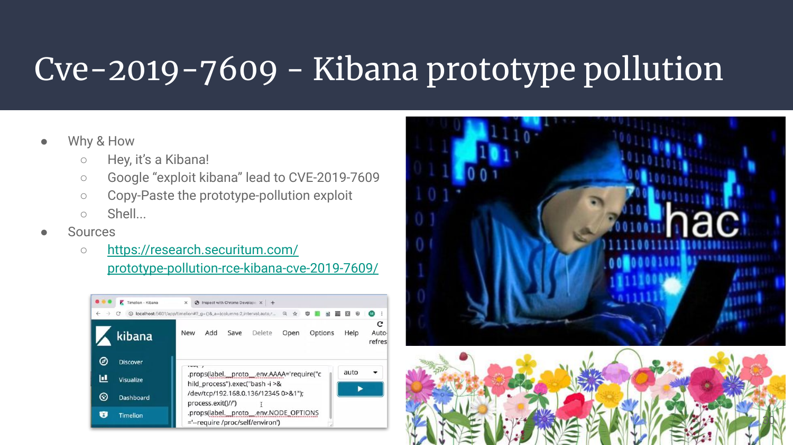

**Case 35**: Me being a simple man. Me find kibana, me check version. Version is old, me google "kibana exploit". Me find known CVE, prototype pollution with PoC. Me copy-pasta, me shell, me done.

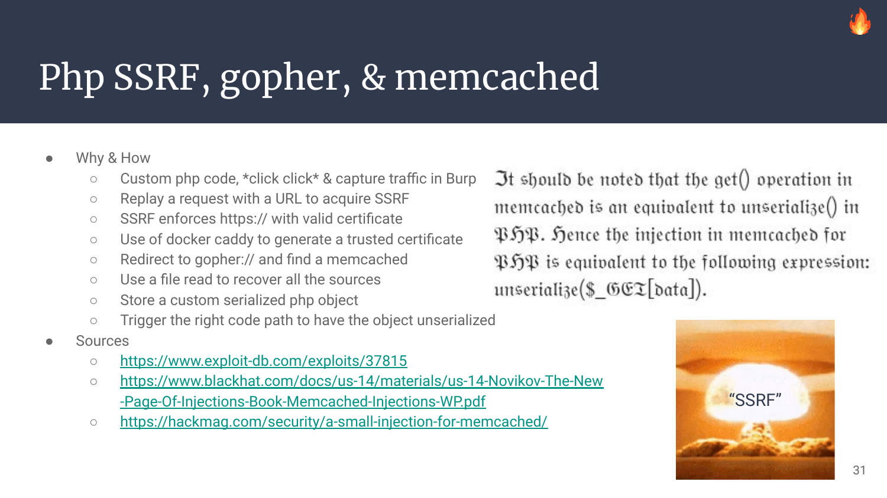

**Case 36**: One more custom php application. By playing a bit with it and inspecting the logs within BurpSuite, I find manually a request submitting an URL. I replay it with a controlled URL (dns callbacks setup), and I get a hit. SSRF acquired, now it seems that the application only works for HTTPS and when the TLS certificate is valid & trusted. It's 2022, we can use [Caddy](https://hub.docker.com/_/caddy) to have a triple AAA TLS server in no time. We then implement a redirection to gopher, and do some loopback scan.

After some enum running in the background, we DO have a MEMCACHED instance running! This means that we can read & write values within memcached with our gopher-enabled SSRF!

The last missing piece here is the default behavior of php toward memcached. If php gets a value from memcached, it will by default attempt to unserialize it. We had a file read for the source code, and enough time to dig into it and create a custom gadget, and this is what we did. This was custom code, so the gadget was really straightforward.

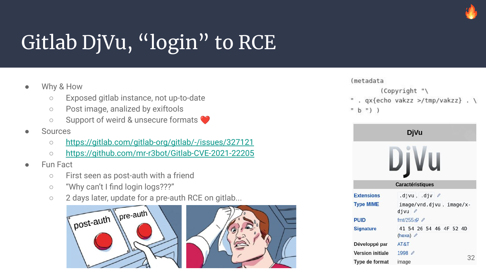

**Case 37**: Gitlab's DjVu CVE exploits the DjVu image format which can contain queries for code execution. Gitlab was using exiftool under the hood for profile pictures, and wasn't blocking this file format nor feature.

I was digging an issue with a friend: A server was supposedly breached by DjVu, but this issue was supposed to be post-auth. Yet we could find no logging error nor success... We were quite surprised, and decided to get back to it the next day. The next day, "breaking news", this was a pre-auth issue, and it took less than a day for the hacking community to find out. That being said, we slept well while procrastinating, which is nice.

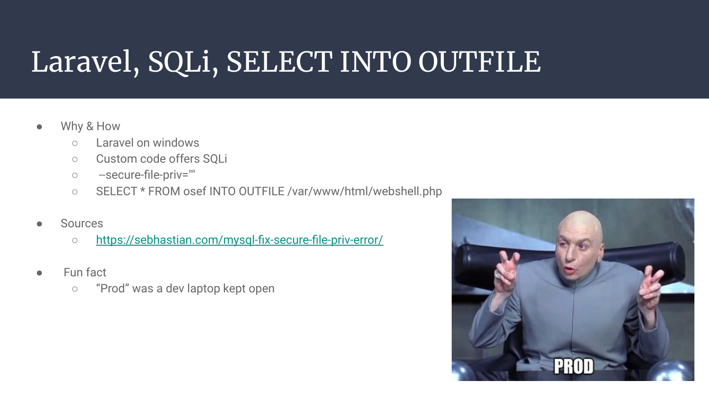

**Case 38**: One of the first times I'm facing a Laravel application, it's a php framework so surely there will be some custom code, with issues. And yup, after some time spent on the application, a wild SQLi stands out! Even better, we can enumerate and conclude on three things: It's a Windows host, we can stack requests, and we can read & write to the filesystem! So without losing time, `SELECT <php_payload> INTO OUTFILE /path/to/webroot/webshell.php`! :)

As stated in the slides, this one was very surprising because after some post-exploitation, the "prod" was in fact someone's laptop, it was even possible (and very fun) to turn on the camera and inspect the (almost empty) room.. :]

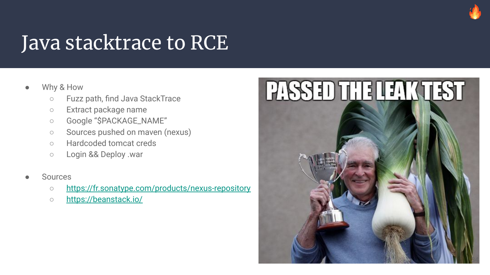

**Case 39**: Here's my most unpopular opinion: Stacktraces and verbose errors are not a "low" issue, but a medium and even sometimes high. Yes, it won't give you a shell right away, but it's wayyyyyy less complex to attack a system that gives you hints on its technologies, methods, params, bugs, contexts, etc. Here's one story to push this further, what if a stacktrace is all you ever needed to connect doct?

So here we go again, crawling, ffufing, grepping stacktraces written in my filesystem. Luckily, we have packages names that seem to not be part of the default & standard Java ecosystem. To get more insights, I'm then spending some time on google, github, gitlab, grep.app and so on, wishing really hard that something cool would pop. And it did! The package has recently been updated and pushed on a public nexus repository, it's even indexed in maven!!!

It's Java, so we can download the sources, and decompile the classes to recover most of the clear sources, even with some comments, and... Hardcoded tomcat passwords! :D

We moved on, assuming the password was `preprod-foobar`, it was too tempting to try `prod-foobar` with our application's tomcat interface, and without much surprise (I wouldn't write this here otherwise, right?), it worked! Then war upload, deploy, shell.

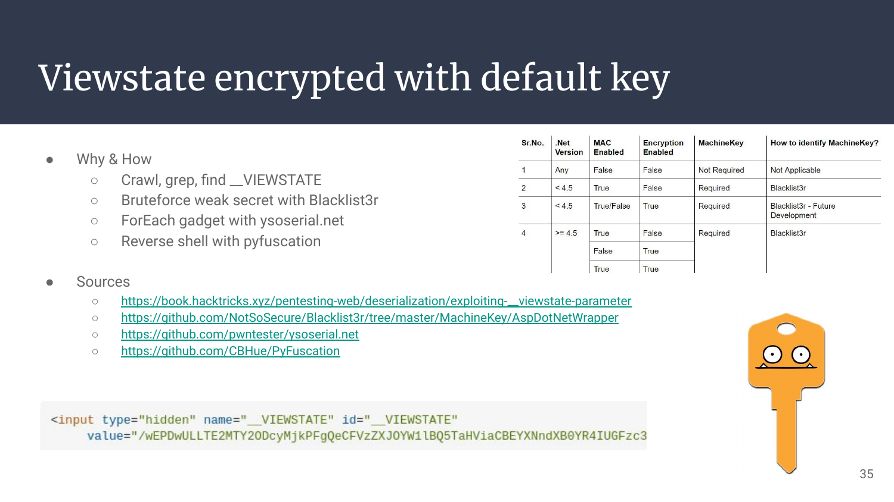

**Case 40**: Now let's embrace the DotNet world for a minute. DotNet uses serialization to keep states among websites pages, this mechanism evolved a lot over time, first the `__VIEWSTATE` token was in plaintext, then an hmac signature was added, then encryption, then encryption WITHOUT a default key... :x

So this app had a `__VIEWSTATE` parameter, found again with crawlz & grep, it was encrypted but the secret was part of the extensive list included in Blacklist3r, which allowed us to decrypt it, and change it by another payload from Ysoserial.net that lead to direct RCE. A better shell was then acquired through Nishang + Pyfuscation to prevent detection by the AV in place.

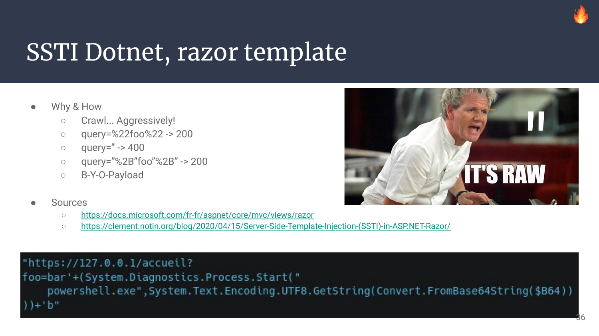

**Case 41**: I love this specific exploit, because it's pure handcrafting and enforces the "don't rely on a single tool" mindset.

New day, new app, I start crawling with a (still yet to be published..) crawler I made years ago: `crawlz`. What I love about it is that it extracts urls and paths depending on the context it's in, saves every request to the filesystem, and also DECODES STUFF BEFORE QUERYING IT. This is an extra important step as even good-looking and working urls like `?search=%22foo%22` can leak to crashes and huge bugs when sent in raw, like `?search="foo"`.

This is exactly what happened here. Parsing urls in an erroneous way, decoding and querying it again triggered a DotNet stacktrace involving "Razor Template". After some research (approx 1mn), Razor is a templating engine, in DotNet, and seems powerful enough to allow code execution. 

- Step 1: Fix the context, find a way to have `code1 OP (payload) OP code2` where we can't control code1 nor code2 as they are part of the application, but with some operations (OP, can be +, -, ;, *, ...) fix the context and force the evaluation of our parenthesized payload.
- Step 2: Read the doc to create the right payload that will execute our command without crashing or hanging the application, this required some local testing as well (VM Windows 10) to prevent any DOS on the audited site.
- Step 3: Trig RCE, Enjoy shell, Share payloads... ❤️

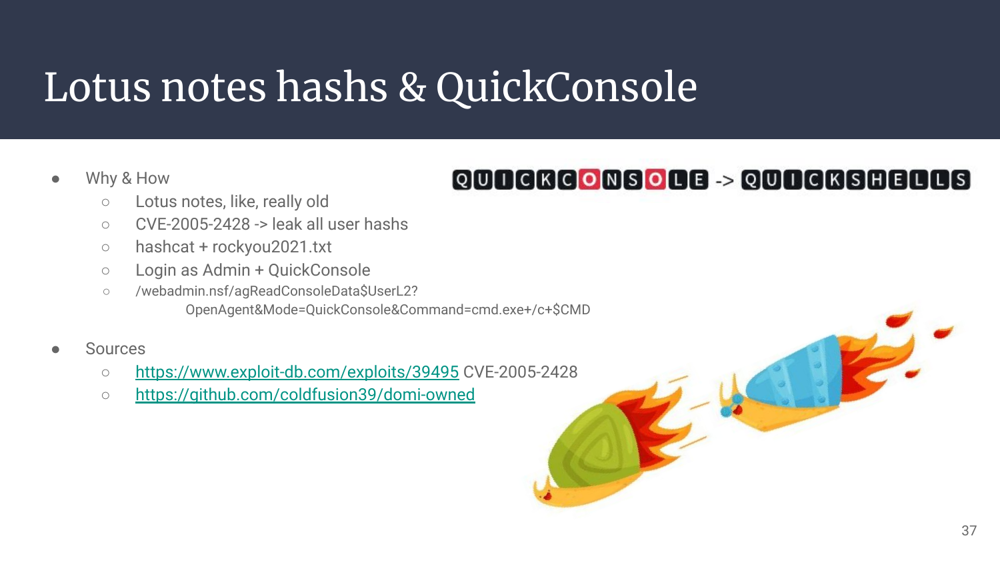

**Case 42**: This website has been made with Lotus Notes, like a LONG time ago. It has never been updated, so the hardest part was to make old CVE scripts work with recent TLS/SSL versions. Once done, it was possible to leak all users hashes, bruteforce them with hashcat (I really like using the new [RockYou2021.txt](https://github.com/ohmybahgosh/RockYou2021.txt) which is roughly 90Go of passwords), and recover an admin account. 

With this admin account, browse the admin interface, and find some features related to console or shell. Practice google-fu again with the right keywords to find a regular way to execute commands with Lotus Notes, use it, and appreciate it.

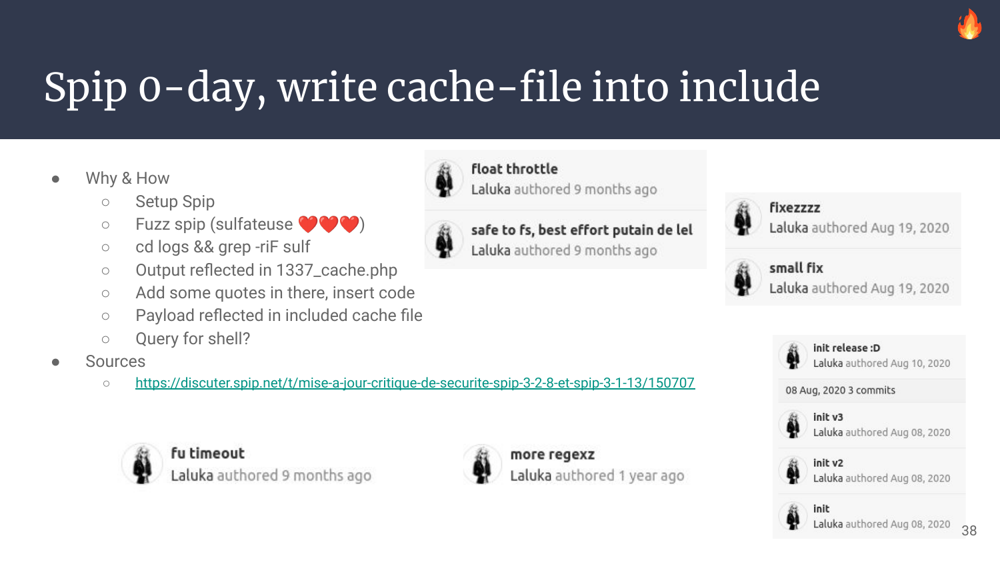

**Case 43**: One of the targets I spent the most time on (along with Jolokia) is Spip. And I did so because I really wanted to find a few quirks within root-me.org, because "It would be nice!". 

So I started coding an http fuzzer already introduced a few times in ThinkLoveShare, but not yet published.. Because a brand new version is `once again` being developed! (Yup, hard to release a wip..)

The main approach was to enable every debug & log feature I could, populate the locally-setup Spip, and fuzz every parameter (and extra params) on every endpoint I found. Many cool things popped out, including a few 0days (SQLi, RCE, XSS, ...). It can be argued that some "weren't actual RCE", but if you think about it, any SQLi is already a RCE, even today, you still can ask for an admin password reset, steal the token with the SQLi, and login as an admin to install any plugin, so yup, SQLi = RCE, without any bruteforce.

This one though was a code injection that occurred while generating a cache file for a specific user. The cache file was included later on, so any format error during its generation would lead to RCE by php-code evaled.

Also, take some time to enjoy the pain (and Joy) of me coding a while ago. Feels like sending messages for my older-self.. :D

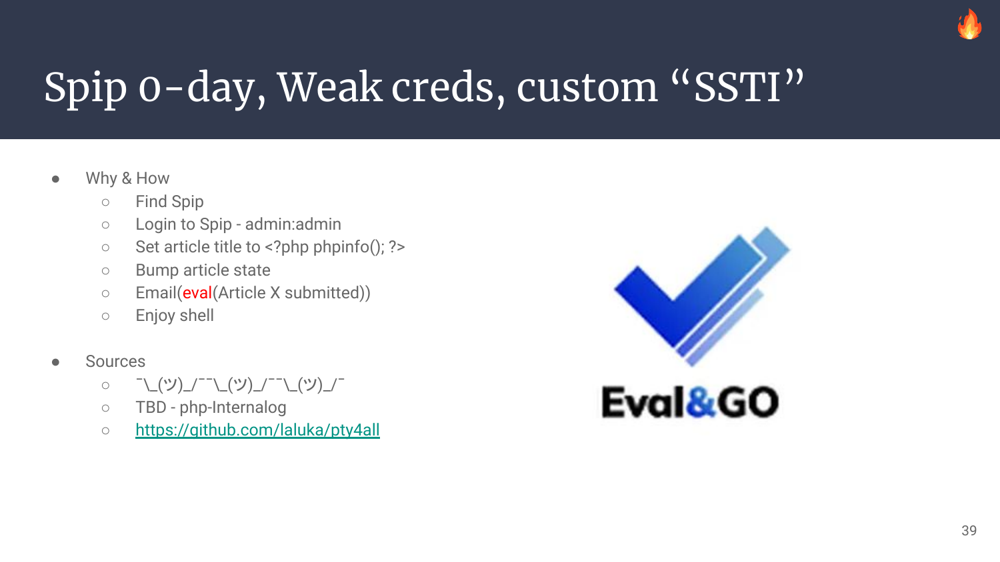

**Case 44**: Another Spip 0day found with a different approach (exploitable as an author (not evil-admin), but once again silently patched: GRrrr...) was an unsanitized code being evaled while notifying an admin that an article has been modified. 

The approach used here was to hook/inspect many dangerous functions within php (More on this with Rump In Rennes 2022!) and send evil payloads all over the place. Automated fuzzing wasn't needed this time, a few samples of php code all over the place, some *click* *click* and a 20 minutes later, *BOOM*, while changing an article from draft to something higher (evaluation, validation), an email was sent with its title being evaled with our raw php content.

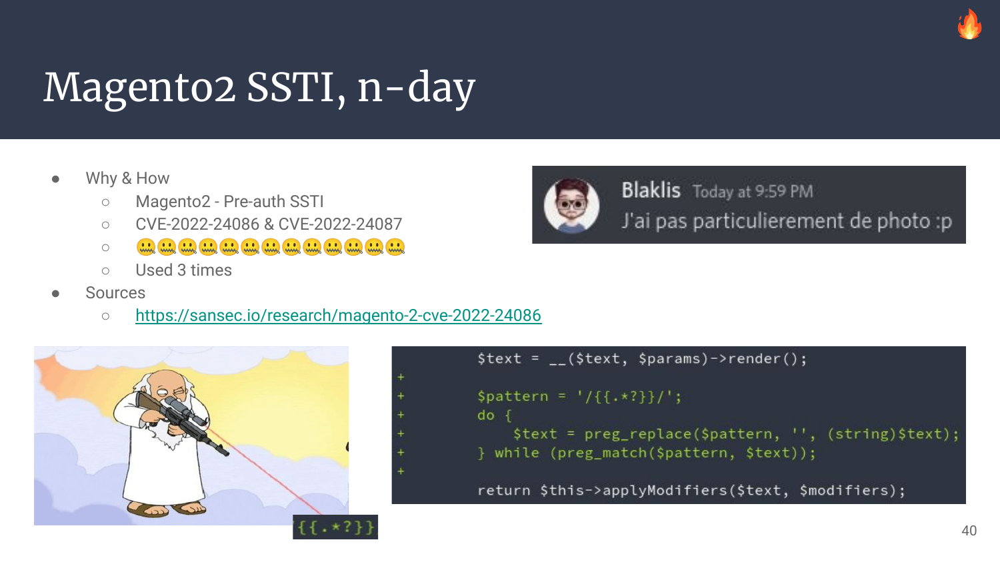

**Case 45-47**: Second time we get to Magento2! And once again, one can either be a security-beast and do it all alone, or be a human friendly being and rely on the awesome community we have in InfoSec! And nope, it's not sarcasm, I really mean it!

The patch was simple enough to realize the issue was an Server Side Template Injection. Grepping all magento2 sources & modules yields some cool results with partial php-like pieces of code within the template. Finding the right sink was also quite easy by simply reflecting data such as `{{self.firstname}}`. But to find the right RCE payload was a SO MUCH HARDER. Actually, I wouldn't have had the time to develop the payload/PoC given the time I had. Luckily, Blaklis comes again to the rescue!

Damn I wish I'll be able to help him back the way he did.. Some day..

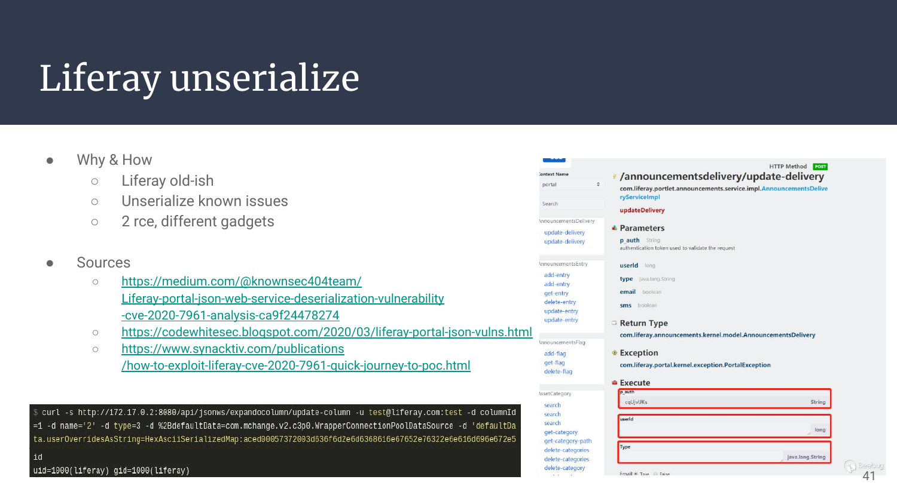

**Case 48-49**: Liferay kind of feels like WebLogic, but in a more RESTFul approach, a bit more tidy. But hey, it's still Java, it still unserializes stuff, it still suffers from arbitrary classes instantiation. Here, a Java serializer object with the right class requested makes the exploit work, gently carried by [Synacktiv's detailed post](https://www.synacktiv.com/en/publications/how-to-exploit-liferay-cve-2020-7961-quick-journey-to-poc.html)! ^.^

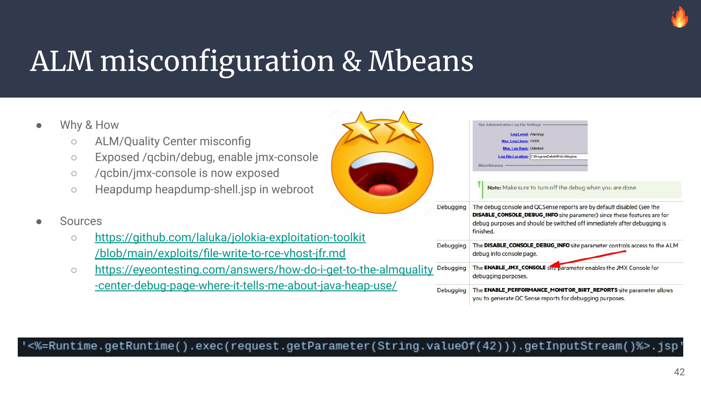

**Case 50**: Never heard about ALM Quality Center? Me neither! But it was suffering from a security misconfiguration that was exposing `/qcbin/debug` to the world. I don't know what this is for sure, but it had a nice "enable JMX-console" button, and as I spent days on Jolokia and thus JMX and its gadgets & MBeans, I knew this would bring us precious help!

Once enabled, `Heapdump` was one of the features offered from the WebUI. From this, it was a matter of time to get a shell.

I love the fact that a HeapDump's name will always appear in the HeapDump itself. It's not too complicated to build a short payload that work both as a file path (no /), reachable jsp file (no null byte, non-printable can be buggy, etc), and IS a jsp payload (actual code exec in jsp).

There is some work to do with chars & url encoding sometimes to be able to reach the webshell once planted. It takes time, but it sure works fine! :]

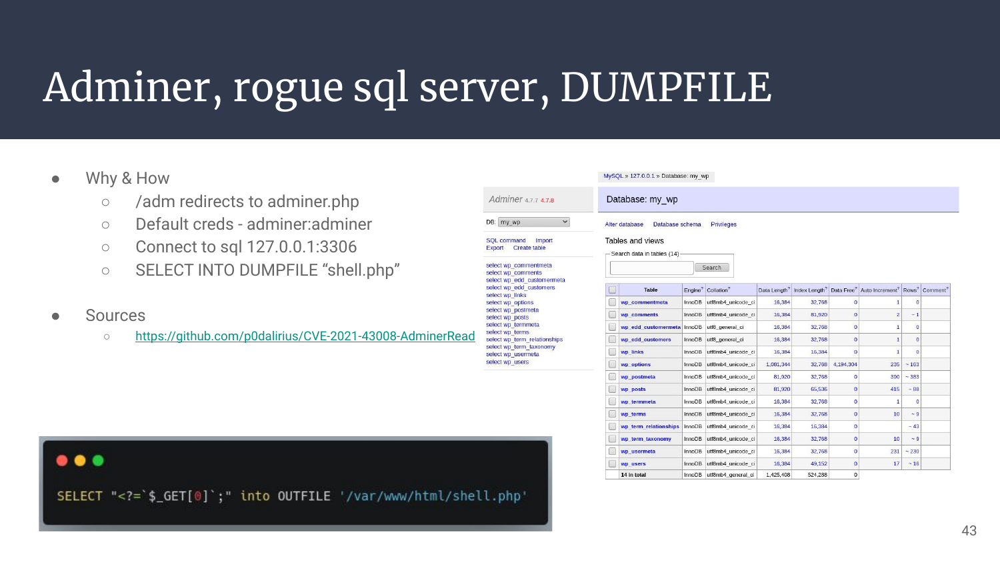

**Case 51**: Ahhh, Adminer. Old friend, victim of Old issues. Weak credentials used to connect to an internal mysql instance, and then benefit from its lack of hardening (access allowed to the filesystem) to `SELECT <payload> INTO DUMPFILE` again, and then access our webshell.

It's quite straightforward this time, but it can be more complex, interacting with another database/system, sometimes from distant hosts (attacker controlled) yet having side effects on the adminer side, etc. I'm quiiiite sure there's still a lot of things to break within Adminer's features!
 

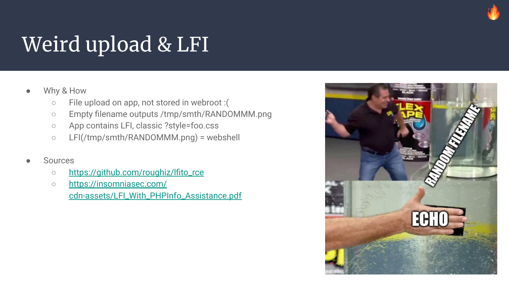

**Case 52**: File upload is a common feature. But relying on the filesystem to store complex file formats isn't always the safest approach! Here, the code contains a test-book LFI, but we had no clue on where the files were stored, and the `/proc` filesystem wasn't working for some reasons I still ignore. So... What?

Well, turns out the file-upload feature was posting the files within a temporary directory first (they were archived later on). They were removed after some time in there, but not immediately.

The other friendly-feature of this file upload, is that when a file was sent with an empty filename, the server was responding with... THE RANDOM AND SECRETLY HIDDEN FILENAME! <3

Pif. Paf. Pouf. Post. Leak. Include. Shell. Beer.

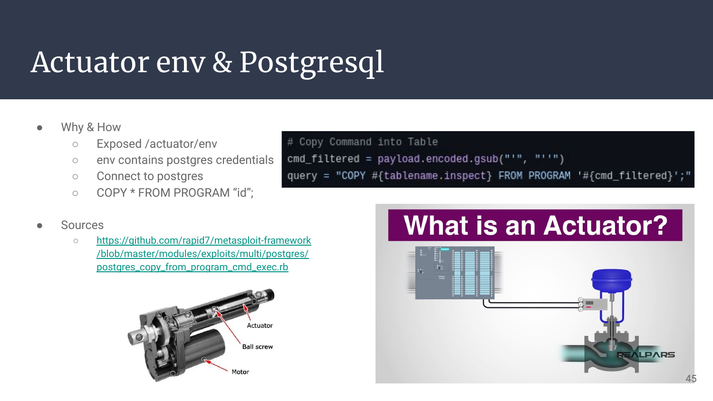

**Case 53**: This time, we're welcomed with an Actuator "/env" endpoint. If the POST method is enabled, it is then possible to modify many properties of the application, and this often leads to RCE. But this time, POST was disabled. Mah :(

But turns out a simple GET on it was revealing (old version as it's now censored) PostgreSQL credentials! This service was also exposed on the internet, which isn't really part of the "best-practices book 2022", so we connect to the database to verify its access, and it works well.

I could have gone the extra mile manually, but from my [research on Pulse Secure VPN](https://thinkloveshare.com/hacking/failed02_pulse_secure_vpn_guacamole_websocket_hooking/), I already knew that a metasploit module was working really well to spawn shells in no time with PostgreSQL: . So I used it and moved on peacefully. :)

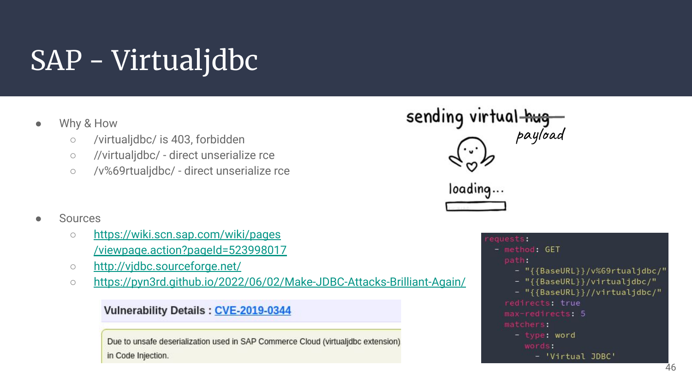

**Case 54-55**: I don't know much about Virtual-JDBC, but a colleague already spent some time on it. I found the endpoint, found the bypass, and knew it suffered from unserialization issues (yup, still Java..)

The payload he gave me worked for the first machine, but the other one was behind a grinchy waf. So we had to improvise and find another gadget! That being said, the payloads are not public yet, and it's not only my work, so no details on this one unless PoCs are to be released by someone else! :)

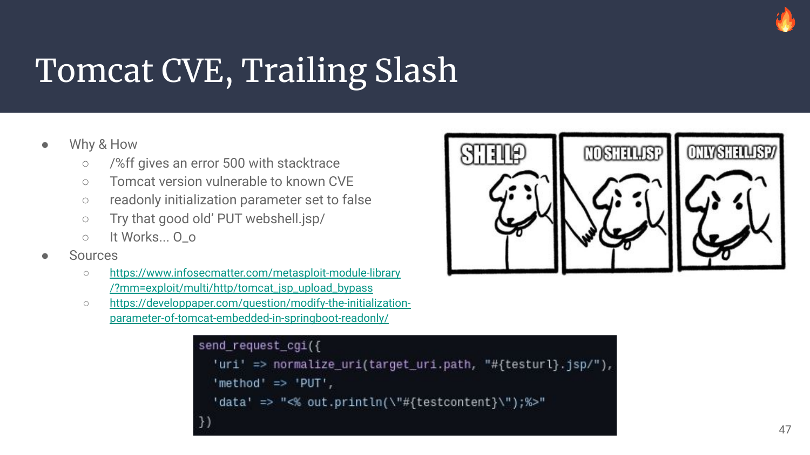

**Case 56**: While auditing websites, I've been facing Tomcat countless times. And everytime I stumbled upon the same trivial vulnerability that I never could exploit: "With a specific configuration & OS, one can upload arbitrary files by sending a PUT request with a trailing slash appended to the URL."

I tried, and tried, and tried. Until some day the planets aligned, and I've been lucky enough to have all the requirements reunited, my webshell.jsp was uploaded straight away, and was executed on the very next curl request. Yay, Hackered!

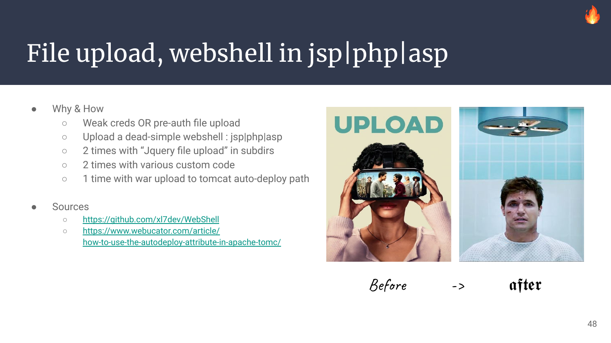

**Case 57-61**: This slide is a farewell for the apps that use a filesystem-based storage, as well as a filesystem-based routing.

Of course, if you rely on the filesystem to expose files, at some point bad files can be created / uploaded / inserted. The filesystem contains too many peculiarities to not be dangerous, think about `/dev/shm`, about symlinks, about zip/rar path traversals, about special chars, about the the DOS with `/dev/urandom` unlimited read, about the `/proc` filesystem with reflected and user-controlled content all over the place.

This can not be safe. 

I don't have much to say, it's the same old story, the same old sorry. You find an app that relies on this and contains a file-upload feature, you mess around with the extensions and paths, and somehow you end up with shells. 

You'll still feel guilty for abusing a poor defenseless app. Like.. Forever.

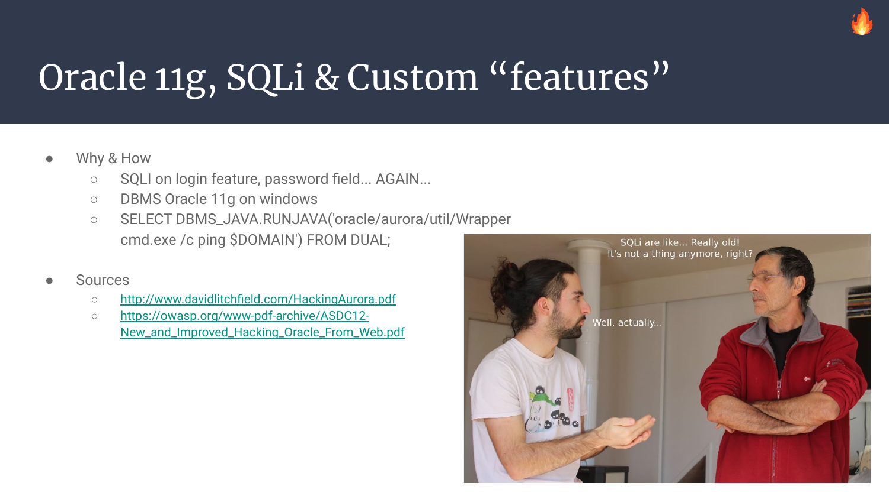

**Case 62**: Le me, Le dad, and assumptions.

This is really a chat we've had a few times. He isn't on the security-side of the force, he plays quite a lot, and is familiar with computers.

And this went like this: "Oh come on, buffer overflows have been a thing for 50 years or so, there must be a solution, something to get rid of them!"

And this went like this: "Oh come on, file uploads have been a thing for 50 years or so, there must be a solution, something to get rid of them!"

And this went like this: "Oh come on, SQL injections have been a thing for 50 years or so, there must be a solution, something to get rid of them!"

I wish dad. I wish.. (Well, I wouldn't have a Job so I "kind of wish"..)

So anyway, our app suffers from an SQL injection, once the context has been fixed, the stacked queries were also enabled. This was a Java app using Oracle 11g on Windows, which is a nice combo to stack many obscure features embedded in many tools without even being aware they're present!

And they were there, laying in the ability Oracle had to run commands through a Java wrapper.

So we use Java, to reach the SQLi, to reach Java, to run a command. OOoookeyyy! :°)

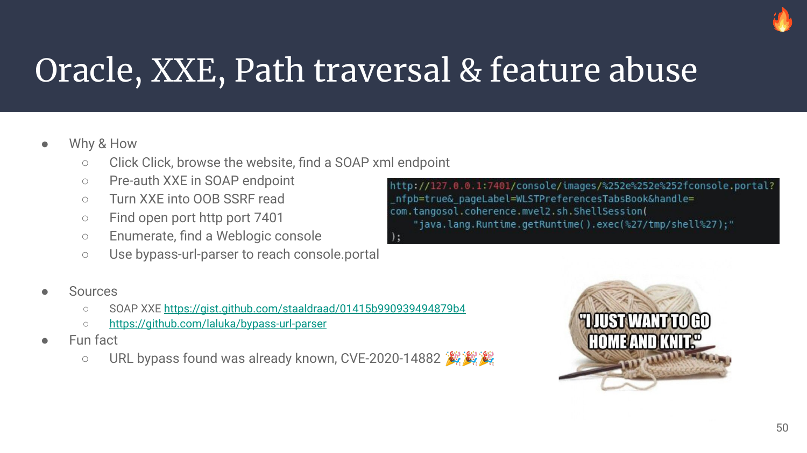

**Case 63**: Hey, It's me again, Java! Remember me? I love SOAP, SOAP loves xml, and when I'm with my friend xml, we offer XXE to the world to spread joy! <3

Using the XXE as an SSRF allowed us to find the internal port 7401 open, turning the XXE to an (almost, bad chars..) full read with OOB interactions (once again, external .dtd file) helped us fuzzing the paths available on the port 7401. We had one path that seemed like an admin feature, and after some time spent on the doc & internet in general, it indeed was! But its access was denied, we were missing the required Basic-Auth header.

BUT, with [Bypass Url Parser](https://github.com/laluka/bypass-url-parser) it was possible to obtain a 200 return code with the path we had. Funny enough, we thought we had found something big, and we kind of did! But one year too late, this was already a CVE! At least there's no painful CVE process to follow.. ;)

**Case 64**: Second WebLogic, this one welcomes us with the endpoint `/xmlpserver/ReportTemplateService`. It's outdated and already suffers from a trivial authent-less XXE  from 2019.

So we read admin hashes from the filesystem (It took some time to dig around, but once more, old Java SDKs will list directories for us when requested so <3). We cracked some hashes, but no admin ones. So we took the recovered plaintexts, wrote some variations, added more hashcat rules on top of it and the second run finally cracked 2 admin passwords! :D

So we try to make good use of the admin interface. Soon enough, we realize that there's a configuration page that takes manu URLs or even URIs as "string configs".

It's Java, Java likes JDBC, and JDBC have been trogouthly researched for URI parsing & instantiation to RCE. Lately, the really good article [Make JDBC Attacks Brilliant Again](https://pyn3rd.github.io/2022/06/02/Make-JDBC-Attacks-Brilliant-Again/) has been released by [@pyn3rd](https://twitter.com/pyn3rd), remember to check it out!

It wasn't released back then, but there were already enough resources about it to copy-paste a few payloads and wait for our shell! :D

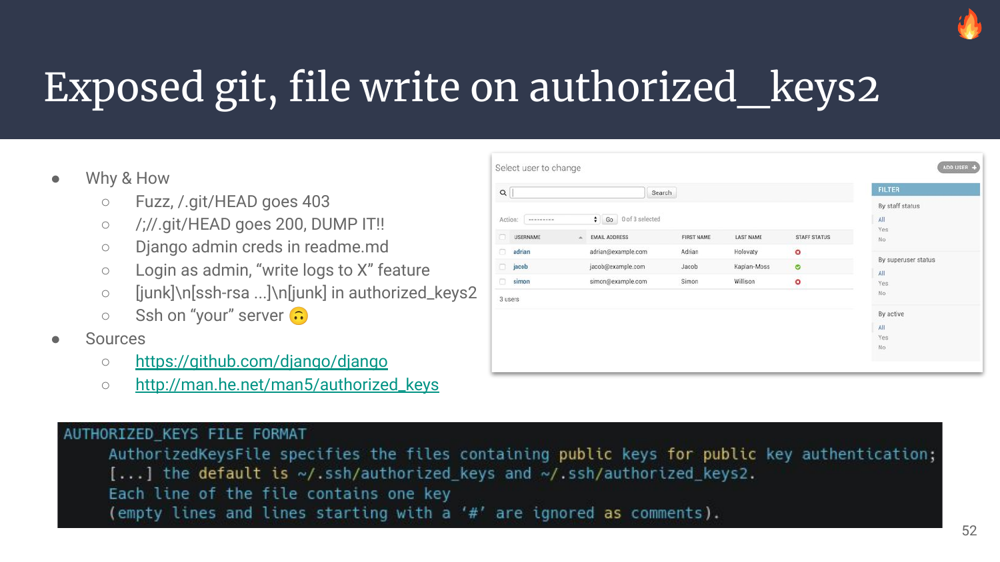

**Case 65**: Brand new day, brand new fuzz, and git files are there but "protected". Url bypass goes BRRRR, and we can access the .git folder and recover all the sources.

By going through the sources, two things stand by. The first one is the admin credentials that are given in plaintext in the readme, and the second one is what seems to be an arbitrary file write, but with partially controlled content.

The idea here was to login as admin, and ask for a "logs export" to `~/.ssh/authorized_keys2`, but we also need to inject our public ssh key in there. To do so, we can either add a new object in Django's backend or trigger an error 500 by querying an URL with `%0A%0A<pub-ssh-key>%0A%0A%ff`. The %ff will fail the url-decoding step and trigger the error 500, and the new lines will help us to have a clean line with our public key.

Thankfully, ssh's `authorized_keys` files remain fault-tolerant in 2022. This was also true for crontabs, but isn't anymore, if they contain ANY error, then the whole crontab gets invalidated, which prevents dirty file-writes direct code execution through them :(

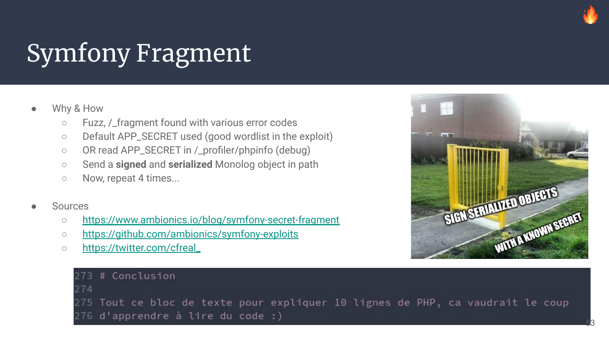

**Case 66-69**: Here is another cool exploit found by [@cfreal_](https://twitter.com/cfreal_), it relies on a "secret" key that no one ever took the time to change, or that was generated with badly generated random bytes.

If you know the `APP_SECRET` used by a symfony-based application, then there are endpoints that are reachable and will unserialize objects that are both signed and encrypted. Other pieces of information required to sign the object are the internal url, path, port, the algorithm used, and sometimes a few other things.

Many of these parts can be bruteforced, to later on obtain the right signature, and send a (most of the time) Monolog serialized object to execute arbitrary functions.

This exploit relies heavily on the `/_fragment` endpoint to be reachable, and on the secret being known, but once more, there are ways to chain this issue with other bugs, like a file read to steal the secret, or a debug-mode to read it from the env. This also works with a `phpinfo()` output. 

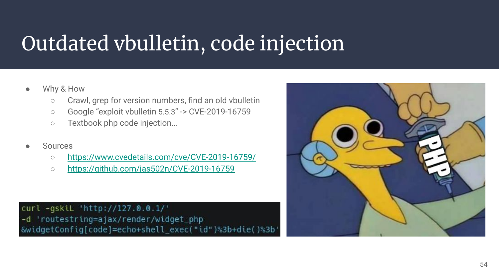

**Case 70**: Are you ready for a really complex vuln? Nah, me neither. Open your browser, "vbulletin 5.5.3 exploit", extract the interesting request from the overly long public exploit, make a curl out of it, and run away with our stolen shell.

Why tf do people need to write 50 or even 100 lines of python where a simple `curl` that anyone could read quickly & copy-paste is enough??? Whyyyyyyyyy?

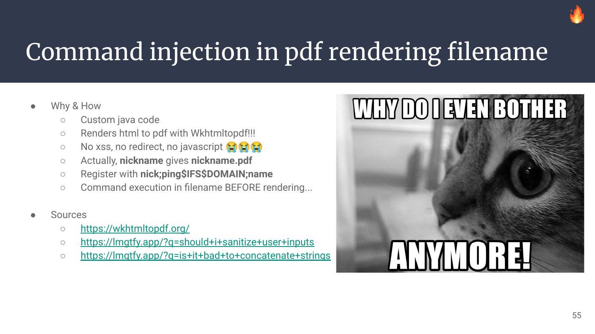

**Case 71**: Hi Sir Java, you're here again? For a good time, right?

Within the custom code of the application (no clue about its framework), a feature allows the user to render html pages and export them to pdf (No clue why either, it didn't seem to be linked to any feature...). Within the exported page, it seems that all the content we can control is properly escaped during the render, and we're then redirected to a file download for "nickname.pdf".

I was running out of idea for this pdf renderer, so I tried to register another account with a badass nickname: `nick;ping$IFS<my.domain>;name` and this still lead me to the pdf download, but this time, my dns received queries, which implied we already had command execution.

Once the source had been recovered and analyzed, it revealed that the webpage to export was first saved to the filesystem as `nickname.html`, and then `wkhtmltopdf` was run on it with the outputname generated from the inputname. In a bash command. With no escaping! <3

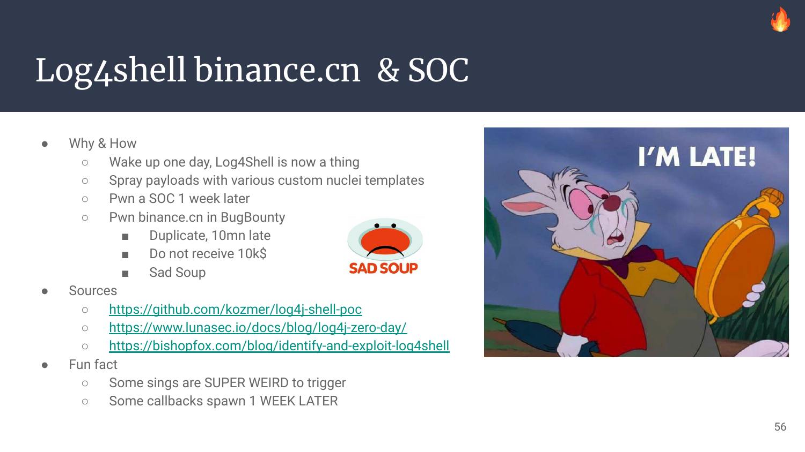

**Case 72-73**: It would be sad to have our big bag-of-bugs without our latest bad-boy, the one that caused quite a lot of trouble and completely messed up my honeypot auto-triaging scripts, right? Riiight???

So, one jndi injection caused by log4shell was REALLY hard to uncover because it was the intersection of many conditions. The request had to: 

- Be a POST request
- Have an overly long path
- Have an overly long parameter KEY with a non-null value
- Have 2 specific headers set by the frontend (or spoofed)
- Have a body of 1M or so

This is the adequation of all these things that lead to the full compromission of a SOC. It has been pretty hard to identify the true reasons for this behavior, but it seemed that in order to have the payload logged (and thus log4shell triggered), it really needed all of this.

And you know how we found it? By sending many similar-looking payloads in ALL THE PLACES, MANY TIMES, AND EVEN MORE. Basically creating the most ugly-terrific request ever, and spraying it with `nuclei`. What a world.

The second shell we obtained with this was on binance.cn which have their own public bug-bounty program. But hey, we've been raced by 10/15mn, so instead of 10k$, we received a gentle thank you. Well, it seems that some minutes are definitely more expensive than the others! We saw the other report, it's fair game.

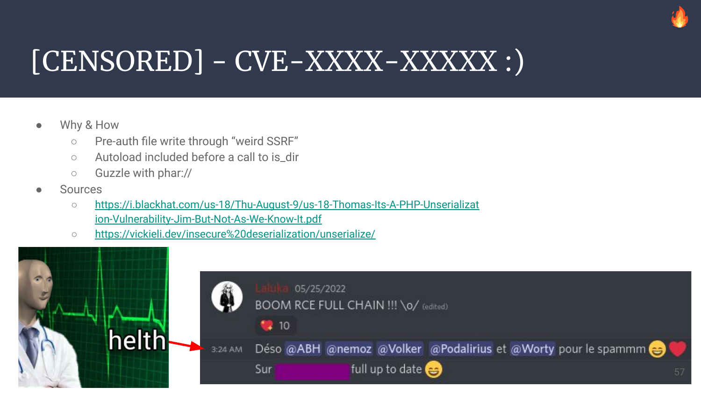

**Case 74**: The latest RCE of this blogpost is the latest I found, a few days before the initial talk. This issue has been disclosed but isn't patched yet, but it's pretty obscure and I see no way anyone could find id from its details as they could apply to MANY apps, so here they are!

Take an app. A php app. Crawl & Fuzz, find an authent-less SSRF. By following the code, it seems that the SSRF is used to retrieve a file and save it to a predictive location on the filesystem, so we have a file write as well!

This app also has autoload in place, but not for every endpoint. It also seems to use Guzzle which is known for its unserialize gadgets. The `phar://` wrapper hasn't been disabled, so by finding the right gadget, the right file path, and the right sink (here, `is_dir`), RCE can be obtained in two curl requests! :D

It's still sad that with php, in 2022, you just want to check if a path is actually a directory, and you end up with a pre-auth remote code execution.

At some point, it's not because of the devs, it's an inherent problem with the language used and its specificities. Php was useful, was a thing, but for a better world, we should stick to "was", not "is". 

That being said: `No shame on the php community, devs, nor maintainers, it's just my opinion, not a truth in any way!`

# 3. Key Takeaways

## Let’s apply Pareto’s rule: 20% effort == 80% efficiency

1. Do not mix routing & filesystem
1. Avoid to the maximum PHP & Java
1. Keep your software up-to-date
1. Be super careful with
    - Serialization (Unserialize for the win <3)
    - PDF rendering (browser exploit, file read, XSS, SSRF)
    - File-Write & Upload features (WebShell, ssh keys)
    - String Concatenations (SSRF/CMD/SQLi)
    - Stacktraces (Not a joke, it’s often the first sin)

## Then, what would be a safe prod?

1. Golang or Rust backend (API only), compiled into a single stripped binary
1. A React frontend (or trusted types) to mitigate most of the XSS
1. An ORM used in the backend for every database request
1. Increase segmentation, one service by minimalistic container
1. A strong Web Application Firewall (Cloudflare, Sqreen, Imperva)
1. A strong Software Update Policy (bump everything twice a month)
1. Frequent security audits, and security trainings for the developers

# 4. Kudos

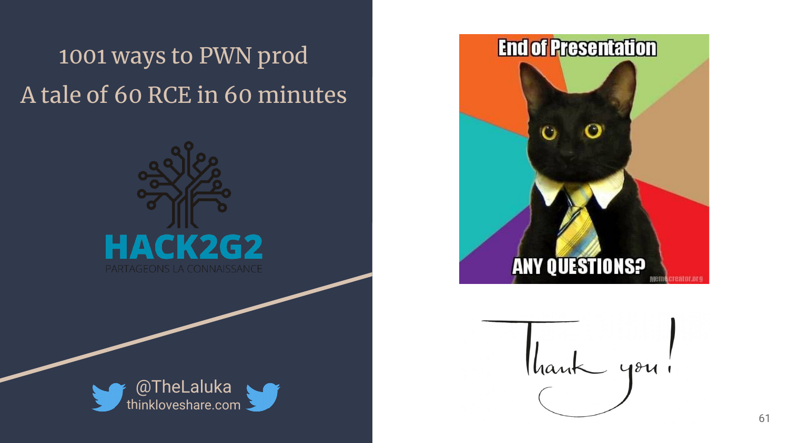

As always, a big shout out for the staff, the organization was once more flawless (Okok, they still YEETed twitch when the internet connection died)!

And thank you for reading through this overly long blogpost, in the end, we went through 74 shells in something like 60 different ways!

Have a marvelous breakage, and a lovely day!
