From time to time, I help friends to troubleshoot issues. Coding, system administration, hacking, pretty much anything as it's a good opportunity to learn from what they are doing, and teach cool tricks at the same time. One big issue though is that I really _rarely_ have a decent connection. Thus, using common tools such as [TeamViewer](https://www.teamviewer.com/), [Anydesk](https://anydesk.com/), RDP, on anything else isn't really working well, crashing, extra slow, ... \
So.. How can I help? Be helped? \
Especially when both of us are on local networks that do not have a public IP with open ports setup? \
Even worse, when the helped one do not have root access on their machine, and thus can't install tools? \
Well, I'll tell you, everything you need is <s>a good</s> <s>a decent</s> an internet connection, and your favourite ssh client!

The solutions I'll describe already made their proofs (at least they worked for me) with the following usecases: 

- Patching security breaches in a website. He knew the app design, I had more insights on the logs, we jumped on it all together and got that SQL injection patched in no time. 
- Installing ffmpeg on a really old centos box, behind a quite strict reverse proxy. She had access to this box and I had more experience with centos and bad dependencies handling (broken .so files, misplaces links, missing packages and the lack of repositories to install from). 
- Solving CTF challenges with friends, from binary exploitation to windows pwning, not forgetting regular web audits! That was muuuch fun, and so many laughs!

There are many ways to achieve that, but they all have their own pros and cons. 

1. [VPS](https://www.digitalocean.com/) + ssh + socat + tmux
   - Pros
      - You own and control everything you use
      - No need for any tool nor privilege
   - Cons
      - It's quite complex
      - You give an access (even sandboxed / with low privileges) to your server
1. [gotty](https://github.com/yudai/gotty) + [ngrok](https://ngrok.com/)
   - Pros
      - The helper doesn't need anything but a browser
   - Cons
      - Not everything is easy in a browser, but damn it's fast!
      - Ctrl^W in shell deletes the last typed word. But closes the current tab in a browser. FUUUUUU
      - Relying on ngrok (account needed, only one connection for free)
1. [tmate](https://tmate.io/)
   - Pros
      - Easy As Fuck to use
   - Cons
      - Relying on tmate's servers / folks
      - Not knowing what's under the hood is sad :(


A few words before we dive in: 

- For this article, I will call our dear friend we want to help "Helpee" and ourselves "Helper"
- The port forwarding stage introduced with SSH can be exchanged with ngrok (thus no VPS needed)
- A DNS is already setup and resolves vps.thinkloveshare.com to my server's IP, this is not mandatory if you hardcode all IPs instead of using a domain name. 
- There are always many ways to achieve one thing, I'll just demonstrate a few ways to achieve this, but it's just a start. Try different things, experiment new tools, learn cool stuff! 
- I do pretty much everything as root on this vps as I use it and then throw it afterward, do not do that nor run programs as root on a production box, especially if it's network related... =]

Alright, let's start! 


# Solution 1 : VPS + ssh + socat + tmux

This first way to support Helpee is probably the most complex, but in the meantime, it allows us to achieve this without installing anything on Helpee's machine. Moreover, it allows us to keep everything under our control. We only assume Helpee already has an ssh client installed. 

Here are the steps we'll follow: 

- Prepare handy static tools hosted on Helper's server so Helpee can download and run them. 
- Get Helpee to establish a connection to Helper's server and redirect a remote port (from server) on their local machine (loopback). 
- Get Helpee to setup a listener offering an interactive pty (password protected please!) on their loopback address. This technique is known as a bind shell, aka a shell bound to a local socket. 
- Helper will then connect to their server and be redirected to Helpee's machine (and thus pty)
Share a common shell with tmux so Helpee can watch Helper fix stuff and learn at the same time :)

### Step 1 : Get our static tools and host them

We'll use [minos-static](https://github.com/minos-org/minos-static) which is a neat utility designed to offer statically built tools. We can use it to have premade recipes to build specific tools, or just download them. This means that these tools won't rely on any library once executed, they're standalones. The downside of this is that they are more sizy, more biggy, more barbecue cheesy, but who cares, right? 

The first tool is socat (man - Multipurpose relay (SOcket CAT)). It is very powerful helps a lot with port forwarding, protocol translation, exposing weird files, stream redirections etc. 
The second tool is tmux (man -  terminal multiplexer). It has a lot of cool features such as display sharing, session management, window splitting and tabs, the ability to keep your session open (and thus won't stop your long running tasks) when you disconnect from it (whether you mean it or your connection crashes). 

```bash
# Use git clone (alias gcl) to clone minos-static and move it to /opt where custom programs belong
gcl https://github.com/minos-org/minos-static
sudo mv minos-static /opt
# Create a symbolic link in /usr/local/bin/ in order to have static-get in our PATH
sudo ln -sf /opt/minos-static/static-get /usr/local/bin/static-get
# Make our tool executable, and rehash to have it in zsh autocompletion module
chmod +x /opt/minos-static/static-get && rehash
# Check what this bad boy can do
static-get -h
```

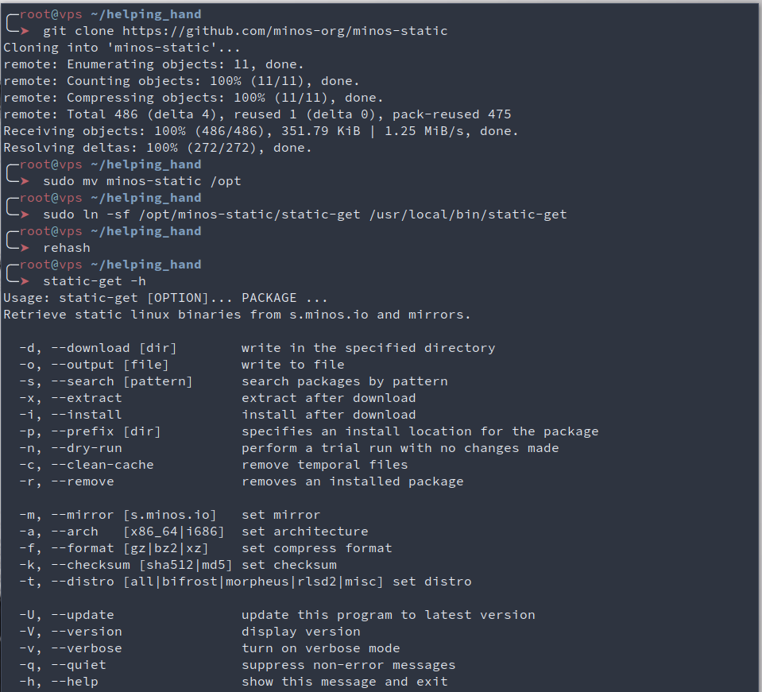


Now that we have static-get, let's get our tools ready! \
Here, we download and extract our binaries, and put them on a common directory that we then expose using python3 and its module http.server. I won't explain every command, if you're in doubt, either run man on it, or use the excellent https://explainshell.com/

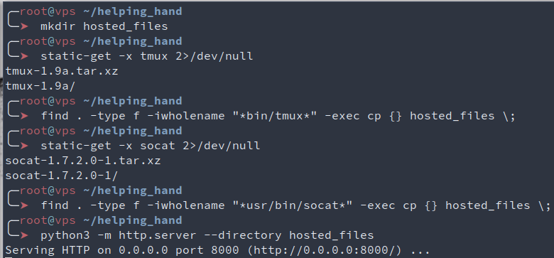

One last thing we need to do on the server is to setup ssh so it allows our server's external ip to be exposed by ssh when port forwarding is requested by a client. To do so, Helper can use sed and it's inplace transformations to set the GatewayPorts line to "yes" in sshd's configuration file. Here, "clientspecified" could be used instead of "yes" to only allow connections from a specific location, but meh, let's stay lazy for now. We then check the file has the correct line, and restart sshd to have the configuration updated. 

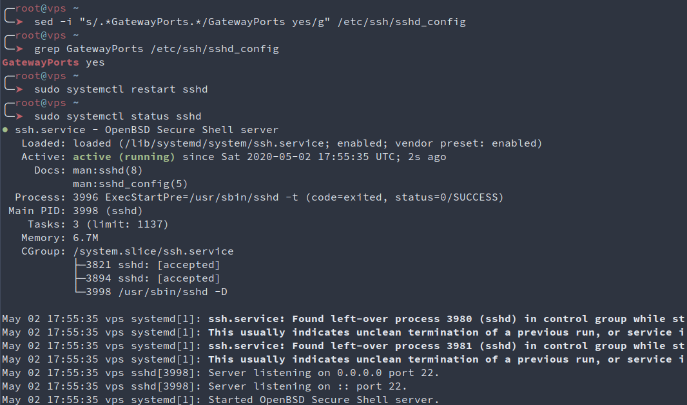

### Step 2 : Setup listeners on Helpee's side

Here, Helpee is a virtual machine ([VirtualBox](https://www.virtualbox.org/)) running [Ubuntu 20](https://releases.ubuntu.com/20.04/). \
Helpee will use curl or wget to download tmux and socat from Helper's server. 

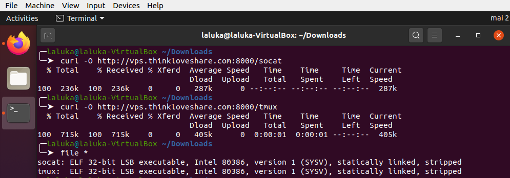

Then, Helpee will ask Helper's server to redirect one of its port to Helpee's local interface. Notice that here, I gave my root password to Helpee which is NOT a good thing. For this task creating a specific user is more than advised, but hey it's only me and me so that's okay for demonstration purpure.. I guess.. `¯\_(ツ)_/¯` \
We then ask socat to execute the command `su $USER` and redirect all of its streams (stdin, stdout, stderr) to localhost:8888. 

So the current setup is the current infrastructure is the following : 

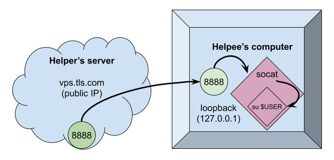

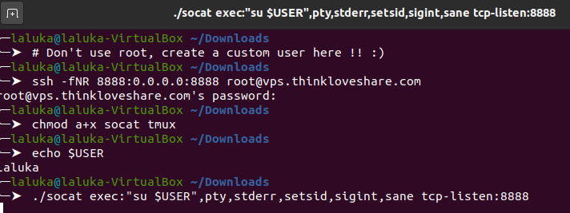


### Step 3 : Connect to Helpee and throw a P-P-Party

At this point, Helper could use a tool such as netcat to connect to vps.thinkloveshare.com:8888 to be redirected to Helpee's login prompt. But the shell would be shitty, no auto completion, broken display, no line edition, etc.. \
Instead of that, we'll use socat on Helper's side to dedicate a tty on Helper's machine to handle Helpee's pty. 

We use socat but this time as a connector (and not a listener). We then ask Helpee's password, and there we are, a fully interactive shell on Helpee's computer! But when Helper types commands, Helpee isn't aware of it and can't learn anything (I mean, nothing more than copy-pasting Helper's commands :D ), which is not our main goal. *sigh*

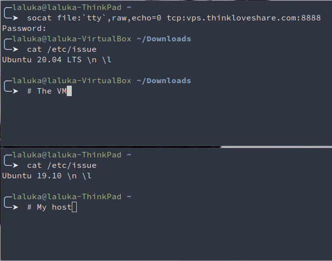

In order to have a common shell or display, many tricks could work, using default tools such as `tee`, `tail`, `bash` redirections, or even the live filesystem `/proc/<pid>/fd/{0,1,2}` to have a transcript of Helper's interactions with Helpee's system. \
But what I think is the most elegant solution is to use the static tmux we already downloaded. So helper will create a tmux session, and Helpee will attach their current shell to Helper's session. It's preferable that both use the same binary (thus same version) to avoid compatibility issues. \
More information in tmux in its man, or in one of its cheatsheets : https://tmuxcheatsheet.com/

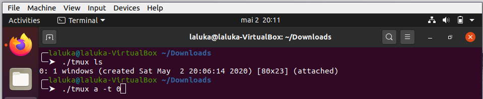
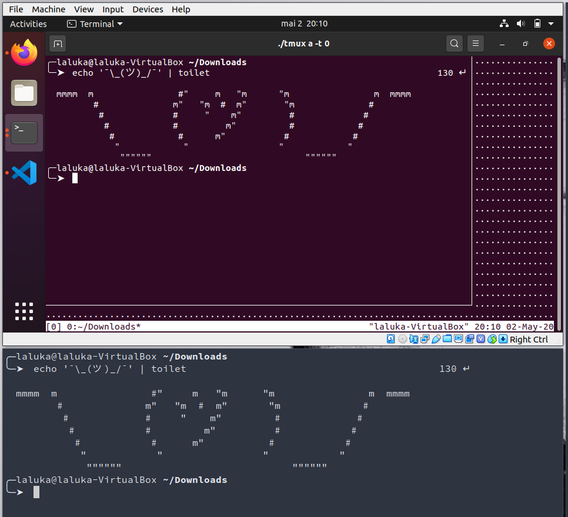

The shell size can be improved by setting a few constants, its font size and dimensions. More on that with the manual and the commands reset, stty, export, and the environment variables SHELL and TERM. \
One more useful thing would be to put Helpee's socat listener in an endless loop, that way if something goes wrong, Helper can connect back without any input from Helpee. \

```bash
while true; do LISTENER_CMD; done
```

Annnnd that's it! We're done with this first solution, Helper and Helpee now share a live fully interactive terminal on Helpee's box! `\o/`

# Solution 2 : ngrok and gotty

An introduction to ngrok is already available here : https://thinkloveshare.com/hacking/ngrok_your_dockersploit/ \
Long story short, use ngrok to connect to ngrok's servers and redirect one of their subdomain:port to Helpee's loopback interface. The binary is also statically compiled, but as this is a service it requires a (free) account. 

Gotty is another neat tool written in go, dynamically linked but which can still be executed without installing anything as all its dependencies are really common and present in pretty much every linux distributions. This tool allows its user to expose a shell over HTTP. 


### Step 1 : Setup gotty

Download and extract its binary from github. Most of the go softwares do have pre built binaries on the release section in github, don't waste time compiling if it's already done! We'll then use openssl to generate a strong rsa key and a TLS certificate. We don't care much about the information it will contain as it's for our personal use only. Once all the assets are in place, we can then use gotty to expose a shell running the same command as in the first solution : su $USER. 
This enforces the use of a password, we don't want to offer a shell on our box to the world, don't we?

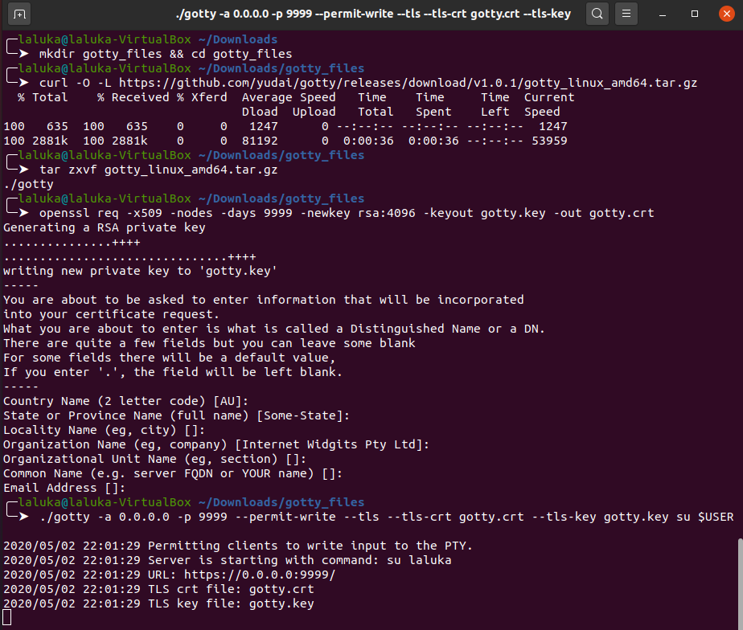


### Step 2 : Setup ngrok

The setup on ngrok is already covered in a previous article and in their official website, so just create an account, download their binary, load your api-key, and open a tcp connection on port 9999. 

We then have the following infrastructure : 

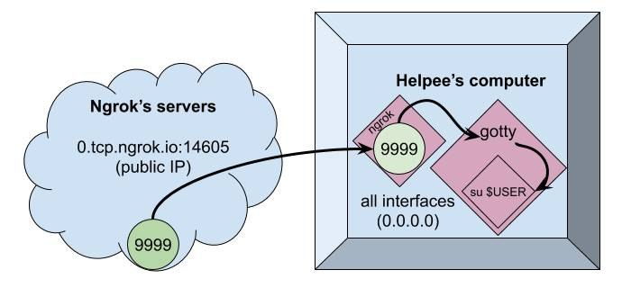

One thing to note here is that gotty listens on 0.0.0.0 which designates all interfaces of the current machine. This is definitely overkill, I should have used 127.0.0.1 but the screenshots are already taken! Sorryyy! *flies away*

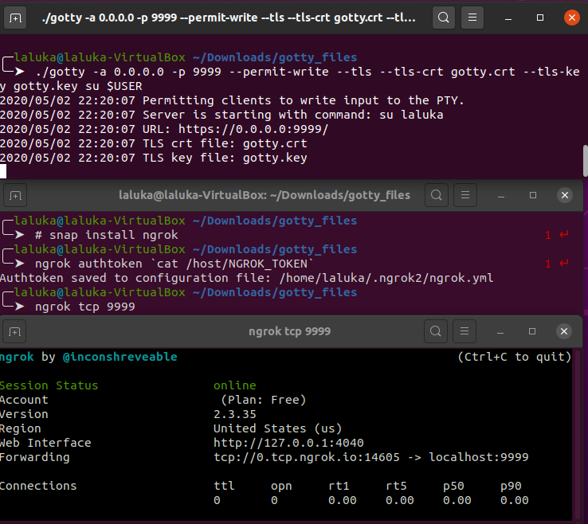


Ngrok exposes a tcp connection, but under the hook, Helpee's loopback interface offers an HTTPS server on port 9999, so by reaching this ngrok's link, we'll be welcomed with our beloved shell!
The shell is once again fully interactive, and the terminal can again be shared using tmux. The main advantage here is that all the work is on Helpee's side, and Helper can join from any device as long as Helpee sends the url and password (Not in plaintext? Please? Not in the same email/text message? Please?)

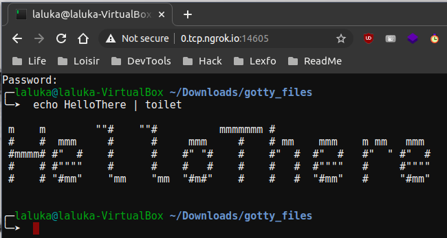


# Solution 3 : tmate

The last solution is definitely the easiest one, but it's a really good thing to understand how something works before using quick cheats that make the whole thing opaque. The only thing Helpee needs to do, is to install tmate, and run "tmate". That's it. Many links will be displayed, allowing Helper to join from a browser or shell, and to have a full or read only access. The shell is already shared, fully interactive, etc... PLEASANT, RIGHT?!

It only requires the user running tmate to have an ssh key. So if you don't have one, generate it! 

```bash
ssh-keygen -t rsa -b 4096
# Or whatever strong algo you like with a decent key size! ;)
```

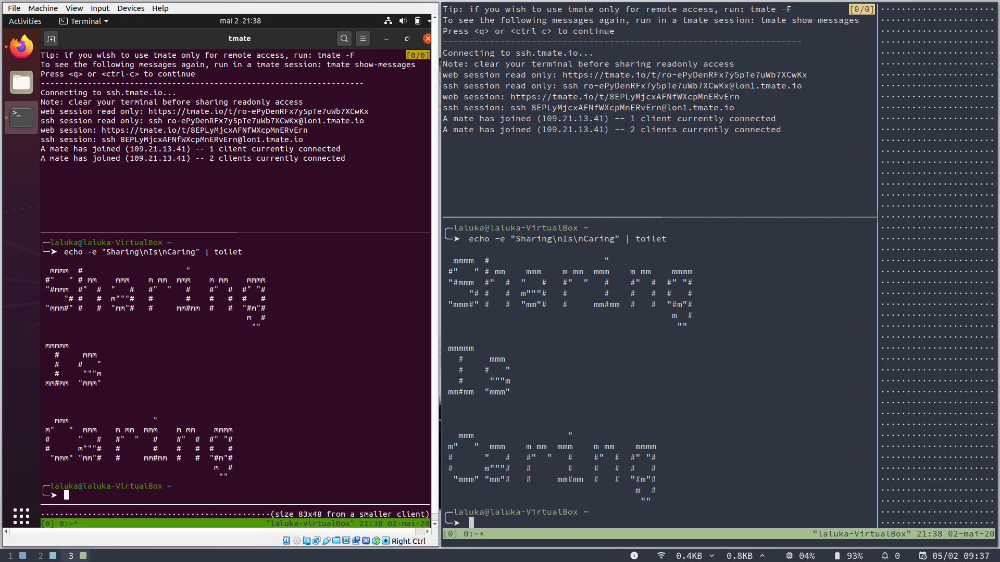
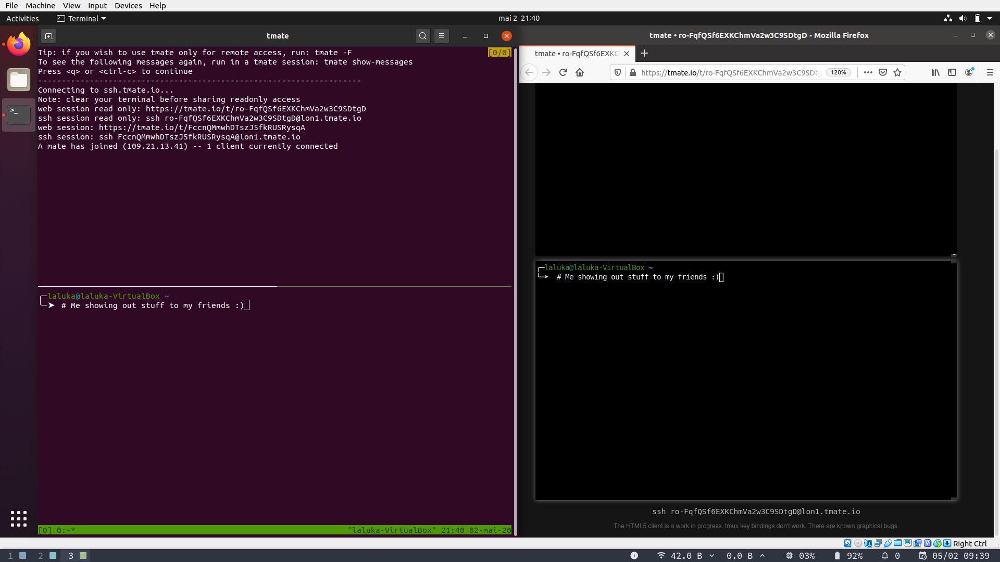


While writing this article I added one major drawback to tmate : "Installing a package is required". \
This means that the attack surface, of image size (let's say of a production system) will be increased. 

But you know what's the best part? 

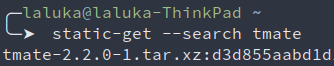

Yup. That's right. Tmate also exists as a standalone. \
So get it, serve it for your friends, ask them to run it, and have fun with them! 

And as mama always used to say, don't forget to clean up your mess once you're done!
This implies removing unused files, binaries, certificates, links, ... \
But also disabling services, restoring a safe ssh configuration, restarting services, verifying you can open a new ssh connection to your server BEFOOOOOORE you close the one you already have (trust me on that.. :) ). 

And probably the most important one : Stop all the programs that may still be running and exposing your server or your friend's computer. Once you think you're done-done... Double check!

> There's no safer service that the one that is __not__ exposed

```bash
# Verify that only ssh is still exposed
ss -latepun | grep LISTEN
```

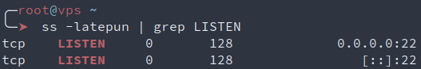


One last thing before I leave you... \
If. You. Break. Something. That. Isn't. Yours. \
You. Are. Responsible. 

So next [beers](https://twitter.com/petite_biere) are on you! ;)


Big shout out to [0nemask](https://twitter.com/0nemask) and [Drastdevix](https://twitter.com/Drastdevix) for proofreading me. \
0nemask spent a lot of time writing cool [HackTheBox writeups](https://onemask.me/posts/) lately. Thus I strongly advice his blog as your next readings! `^.^`
