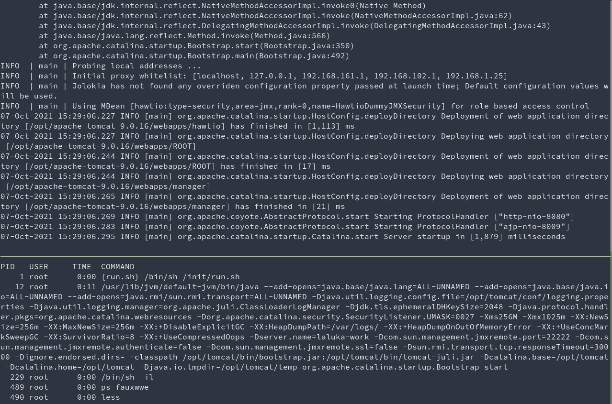
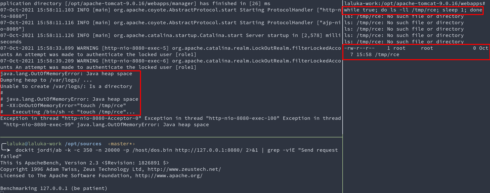
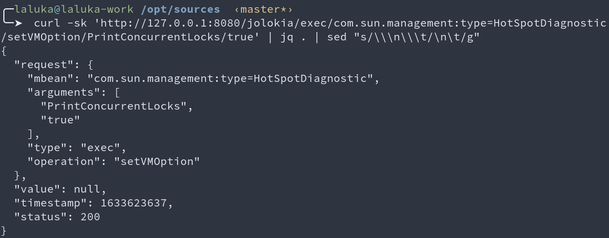
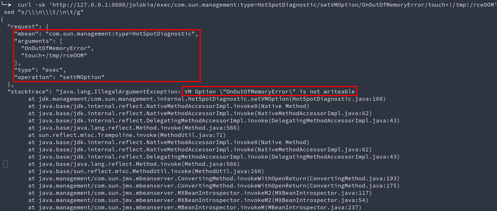
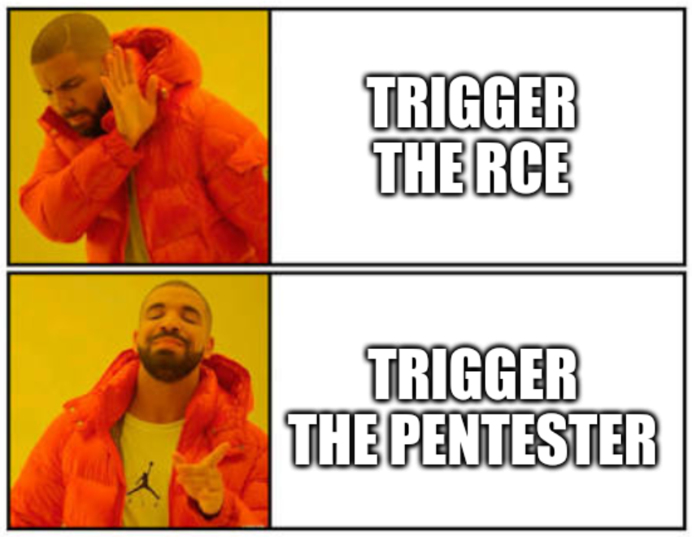

## First article of a new series! Exciting isn't it?

We often read articles or research that explain how to exploit X or how Y works. Most of the time this seems straightforward, and yet we all struggle doing our own research. We "know" that failing is "normal", it's part of the process, yet it can hurt or make you feel bad.

> The path I now want to take, is the wrong one. The one that leads to nothing. \
> This is why I want to write a few articles explaining _how a failed on various fun & cool ideas_. 

Oh, one last thing before we begin! \
If you find something cool to add, or a way to make these ideas successful, I'd be happy to have you for a guest-post!

---


# DOS to RCE using Jolokia

While a github repository (TBD) and more jolokia-pwning research are to come, I want to take some time to expose a fun idea that could have worked, but did not (at all).

We always (as pentesters) are scared to damage a production environment. But what if for some reason, a DOS, or "lite DOS", is the solution to your cherished Remote Code Execution?

Yup. This is something you're `not supposed to do`. But `what IF`...


## Exploitation scenario

Ok, so this explanation will require some comprehension of jolokia, read the [previous article](/hacking/ssrf_to_rce_with_jolokia_and_mbeans/) if you're not familiar with this software. 

The idea is the following: 

1. Use jolokia to modify a JVM option: `OnOutOfMemoryError` or `OnError`
1. Insert our payload in the option value
1. DOS the target to trigger an `Error` or `MemoryError`
1. Enjoy your shell!

Too easy, clean, neat, no interaction with the filesystem, flawless!


## Yes but No

Now, let's look more into the details, why isn't this working?

Let's start from the beginning, we need a test setup, so I. need. docker.

From the previous article, we'll start a simple jolokia instance and steal its full command line. Then we'll start our custom instance to test our idea. 

```bash
# Start a docker with jolokia
docker run --rm -it --net=host bodsch/docker-jolokia
# Enter the docker
docker exec -it $(docker ps | grep bodsch/docker-jolokia | awk '{ print $1 }') /bin/sh -il
# Dump the commandline the lazy way
ps fauxwwe | less
```



- Top terminal: Java server inside the docker
- Bottom terminal: result of `ps fauxwwe |  less` run inside the docker

Now we know how the program was started (bottom terminal), we'll tweak this line a bit to test the JVM option. 

```bash
# Start the java server, tweaking our options, and lowering the allowed memory for easier testing
# options: -Xms32M -Xmx32M -XX:OnOutOfMemoryError="touch /tmp/rce"
docker run --rm -it --net=host bodsch/docker-jolokia /usr/lib/jvm/default-jvm/bin/java --add-opens=java.base/java.lang=ALL-UNNAMED --add-opens=java.base/java.io=ALL-UNNAMED --add-opens=java.rmi/sun.rmi.transport=ALL-UNNAMED -Djava.util.logging.config.file=/opt/tomcat/conf/logging.properties -Djava.util.logging.manager=org.apache.juli.ClassLoaderLogManager -Djdk.tls.ephemeralDHKeySize=2048 -Djava.protocol.handler.pkgs=org.apache.catalina.webresources -Dorg.apache.catalina.security.SecurityListener.UMASK=0027 -Xms32M -Xmx32M -XX:OnOutOfMemoryError="touch /tmp/rce" -XX:NewSize=256m -XX:MaxNewSize=256m -XX:+DisableExplicitGC -XX:HeapDumpPath=/var/logs/ -XX:+HeapDumpOnOutOfMemoryError -XX:+UseConcMarkSweepGC -XX:SurvivorRatio=8 -XX:+UseCompressedOops -Dserver.name=laluka-work -Dcom.sun.management.jmxremote.port=22222 -Dcom.sun.management.jmxremote.authenticate=false -Dcom.sun.management.jmxremote.ssl=false -Dsun.rmi.transport.tcp.responseTimeout=30000 -Dignore.endorsed.dirs= -classpath /opt/tomcat/bin/bootstrap.jar:/opt/tomcat/bin/tomcat-juli.jar -Dcatalina.base=/opt/tomcat -Dcatalina.home=/opt/tomcat -Djava.io.tmpdir=/opt/tomcat/temp org.apache.catalina.startup.Bootstrap start

# Inside the docker, continuously check if RCE got triggered
while true; do ls -ll /tmp/rce; sleep 1; done

# From the host, create a big file and DOS the server :D
dd if=/dev/urandom bs=1024M count=4 > dos.bin
dockit jordi/ab -k -c 350 -n 20000 -p /host/dos.bin http://127.0.0.1:8080/
```



- Top left terminal: Java server executing payload
- Bottom left terminal: Benchmark (DOS) in progress
- Right terminal: Wait, wait, wait, BOOM, RCE. 


This works pretty damn well! Now, let's just confirm we can modify this option with Jolokia.

First, we test with a simple option, then with the one we need.

```bash
# Works, dope. 
curl -sk 'http://127.0.0.1:8080/jolokia/exec/com.sun.management:type=HotSpotDiagnostic/setVMOption/PrintConcurrentLocks/true'
# fuuuuUUUUUUUUU
curl -sk 'http://127.0.0.1:8080/jolokia/exec/com.sun.management:type=HotSpotDiagnostic/setVMOption/onOutOfMemoryError/touch+!/tmp!/rce'
```






I also took some time to brute-force every option. All the ones that seemed interesting are blocked (at least on my JDK with this configuration). \
Reality is hard, we can't write these options through jolokia, implying that we can't get RCE this way.

> But you're a hacker can't you bypass this?

As far as I know, no. But please, prove me wrong!

Here are a few thoughts about it: 

- The [documentation](https://www-ppti.ufr-info-p6.jussieu.fr/doc-online/Java/jdk1.6/docs/jre/api/management/extension/com/sun/management/HotSpotDiagnosticMXBean.html) from `HotSpotDiagnosticMXBean` says `List<VMOption> getDiagnosticOptions() Returns a list of VMOption objects for all diagnostic options. A diagnostic option is a writeable VM option that can be set dynamically mainly for troubleshooting and diagnosis.`
- The source code for this is here [management/HotSpotDiagnostic.java#L55-L64](https://github.com/frohoff/jdk8u-dev-jdk/blob/da0da73ab82ed714dc5be94acd2f0d00fbdfe2e9/src/share/classes/sun/management/HotSpotDiagnostic.java#L55-L64)
- This implies that our options are in fact flags, see `Flag f = Flag.getFlag(name);` in `getVMOption`
- The [Flag class](https://github.com/frohoff/jdk8u-dev-jdk/blob/da0da73ab82ed714dc5be94acd2f0d00fbdfe2e9/src/share/classes/sun/management/Flag.java#L39-L53) has a constructor that specifies the `writeable` property. 

Finally, this implies that when we try to modify an option, if we're able to resolve it, then its writeable attribute will be resolved as well, so there is no point playing with bad-chars, or case-sensitivity. It's just not the right approach. \
Maybe finding a way to modify the writeable property would be more efficient, who knows, the rest is up to you! :)



I really hope you liked this first `FAILED` blogpost, see you in a few for more funny quirks!
