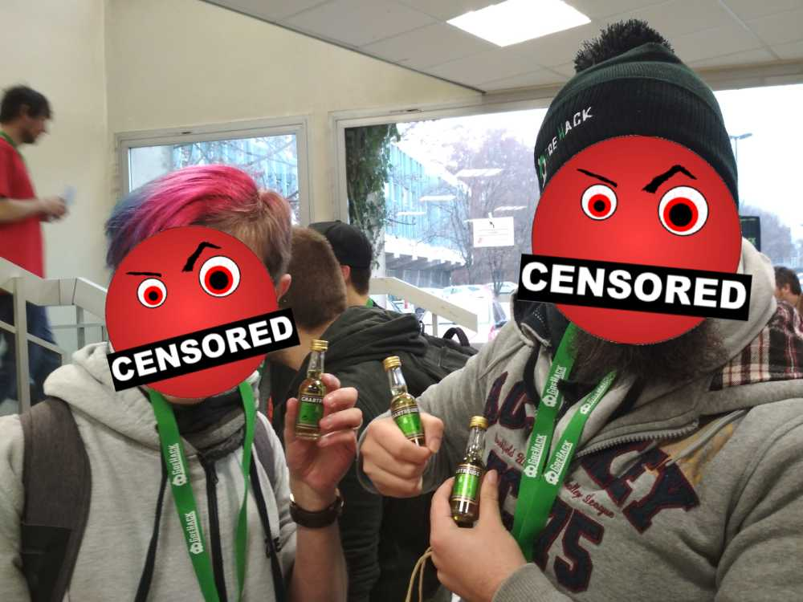
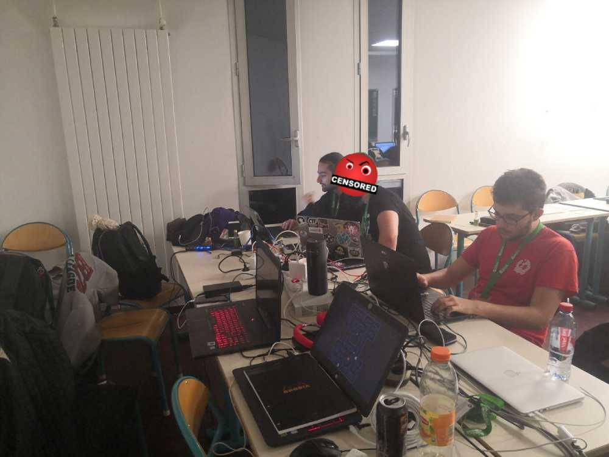
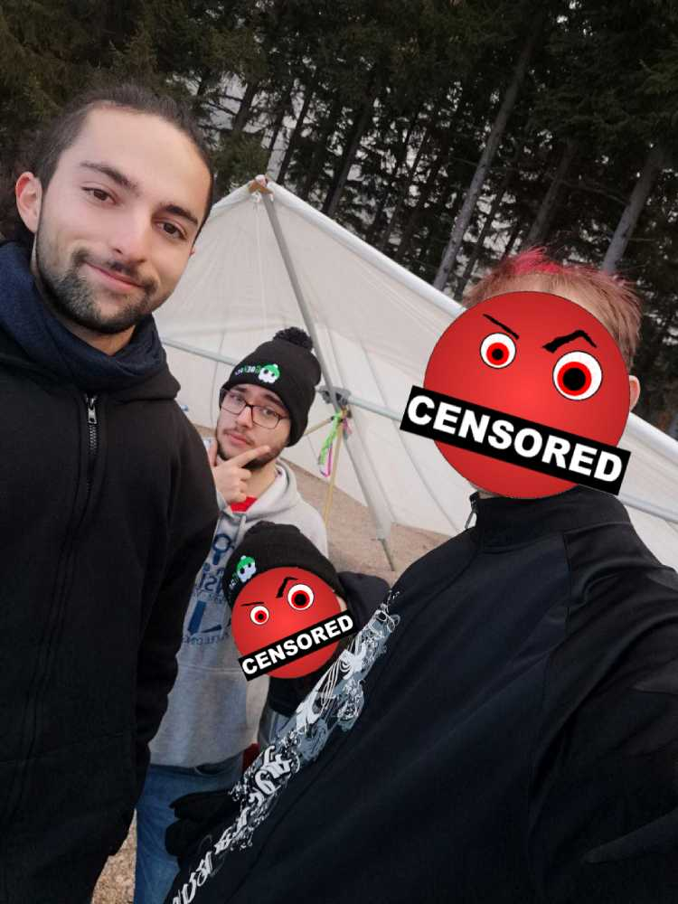

## Before I start...

One year ago was my first on-site hacking event : GreHack 2017 !

The conferences were great, I met a few cool people there, and the CaptureTheFlag was awesome, even tho I had almost no knowledge, there's always a starting point huh ? \
I spent the whole year doing my best to gain hacking knowledge, meet people into infosec, solve challenges, join events, conferences, CTFs, ...\
Some were great, but I still had the memories of this awesome event, and thought that the conference were the best (no marketing bullshit, only precise knowledge shared by interesting people). And this year again, the conferences were pretty
neat, and the CTF was great !

A big thank you to the organizers, you rock ! ❤

## 1st conference : Return of the Gand Crab Ransomware

This ransomware is kind of special because its lifecycle is Agile-like. It contains multiple exploits, 0days, updates, ...\
It is considered as a MaAS (Malware-as-a-Serice) as it provides an easy to use GUI for the customer, the developers take a small cut of the malware profit.
It's spread via maaany ways : js / .doc / macro / vb / fake encrypted CV / open RDP bruteforce via shodan / exploits kits / browser exploits, ...\
It also avoids detection in VMs usning obfuscation techniques, and uses long time execution functions or the VM to close itself before it gets malicious. It uses a custom packer (won in a custom packer contest, that's fun and original !)\
The communication part interacts (in most versions) with a C2 server via TOR.

The last fun thing here is that the developers added the code of "0day" in the code, without using it, just saying (bragging) : "We found a crash, probably something critical, bla bla bla, you are bad and should feel bad."

The reverse engineers that found that laught a lot because : The code triggers the antiviruses even if it's useless and unused, and they're quite sure that this PoC isn't good enough to be turned into an RCE. So... That's a fail ! =]

https://twitter.com/tamas_boczan

## 2nd conference : ROPGenerator - Quarkslab

If you don't know what ROP is, you may want to read this previous article : [PWN 3of4 : SaperliROPette](https://thinkloveshare.com/hacking/pwn_3of4_saperliropette/)

The software presented has two main functionnalities : Find ROP gadget that will respond to the constraints you give, and chain gadgets in order to have a fully functionnal ROPchain.

Finding the right gadget can be done in two different ways : \
Syntactic (fast & limited) Vs Semantic (slow & powerful)

* Features

 - Gadget Searching :
Gadgets are used to construct a dependency graphs, the semantic is then extracted, sorted and then stored in a database.

 - Gadget Chaining :
The database previously created is then queried, and strategies are used (aka using temporary registers, computing numbers, ...) to store the right values at the right places. intermediate strategies can be used, this increases the computing time but it still reasonable (few minutes on binaries like bash).

* Demo

 - *downloads a root-me.org binary*
 - *starts the tool : "plz pwn that"*
 - *60 points, less than 5 minutes, done.*

This tool is POWERFUL AF !!!\
Thank you for this gem, I'll definitely use it !

https://github.com/Boyan-MILANOV/ropgenerator

## 3rd conference : Pwning an SAP, then what ?

*_sorry_but_I_hate_sap.* \
*_sorry_but_I_hate_sap.* \
*_sorry_but_I_hate_sap.* \
*_sorry_but_I_hate_sap.* \
*_sorry_but_I_hate_sap.* \

Long story short, SAP are soooo huge that the attack surface is insanely wide. If you plane on pentesting one, get your tools ready, because you'll get through a lot of data. The exploitation isn't that hard tho...

The conference was interesting, but because of some personal issues with SAP softwares... I won't... I won't. Never ever again.

## 4th conference : Abusing privileged file manipulation

Short introduction about the concept of race conditions and examples. Introduces windows specific tricks and softwares to monitor privileges and child processes needed to detect this kind of race conditions.

*Trash talking about antiviruses ! `\o/`*

Awesome presentation pwning AVs, the core idea is that an antivirus uses high privileges to monitor the whole system, and most of the time, isn't sandboxed. Many of them are exploitable by changing the file while they are analysing or removing it. Using links / restore functionnalities, files can acquire full SYSTEM privileges allowing the hacker to take own the system.

## 5th conference : Screaming Channels, when Electromagnetic Side Channels Meet Radio Transceiver

Basically, this guy can hear your cpu scream through his bluetooth antena while doing some crypto encryption. The noise is then used to leaks your AES private key up to 10 meters away. Also he is a good looking metal-head, which is nice ! =]

https://twitter.com/nSinusR

## 6th conference : Trap your Keyboard 101

Attacking a Corsair strace RGB, as it is programmable and has memory... Why not ?\
The firware is updated by downloading the new version in a temp folder. So we can hijack it and reverse it : arm binary with IDA + miasm : \

*[ Quite long and technical talk ]*

Demo time, the crowd is sceptical...

*GOSH MY FUCKING WHAT ?!*

The keyboard has been turned into a record and replay independent device (aka an expensive and good looking Rubber Ducky). \
What this means, is that you can just lend your keyboard to a friend, propose him to test it for few days. And when your keyboard comes back, it contains your friend's password, and the best part : It can type it, with colors, for you !

This talk was tedious (good effort on the english tho), but the work done is VERY clever.\
If you ever read this, you rock !

https://twitter.com/marilafo19

## 7th conference : Analyzing Ultrasound-based Physical Tracking Systems

TL;DR : This apk will decode ultrasound played without you knowing it to sell you useless stuff you don't need. \
An classic smartphone application can scan the audio spectrum continuously waiting for a particular signal using infra sound. This sound will trigger the application, revealing this way your location to the vendor. He will then use your phone to interact with you... In a commercial way... Yay...

This can be mitigated using ultrasonic jamming, but that's quite rare. It can also be easily reverse engineered ans DDOS... =]

https://twitter.com/Cunchem

## 8th conference : Bridging the gap between Secure Hardware and Open Source

Too much hardware, not enough brain left...

https://github.com/LedgerHQ

## 9th conference : Detecting all type of illegal Access Points on enterprise networks

Too tired and preparing for the workshop...

https://twitter.com/qingxp9

## Workshop on Miasm (one among many others proposed)

Excellent introduction to the Miasm reverse engineering framework.

The exercice presented is the following : symbolical execution to resolve a crackme binary. But not on the binary itself, on the intermediate representation generated by Miasm, and solving the constraints using z3 as a solve engine.

If this sounds like deep black magic to your ears... That's pretty normal. But damn, it works, and it's beautiful !

https://github.com/cea-sec/miasm

## On-site CTF

We were only three members of Apéri'Kube present, so we merged with the team [Cryptis](https://twitter.com/TeamCryptis). They were really kind and paticipating with them was a lot of fun ! We're still a bit disapointed because the challenges were mainly focused in reverse engineering, some crypto and hardware stuff. Still some forensic and
some web and crypto, the infrastructure was nice !

Here is a picture of us not solving a challenge :

And later that day, we went to fly ! ;)

I hope you had fun reading this article, and will some day attend to a GreHack event. You definitely won't regret it !

<h2 id="fr">French version</h2>

## Avant de commencer...

Il y a un an, j'ai participé à mon premier événement de hack présentiel : GreHack 2017 !

Les conférences étaient géniales, j'y ai rencontré quelques personnes très sympa, et le CaptureTheFlag était super cool même si je n'avais presque aucune connaissance en hack à l'époque. Il faut bien débuter un jour de toute facon, hein ? \
J'ai passé un an à faire de mon mieux pour acquérir de nouvelles connaissances en hack, rencontrer des gens dans l'infosec, résoudre des challenges, participer à des événements, des conférences, des CTFs, ...\
Certains étaient géniaux, mais j'avais encore le souvenir de cet événement qui était à mes yeux au dessus des autres, avec ses conférences au top (pas du marketing-bullshit, seulement des connaissances précises partagées par des passionnés). Et cette année encore, les conférences étaient très intéressantes et le CTF bien sympa !

Un grand merci aux organisateurs, vous gérez ! ❤

## 1ère conférence : Return of the Gand Crab Ransomware

Ce ransomware est un peu spécial parce que son cycle de vie ressemble au modèle Agile. Il contient de multiples exploits, 0day et a été fréquemment mis à jour.\
Il est considéré comme un MaAS (Malware-as-a-Serice) car il fournit une interface graphique facile à utiliser pour le client, tandis que les développeurs prennent une petite partie du profit du malware.
Il se propage par de nombreux biais : js / .doc / macro / vb / faux CV chiffrés / open RDP bruteforce trouvés via shodan / exploits kits / exploits navigateur, ...\
Il évite également la détection dans les VMs en utilisant des techniques d'obfuscation, et utilise des fonctions s'exécutant longtemps pour que la VM se ferme avant qu'il ne devienne malveillant. Il utilise un packer custom (gagné dans un concours de packer, plutot original !)\
La partie communication interagit (dans la plupart des versions) avec un serveur C2 via TOR.

La dernière chose amusante ici est que les développeurs ont ajouté le code de la 0day, sans l'utiliser, en disant simplement (en se vantant) : "Nous avons trouvé un crash, probablement quelque chose de critique, bla bla bla bla, you are bad and should feel bad."

Les reverse-engineers qui l'ont découvert one bien rigolé car le code déclenche les antivirus alors même qu'il n'est pas utilisé, et ils sont à peu près sur que cette PoC n'est pas assez bonne pour être transformée en RCE. Alors... C'est un échec ! =]

https://twitter.com/tamas_boczan

## 2ème conférence : ROPGenerator - Quarkslab

Si vous ne savez pas ce qu'est le ROP, un petit coup d'oeil s'impose sur cet article précédent : [PWN 3of4 : SaperliROPette](https://thinkloveshare.com/fr/hacking/pwn_3of4_saperliropette/)

Le logiciel présenté a deux fonctionnalités principales : Trouvez le ROP gadget qui répondra aux contraintes que vous lui donnez, et chainer les gadgets trouvés afin d'avoir une ROPchain pleinement fonctionnelle.

Trouver les bons gadgets peut se faire de deux façons différentes : \
Syntactique (rapide & limitée) Vs Sémantique (lente & puissante)

* fonctionnalités

 - Recherche de gadget :
Les gadgets sont utilisés pour construire un graph de dépendances, la sémantique est ensuite extraite, triée et stockés dans une base de données.

 - Chaînage de gadgets :
La base de données précédemment créée est alors interrogée, et des stratégies sont utilisées (par exemple en utilisant des registres temporaires, opérations arythmétiques, ...) pour mettre les bonnes valeurs aux bons endroits. Des stratégies intermédiaires peuvent être utilisées, cela augmente le temps de calcul mais reste raisonnable (quelques minutes sur des binaires comme bash).

* Demo

 - *Télécharge un binaire de root-me.org*
 - *Démarre l'outil : "plz pwn that"*
 - *60 points, moins de 5 minutes, c'est fait.*

Cet outil est p*tain de PUISSANT !!!\
Merci pour cette perle, je l'utiliserai à coup sur !

## 3e conférence : Pwn un SAP, et après quoi ?

*_sorry_but_I_hate_sap.* \
*_sorry_but_I_hate_sap.* \
*_sorry_but_I_hate_sap.* \
*_sorry_but_I_hate_sap.* \
*_sorry_but_I_hate_sap.* \

Pour la faire courte, SAP est tellement vaste que la surface d'attaque en est incroyablement grande. Si vous avez l'intention d'en tester un, préparez vos outils, car vous obtiendrez beaucoup de données. En revanche l'exploitation n'est pas très comlpexe avec les bons outils...

La conférence était intéressante, mais à cause de quelques problèmes personnels avec les logiciels SAP... Je... Ne... Veux plus de ca... Plus jamais.

## 4ème conférence : Abus et manipulation de fichiers privilégiés

Brève introduction sur le concept de race condition et exemples pratiques. Il présente ensuite des tricks et logiciels spécifiques à Windows pour surveiller les privilèges et les child process, outils nécessaires pour détecter ce type de failles.

*Clash gratuit d'antivirus ! `\o/`*

L'idée de base est qu'un antivirus utilise des privilèges élevés pour surveiller l'ensemble du système, et la plupart du temps, n'est pas sandboxé. Beaucoup d'entre eux sont sensibles à une même faille : Manipuler le fichier pendant qu'ils sont en train d'analyser. En utilisant des liens / fonctions de restauration, les fichiers peuvent acquérir les privilèges SYSTEM, et ainsi permettre a l'attaquant de prendre le contrôle de la machine.

## 5ème conférence : Screaming Channels, lorsque les cannaux cachés électromagnétiques rencontrent l'émetteur-récepteur radio

En gros, ce mec peut entendre votre processeur hurler à travers son antenne Bluetooth tout en faisant chiffrant des données. Le bruit est alors utilisé pour faire fuiter votre clé privée AES jusqu'à une distance de 10 mètres. C'est aussi un métalleux classieux, which is nice ! =]

https://twitter.com/nSinusR

## 6ème conférence : Piègez votre clavier 101

Attaquer un Corsair strace RGB, car il est programmable et dispose de mémoire.... Pourquoi pas ?\
La mise à jour du firmware se fait en téléchargeant la nouvelle version dans un dossier temporaire. Donc on peut le détourner et le reverse : binaire arm avec IDA + miasm :

*[ Talk asser long et technique ]*

C'est l'heure de la démo, la foule est sceptique....

*Qu'est-ce que p*tain de quoi?!*

Le clavier a été transformé en un appareil d'enregistrement et de relecture indépendant (aka un Rubber Ducky dans un beau boitié). \
Ce que cela signifie, c'est que vous pouvez simplement prêter votre clavier à un ami, lui proposer de le tester pendant quelques jours. Et quand votre clavier revient, il contient le mot de passe de votre ami, et la meilleure partie : Il peut le taper avec des belles couleurs tout seul devant vous !

Ce talk était fastidieux (bon effort sur l'anglais tout de même), mais le travail fait est remarquable.\ Si jamais tu lis ça, bien joué ! ;)

https://twitter.com/marilafo19

## 7ème conférence : Analyser les systèmes de suivi physique à base d'ultrasons

TL;DR : Cet apk va décoder les ultrasons émis sans que vous le sachiez pour vous vendre des choses inutiles dont vous n'avez pas besoin. \
Une application smartphone classique peut balayer le spectre audio en continu en attendant un signal particulier à l'aide d'infrasons. Ce son réveillera l'application, révélant ainsi votre emplacement au vendeur. Il utilisera ensuite votre téléphone pour interagir avec vous... Pour du commercial... Yay...

Cela peut être bloqué par brouillage ultrasonique, mais c'est assez rare. Il peut aussi être facilement rétro-rengineeré et DDOS... =]

https://twitter.com/Cunchem

## 8ème conférence : Combler le fossé entre le matériel sécurisé et l'Open Source

Trop de hardware, plus assez de cerveau....

https://github.com/LedgerHQ

## 9ème conférence : Détection de tout type de points d'accès illégaux sur les réseaux d'entreprise

Trop fatigué, on se prépare pour le workshop...

https://twitter.com/qingxp9

## Workshop sur Miasm (un parmi beaucoup d'autres proposés)

Excellente introduction au framework de reverse-engineering Miasm.

L'exercice présenté est le suivant : exécution symbolique pour résoudre un crackme. Mais pas sur le binaire lui-même, sur la représentation asseembleur  intermédiaire générée par Miasm, et en résolvant les contraintes en utilisant le solveur z3.

Si cela vous évoque de la magie noire... C'est plutôt normal. Mais bon sang, ça marche, et c'est beau !

https://github.com/cea-sec/miasm

## CTF présentiel

Nous n'étions que trois membres d'Apéri'Kube présents, nous avons donc fusionné avec l'équipe [Cryptis](https://twitter.com/TeamCryptis). Ce fut un plaidir de participer avec eux, on s'est vraiment bien amusé, les rires nerveux faisent foule à 4h du mat ! Nous sommes quand même un peu déçus parce que les challenges étaient principalement concentrés sur du reverse engineering, un peu de crypto et du hardware. Quelques challenges en forensic et très peu de web. L'infrastructure a tenu le coup, RAS ! =]

Voici une photo de nous en train de ne pas résoudre un challenge :

Un peu plus tard le même jour, nous sommes aller voler ! ;)

J'espère que ce petit récit vous a plu et que vous assisterez un jour à une GreHack. Vous ne le regretterez clairement pas !
