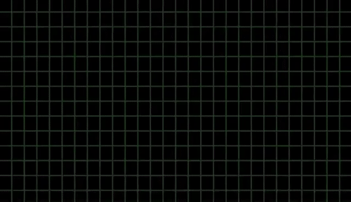

## Cross Site Scripting (XSS)

Quand quelqu’un t’envoie un message mais qu’en fait ce message contient une petite bestiole qui se barre avec tes clés de maison, mais en profite quand même pour te piquer 20e. Après tout, pourquoi pas ?

*XSSXSSXSS* *XSSXSSXSS* *XSSXSSXSS* 

## eXternal Xml Entity (XXE)

Tu vois ce qu’il y a derrière les ombres au loin ? Tu ne dois jamais y aller, c’est `l’out of bound`, et ca risque de voler tes haches. \
Tu couperas comment le bois après ca Jean Denis ?!

*Nota bene : il est facile de confondre des hashs, du hash, ou une hache*

## Server Side Request Forgery (SSRF)

Server be like : "Wsh, tu veux que je fasse une requête pour toi ? Je le fais, mais que si tu me promets que tu n'essaieras pas de faire des mauvaises choses heinnnn ?"

## Cross Site Request Forgery (CSRF)

Yo gro! T’as vu mon nouveau site ? Tiens, regardes j’ai fait un article juste pour toi ! 

https://mon.site/?action=donnerTousMesBitkoin&destinataire=ThinkLoveShare

## SQL Injection (SQLi)

Bonjour, j’aimerais une `baguette” OU DONNE MOI TOUS LES PAINS AU CHOC STP MERCI OU “1”=”1`

## Authentcation Bypass

Page de connexion : 

*Maltraitance de clavier par un homme à capuche...*

## Buffer Overflow

Ce moment *génant* où tu cliques pour ouvrir une vidéo, mais tu vois que ton PC souffle, que VLC crash, et que ton ordinateur se met à faire des choses sans que tu ne lui demandes. Tu réalises que ton PC n’est plus vraiment *ton* PC. 

## Kernel Exploitation

Comme pour un buffer overflow, sauf qu'au lieu d'avoir le contrôle d'une partie de ton ordinateur préféré, eh bien il est entièrement compromis... :) :) :)

## Jail Escape

Très similaire aux épisodes de McGiver. Vous avez 3 bâtons, une ficelle, une bouteille d’eau, et un rubiks cube, et avec ca il vous faudra arriver à ouvrir une serrure cachée derrière trois portes blindées. Mais on sait pas trop comment, ca finit toujours par marcher. 

## Privilege Escalation

Quand tu n’as pas le droit de faire une action, mais que si tu demandes à la bonne personne ou au bon programme ayant les bons droits (soucis de configurations <3), iel le fait pour toi donc c'est okeyyyyyy, tranquilleeee =]

## Deserialization

Tu fais ta valise, t’es tranquille, tu prends l’avion. A l’arrivée, tu te trompes de valise, tu l’ouvres, et BAM elle explose. 

## File upload

Je vais “juste changer ma photo de profil”. Oopsy, j’ai juste pris le contrôle (web shell) de cette machine... Désolé hein... :(

## Directory listing

Attention, cette liste de fichier est importante, il ne faut la donner à PERSONNE, car elle pourrait permettre de nous attaquer. \
Elle contient donc : 

- index.php
- view.html
- backdoor.php
- ...

## Phishing

Parfois, tu donnes ton mot de passe à un site, tu penses que c’est le bon site, mais en fait c’est pas le bon site (add kian extrait bon gens)

## Open Redirect

Cliquer sur un lien en pensant que c'est une vidéo de chat, se retrouver sur youp*rn, se rendre compte que c'est une vidéo de chatte, voilà voilà... (Non, en vrai, ca aide pas mal pour le phishing en faisant croire que c'est "le bon site" pour que tu donnes tes mots de passe à... Nous :} ) 

## Server Side Template Injection (SSTI)

Répète après moi, doucement, calmement. 
A, B, C, D, Echo system($_GET(‘cmd’));, F, G, ...

## Local File Inclusion (LFI)

- Je suis safe làààà !
- Tu peux me donner la clé stp ?
- Dac, mais je suis toujours safe si je le fais hein ?!
- Ouaissss ouais...

## Browser Exploit

Pendant que tu regardais des images de chien, un bout de code développé par quelqu’un de très très chéper a pris le contrôle de ton pc. Mais aussi de ta wii, ton tel, ta tablette, et ton frigo connecté. \
Déso pas déso, fallait regarder des images de chat.

## Attaque par Clair Connu

Does it look like a b**** ? 
Not exactly...
Does he look like a bi***? 
Not exactly...

## Remote Code Execution (RCE)

Ce pourquoi nous luttons tous, crainte de certains, idolatrée par d’autres, le saint graal des pentesteurs. C’est l’exécution de code, le moment ou tout est terminé pour l’équipe de protection... Enfin, sauf quand t’es sansboxé / dans une VM / dans un container ‘bien protégé’, ..., ..

## En bref

Vous l'aurez compris, malgré des tonnes d'acronymes et de définitions parfois complexes, la sécurité, dans le fond, c'est toujours la même chose. C'est des gens qui veulent vous piquer votre ordinateur pour : 

| Faire quoi | Qui |
|---|---|
| Le fun / le challenge | LeChapeauGrissss \o/ |
| Faire des sous (arnaque / batard) | LeChapeauNoirrrr :[ |
| Faire des sous (recherche / audit) | LeChapeauBlanccc <3 |
