This article is the transcript of a talk (FR) [@Groumpf_](https://twitter.com/Groumpf_) and [I](https://twitter.com/thelaluka) gave for the [RumpARennes](https://twitter.com/securinsa) and [GreHack](https://twitter.com/grehack) events in 2022, kudos to the staff!

Slides: [Custom-php-Introspection-for-0-Day-Research.pdf](Custom-php-Introspection-for-0-Day-Research.pdf)



---

Like previous conference-related articles, this one will sound more like a transcript than a regular "technical & in depth presentation".

Read the slides first, their explanation will be written below.

# 1. Whoami || Whoarewe

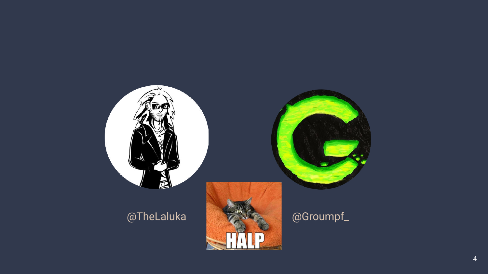

If you're here, you already know me. I like web 0-day research, and infosec in general. But for this specific project, I was wasting tons of time coding in C for low level needs in the core of Php. In the meantime, I really wanted to share projects with close-friends as it's way funnier that way. Therefore, I pinged one that had the skills I needed, and the fun I was looking for: [@Groumpf_](https://twitter.com/Groumpf_)

*Appears magically*: Hello there, I'm Groumpf, aka [maxmarsc](https://github.com/maxmarsc) or Sarumax sometimes (can't quite decide on the pseudo). I'm mainly an audio software engineer. I like dev, audio, music, low-level dev, embedded dev, music-making embedded dev... I think you got the point. My main tools are C, C++, Python and Rust, so when Laluka offered me to help him mess with the PHP source code I thought it would be funny!

# 2. Introspection 101

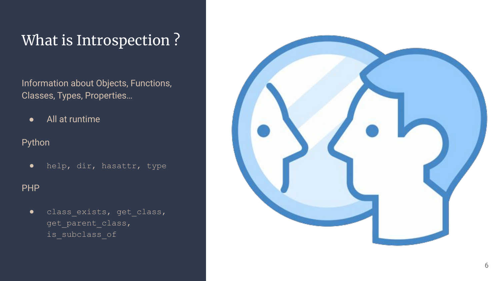

Apart for the lonely time we spend under the shower thinking about ourselves, introspection is a collection of techniques to gather information about running code, like an object's method, attributes, or execution time. Some languages have built-in features, some better than others.

> Reflection is almost the same thing but goes further. The idea of reflection is not only to gather data, but also to modify it, on the fly.

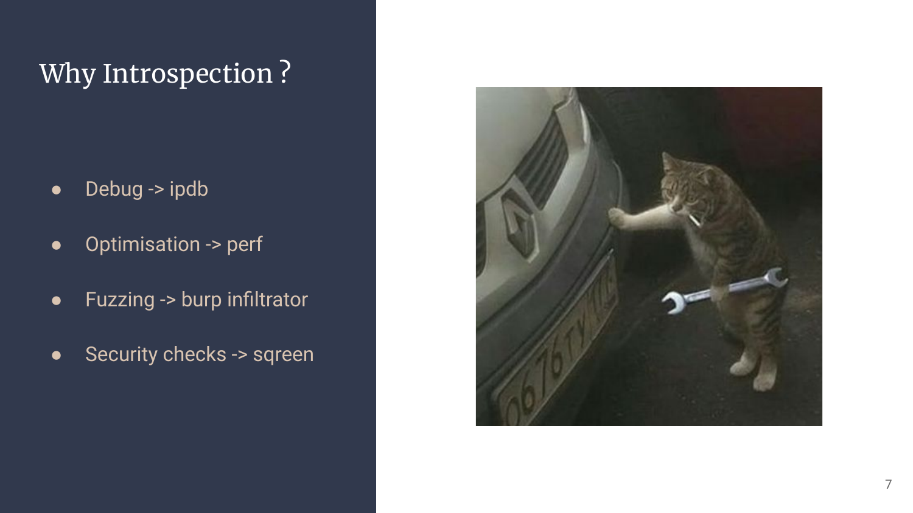

Introspection can be used in many ways, so here are a few examples to better understand what we're speaking about.

- Debugging: Ipdb is a python interactive debugger relying heavily on python's own introspection features like dir, type, getattr, etc.
- Optimisation: Perf is a linux tool that can be used to profile a tool by tracing its behavior, pinpointing most used functions and bottlenecks.
- Fuzzing: Burp infiltrator is a single jar file one can inject in a java backend to get information about juicy classes loaded or dangerous functions reached while fuzzing with BurpSuite.
- Dynamic Security Checks (DAST): Sqreen is a product one can use to instrument an application during its runtime to monitor for dangerous behaviors and pitfalls, it hooks functions and detects quirks while keeping an accurate vision of the context they appear in.

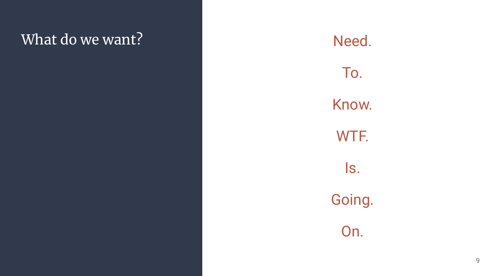

Long story short, what do we want?

> **Know WTF is going on inside the box**

Said in a more classy way, we want to know which (dangerous) functions are called, when, where, by whom, and the payload or parameter that reached it.

# 3. Php-Internalog & Iterations

Before we begin, on the left side is a sample php file containing some smelly code. This is not exhaustive, but good enough for a first approach to see what we'll be able to catch as we iterate!

### V0 - ltrace, strace, LD_PRELOAD

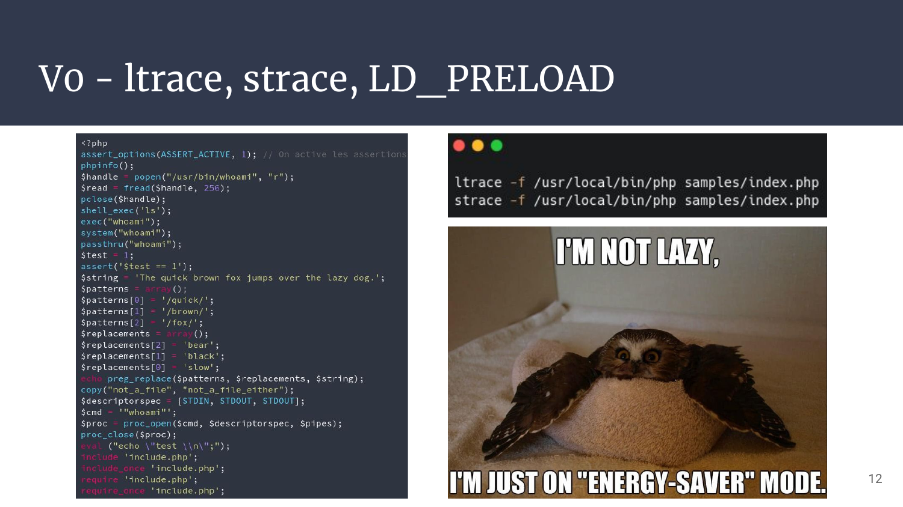

The first approach I had was really dummy, and I was 99% sure nothing really interesting would stand out as it's way too low level for the type of bug we want to catch. But as it costs no time, better double check just in case!

So there we go with ltrace and strace. I omitted the attempt with LD_PRELOAD as this was slightly better, but was suffering the same issues.

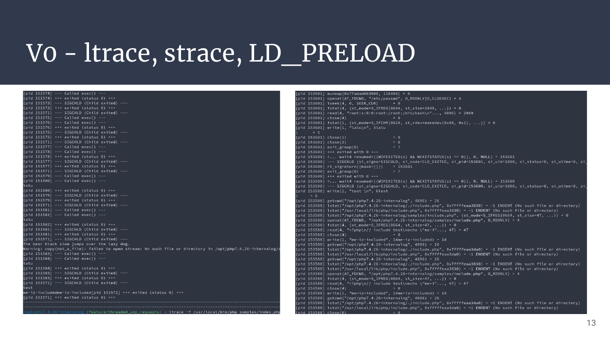

And as expected, we're getting low level debug information. It's not "nothing" as we're already able to catch file reads, listing, writing, socket calls, library calls, and so on. But for logic bugs, or higher level issues, it's a dead-end.

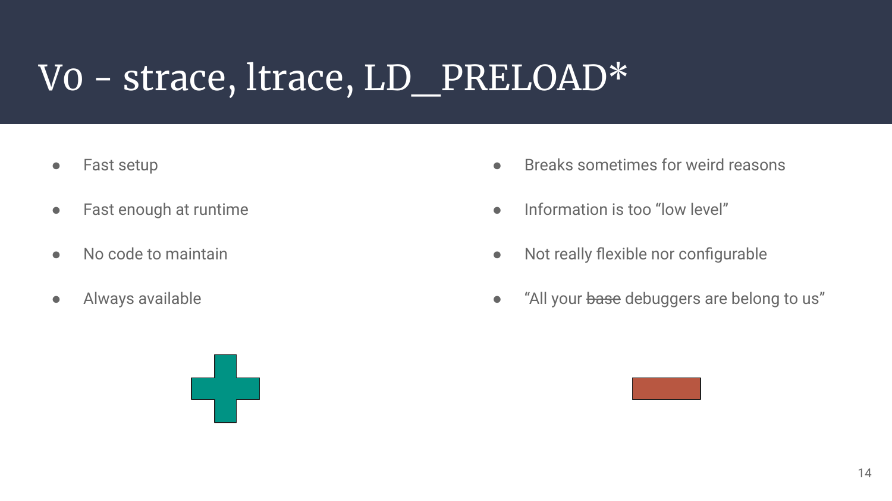

*Self explanatory slide noise*

It's fast at setup time and runtime, but it's not showing us what we need. Next!

### V1 - Fork php-7.4, UDP client, netcat

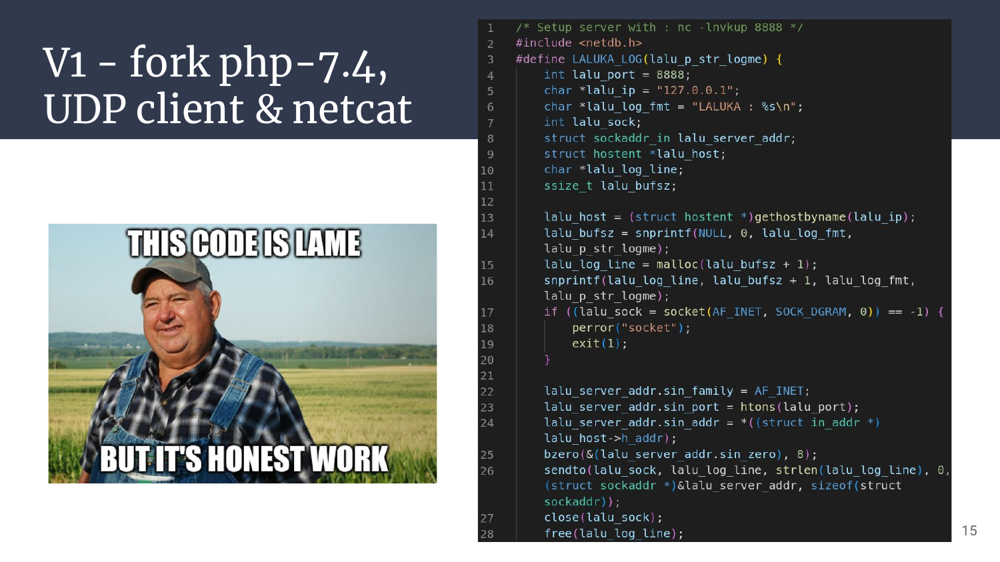

The idea for this first real iteration was to be able to log targeted functions, by adding a custom UDP client to php, and by blasting string-formatted lines of logs that a simple netcat UDP server would print out. So I tried to figure out where would be the right place to put the UDP client within php, and the right (or dirtyest?) place seemed to be right next to the declaration of the PHP_FUNCTION macro that is called pretty much everywhere a function lives.

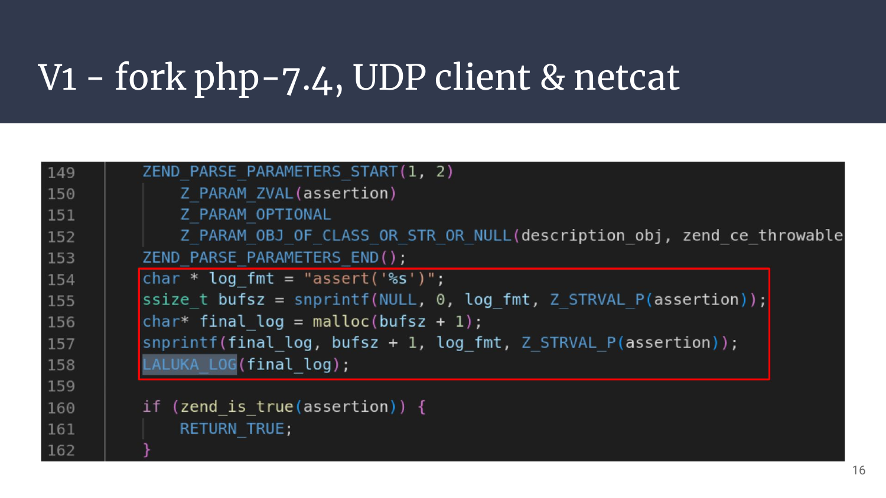

Once our UDP client is in place, we still need to understand how functions work in Php, parse their arguments, format them nicely in our log-strings with snprintf (no sprintf for pwn PTSD (๏ᆺ๏υ) ), and send them out.

- Long story short 1: Functions are declared in with the PHP_FUNCTION macro, and the macros ZEND_PARSE_PARAMETERS_END and ZEND_PARSE_PARAMETERS_START are kind of unstacking arguments passed through Z_VAL objects.
- Long story short 2: Even though I wrote only a few lines of C, I might have introduced security issues and performance issues. C is hard and I don't pretend to be good at it. M'kay?

So that's it, it's manual, it's tedious, but it definitely works!

Now, how could we cover more interesting functions? How could we automate the process of hooking, parsing, formating, and sending information? How could we reach a decent speed at runtime? And how could we avoid recompiling the whole (php/zend) thing everytime we change a single char?:x

Also, hwo caw ne pverent thaerds fmro diong taht? HLEP!

You get the idea, this first iteration validates the idea, but won't do the trick on its own.

### V2 - xDebug is all you need, but SLOW AF

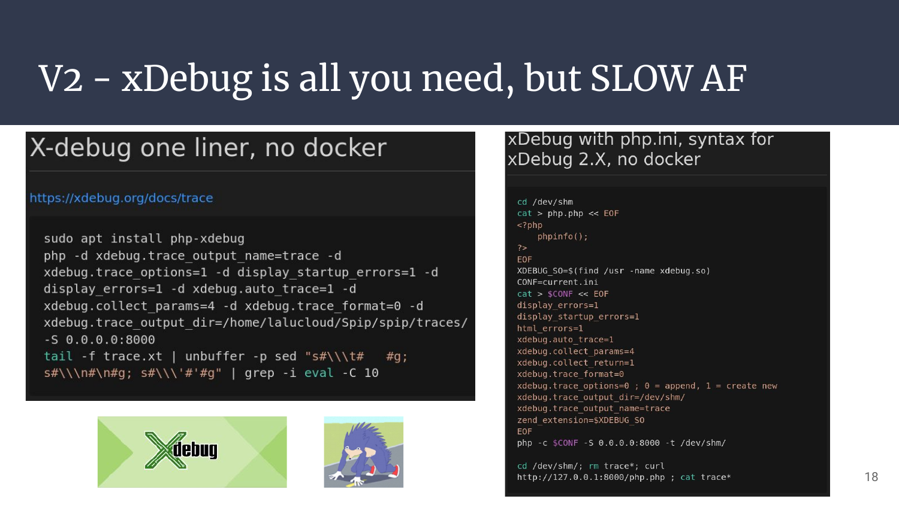

The second iteration came from the idea of relying on developers tools. As demonstrated earlier, devs also use introspection a lot for profiling, troubleshooting, and debugging. In Php, xDebug is THE .so you need. It's really easy to install, not too painful to configure, and it can both allow the use of a live debugger or automate the tracing of EVERY SINGLE FUNCTION CALL OR PHP LINE!

> This was actually not that easy to setup as the documentation is sometimes quite cryptic, and the in-between for versions 2 and 3 is a bit blurry, so it took some time to have the right rules to have a clean dump printed out at the right place, but we're getting there!

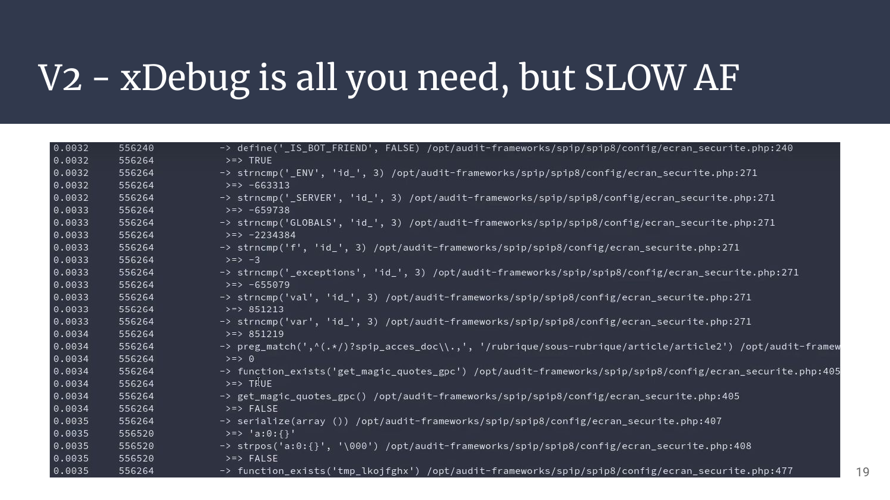

The output can be parsed to some extent, and the given information is way more than what we need. But... 

It's SO DAMN SLOW!!!

And the overhead, oh my god. As EVERYTHING is logged, the output can be really **really** huge.

> Fun fact: I've had crazy issues with this one. I used to place the dumped files in /dev/shm to benefit from the writing speed this device (actually ram) offers. But while playing with Magento2, the generation of a css file with php had so many nested functions that **one single request  took more than 20Go**!
> I have a 32Gb laptop. I ran the curl twice to check if this was a hiccup or a normal behavior. 20Go+20Go definitely fills my 32Go of ram, my computer froze, then crashed. Gg me.

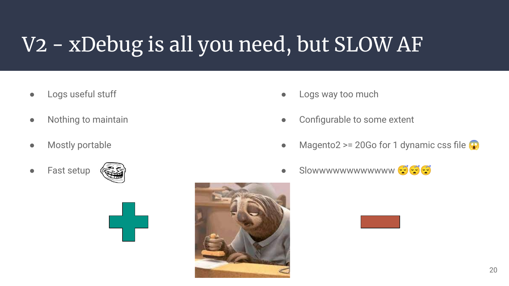

So that's it for this second iteration, we have all the information we need and even more. We're actually drowning, in fire, with log-lines thrown violently at us as we sink.

> Small idea that came while writing the article version of the talks: Maybe forking xDebug or offering a PR to add the capability to have a fine-grained configuration toward what is logged might have been smart. Might. 
> I read some documentation about filtering stacktraces (with configuration files) depending on the path, but nothing about function names or parameters. Maybe code changes are needed, maybe more documentation is needed, if you know, come say hi!

This is when I reached out to Groumpf and told him about my current project, if he wanted to have a look, or even better, join me!

Therefore, the keyboard is now his for the V3 & V4, I'll be joining back at V5!

### V3 - Fork php-7, curl, sync

Hello there! So we're back to the idea of hooking directly into the PHP source code, Laluka POC'ed this, but this time we want to do it nice and clean.

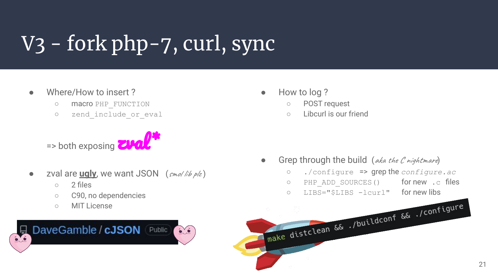

First of all a quick reminder/overview: we're trying to hook things inside a huge C project, and we will probably have to add some libraries on the way. C/C++ build systems can easily become a nightmare to manage, especially when you're not familiar with the project's structure, and I do not plan to become a PHP specialist. 

This means: **We want to keep it simple**, especially with new dependencies!

Let's see where Laluka's work was, and how to improve/get further:

- His intuition on `PHP_FUNCTION` macros was right: every function (except for `include`/`requires`/`eval` and other code generative stuff) is declared this way and exposes the arguments we're looking for in `zval*` arrays.
- I wrote a small recursive function that translate `zval*` into JSON, to get away from ZEND as quickly as possible. Then we call it from above and log the payload away with libcurl. Long live `log_zval_parameters()`!

> Notice the small JSON lib I choose, 2 files, easy to add to the project. \
> Keep it simple!

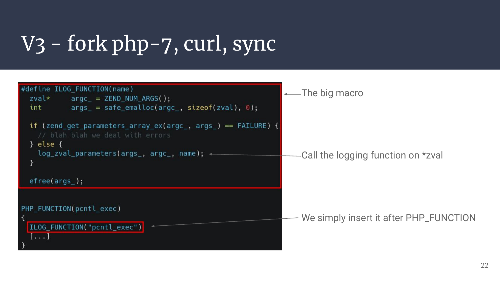

I then created a macro (trailing back-slashes are removed for readability) which loads the parameters into an array from any `PHP_FUNCTION` context. We "just" have to add the macro in every function we want to log and here it is!

Except for `include`, `eval`, `requires`...\
Let's deal with this now!

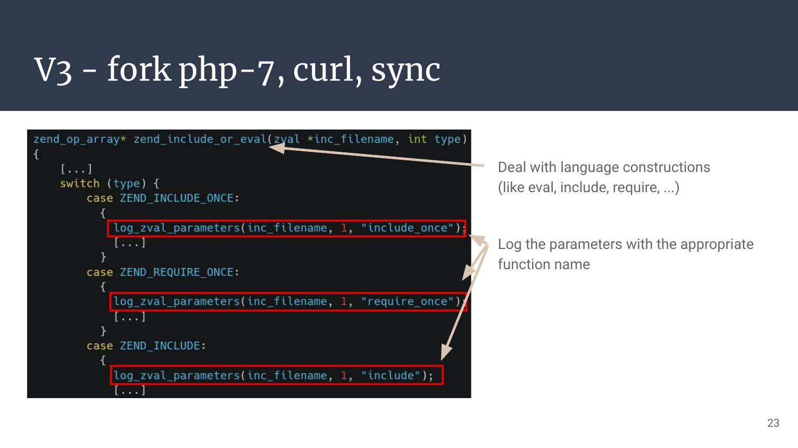

These PHP functions are all defined in the same C function, which uses a `switch ()` to handle the different cases. Parameters are already loaded in the `zval* inc_filename` parameter, so we just have to hook on every case and we're done!

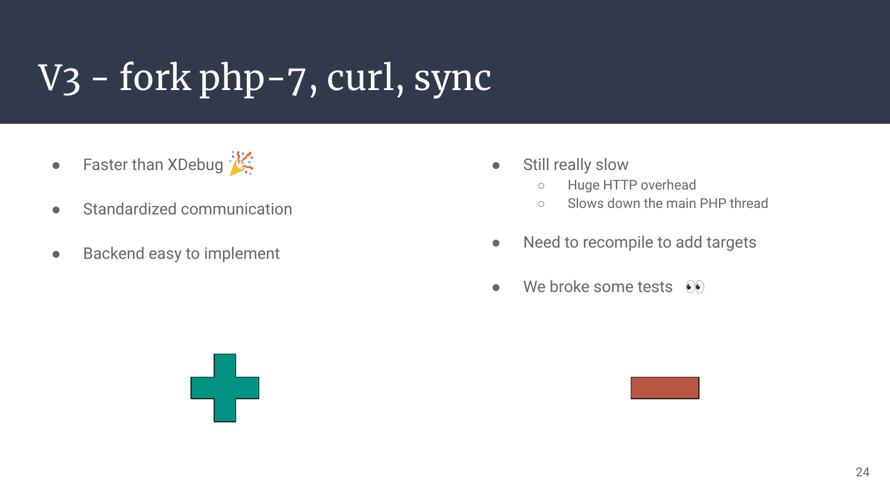

So that's it, our third iteration actually works quite the same way as the 1st one, but with POST requests, way simpler to configure, add targets, and define the listening backend's address and port.

No surprise it's way faster than xDebug, but still slower than what we need, although it's getting in good shape.

So how can we get faster while sticking to the same idea?

### V4 - Fork php-7, async UDP, python backend

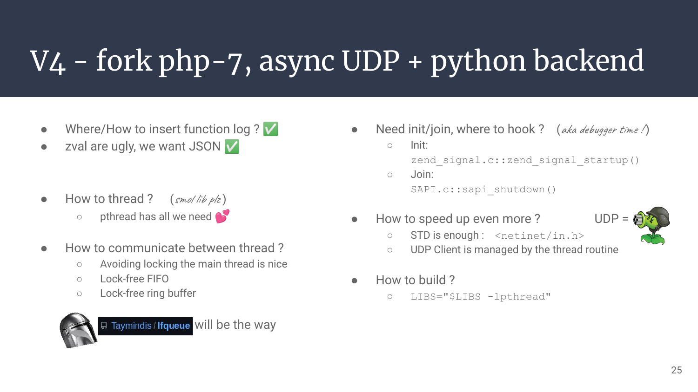

The two main suspects slowing us were:

- We are doing all the work on the main PHP thread, not the brightest idea, so let's thread this up!
- The HTTP overhead & RTT of a POST request is useless, UDP was probably a better idea.

Everything is in the slides but quickly: ring-buffer VS FIFO is an interesting debate. Ring-buffer could be more efficient by sparing some heap allocation but would require more fine-tweaking. FIFO will do, FIFO we go!

For the record the two lock-free structure I considered for this part are:

- [FIFO](https://github.com/Taymindis/lfqueue)
- [ring-buffer](https://github.com/QuantumLeaps/lock-free-ring-buffer)

Also if we forget to join on the logging thread, we might exit before everything has been sent on the network. So we wait for it, gently.

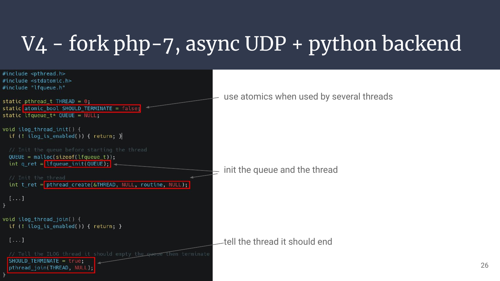

If we take a quick look at how I implemented thread init & join we can outline an interesting part: the use of *atomic variables*.

Usually basic types smaller than 32/64bits (on respectively 32/64bits systems) are guaranteed to be lock-free when atomic.

Understand: "Painless Synchronization"! *I said keep it simple!*

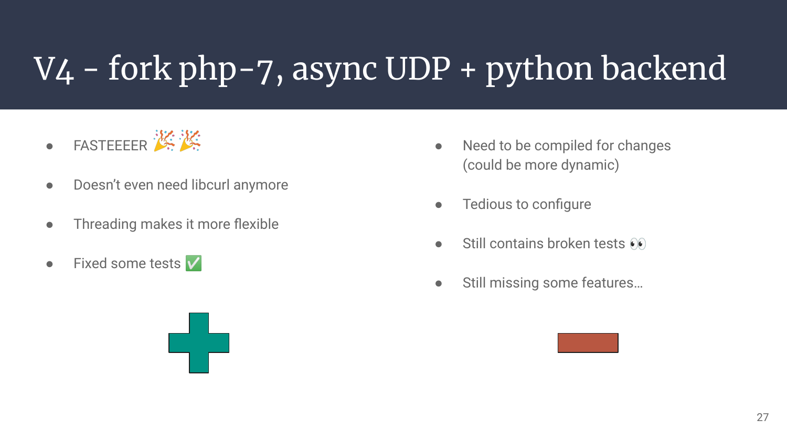

So how does this 4th version perform? Very well! It's fast, easier to configure, we added an init hook so we can read configuration files at startup, and we don't bloat the main thread with our stuff anymore!

But it cannot outrun the major limitation: you need to recompile PHP everytime you try to modify/add stuff.

> An interesting way to make it more flexible would be to override `PHP_FUNCTION` with a custom macro, which would dynamically check if the name of the function is in a user-provided hashtable to determine if the function is to be logged. But at that time... A new challenger appeared!

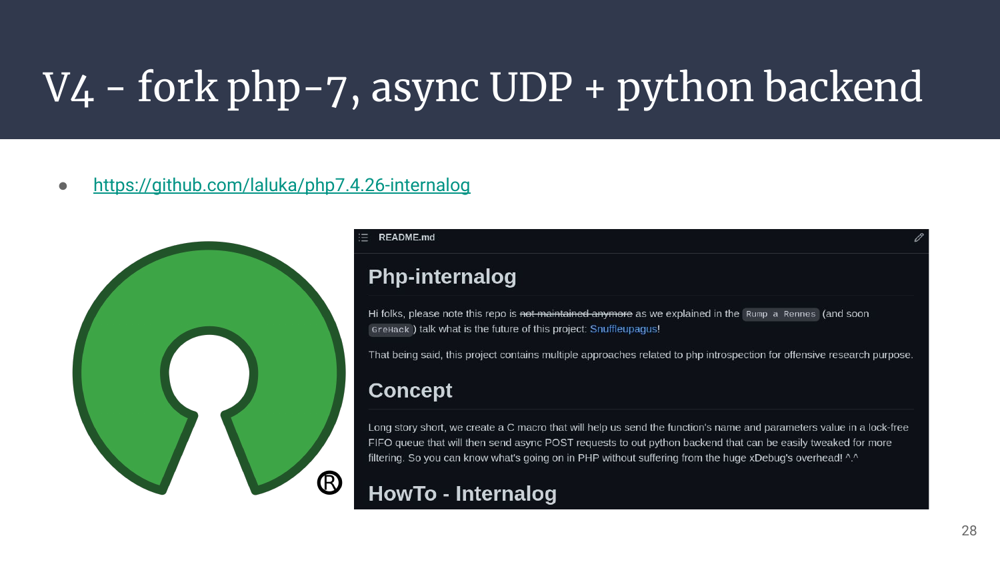

This project & code is open source, have fun tearing it into pieces!

### V5 - rump@StHack, long live Snuffleupagus

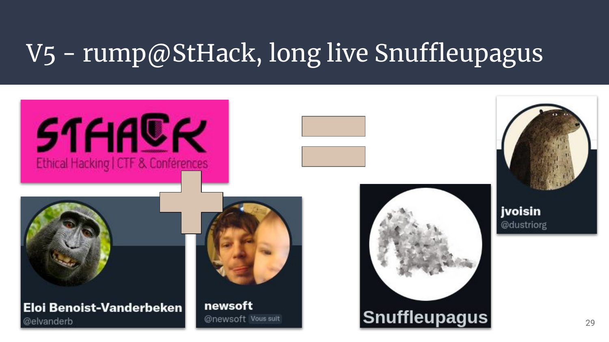

1. Be me, go to StHack, give a short rump with the current state of the project to tease for a later talk
1. During the Q&A, Eloi asks "Hey, how is your tool different from suhosin or Snuffleupagus?" // Back then I had no clue, and said so
1. A few days later, I read about it, tried to PoC it, and ended up confused about the tool features. I was probably quite tired, so I walked it away.
1. A few days later, I visited @NewSoft, we chatted, and walked. I then told him about this question, suggestion, tool, and my cluelessness about it.
1. He tells me that this tool is neat, that he knows the maintainer, actually works with him, and that I definitely might have missed something. He also suggests that we speak together.
1. So we speak, and speak, and after struggling quite a lot to understand each other (much fun actually!), we finally find a way to tweak the tool to fit our needs and patch a few discrepancies on the way!

> Takeaway: Never stay alone on your projects, meet friends, exchange, learn from each other, tell what you know to those that can benefit from it!

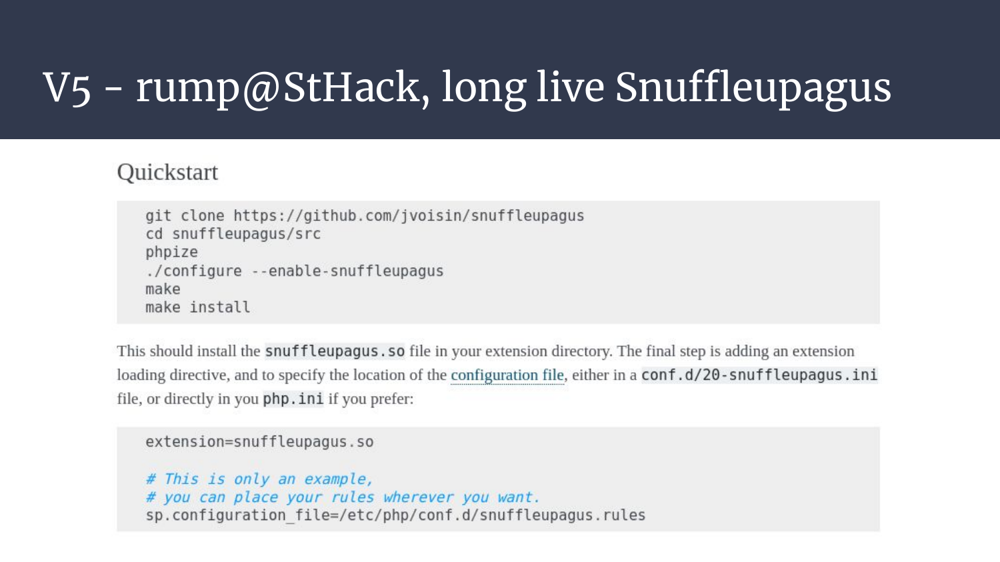

Now we have the background, but what does Snuffleupagus actually do?

Snuffleupagus will read a configuration file containing rules, and then hook the right places in the php codebase to be able to block them. 

Block? Yup. This tool was originally designed for blue-teamers willing to harden their php server, by killing classes of bugs with a one-shot approach instead of patching every potential occurrence of a bug.\
But you know what's even better?\
To ensure that blocking a function would not cause an application to crash, they added the `simulation` keyword in the rules to only simulate (ie. "log") the detected behavior.

The installation is straightforward, the documentation is clean and easy to read. Yum!

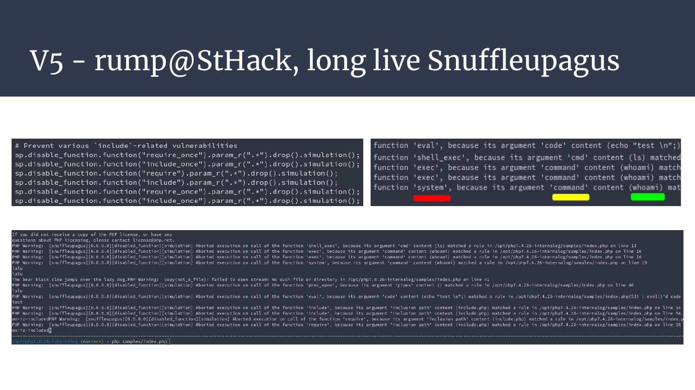

- Top left: The rules that indicate the functions to log, and the parameters (a regex) to log. Also, our beloved "simulation" keyword!
- Top right: Function X has been blocked/logged, because its argument Y contains the (here any) word Z
- Bottom: The full log output, quite indigest if not parsed!

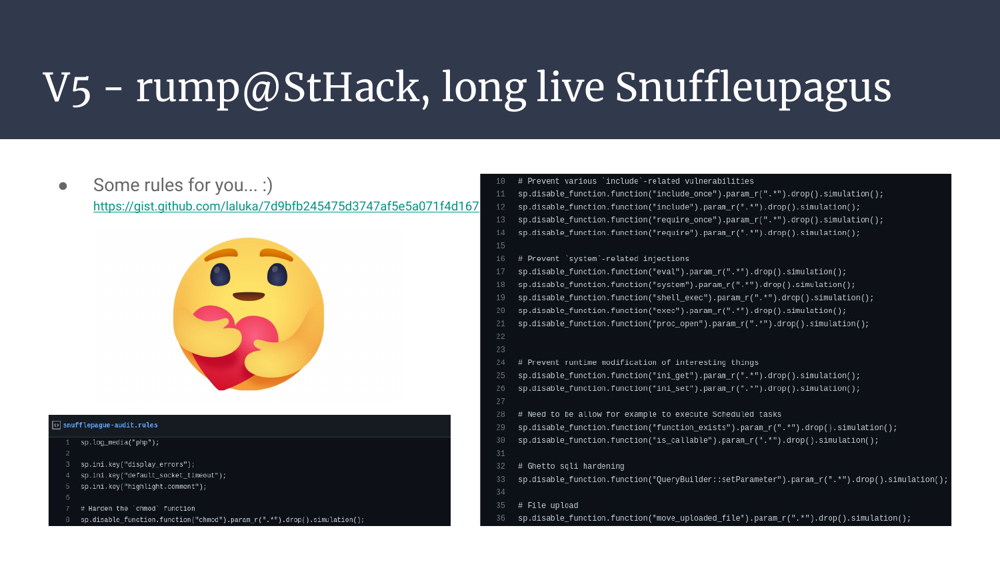

Here's a basic set of rules I played with, it's not exhaustive, but it's enough to start finding cool bugs!

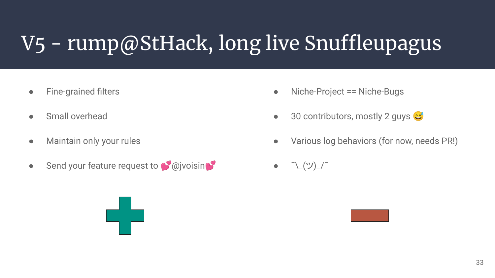

So... That's it, we have our fully packaged tool for introspection?

Yes! Of course it's not "finished" yet, and what I want to mean is that no project is ever finished. It would be nice to have more coverage, more standardized logs, more contributors for this awesome project, rules for every open source framework, etc, etc etc.

But DANG! This is a really decent start!

# 4. Pentest, Methodology, and Findings

That's cool and all, but is this approach yielding cool results?

If so, how can I use it as well to learn & play along?

Pick the Php framework of your choice. Install Snuffleupagus, crawl it, fuzz it, mine its parameters, inspect your logs, and...

Voilà! You're a 0-day researcher now! 🎉🥳🎉

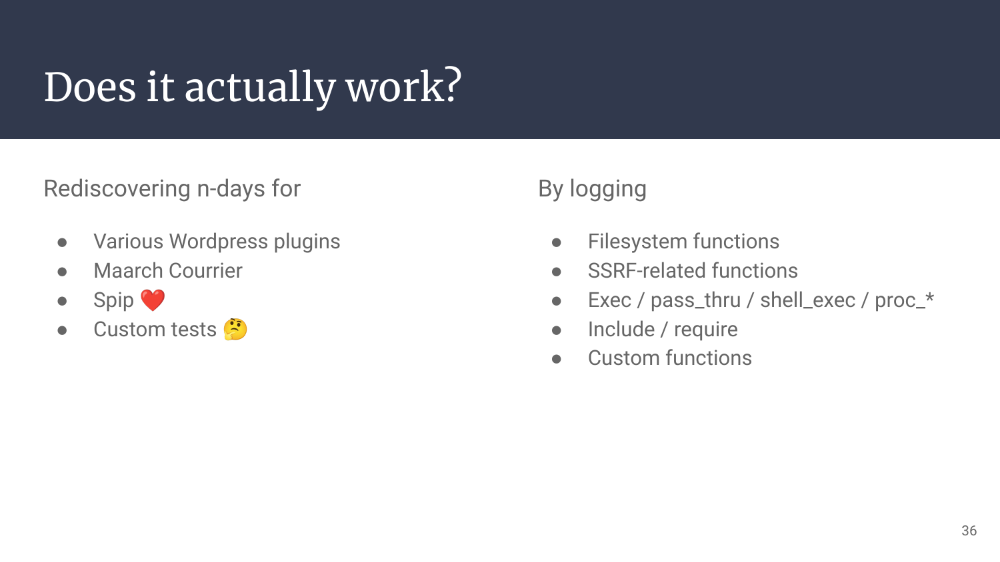

On my side, I've been able to reproduce various issues with wordpress plugins without reading much code, and find 0-days in Spip and Maarch Courrier in little time. Of course Snuffleupagus doesn't do it all for you, you'll still be in charge of code coverage and generating interesting payloads to provoke interesting logs, but now you have your researcher lens to peek from Php's Core!

### Demo, RCE post-auth on Spip 4.2

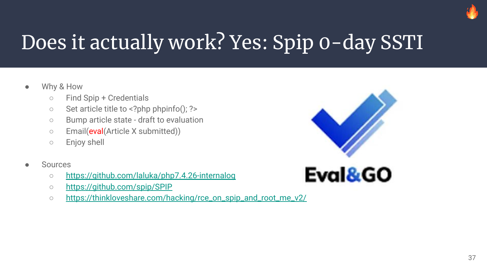

One case that demonstrates well the importance of introspection is this blind SSTI. On the webpage, if the template works or fails, no log is shown, but under the hood, some nasty eval takes place.

I was fiddling around, pasting php tags here and there, and had no errors. But at some point, an angle bracket has been logged in an eval call. Woopsy!

As the php tag was still half broken, a simple outbound dns request or file touch wouldn't have worked as an eval'd code needs to be valid (AST way) before anything gets executed. Mine was not because of string transformations, so I would have missed it silently!!!

#### Without Snuffleupagus



#### With Snuffleupagus



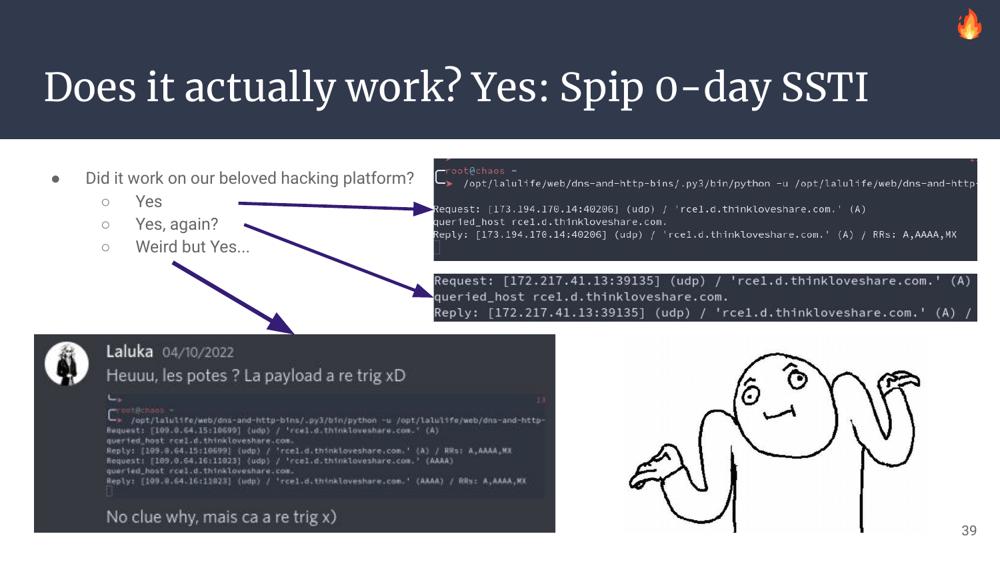

> One last fun fact: Yes, this worked on our beloved French hacking/training/ctf platform. Actually it worked twice and I don't know why. Aaaactuallyyyy, while cleaning and while the payload was being removed, it triggered a third time, and to this day, I still don't know why as I took no extra time to inspect why. // cc [@SpawnZii](https://twitter.com/SpawnZii) if you read my words.. ;)

# 5. Outro

What we introduced here is a first naive approach to introspection applied to offensive research. This is definitely not a finished product in any way. Yet we really wanted to lay some bricks so we can build as a community, and not as individual researchers.

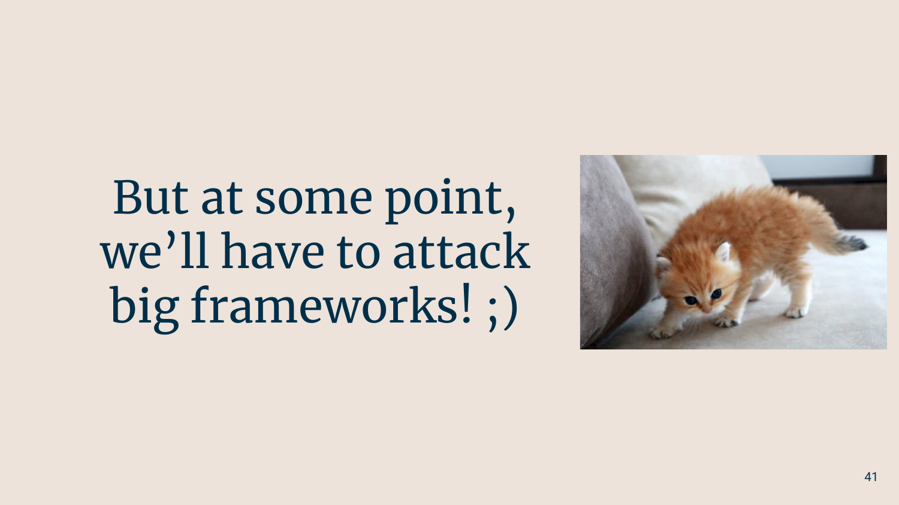

Don't worry tho, time passes, skills are coming along, and... At some point we'll definitely try to attack battle-tested frameworks to see what they're truly worth security-wise!:D

# 6. Kudos

As always, let's take the time to thank all those who have made these events and research projects possible!

- [@elvanderb](https://twitter.com/elvanderb) at StHack for mentioning Snuffleupagus during my rump's Q&A
- [@dustriorg](https://twitter.com/dustriorg) / Jvoisin for actually maintaining Snuffleupagus, kudos to the previous researchers as well
- [@newsoft](https://twitter.com/newsoft) for drinking at Meetups, knowing stuff, and helping cool folks meet to engage in new projects!
- Staff teams from [GreHack](https://twitter.com/grehack) and [RumpARennes](https://twitter.com/securinsa) for the events!
- The community (you), otherwise there would be no event ;)
- Php for being... Php...:)

---

We ([@Groumpf_](https://twitter.com/Groumpf_) and [I](https://twitter.com/thelaluka)) wish you had a great time reading this article. 

Feel free to reach out for new cool research ideas! \
Until we meet again: Happy breaking!