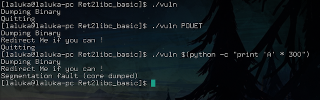
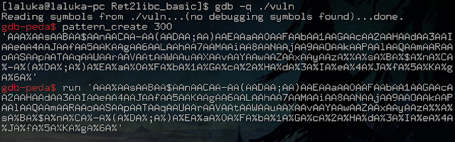
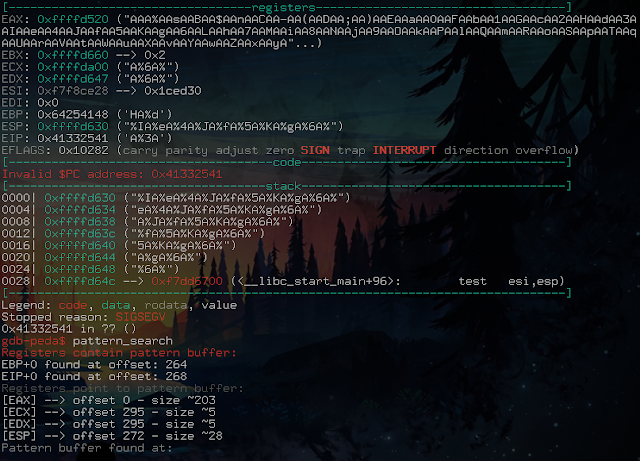
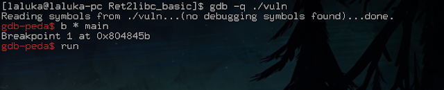
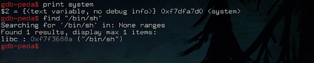
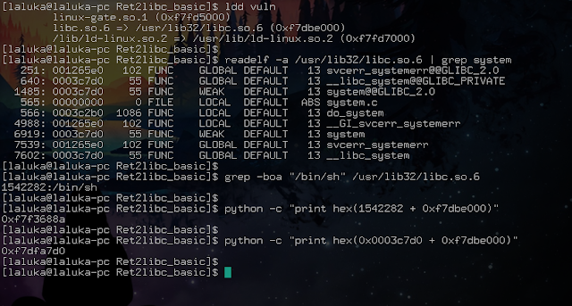
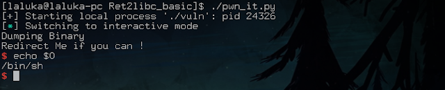
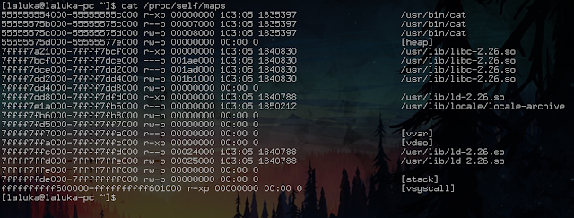

> Small edit after the initial publication of the articles:

> These four articles lead me to give an "pwn introductory" conference at the HitchHack 2018. It summarizes the first 3 articles but goes less into detail. If this format suits you better, the slides are downloadable [here](/hacking/pwn_1of4_buffer_overflow/slides_conf_123_pwned.pdf) and the video (French only) here :



Welcome to this 2nd article dedicated to pwning linux executables!

On the list today, the ret2libc, or return to lib C. Still in the family of buffer overflow exploits, and always with the colleague's sources: https://cyrilbresch.fr/

I won't not go back to the huge definition list here, if needed, check back the (quite rough) previous article !


## The ret2libc... Why?

In the first article, we injected a shellcode into the stack, and we used the buffer overflow to redirect the execution on our shellcode, allowing us to spawn a shell. It was good, it was a little tricky, but it was... Functionnal ? Sadly, nowadays, it's not as easy as it was. Sad isn't it?

Indeed, at each security breach, new protections are developed and added to the systems. One of the protections found against this attack is the use of an NX flag placed on the stack. This makes the stack non-executable. Damnit!


Fortunately for us, some bearded (or beardless, who am I to judge?) people have found solutions to be able to have fun anyway. One of them, the ret2libc!


## The ret2libc... Wut ?

A C program does not know how to do much, very little in fact. In a program we use functions that "works magically", without thinking too much about what's underneath.

For example, the printf function that allows us to display text. The getc function which allows us to read a character typed by the user. Or even... The system function, which allows us to run a new program. All these functions are accessible in our program, we use them without ever having had the curiosity (or even the desire?) to look at their content or recode them. Good thing for us, they are already done, and placed in the...\
*Drum roll...*\
**libc** !

A little ref to the man: http://man7.org/linux/man-pages/man7/libc.7.html


Long story short, it is the standard C library, the place where all the most common / used functions are stored.

A program using the libc dynamically will be given a reference to this library when first executed. It'll then know where it can find it, its position in number of byte, in the stack.

The way it finds the different functions in the libc is quite complex, so I won't talk about it in this article, but for the most curious / brave: [plt_got_ld_so](https://www.segmentationfault.fr/linux/role-plt-got-ld-so/)

The main idea is the following:

The stack is not executable? Duh... The libc, on the other hand, is present, contains interesting functions, and is executable. The only thing left to do it to call on its functions. Literally.

We will therefore place in the stack the arguments that interest us (the arguments are here passed  by the stack, x86-64 style) as well as hijack the execution flow of the program to make it execute the system function (there are many variants, but it remains the most classic).

Note :

A program compiled in static (gcc: option -static) is not exploitable this way, because the used functions of the libc will have been incorporated into the program, so not libc will be linked at start-up. It will therefore not have access to the system function. But fortunately for you... Article 3? è_é


## The ret2libc.... How?

The basics are in place, now,  the walkthrough!

The studied binary is downloadable [here](vuln)

We start by understanding how the program works (or does not work...), find the crash :



Note :

 - `$(cmd)` : allows you to execute the cmd command as a priority.

 - `python -c "code"`: allows you to execute python code from bash. So it's really easy to display a lot of chars.

We're crashing. Well, that's excellent! Now, the offset, with the tool `pattern` in gdb-peda:



I will explain some more the next screenshot, because it hurt you quite bad (cf your feedback, thank youuu!)

The terminal is divided into three parts:

 * Registers: What the different registers contain when the program stops, here by a crash.

 * Code: Where EIP (Instruction Pointer) points, i.e. where we are in the execution and what comes next.

 * Stack: The content of our stack, with addresses, format, references, ...



Then we look for the pattern used previously to find the offset. Here, miraculously, EIP is directly controlled, which is actually quite rare... Good thing for us!

The offset displayed for EIP is therefore 268 bytes.

Now, the ret2libc part:

A simple payload will have the following structure:

-> "A" * offset\
-> Where we want to jump (system)\
-> Where the program will return after the function call\
-> Argument(s) of the used function

So we are missing the system address, and our parameter.

There are plenty of ways to retrieve this information, I'll show you two.

Attention, we are working here without the ASLR, once again to make the exploit more understandable. To disable it:

```shell
$ # As root :
$ echo 0 > /proc/sys/kernel/randomize_va_space
```

The first, simpler but also not always reliable, makes uses of gdb / peda (note that gdb disables by default the ASLR when debugging):





It is important to set a breakpoint (software breakpoint, a way to pause the program to see, for example, the state of its registers, and continue its execution later on) at the beginning of the program and run it before doing our search. It is necessary so the libc has been resolved (attached / linked). Otherwise, you wouldn't see anything, neither system, nor "/bin/sh", this string being nicely placed in the libc.

Second solution, a little less simple but so much more reliable / scalable:



I will detail it for you, because these tools are powerful but not necessarily easy to use when you discover them.

 * Step 1:

 ldd displays the shared dependencies of a program. Here, (among other things), the libc and its offset. Without ASLR it does not change, with it enabled, it will change each time.

 * Step 2:

 readelf, helps us to analyze the content of the libc, which is an ELF file, but also a shared library. Option `-a` to read all the content, and put all the lines analyzed in grep using a pipe `|`, which will search for lines containing the word system. We get the one we are interested in: 0x0003c7d0, so the system offset in the libc.

 * Step 3:

 We then look for `/bin/sh\x00` in the libc. `-b` to have the offset in byte, `-o` to have only the search word and not the line, and `-a` to activate the analysis in binary mode. We therefore obtain in decimal the offset of `/bin/sh` in the libc.

 * Step 4:

 Some python to get the sum of the libc offset and what interests us, and BIM, we have everything. A little longer, but for more complicated exploits, this way of doing things is to be preferred, believe me! :')


So we got the system and `/bin/sh` addresses to run a shell. Allright! :D

Now that we have everything we need, let's write down our exploit:

```python
#!/usr/bin/en python2

from pwn import *

offset = 268
payload = "A" * offset
payload += p32(0xf7dfa7d0) # @system
payload += p32(0x42424242) # @retour - foo
payload += p32(0xf7f3688a) # @"/bin/bash\x00"

r = process(["./vuln", payload])
r.interactive()
```

Note :

Here, I used 0x4242424242 because the value doesn't matter to us, where the program returns here when leaving the targeted function, here it doesn't matter. But if you want to avoid the program crash when you close your shell, it is possible to put in this location the address of the exit function, which will properly close the program, thus leaving no trace in the logs... ;)

Here, once the shell is closed, the program will jump to address 0x424242424 and die of a painful segfault... Save lives, place exits... Or don't.

Then we run it:



And BIM, we pop our shell via a very basic ret2libc!


## Bonus: Memory mapping!

Assuming that the ASLR is activated, this solution can still be used under one condition: to be able to find the libc. There are many techniques to leak its current location, and that the program is started (because remember, it changes every time), all you have to do is add the function offset to get your exploit.

But luckily, there is a magical place in our system, readable by the user who ran the program (thank you Geluchat for the rectification, his website here: https://www.dailysecurity.fr/), which tells you where the different objects related to its execution are placed: `/proc/self/maps` !



A quick look there, or by /proc/PID/maps (the PID being the identifier of the program to analyze) will allow you to see where the different parts are placed. If you can pause your program and read this information, the ASLR is no longer relevant! :)

I will stop here for this brief introduction to ret2libc. Be aware that this is a basic example, that it is common to "chain" ret2libc calls to use several functions in a single exploit. Next article, the ROP!

See you soon for the third article and thank you for your many feedback!

And for those of my class who read me...\
Keep it up, the second-chance exam is coming!


<h2 id="fr">French version</h2>


 > Petit ajout après la publication des articles :

 > Ces quatres articles ont donné lieu à une conférence d'introduction au pwn à la HitchHack 2018. Elle résume les 3 premiers articles mais rentre moins dans le détail. Si ce format vous convient mieux, les slides sont téléchargables [ici](/hacking/pwn_1of4_buffer_overflow/slides_conf_123_pwned.pdf) et la vidéo (francais uniquement) ici :



Bienvenue pour ce 2ème article consacré au pwn d'exécutables linux !

Au programme, le ret2libc, ou retour à la lib C. Toujours dans la famille des exploits type buffer overflow, et toujours avec les sources du collègue : https://cyrilbresch.fr/

Je ne repasse pas par la liste des définitions, celle-ci ayant été bien dégrossie dans le premier article.


## Le ret2libc... Pourquoi ?

Dans le premier article, nous avons injecté un shellcode dans la stack, et nous avons utilisé le buffer overflow pour rediriger le flot d'exécution sur notre shellcode, ceci nous permettant de spawn un shell. C'était bien, c'était un peu tricky, mais c'était... Fonctionnel ? Ce n'est malheureusement plus aussi facilement réalisable de nos jours. Triste n'est-il pas ?

En effet, à chaque faille de sécurité, de nouvelles protections sont élaborées et ajoutées aux systèmes. L'une des protections trouvée contre cette attaque est l'usage d'un flag NX placé sur la pile. Cela rend la stack non exécutable. Damnit !


Heureusement pour nous, des barbus (ou imberbes, qui suis-je pour juger ?) ont trouvé des solutions pour pouvoir quand même s'amuser. L'une d'entre elles, le ret2libc !


## Le ret2libc... Wut ?

Un programme en C ne sait pas faire grand-chose, très peu en fait. Nous faisons dans un programme appel à des fonctions qui "font de la magie", et ce sans trop réfléchir à ce qu'il y a dessous.

Par exemple, la fonction printf qui nous permet d'afficher du texte. La fonction getc qui nous permet de lire un caractère saisi par l'utilisateur. Ou encore... La fonction system, qui nous permet d'exécuter un programme externe au notre. Toutes ces fonctions sont accessibles dans notre programme, nous les utilisons sans jamais avoir eu la curiosité (ni même l'envie ? ) de regarder leur contenu ou de les recoder. Tant mieux, elles sont déjà faites, et placées dans la... \
*roulement de tambours... **libc** !

Petite ref au man : http://man7.org/linux/man-pages/man7/libc.7.html


En bref, c'est la librairie standard C, l'endroit où sont stockées toutes les fonctions les plus habituelles / utilisées.

Un programme utilisant la libc en dynamique se verra, à son lancement, donné un accès à la libc via son offset (comprendre "là où il peut trouver la trouver" / sa position, en nb de byte, dans la stack).

La manière dont il trouve les différentes fonctions dans la libc est assez complexe, je n'en parlerai donc pas dans cet article, mais pour les plus curieux / courageux : [plt_got_ld_so](https://www.segmentationfault.fr/linux/role-plt-got-ld-so/)

L'idée générale est la suivante :

La stack n'est pas exécutable ? Duh... La libc, elle, est présente, contient des fonctions intéressantes, et est exécutable. Plus qu'à sauter dessus, sens propre comme figuré !

On va donc placer dans la stack les arguments qui nous intéressent (les passages d'arguments se font ici par la stack, x86-64 conventions) ainsi que détourner à nouveau le flot d'exécution du programme pour lui faire exécuter la fonction system (il y a pleinnnnn de variantes, mais ca reste le plus classique).

Remarque :

Un programme compilé en statique (gcc : option -static) n'est pas exploitable de cette manière, car les fonctions utilisées de la libc auront été incorporées au programme, elle ne sera donc pas attachée au lancement. Il n'aura donc pas accès à la fonction system. Mais heureusement pour vous... Article 3 ? è_é


## Le ret2libc... Comment ?

Les bases sont posées, maintenant, le walkthrough !

Le binaire étudié est téléchargable [ici](vuln)

On commence par comprendre comment le programme fonctionne (ou ne fonctionne pas...), trouver le point de crash :


Remarque :

 - `$(cmd)` : permet de faire exécuter en priorité la commande cmd.

 - `python -c "code"` : permet d'exécuter du code python via bash. Donc afficher facilement plein de caractères.

On crash. Bien ca, excellent ! Maintenant, l'offset, avec le tool `pattern` dans gdb-peda :


Je vais expliquer un peu mieux le prochain screenshot, car il vous a pas mal embêté (cf vos retours, merciii !)

Le terminal est découpé en trois parties :

 * Registers : Ce que contiennent les différents registres au moment où le programme s'arrête, ici par un crash.

 * Code : Là où pointe EIP (Instruction Pointer), c'est à dire là où on en est dans l'exécution et les instructions à suivre.

 * Stack : Le contenu de notre pile, avec les adresses, leur format, références, ...


Puis on cherche le pattern utilisé précédemment pour trouver l'offset. Ici, miracle, on contrôle directement EIP, ce qui est en réalité assez rare... Tant mieux pour nous !

L'offset affiché pour EIP est donc de 268 bytes.

Maintenant, la partie ret2libc :

Un payload simple aura la structure suivante :

-> "A" * offset\
-> Là où on veut sauter (system)\
-> Là où le programme retournera après l'appel de fonction\
-> Argument(s) de la fonction utilisée

Il nous manque donc l'adresse de system, et de notre paramètre.

Il y a plein de manière permettant de récupérer ces informations, je vais vous en donner deux.

Attention, on travaille ici sans l'ASLR, une fois de plus pour rendre l'exploit plus compréhensible. Pour le désactiver :

```shell
$ # En tant que root :
$ echo 0 > /proc/sys/kernel/randomize_va_space
```

La première, plus simple mais aussi pas toujours fiable, via gdb / peda (attention, gdb désactive par défaut l'ASLR lors du débuggage) :


Il est important de mettre un breakpoint (point d'arrêt logiciel, une manière de mettre le programme en pause pour voir par exemple l'état de ses registres, puis continuer son exécution ultérieurement) en début de programme et de le lancer avant de faire notre recherche, car il est nécessaire que la libc ait été résolue (attachée / linkée). Dans le cas contraire, on ne voit rien, ni system, ni "/bin/sh", ce string étant gentiment placée dans la libc.

Deuxième solution, un peu moins simple mais tellement plus fiable / évolutive :


Je vais vous la détailler, car ces outils sont puissants mais pas forcément faciles à utiliser quand on les découvre.

 * Etape 1 :

 ldd affiche les dépendances partagées d'un programme. Ici, (entre autre), la libc et son offset. Sans ASLR il ne change pas, avec, il changera à chaque commande.

 * Etape 2 :

 readelf, nous permet d'analyser le contenu de la libc, qui est un ELF, mais aussi une librairie partagée. Option `-a` pour lire tout le contenu, et mettre à l'aide d'un pipe `|` toute les lignes analysées dans grep, qui va rechercher les lignes contenant le mot system. On récupère celle qui nous intéresse : 0x0003c7d0, donc l'offset de system dans la libc.

 * Etape 3 :

 On cherche `/bin/sh\x00` dans la libc. `-b` pour avoir l'offset en byte, `-o` pour n'avoir que le mot recherché et non la ligne, et `-a` pour activer l'analyse en mode binaire. On obtient donc en décimal l'offset de `/bin/sh` dans la libc.

 * Etape 4 :

 Un coup de python pour avoir la somme de l'offset de la libc et de ce qui nous intéresse, et BIM, on a tout. Un peu plus long, mais pour des exploits plus compliqués, cette manière de faire est à privilégier, croyez-moi ! :')


On a donc récupéré les adresses de system et de `/bin/sh` pour faire exécuter un shell. Nickel ! :D

Maintenant qu'on a tout ce qu'il nous faut, on écrit notre exploit :

```python
#!/usr/bin/en python2

from pwn import *

offset = 268
payload = "A" * offset
payload += p32(0xf7dfa7d0) # @system
payload += p32(0x42424242) # @retour - foo
payload += p32(0xf7f3688a) # @"/bin/bash\x00"

r = process(["./vuln", payload])
r.interactive()
```

Remarque :

Ici, j'ai mis 0x42424242 car la valeur ne nous importe peu, où se rend le programme en sortant de la fonction attaquée, ici ca n'a pas d'importance. Mais si vous voulez éviter que le programme crash une fois que vous fermez votre shell, il est possible de mettre à cet emplacement l'adresse de la fonction exit, qui fermera proprement le programme, ne laissant ainsi pas de trace dans les logs... ;)

Ici, une fois le shell fermé, le programme sautera à l'adresse 0x4242424 et mourra d'un douloureux segfault... Sauvez des vies, placez des exit... Ou pas.

Puis on le lance :


Et BIM, on pop notre shell via un ret2libc bien basique !


## Bonus : Cartographie de la mémoire !

A supposer que l'ASLR soit activé, cette solution est quand même exploitable sous une condition : Arriver à trouver la libc. Il existe de nombreuses techniques pour arriver à faire fuiter l'endroit où elle a été placée, mais une fois que vous l'avez (une fois le programme lancé, car rappelez-vous, elle change à chaque fois), il n'y a qu'à ajouter l'offset pour avoir votre exploit.

Mais coup de chance, dans votre système, il y a un endroit magique, lisible par tous l'utilisateur qui a lancé le programme (merci Geluchat pour la réctification, site du poto ici : https://www.dailysecurity.fr/), qui vous indique où sont placés les différents objets liés à son exécution : `/proc/self/maps` !


Un petit tour par ici, ou par /proc/PID/maps (le PID étant l'identifiant du programme à analyser) vous permettra de voir où sont placés les différentes parties. Si vous arrivez à mettre votre programme en pause et lire cet endroit, l'ASLR n'a plus aucune utilité ! :)

Je m'arrête ici pour cette brève introduction au ret2libc. Sachez tout de même que c'est un exemple de base, qu'il est courant de "chaîner" les ret2libc afin de faire appel à plusieurs fonctions au sein d'un unique exploit. Prochain article, le ROP !

A bientôt pour le troisième article et merci pour vos nombreux retours ! `^_^`

Et pour ceux de ma promo qui me lisent...\
Bonne suite de révisions pour les rattrapajjjj !
