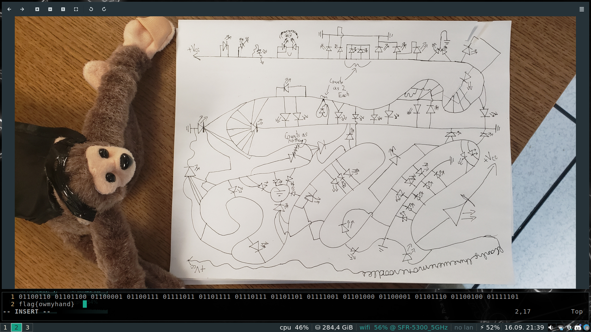

### Description

> Start from the monkey's paw and work your way down the high voltage line,
for every wire that is branches off has an element that is either on or off.
Ignore the first bit. Standard flag format.

> -Elyk

### TL;DR

This challenge consists in the analysis of a lovely electronic scheme.\
It is composed of diodes, wires, wires, wires and wires.\
The goal is to extract bits of data from the circuit.\

The task was not really hard, but if you have a bad sight, you're gonna have a bad time.

### Methology

Few things to know, here are the keys :

  - If a diode is attached to VCC on its flat side and 0 (aka GND) on its pointy side, it'll be __ON__
  - If it's the opposite, it'll be __OFF__ (yup, direction matters !)
  - If the input and output are attached to the same wire, it's __OFF__

By using these rules, we extract the bits one by one, with our eyes glitching hard, and we obtain :

`01100110 01101100 01100001 01100111 01111011 01101111 01110111 01101101 01111001 01101000 01100001 01101110 01100100 01111101`

Once decoded : __flag{owmyhand}__

<h2 id="fr">French version</h2>

### Description

> Commencez à la patte du singe et descendez la ligne à haute tension,
pour chaque fil branché a un élément, prenez une valeur on ou off. Ignorez la première partie. Format de flag standard.

> -Elyk

### TL;DR

Ce challenge consiste en l'analyse d'un superbe schéma électronique. \
Il est composé de diodes, de fils, de fils, de fils, de fils et de fils. \
Le but est d'extraire des bits de données du circuit.

Cette épreuve n'était pas très complexe, mais si vous avez une mauvaise vue, vous allez passer un mauvais quart d'heure.

### Methologie

Peu de choses à savoir, voici les clés :

  - Si une diode est fixée au VCC sur son côté plat et 0 (aka GND) sur son côté pointu, elle sera __ON__.
  - Si c'est le contraire, elle sera __OFF__ (ouep, le sense compte !)
  - Si l'entrée et la sortie sont reliées au même fil, elle est __OFF__.

En utilisant ces règles, on extrait les bits un par un, avec nos yeux en galère, et on obtient finalement :

`01100110 01101100 01100001 01100111 01111011 01101111 01110111 01101101 01111001 01101000 01100001 01101110 01100100 01111101`

Une fois décodé : __flag{owmyhand}__
