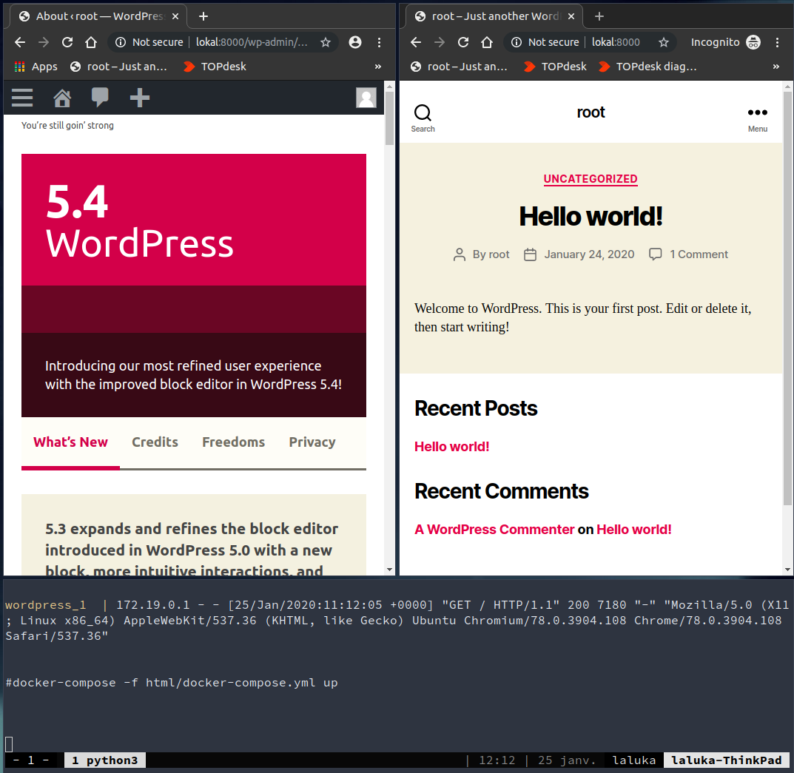
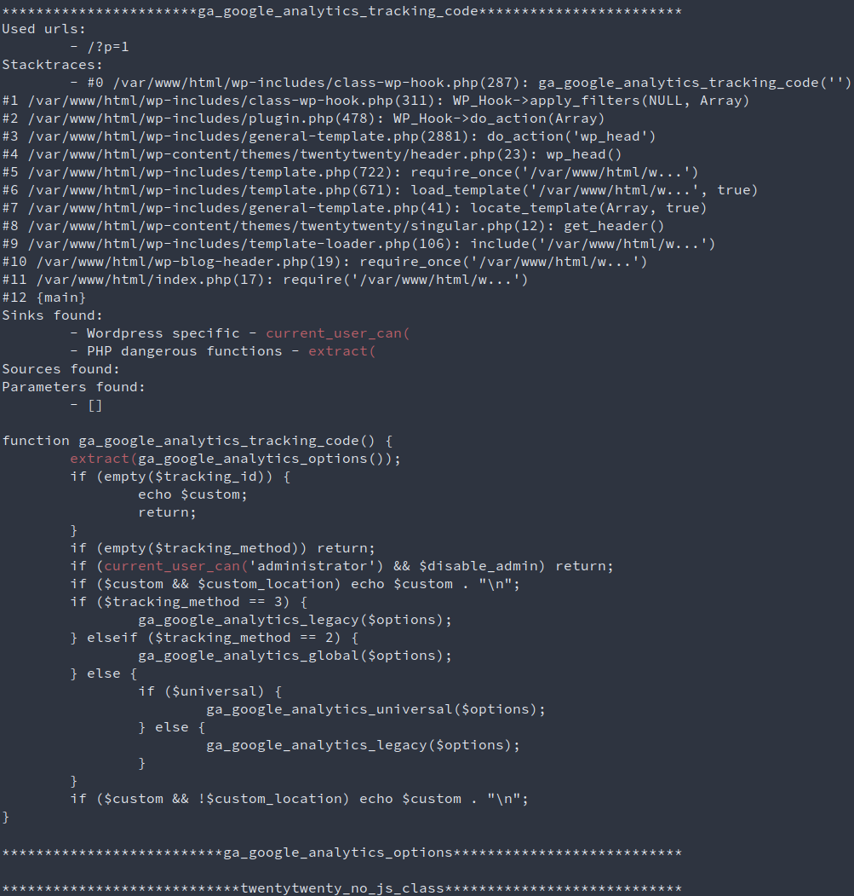
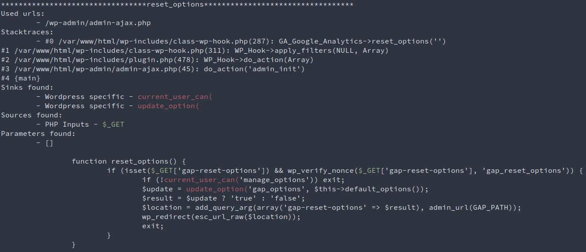

About a month ago, I had to audit a wordpress website. As it was one of my first real-life pentest, I was really hyped and ready to try extra-super-hard to compromise this target. But after a few hours, I realised that : 

- Wordpress is up to date
- Every plugin or theme is up to date
- There is no custom code (At least, I found none using gobuster and big wordlists)
- There is no weak credentials (Same, I found none doesn't mean there's none.. :] )

So my only hope was to find a zero day. Nothing less. Thus I started working on a tool to audit php components. \
In retrospect, I think I should have spent more time looking for code-auditing tools, or php tracers, or function-hooking library, but anyway, here's what came out of this need : Wordpress Subpath Auditor !


## Main audit concepts

Basically, during the audit of a Wordpress (or Drupal, Joomla, ...), there are a few quick wins the auditor can use : 

- Outdated framework vulnerable to a known CVE, leading to a direct RCE
- Outdated plugin or theme vulnerable to a known CVE, leading again to a direct RCE
- Exposed admin panel with weak credentials (then edit php code or import a file and gain RCE)

If none of these quick win works, then it's time for a "real" audit ! For me, this consists in : 

1. Running [nmap](https://github.com/nmap/nmap) scans to detect potential services running (here let's assume only HTTP(80)/HTTPS(443) is open)
1. Running [droopescan](https://github.com/droope/droopescan) or [wpscan](https://github.com/wpscanteam/wpscan) to ennumerate the users and components
1. Run [ffuf](https://github.com/ffuf/ffuf) or [gobuster](https://github.com/OJ/gobuster) with lists from [SecLists](https://github.com/danielmiessler/SecLists) or [fuzzdb](https://github.com/fuzzdb-project/fuzzdb)
1. Create a local copy of the target using [wordpress-docker-compose](https://github.com/nezhar/wordpress-docker-compose), and audit the sh*t out of it!

This local copy will include the exact wordpress version, free plugins with the right version, and `legitimately acquired premium plugin code` *cough* `dirlisting` *cough* `google dorks` *cough*. What a wonderful world we live in, with all these open-source softwares and not-so-closed other projects... =] \
Of course, our local copy won't include the custom code from our target, but usually there is either none, or a really small attack surface so that's not much of a concern. 


## Wordpress Subpath Auditor

### Main idea

The main idea behind this tool, is to track the server-side paths a user can take while browsing this website. This approach allows the attacker to rapidely identify the code an unauthenticated user can reach. \
Note that this can work with an authentified user as well (different user-roles on wordpress could have their paths compared), but I don't want to detail this approach here / for now. :)

So, your local wordpress is running fine? All the plugins are installed? Fine. Let's dig deeper now!




### How to use

The whole process is specified in the project's readme, but here's the TL;DR: 

1. Create the local copy of your target (Docker <3)
1. Commit all your changes as it's going to get EXTRA-MESSY
1. Activate your pyenv and install the `requirements.txt`
1. Run `wo_su_au.py` against your local installation
1. Inspect the results!

Here's a sample output with detected sinks:





### How it works

1. Initial crawl to discover content
1. Code instrumentation: patch all functions to log:
   1. Function name
   1. Function code
   1. Current stacktrace
   1. Current function parameters
   1. Current uri (user later for replay)
1. Crawl a second time to trigger the instrumented code
1. Retrieve the logs and parse them
1. Add [Sources and Sinks](https://www.youtube.com/watch?v=ZaOtY4i5w_U) colored hilights (less painful to read)

The there's only "a few" interesting targets left to inspect manually. But if you see something fishy, you know for sure you can reach it, and how. The only part left is to code the exploit, and you know what? It's the funny part! ;)

```bash
source .py3/bin/activate
python wo_su_au.py -u http://lokal:8000/ -s html/wp-content/plugins | tee output.txt
less output.txt
```


### Fake Known limitations

There are currently no proxy implemented as I like to keep it simple. But you know what? Sooooo many tools allow you to proxify pretty much anything that's it's quite useless to implement one. If you want to use a proxy (and you definitely should, with burp etc), consider using techniques such as env variables (`HTTP_PROXY`, `HTTPS_PROXY`, `ALL_PROXY`, ...)

The crawler works in a "GET-only" mode, which is a bit too minimalistic to have a real impact. Yet I don't want do implement a huge crawler / fuzzer in this tool, remember, linux's philosophy is to keep things as small as possible. Do only one thing, but the right way. So it's really advised to use this tool with a third part one such as [BurpSuite](https://portswigger.net/burp/communitydownload) or [Arachni](https://github.com/Arachni/arachni). Both ways, you'll want to use a proxy to keep in memory the request emitted to be able to replay them afterward. 


### True Known limitations

The current performances are litteraly `the worst`. This is due to two things : 

- Even if the webserver is multithreaded and can be fast, the logger uses only one file. I had to enforce that to prevent multiple threads to write in the log file at the same time and thus wrecking the logs. 
- Too much sh*t is being logged, and IOs are known to be a bottleneck. Some cache should be implemented to prevent logging function code every time it's hit. Maybe.. for a V2? 

The covered surface is pretty damn small, and highly dependent on the crawler / fuzzer efficiency. This is true, but this is part of the design. Every dynamic approach of a problem is leaving apart a huge part of the code, it's a trade off. This is why `this tool will never replace a thorough code audit`. 


## Demo video




## Can I use this tool ?

Yes, but only if you don't cry too much while reading my dirty code, I don't want you to be sad because I'm a shitty dev... Ok?

This tool is open source since... Well, released with the article, so `today`, relatively speaking :) \
You can get it here: https://github.com/Laluka/wordpress_subpath_auditor

> I'll end this article with a quote from someone I like, \
> "Quick, find something, break something!"
