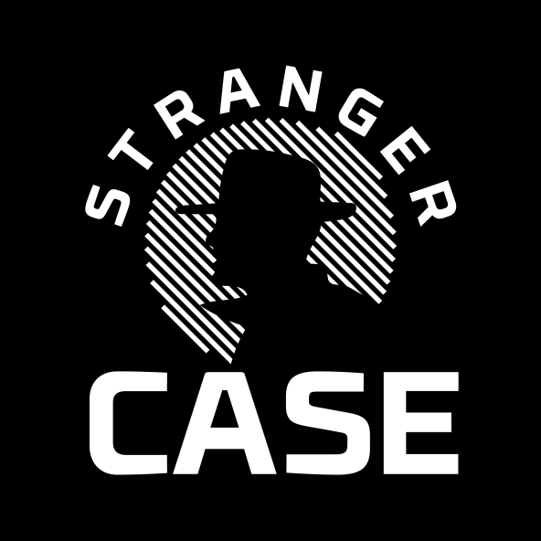

## ThinkLoveShare

Writing InfoSec BlogPosts & Streaming takes time and requires a decent setup (and work-life balance). If you like the work done here and want to help me moving forward with new research & projects (thanks! ❤️ ), here are a few options!

- Sponsor a Stream-Episode [twitch.tv/thelaluka](https://www.twitch.tv/thelaluka) or BlogPost
  - You can suggest a topic, guest, tool or feature to PoC
  - Your logo & links will be reflected Live & in the `Wall of Support` below
- Make a one-shot or reccurent small donation through one of
  - Tipeee - [tipeee.com/thinkloveshare](https://tipeee.com/thinkloveshare)
  - Paypal - [paypal.me/TheLaluka](https://paypal.me/TheLaluka)

More on this on the channel introductory video!



## Wall of Support

### 2023

- ??????: Be the next sponsor & help me keep creating & sharing cool stuff!

---
- Stream: `Stranger Case` through their association ASTRE
  - [@Stranger_Case](https://twitter.com/Stranger_Case)
  - First unsolicited stream sponsor, helping for a 2nd monitor ^.^
  - Stranger Case is an OSINT CTF focusing on interactions between players & staff playing various characters to Social Engineer!

    
    

---
- Donators
  - [@mxrchreborn](https://twitter.com/mxrchreborn)
  - [0x1sis](https://twitter.com/0x1sis)

---
- Your name/corp have been forgotten?
  - Please reach out, it's 99% chance an honest mistake
  - It really matters to me to thank the ones that made this possible
