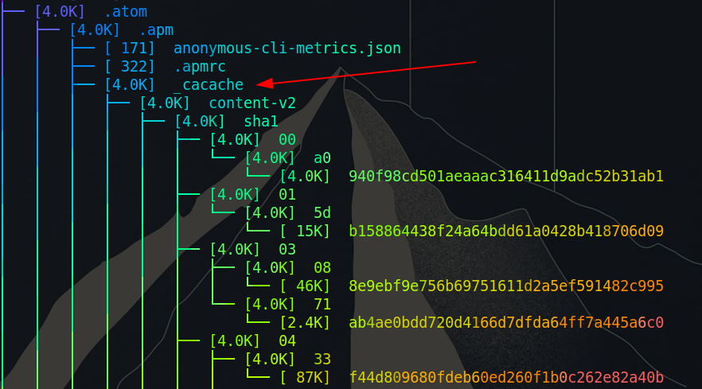
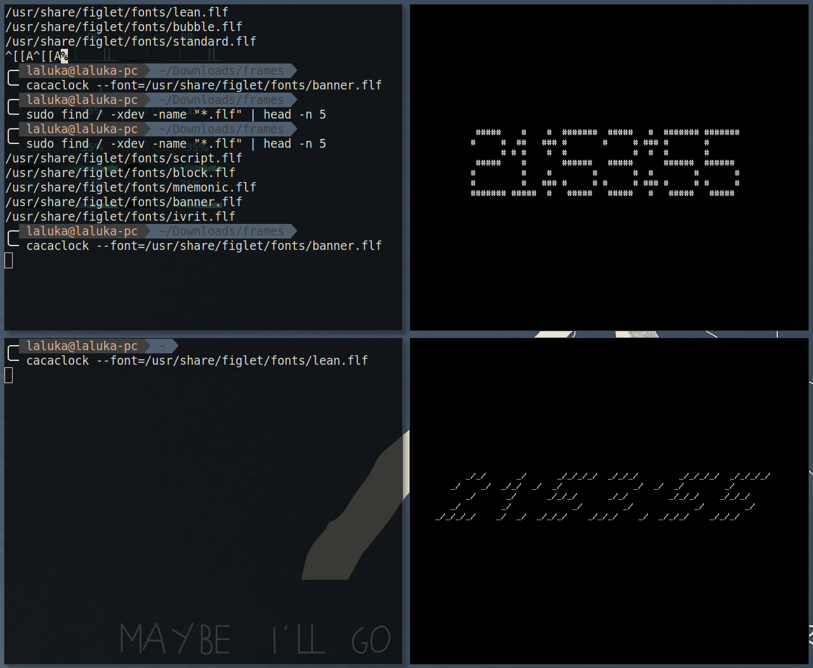

## The root cause

Here's the thing, I was doing some cleaning in my computer's home directory after solving some hacking challenge. To see what kind of files where still present I ran the command `ta`, which is aliased (in my system) to the following function.

```bash
ta () {
  tree -ah "$@" | lolcat;
}
```

It lists my files recursively, showing hidden files and putting some neat rainbow colors at the same time.



I took a look to the output and found the `_cacache` word. I'm still childish, and in French 'caca' means poop and cache can design a place to hide things. So the hidden poop thing got me curious. Do I have shit in my computer? If so, how much? What kind of poop do my current operating system possess?


So I ran the following command to inspect my system. To understand it, you can browse the manual with `man find`, but hey, I know you're not here for that so here's what it does!

- sudo - SuperUserDo, executes the command as a superuser
- find - Pretty explicit, find all the files
- / - From the root of my filesystem, so including every possible places
- xdev - Only walk my filesystem, not mounted fs
- iname - Find by name, case insensitive
- "\*caca\*" - Contains the word caca without constraint on the beginning nor end

```bash
sudo find / -xdev -iname "*caca*"
```

I stripped the result that were not really interesting, here's the sum'up:

```
/DRIVE/perso/2015/arthur/caca_papillon.jpg
/root/.npm/_cacache
/home/laluka/.npm/_cacache
/home/laluka/.atom/.apm/_cacache
/usr/share/licenses/libcaca
/usr/share/libcaca
/usr/share/libcaca/caca.txt
/usr/include/caca_conio.h
/usr/include/cacard
/usr/include/cacard/libcacard.h
/usr/include/caca.h
/usr/include/caca_types.h
/usr/include/caca0.h
/usr/lib/libcaca.so
/usr/lib/gstreamer-1.0/libgstcacasink.so
/usr/lib/pkgconfig/libcacard.pc
/usr/lib/pkgconfig/caca.pc
/usr/lib/libcacard.so
/usr/lib/libcaca.so.0
/usr/lib/vlc/plugins/video_output/libcaca_plugin.so
/usr/lib/libcaca.so.0.99.19
/usr/lib/libcacard.so.0.0.0
/usr/lib/node_modules/npm/node_modules/cacache
/usr/lib/libcacard.so.0
/usr/bin/cacafire
/usr/bin/cacaview
/usr/bin/caca-config
/usr/bin/cacaclock
/usr/bin/cacaplay
/usr/bin/cacaserver
/usr/bin/cacademo
```

## First finding

So, first line shows my google drive's folder. The file extension tells us that it's an image, so let's use eog (eye of gnome)!

```bash
eog /DRIVE/perso/2015/arthur/caca_papillon.jpg
```


So this is one of my previous roommate, definitely not some poop. He was extremely tired after a party so I took advantage of the situation to make fun of him! `è.é`


## Other findings

- `_cacache` - Cached files in different home places, this is some user-specific cache that makes softwares start / run faster by keeping some assets locally.
- `/usr/share/` - Mostly read-only data, configuration examples, and code samples. Meh meh.
- `/usr/include/` - Code and headers. This is the kind of file that one can _include_ in other programs to compile them.
- `/usr/lib/` - Compiled dynamic libraries that can be either _linked_ during the compilation or _loaded_ at runtime. Also some package-specific configuration files.
- `/usr/bin/` - Distribution specific linux programs... That's our goldmine!


## Goldmine exploitation

We have toys (binaries), so let's have fun!\
Description from the libcaca dev's [website](http://caca.zoy.org/wiki/libcaca):

> libcaca is a graphics library that outputs text instead of pixels, so that it can work on older video cards or text terminals.


### cacafire




### cacaview

```bash
cacaview /DRIVE/perso/2018/Louka/avatar_square.png
```


Once again, a huge thank you to _Simon Martineau_ who drew my avatar! `^_^`


### caca-config

Quick look to the man and the program, probably useful for the developers, but not much fun for us... *Sigh*

```
$ man caca-config
caca-config - script to get information about the installed version of libcaca

$ caca-config --help
Usage: caca-config [OPTIONS] [LIBRARIES]
Options:
   [--prefix[=DIR]]
   [--exec-prefix[=DIR]]
   [--version]
   [--libs]
   [--ldflags]
   [--cflags]

$ caca-config --version
0.99.beta19
```

### cacaclock

RTFM (Reat The _Fancy_ Manual) -> Find the right fonts to use -> Boom, live clocks with funny fonts!\
I've been to lazy to create a gif but trust me, it's live! ;)




### cacaplay & cacaserver

The first tool can be used to play .caca files. I won't use it there but feel free to browse the web and send me your best .caca!\
Please no poop pics. Just don't.

The second one is meant to serve some caca animations. Differents clients can connect to it using `telnet` or `netcat` and enjoy these animations without having this software.


### cacademo

Last but not least, the demo for the best caca animations!




## The license

Once more, the manual tells us:

> cacademo  is  covered  by  the  Do What the Fuck You Want to Public License ([WTFPL](https://en.wikipedia.org/wiki/WTFPL)). cacafire is covered by  the  GNU  Lesser  General  Public  License ([LGPL](https://en.wikipedia.org/wiki/GNU_Lesser_General_Public_License)).

Crazy names, huh? \
Still, these are perfectly valid licenses!


More information on how to choose yours [here](https://choosealicense.com/)

As always, I hope that you had fun reading this article. Personally I'm always amazed to realize that really smart people spend `a lot` of time writing that kind of _"useless"_ yet complex software, document it, contribute to it, makes it public, license it, and... Ship it in our distributions!

Next time you'll find something odd, something bizarre, consider giving it some time, who knows what you could end up finding! ツ

> I came here looking for shit, but unfortunately I only found gold! - Laluka 2019


<h2 id="fr">French version</h2>


## La cause initiale

Voilà l'idée, je faisais un peu de nettoyage dans le répertoire home de mon ordinateur après avoir résolu un challenge de hacking. Pour voir quels types de fichiers étaient encore présents, j'ai utilisé la commande `ta`, qui est aliasée (dans mon système) à la fonction suivante.


```bash
ta () {
  tree -ah "$@" | lolcat;
}
```

Elle liste mes fichiers de manière récursive, montrant également les fichiers cachés et mettant quelques jolies couleurs arc-en-ciel au passage.


J'ai jeté un coup d'oeil au résultat et j'ai trouvé le mot `_cacache`. Je suis encore un gamin, je lis "caca", je rigole... Bon... Du caca caché ? Mode curieux activé ! Ais-je vraiment de la merde dans mon ordinateur ? Si oui, en quelle quantité ? Quel genre de caca mon système d'exploitation actuel possède-t-il ?


J'ai donc exécuté la commande suivante pour inspecter mon système. Pour la comprendre, vous pouvez parcourir le manuel en utilisant `man find`, mais bon, je sais que vous n'êtes pas là pour ça alors voilà l'explication !

- sudo - SuperUserDo, exécuter la commande en super utilisateur
- find - Assez explicite, chercher des fichiers
- / - A partir de la racine du système de fichier, donc chercher 'partout'
- xdev - Parcourir seulement ce système et pas les fs attachés / montés
- iname - Chercher par nom, insensible à la casse
- "\*caca\*" - Qui contient le mot caca, pas de contrainte sur le début ou la fin

```bash
sudo find / -xdev -iname "*caca*"
```

J'ai enlevé certains résultats qui n'étaient pas très intéressants, voici le résumé :

```
/DRIVE/perso/2015/arthur/caca_papillon.jpg
/root/.npm/_cacache
/home/laluka/.npm/_cacache
/home/laluka/.atom/.apm/_cacache
/usr/share/licenses/libcaca
/usr/share/libcaca
/usr/share/libcaca/caca.txt
/usr/include/caca_conio.h
/usr/include/cacard
/usr/include/cacard/libcacard.h
/usr/include/caca.h
/usr/include/caca_types.h
/usr/include/caca0.h
/usr/lib/libcaca.so
/usr/lib/gstreamer-1.0/libgstcacasink.so
/usr/lib/pkgconfig/libcacard.pc
/usr/lib/pkgconfig/caca.pc
/usr/lib/libcacard.so
/usr/lib/libcaca.so.0
/usr/lib/vlc/plugins/video_output/libcaca_plugin.so
/usr/lib/libcaca.so.0.99.19
/usr/lib/libcacard.so.0.0.0
/usr/lib/node_modules/npm/node_modules/cacache
/usr/lib/libcacard.so.0
/usr/bin/cacafire
/usr/bin/cacaview
/usr/bin/caca-config
/usr/bin/cacaclock
/usr/bin/cacaplay
/usr/bin/cacaserver
/usr/bin/cacademo
```

## Première trouvaille

La première ligne montre mon dossier google drive. L'extension du fichier nous dit que c'est une image, alors utilisons eog (eye of gnome) !

```bash
eog /DRIVE/perso/2015/arthur/caca_papillon.jpg
```


C'est l'un de mes précédent colocataires, clairement pas un caca. Il était très fatigué après une fête, alors j'ai profité de la situation pour me moquer un peu de lui ! `è.é`


## Autres trouvailles

- `_cacache` - Fichiers mis en cache dans différents répertoires home. Il s'agit d'un cache spécifique à chaque utilisateur qui permet aux logiciels de démarrer / s'exécuter plus vite en conservant certaines ressources localement.
- `/usr/share/` - Principalement des données en lecture seule, des exemples de configuration et de code. Meh meh.
- `/usr/include/` - Code et headers. C'est un type de fichier que l'on peut _inclure_ dans d'autres programmes pour les compiler.
- `/usr/lib/` - Bibliothèques dynamiques compilées qui peuvent être soit _linkées_ pendant la compilation, soit _chargées_ au moment de l'exécution. Egalement quelques fichiers de configuration spécifiques par package.
- `/usr/bin/` - Programmes linux spécifiques par distribution... C'est notre mine d'or !


## Exploitation de notre mine d'or

Nous avons des jouets (binaires), il est donc temps de faire joujou !\
Description tirée du site internet des développeurs de [libcaca](http://caca.zoy.org/wiki/libcaca):

> libcaca is a graphics library that outputs text instead of pixels, so that it can work on older video cards or text terminals.


### cacafire




### cacaview

```bash
cacaview /DRIVE/perso/2018/Louka/avatar_square.png
```


Encore une fois, un grand merci à _Simon Martineau_ qui a dessiné mon avatar ! `^_^`


### caca-config

Coup d'oeil rapide au manuel et le programme, probablement utile pour les développeurs, mais pas très amusant pour nous... *Soupir*

```
$ man caca-config
caca-config - script to get information about the installed version of libcaca

$ caca-config --help
Usage: caca-config [OPTIONS] [LIBRARIES]
Options:
   [--prefix[=DIR]]
   [--exec-prefix[=DIR]]
   [--version]
   [--libs]
   [--ldflags]
   [--cflags]

$ caca-config --version
0.99.beta19
```

### cacaclock

RTFM (Reat The _Fancy_ Manual) -> Trouver les bonnes polices à utiliser -> Boom, une horloges live avec des polices fun!\
J'ai été un peu trop flemmard pour créer un gif mais croyez-moi, c'est animé ! ;)


### cacaplay & cacaserver

Le premier outil peut être utilisé pour lire des fichiers .caca. Je ne l'utiliserai pas ici mais n'hésitez pas à parcourir le web et à m'envoyer vos meilleurs .caca!\
S'il vous plaît, pas de photos de caca. Vraiment, non.

Le second est destiné à servir des animations de caca. Différents clients peuvent s'y connecter à l'aide de `telnet` ou `netcat` et profiter de ces animations sans avoir ce logiciel !


### cacademo

Le dernier mais pas des moindres, le programme démo pour les meilleures animations .caca !




## La licence

Une fois de plus, le manuel nous dit:

> cacademo  is  covered  by  the  Do What the Fuck You Want to Public License ([WTFPL](https://fr.wikipedia.org/wiki/WTFPL)). cacafire is covered by  the  GNU  Lesser  General  Public  License ([LGPL](https://fr.wikipedia.org/wiki/Licence_publique_g%C3%A9n%C3%A9rale_limit%C3%A9e_GNU)).

Sympa comme nom de licence hein?\
Eh bien ce sont tout de même des licences tout à fait valides !

Plus d'informations sur la façon de choisir la vôtre [ici](https://choosealicense.com/)

Comme toujours, j'espère que vous avez apprécié lire cet article. Personnellement, je suis toujours étonné de constater que les gens très futés passent `beaucoup` de temps à écrire ce genre de logiciels complexes et _"inutiles"_, à les documenter, à y contribuer, à les rendre publics, à les licencier et... Les inclure dans nos distributions !

La prochaine fois que vous trouverez quelque chose d'un peu étrange, de bizarre, consacrez-y un peu de temps, qui sait ce que vous pourriez finir par trouver ! ツ

> Je suis venu pour chercher la merde, mais je n'ai malheureusement trouvé que de l'or ! - Laluka 2019
