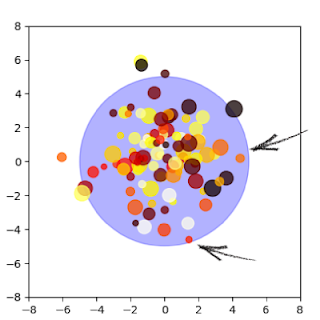
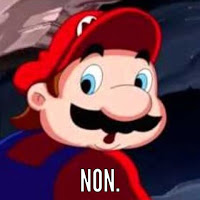
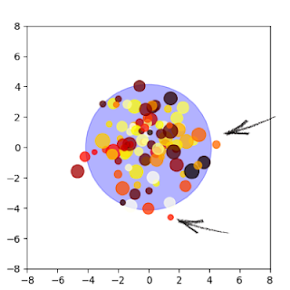

Hello dear reader,

Today, I would like to talk to you about a deep subject, but in a very superficial way. I would like to talk to you about our society, the groups that are born, live and die in it. Groups, of course, but focused on the individuals who compose them, or who oppose to them.

As usual, I will try to share with you a way of seeing things: mine. So I definitely won't be objective, it's up to you to decide what you'll keep, throw away, recycle...

To make it as clear as possible, I'm going to add two or three beautiful homemade diagrams using `python` and `matplotlib` hoping that they will give you a little touch of color!

In order to make you understand my idea, I need to define a few things beforehand. I know that many of you are avoiding mathematical rigour, so don't worry I will do so with human-readable words:

Normal distribution: Everyone is similar, with a few exceptions apart
Norm: Distance between an individual and the one who would be seen as "the most normal".
Average: What is most meaningful / tolerable for the majority of individuals

Despite these **extremely precise** definitions, there is still a difference between the mathematical aspect of these words and their use in everyday language.

Purists, be... Well, disappointed, huh?  `¯\_(ツ)_/¯`

Enough talk to say nothing: ThereWeGo!

This first diagram represents a population. The first thing to note is that most individuals are placed in the center. That's the notion of normal distribution, which makes everyone... Well.... Normal? Distributed? Makes sense, doesn't it?..... >.>

A second interesting point is that it is impossible to represent all the criteria of a population on a single diagram. Here, we will focus on the place of individuals and not on their colour (huehue). In a nutshell, two individuals can share the same opinion while one is a 20-year-old metalhead dressed and made up in black and the other a 90-year-old granny dressed in pink with a pretty chapel. Sisi, it's possible, I swear.

Finally, the large blue circle is what will be considered the norm. The radius of the norm circle computed to be twice the average. In other words, we are all different and form a group, a population. But we only consider as 'normal' individuals near the average sometime a bit farther. \
"We're not animals, huh? "

We will take two members of the group (pointed by an arrow), haphazardly, you and a relative. You are well, 'normal', accepted by the majority but not everywhere because we are all a little unique / different. Keep your positions in mind for the future.

We also see that despite a fairly broad, tolerant standard, there are still individuals who are sufficiently eccentric to be outside the circle, here, black and yellow at the top, yellow and orange on the left or black on the right.

These individuals are "out of the norm", so they are often stigmatized and criticized for their differences.

What if... We removed them?

*SPIOUF*\
We are now among normal people. We're so fiiine! No?

Pertinent...

By removing abnormal individuals, the average will be recalculated, and therefore the norm too (always equals to twice the average). These modifications give us the following diagram:

Now you are out of the norm, you who were so well, so warm, in your element... Isn't that sad?

*Drama intensifies*

Well, it's not that dramatic, after all, people had this role before you, it's not as if they were stigmatized, criticized, insulted on a daily basis.\
Oh, Wait...

"Well, it's all very nice your hippie stories there, but it doesn't concern us, we don't piss anyone off, we just want to be quiet and nobody to piss us off!"

Calm the F*ck down. Okay?! Thank you =]

Yes, indeed, if you read this article, it is because you are already (I hope) open-minded enough not to look for trouble with others for no reason.

But the point I wanted to make here is a little more nuanced than that. What I try to express is that you are (we are) the last walls to this drift. That your tolerance, respect and actions are the only things that allows us to maintain a flexible standard, a great diversity of thought, culture and hobbies in our society.

> To accept to be a minority is fight to preserve a diversified population, and to protect the most vulnerable or influenced individuals by keeping them warm in the great blue circle. \
 Stay safe, take care & luv ❤

<h2 id="fr">French version</h2>

Bonjour cher lecteur, chère lectrice,

Aujourd'hui, j'aimerais te parler d'un sujet profond, mais de manière très superficielle. J'aimerais te parler de notre société, des groupes qui y naissent, y vivent et y périssent. Des groupes, certes, mais surtout des individus qui les composent, ou s'y opposent.

Comme à mon habitude, je vais tenter de te partager une manière de voir les choses : la mienne. Je ne serai donc probablement pas objectif, libre à toi de faire la part des choses sur ce que tu gardes, jettes, recycles...

Pour que ce soit le plus clair possible, je vais ajouter deux ou trois beaux schémas faits maison à l'aide de `python` et `matplotlib` en espérant qu'ils réposent en toi une petite touche de couleur !

Afin de te faire comprendre cette pensée, il me faut préciser quelques notions au préalable. Mais comme je sais que parmi vous, beaucoup fuient la rigueur, je vais le faire avec mes mots :

Distribution normale : Tout le monde est similaire, à quelques exceptions près
Norme : Distance entre un individu et celui qui serait vu comme "le plus normal"
Moyenne : Ce qui est le plus parlant / tolérable pour la majorité des individus
Malgré ces définitions d'une précision extrême, il reste une différence entre l'aspect mathématique de ces mots et l'utilisation qu'ils ont dans la langue courante.

Puristes, soyez... Bah déçus hein ! `¯\_(ツ)_/¯`

Assez parlé pour ne rien dire : C'est tipar !

Ce premier schéma représente une population. La première chose notable est que la plupart des individus sont placés bien au centre. Ca, c'est la notion de distribution normale, qui fait que tout le monde est... Eh bien... Normal ? Distribué ? Makes sense, doesn't it ?... >.>

Un second point intéressant est qu'il est impossible de représenter tous les critères d'une population sur un seul schéma. Ici, on va s'intéresser à la place des individus et non à leur couleur. En bref, deux individus peuvent partager un même avis alors que l'un est un métalleux de 20 ans habillé et maquillé en noir et l'autre une petite mamie de 90 ans habillée en rose avec un joli chapal. Sisi, c'est possible je vous jure.

Pour finir, le grand cercle bleuté est ce que l'on va considérer comme la norme. La norme est plus grande que la moyenne, ici, deux fois plus grande. En d'autres termes, nous sommes tous différents et formons un groupe, une population. Mais nous ne tolèrons pas que les individus parfaitement normaux, mais un peu plus. On est pas des bêtes quand même...

On va prendre deux membres du groupe (fléchés), au hasard, vous et un/e proche. Vous êtes bien, 'normaux', acceptés par la majorité mais pas partout car on est tous un peu unique / différents. Gardez vos positions en tête pour la suite.

On voit également que malgré une norme assez large, assez tolérante, il reste des individus qui sont suffisamment excentrés pour être en dehors du cercle, ici, noir et jaune en haut, jaune et orange à gauche ou encore noir à droite.

Ces individus sont "hors norme", donc souvent stigmatisés, critiqués pour leurs différences.

Et si... On les enlevait ?\
*SPIOUF*\
Nous voilà désormais entre gens normaux. On est biennn ! Non ?

Pertinent...

En retirant les individus anormaux, la moyenne va être recalculée, et par conséquent la norme aussi (valant ici toujours de deux fois la moyenne). Ces modifications nous donnent le schéma suivant :

Voilà que désormais, vous êtes en dehors de la norme, vous qui étiez pourtant si bien, au chaud, dans votre élément... Si c'est pas triste !

*Drama intensifies*

Bon, ce n'est pas si dramatique, après tout, des personnes avaient ce rôle avant vous, ce n'est pas comme si elles étaient stigmatisées, critiquées, insultées au quotidien... Oh, wait !

"Bon, c'est bien beau tes histoires de hippie là, mais nous ca nous concerne pas, on fait chier personne, on veut juste être tranquille et que personne nous fasse chier !"

Déjà tu te calme Ok ?! Merci =]

Oui, en effet, si tu lis cet article, c'est que tu es déjà (je l'espère) assez ouvert d'esprit pour ne point chercher noise à autrui sans raison.

Mais le point que je voulais soulever ici est un peu plus nuancé que ca. Ce que je veux tenter d'exprimer, c'est que vous êtes (nous sommes) les derniers remparts à cette dérive. Que votre tolérance, votre respect et vos agissements sont les seules choses qui permettent de conserver une norme flexible, une grande diversité de pensée, de culture et de loisirs dans notre société.

 > Accepter d'être une minorité, c'est lutter  pour conserver une population diversifiée, et protéger les individus les plus fragiles ou influençables en les gardant au chaud dans grand cercle bleu. \
 Prenez soin de vous et vos proches & luv ❤
