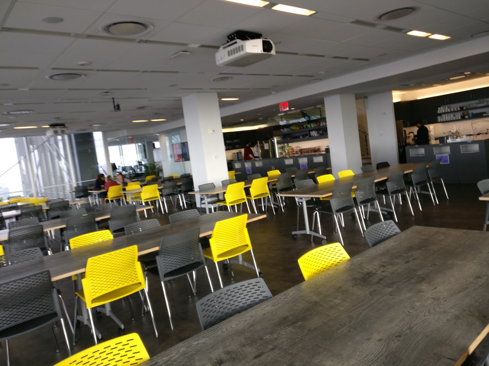
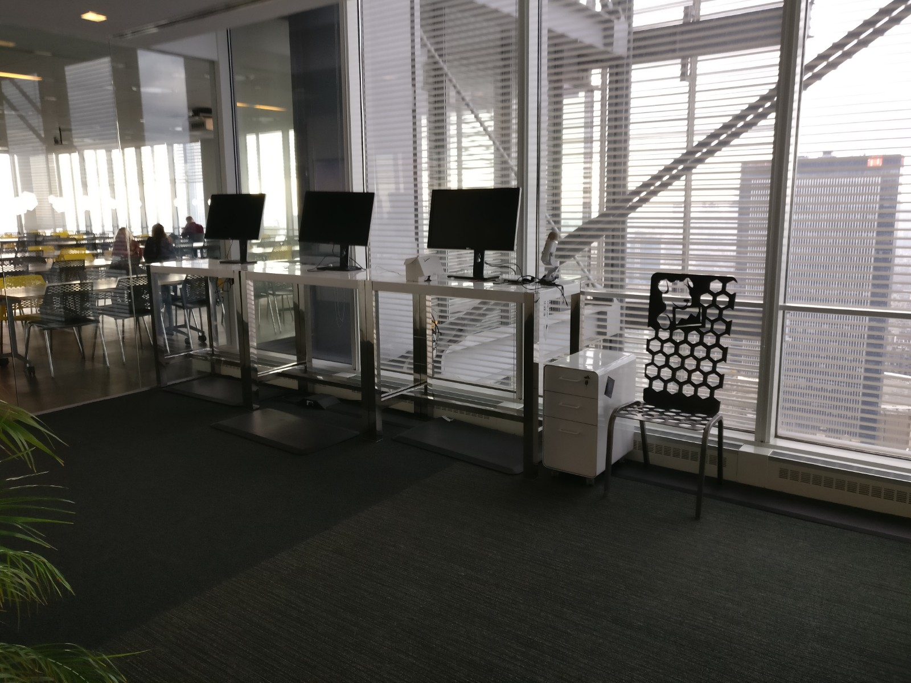

# Before I start...

You've been quite a lot (I wasn't expecting that much to be honest) to ask me for news. I'd like to spend hours speaking with each of you, but the thing is that with all I have to do during the first week (register into administrative stuff, open a bank account, get well in the place, start work, socialize a bit, recover some sleep, ...) and the fact that I don't have the right phone package yet. Mooore the __small__ time window when we're awake at the same time, I just can't, it's too much for the moment.

That's why I'll write everything here so you can read it when you have some time, and we can have time left for speaking about random life things, and not just me repeating the same thing over and over.

Makes sense? Cool!

If you read that, the odds are that you're someone I really care for, so be well, have a great day, and remember that I love you even tho I'm far away! ;)

# Datadog in New-York, why and how

So, as you _may_ know, I've been into hacking since July 2017. I found a real passion here, and spent __a lot__ of time learning it. \
During the learning process, I had to meet many great people that I like to share tricks with, brainstorm, help or ask for help. One of the most bad-ass hacker I know is [Geluchat](https://twitter.com/Geluchat). He is really efficient when it comes to breaking stuff, and also likes to share what he knows, mainly in his website [DailySecurity](https://www.dailysecurity.fr/). \
He heard about this open position at Datadog (thanks his friends) and as he knew I was looking for an internship, he reached me and...

The application process took a bit more than a month.

- Interview : Human resources and explanations
- Interview : Company presentation + Technical cybersecurity questions / coding exercises
- Interview : Technical cybersecurity questions / coding exercises
- Black-box penetration testing of a web application
- Interview : Internship subject with the Security Team Chief
- Interview : "You've been hired!"

# The travel

Datadog do have branches all over the world, but I applied for New-York, because one of Geluchat's friends was already there, and also because I was really curious about this city, the American way of life and such. So... There I am, traveling to Manhattan!

So, in order to go there, I had two days between the end of my exams and the beginning of the internship. Two days to move all my stuff from Valence (FRANCE) to somewhere safe and reach Manhattan (USA). That was quite rough... But mainly because we also had to deal with snowfalls, yellow jackets protests in France, and some misunderstandings between my NYC host and I. That was HARD, but in the end, it went pretty well.

I've been able to spend a few hours with my aunt while in Paris, and as I'll also use these articles as a souvenir, I'll drop some random pics in from time to time. Enjoy the tiredness! :p

Here's a pic of the first man I've talk with in the US, he helped me to find a free-wifi, book an Uber and find where I had to join him (EWR's airport is quite huge... Oopsy!).

# The job

The job description is the following:

 > First, you will learn the Datadog application and become familiar with the various workflows used by development
teams as well as the security team. You will then assist with code reviews and design reviews, working closely with
development teams to ensure that security is included in the Software Development Lifecycle process. You will
continue to create and maintain automated code scanning software and testing frameworks as well as directly
contribute code to production servers to detect or block application-level attacks. The technologies you will use during
this time include (but are not limited to) AWS, GCP, Kubernetes, Docker, Terraform, Python, Go, Github, Gitlab,
Serverless.

TL;DR: Review their code and development process in order to avoid being pwned. Also, the technologies used are things that I either know, or was planing to learn. The best part? They all work on Apple computers. Well, that's not a pure LINUX style, but at least we're not using windows all day long, so that is __GREAT__.

# Day 1

Tons of conferences:

- Introduced to the Datadog history, why it has been created, what's its grow rate and such. What's the core essence, the living way of life. (Really tolerant company, quite flexible with the dress-code, schedule and such, as long as it's OK with your manager (which is almost always awesome!))
- Security measures, what to do and avoid in order to stay safe, ...
- IT on-boarding: We receive macbooks pro and setup the __huge__ ecosystem they use. It's mainly the whole google cloud stack (drive, docs/sheet/slide, agenda, and maaaany others (50+ apps) but I don't know yet what I can share or not. But the main idea is to use the google account as a main SSO tool, and link everything possible to it to make it complete)
- Payroll and benefits -> No benefits for trainees, but I still went there to see what we can enjoy as a full-time employee and... That's pretty huge!

Funny thing: There's also free vending machines (giving machines?) for IT appliances, like cables, keyboards, mouse, Yubikey, ...

We also had time to visit the place and meet our buddy (someone that isn't in the same team as us, to enhance communication in the company, and also have a friendly face roaming around). Here's my buddy, Piotr, from France too. He's quite awesome, which is nice! We already planed to go on a parachute jump together!

# Day 2 & 3

Getting familiar with the place, and setting tons of softwares and accounts up. Also, getting to talk with my manager and manager's manager. Every meeting looks like making a new friend. Am I in heaven?

# Random thoughts

New-York avenues are so huge, and so wide, that even when they are crowded, of full of cars, they're still way less oppressing or stressful as Paris ones. It's quite pleasant to walk in there, the buildings are __really__ high, but still not an issue as we have much sunlight from the wide avenues. I really like this place ! =]

I had a small walk to Central Park in the Sunday afternoon, a small lake was completly frozen!

While speaking with Mateo (roomate) and Nora (friend from France), we were speaking about feelings and how sex if as seen girls or boys. Seen from a man perspective it was seen as a loaded gun, one shot, and that's all, and from a woman, more like a volcano, power builts over time and then erupts. So... this gem went out:

> "Ever tried to shoot a volcano with a gun? It wouldn't do shit!"

Last fun fact of this article: At Datadog, we can use this place 'as we want' on a 24/7 basis. This means that at any time, day or night, work or weekends, if I want to, I can just bring a bunch of friends or even family, have a snack or share a few beers enjoying this awesome sight. How cool is that?!

# Last words

As you may [imagine](https://www.youtube.com/watch?v=YkgkThdzX-8), I like how life going is here. But I still miss you all so much. I'll try to write such article (maybe a bit smaller tho) every week.

New life, new job, new gear... Same team! \
❤ Aperi'Kube ❤

Have a great day/night/whatevet_you_like and see you soon!

<h2 id="fr">French version</h2>

# Avant de commencer...

Vous avez été beaucoup (je ne m'attendais pas à tant pour être honnête) à me demander des nouvelles. J'aimerais vraiment passer des heures à parler avec chacun d'entre vous, mais avec tout ce que j'ai à gérer pendant la première semaine (inscriptions à l'administration, ouverture de compte bancaire, trouver des repères, commencer à travailler, me socialiser un peu, récupérer un peu de sommeil, ...) et le fait que je n'ai pas encore le bon forfait téléphonique. Plussss le __petit__ laps de temps où nous sommes éveillés en même temps, je ne peux pas, c'est 'un peu' trop pour l'instant.

C'est pourquoi je vais tout écrire ici pour que vous puissiez le lire quand vous en aurez le temps, et qu'il nous reste du temps pour parler de choses et d'autres, et pas seulement pour que je répète la même chose encore et encore.

Makes sense ? Cool !

Si vous lisez cela, il y a de fortes chances que vous soyez quelqu'un à qui je tiens beaucoup, alors des bisous, passez une bonne journée, et souvenez-vous que je vous aime très fort même si je suis loin ! ;)

# Datadog à New-York, pourquoi et comment

Donc, comme vous le savez _peut-être_, je suis dans le hacking depuis juillet 2017. J'y ai trouvé une vraie passion et j'ai passé __beaucoup__ de temps à apprendre et pratiquer. \
Durant ce voyage initiatique, j'ai rencontré beaucoup de gens formidables avec qui j'ai pu partager des sessions de hack, des idées, demander de l'aide ou encore en donner. L'un des hackers les plus bad-ass que je connaisse est [Geluchat](https://twitter.com/Geluchat). Il est vraiment très bon quand il s'agit de casser des choses, et aime aussi partager ses connaissances, principalement sur son site web [DailySecurity](https://www.dailysecurity.fr/). \
Il a entendu parler de ces possibilités de travail à Datadog (grâce à ses amis) et comme il savait que je cherchais un stage, m'a contacté et....

Le processus de recrutement a pris un peu plus d'un mois.

- Entretien : Ressources humaines et explications
- Entretien : Présentation de l'entreprise + questions techniques sur la cybersécurité / exercices de prog
- Entretien : Questions techniques de cybersécurité / exercices de prog
- Test d'intrusion en boîte noire d'une application web
- Entretien : Sujet du stage avec le chef d'équipe de sécurité
- Entretien : "Vous avez été engagé !"

# Le voyage

Datadog a des points de présence dans le monde entier, mais j'ai postulé à New-York, parce qu'un ami de Geluchat y était déjà, et aussi parce que j'étais vraiment curieux de découvrir cette ville, du mode de vie américain etc. Alors.... Me voilà, en route pour Manhattan !

Pour y aller, j'avais deux jours entre la fin de mes examens et le début du stage. Deux jours pour déménager toutes mes affaires de Valence (FRANCE) vers un endroit sûr et rejoindre Manhattan (USA). C'était assez rude... Mais surtout parce que nous avons dû faire face à des chutes de neige, à des manifestations des gilets jaunes en France et à des malentendus entre mon hôte sur NYC et moi.

J'ai pu passer quelques heures avec ma tante pendant mon séjour à Paris, et comme je vais aussi utiliser ces articles comme souvenir, je vais y déposer des photos au hasard de temps en temps. Enjoy ma fatigue ! :p

Voici une photo de la première personne  à qui j'ai parlé aux Etats-Unis, il m'a aidé à trouver un wifi gratuit, à réserver un Uber et à trouver où je devais le rejoindre (l'aéroport d'EWR est assez grand... Oopsy !).

# Le taff

La description du poste est la suivante :

 > Tout d'abord, vous apprendrez l'application Datadog et vous vous familiariserez avec les différents workflows utilisés par les équipes de développement et sécurité. Vous participerez ensuite aux revues de code et de conception, en travaillant en étroite collaboration avec les équipes de développement pour vous assurer que la sécurité est incluse dans le cycle de vie du développement logiciel. Vous continuerez à créer et à maintenir des logiciels d'analyse de code et des frameworks de test automatisés ainsi qu'à contribuer directement au code des serveurs de production pour détecter ou bloquer les attaques au niveau des applications. Les technologies que vous utiliserez pendant cette période incluent (mais ne sont pas limitées à) AWS, GCP, Kubernetes, Docker, Terraform, Python, Go, Github, Gitlab, Serverless.

TL;DR : Revoir leur code et leur processus de développement afin d'éviter de se faire pwn. Les technologies utilisées sont des technos que je connais déjà ou que j'avais l'intention d'apprendre. La meilleure partie ? Ils fonctionnent tous sur des ordinateurs Apple. Bon, ce n'est pas un pur LINUX, mais au moins nous n'utilisons pas de Windows toute la journée, donc c'est __COOL__.

# Jour 1

Des tonnes de conférences :

- Présentation de l'historique de Datadog, pourquoi ils l'ont créé, quel est son taux de croissance etc... Quelle est l'essence de cette entreprise, le mode de vie. (Entreprise très tolérante, assez flexible avec le code vestimentaire, l'horaire, ... Tant que c'est en accord avec notre manager (qui est quasiment toujours quelqu'un de génial !))
- Mesures de sécurité, ce qu'il faut faire et éviter pour rester en sécurité, ...
- Intégration informatique : Réception d'un macbooks pro et configuration du __vaste__ écosystème qu'ils utilisent. C'est principalement l'ensemble de la suite   de Google (drive, docs/sheet/slide, agenda, et bien d'autres (50+ applications) mais ne sachant pas exactement ce que je peux partager ou non... L'idée générale est d'utiliser le compte google comme compte principal pour du SSO, et d'y lier tout ce qui est possible pour le rendre complet.
- Salaires et avantages sociaux -> Pas d'avantages sociaux pour les stagiaires, mais j'y suis quand même allé pour voir ce dont nous pourrions profiter en tant qu'employé à temps plein et... C'est plutôt énorme !

Chose amusante : il y a des distributeurs automatiques gratuits pour les appareils informatiques, comme les câbles, les claviers, la souris, les Yubikey, etc...

Nous avons aussi eu l'occasion de visiter les lieux et de rencontrer notre buddy (quelqu'un qui n'est pas dans la même équipe que nous, pour améliorer la communication au sein de l'entreprise, et aussi pour avoir un visage amical à proximité). Voici mon buddy, Piotr, qui est aussi Francais. Il est super sympa, which is nice ! On a des petites choses en vue, comme... Un saut en parachute ! :D

# Jour 2 & 3

Se familiariser avec ce beau lieu et setup des tonnes de logiciels et de comptes. J'ai aussi eu l'occasion de parler avec mon manager et son manager. Chaque réunion équivaut à une belle rencontre, une nouvelle amitié. Suis-je...  au paradis ?

# Pensées diverses

Les avenues new-yorkaises sont si grandes, et si larges, que même lorsqu'elles sont bondées, pleines de voitures, elles demeurent bien moins oppressantes ou stressantes que celles de Paris. C'est très agréable de s'y promener, les bâtiments sont __vraiment__ hauts, mais ce n'est pas non plus un problème car nous avons beaucoup de lumière et de soleil grâce aux larges avenues. J'aime vraiment bien cet endroit ! =]

Nous avons marché un peu jusqu'à Central Park le dimanche après-midi, un petit lac était complètement gelé !

En parlant avec Mateo (colocataire) et Nora (amie de France), nous parlions des sentiments et de la façon dont le sexe est vu par les hommes ou femmes. Du point de vue de l'homme, c'était considéré comme un gun, un coup de feu et c'est terminé, et du point de vue féminin, plus comme un volcan, l'énergie s'accumule avec le temps, puis éruption. Petite perle au cours de la discussion :

> "Ever tried to shoot a volcano with a gun? It wouldn't do shit!"

> "Vous avez déjà essayé de tirer sur un volcan avec une arme à feu ? Ça ferait que dalle !"

Dernier fait amusant de cet article : Chez Datadog, nous pouvons utiliser cet endroit "comme bon nous semble" 24/7. Cela signifie qu'à tout moment, de jour comme de nuit, en semaine comme le week-end, si je le souhaite, je peux amener des amis ou de la famille prendre un snack ou partager quelques bières en profitant de cette vue magnifique. Elle est pas belle la vie ?!

# Derniers mots

Comme vous pouvez l'[imaginer](https://www.youtube.com/watch?v=YkgkThdzX-8), j'aime beaucoup la vie ici. Mais vous me manquez tous beaucoup. J'essaierai de donner des nouvelles ici (peut-être un peu plus court quand même) chaque semaine.

Nouvelle vie, nouveau taff, nouveau matériel.... Même équipe ! \
❤ Aperi'Kube ❤

Passez une bonne jounée, soirée, ou ce que vous voulez, et à bientôt !

