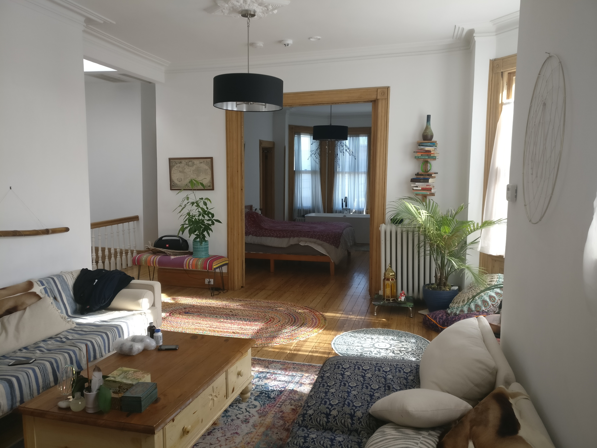
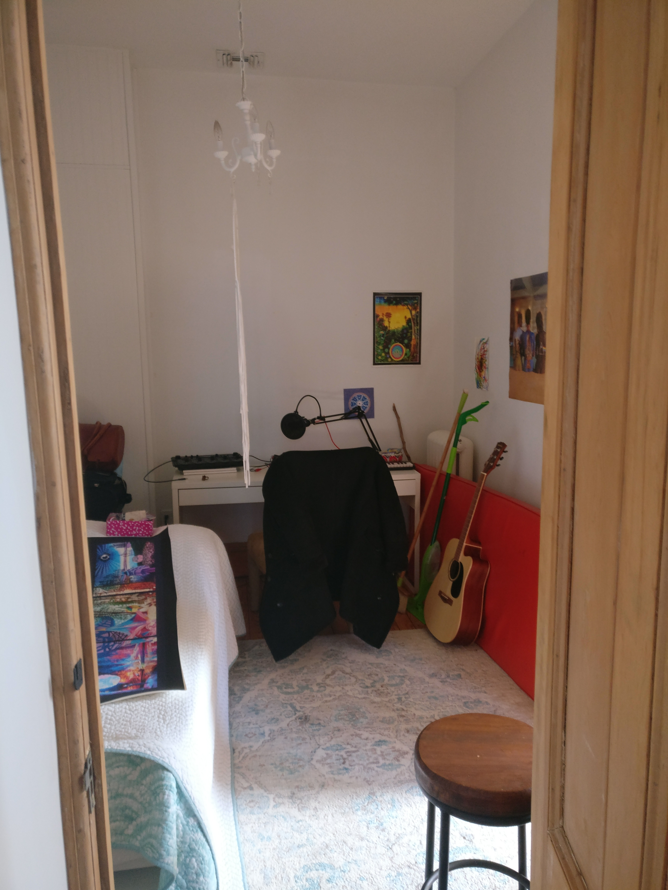
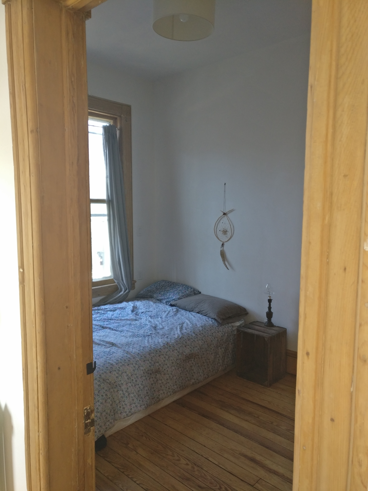
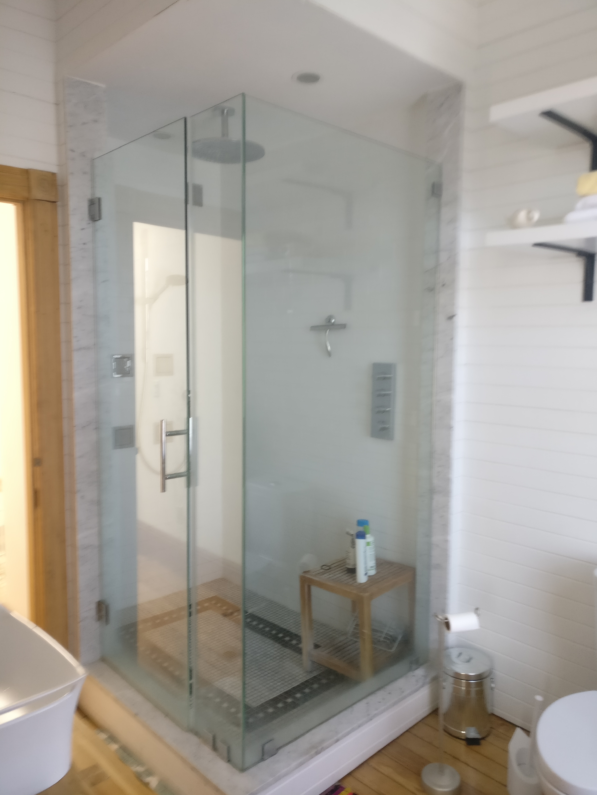
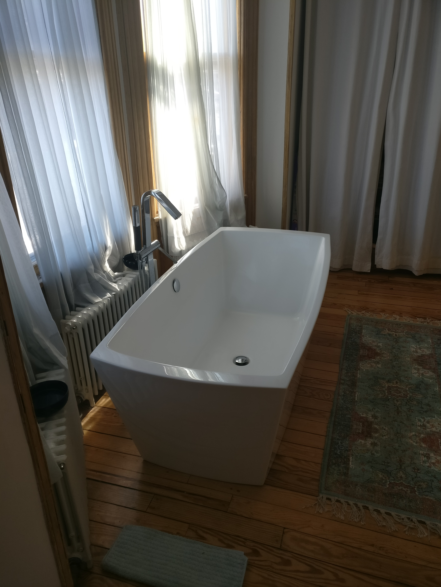
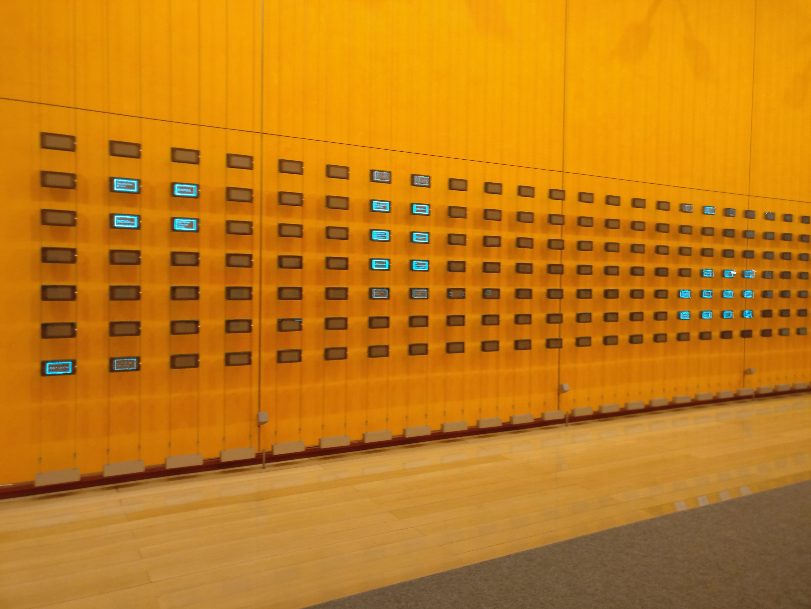
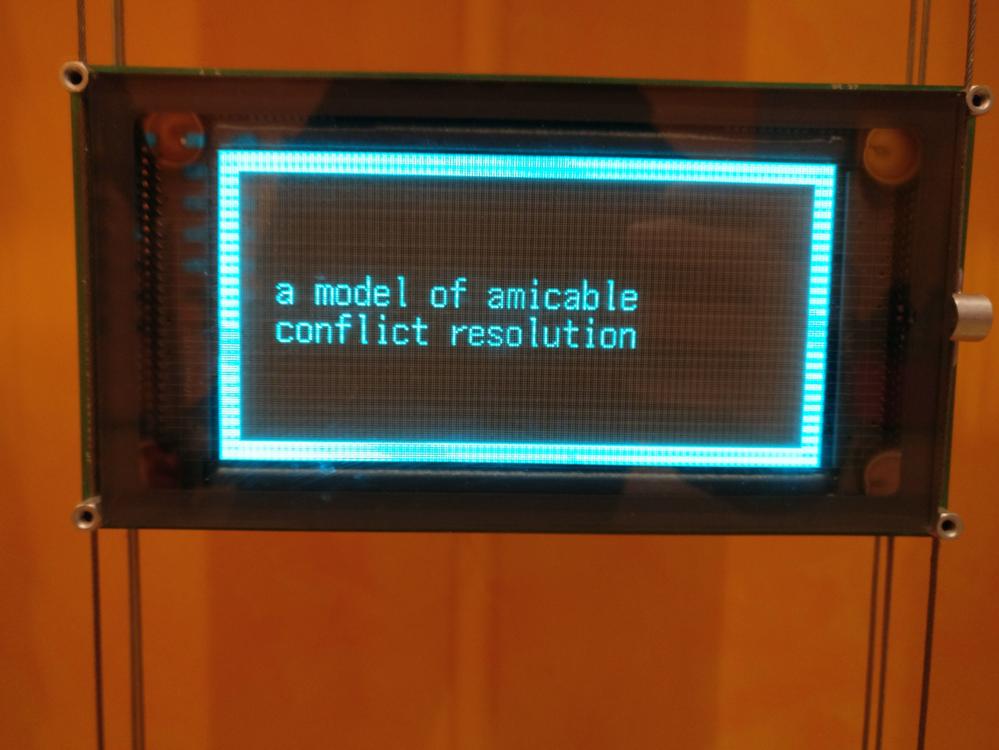
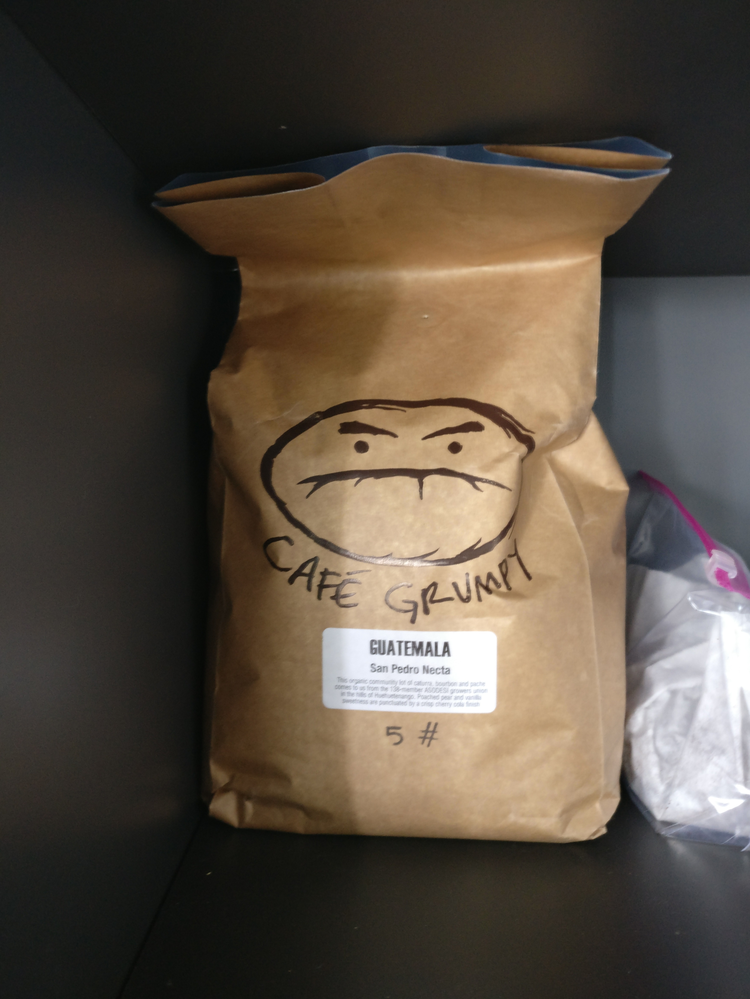

# Have you seen my home?

During the first week, I've been living with Tatiana and Mateo in a flat just below Central Park, the flat itself was really nice, but still had one problem: the building have a very strict guests policy. It was forbidden to sublease a room due to recent regulations in New-York (mainly because of RBNB's overnight guests and... MONEY of course!). Each night, going back to the building was easy, but reaching the flat was pretty challenging. I had to either convince the doorman to let me in (different each day), or sneak myself inside. It was  really stressful being unsure to have a home at night. The landlord was risking a 10 000$ fine for unregistered guests, so as soon as I heard about that, I left.

A wise man once told me:

> I just want home to be a peaceful place.\
- Mateo

I now live in Union City, New-Jersey. This is a bit farther from work (25mn by bus), but this is a really nice place, and the house is... Huge, zen, and with wood everywhere! Also, it features a cool Roommate French Chief (RFC) inside! =D

# Do you even cook?

> Nope!\
- Literally anyone

At first, I was wondering why everyone was precising "I like to cook", or "We cook sometimes" in the apartment and housing announces. Now I know why. Here, almost no one cooks. People eat at the restaurant, or buy some cheap food on the go and don't spend / 'waste' time eating or cooking. Pretty surprising, but in the other hand it leaves so much free time... A matter of choice, I guess? I'll have to take care of what I eat, y'know, just in case... Most of the time, my friends, roommate and I eat a small breakfast, a good lunch, and nothing at night. Let's see how it goes! =]

# You said Free Wi-Fi?

One huge difference between any city in France and New-York is the network coverage and phone bill. You usually pay around 60$ a month to have 10Go internet here against 15€ for 50Go in France. Damnnnn! But here, there are free Wi-Fi everywhere. Every brand, every park, every avenue have its own Wi-Fi hotspot that you can access by giving your email (yup, sell your soul, they need logs `D:`). Even in the subway! That really helps when you just arrived and don't have a working phone yet... `¯\_(ツ)_/¯`

# Yoga, Salad, Walking and Minerals

Tatiana invited me to her Kundalini yoga course, that was quite fun, pretty relaxing, but to me this was too sport-centered and I was more in a relaxed mood so... Cool, but not enough to sign-in for a month! We then walked and had a huge mixed salad. We kept walking toward home when suddenly, a wild mineral appears!

# In you we trust, please feel free to be happy

One of the things that I wasn't expecting at all is the freedom we have at work. It's been only two weeks, so it mayyyy change, but I really don't think it will. There's no tracking system, no schedule (a few meetings, but no real dead-line or mandatory hours). We can choose our own hours of work, and as long as we do the job, we are free to leave earlier, or later, or even not leaving at all if we want to. The only no-go is if our absence will block someone, that's why we document everything we do, so someone can replace us if needed. This is clever, dope AF! The only thing tracked is the work done and the one that is left to do, but not who did what nor when. I like that.

As we all like that freedom so much, everyone is really doing their best to be able to preserve this freedom and make this company last long.

Psychology? You're doing it right! `\o/`

# Hey, how's work?

Honestly? It's really interesting!

After a first week spend entirely setting up my dev environment, I was finally able to work on something! Or... Was I?

I spent my whole week on a 'simple' problem, struggling more than I should have to make it more secure. Why? Because of testing of course!\
They have so many components that interact with each other in different ways that they created some very fine tuned tests, for almost everything. But a simple computer isn't able to hold the whole prod nor dev env. That's why we use some CICD (Continuous Integration) pipelines in gitlab to run the tests remotely and automatically.

Still, I had some legacy code to refactor, no one knew if it was still used, and no test samples were collected (code from 2011). Refactoring some code without knowing precisely what it should do is NOT the way to go. Well, at least now I'll define more precisely my objectives before trying to realize them! =]

Last minute update: My patch passed all the tests, my pull request will now be reviewed by a peer that will check if I haven't introduced bad code (crossed fingers here) or security issues, and then we'll merge that branch in prod.

# What about the keyboard thingy?

I'm glad you asked! It sucks!!!\
Both azerty and qwerty are more than OK keyboard layouts. But the transition from one to an other is HORRIBLE, not because of the layout itself, but because of the keyboard shortcuts. Yup.

With my azerty keyboard, I use `CTRL+A` all the time in order to select all the content of a file/field. The A is replaced by a Q on a qwerty keyboard... Do you know what happens on a mac while pressing `CTRL+Q` or `CMD+Q`? It exits the application, most of the time without prompting for confirmation. Thus I lived way too many times this sad scenario:

1. "Please note these crucial information, you'll need it and we won't give it again."
2. *Le me trying to select the information*
3. *Le me realizing I just closed the application*
4. *Le me face-palming one more time*

# Valentine's day!

Thursday was Valentine's Day, and I had my plan has been set two months ago! I reached a friend of Marine (currently in Sweden) so he could offer her three roses while I was in call with her. She didn't knew about that, and... \
It worked pretty well! =D

# More pics

The building entrance and its strange yet cool screens!

A street art that I liked a lot:

Lovely grumpy coffee grains & food at work:

A wild weed truck appears!

Snowy weather:\
(I suck at taking good pictures, sorry...)

And a hat!

Have a freackin' marvelous day, and see you soon! ^.^

<h2 id="fr">French version</h2>

# Auriez vous vu passer ma maison ?

Pendant la première semaine, j'ai vécu avec Tatiana et Mateo dans un appartement juste en dessous de Central Park, l'appartement lui-même était vraiment sympa, mais il y avait un problème majeur : la stricte politique du bâtiment en matière d'invités nocturnes. Il est interdit de sous-louer une chambre à cause de la nouvelle réglementation de New-York sur l'hébergement (principalement à cause des hosts RBNB et... de l'ARGENT bien sûr !). Chaque soir, il était facile de retourner à l'immeuble, mais l'accès à l'appartement lui était tendu. Je devais soit convaincre le portier de me laisser entrer (un différent chaque jour), soit me faufiler à l'intérieur. C'était vraiment stressant de ne pas être sûr d'avoir un lieu ou dormir la nuit. Le propriétaire risquait une amende de 10 000$ pour des invités non inscrits, alors dès que j'en ai entendu parler, je suis parti au plus vite.

Un jour, un homme sage m'a dit :

> I just want home to be a peaceful place.\
> Je veux juste que ma maison soit un lieux paisible
- Mateo

J'habite maintenant à Union City, New-Jersey. C'est un peu plus loin du travail (25mn en bus), mais c'est un très bel endroit, et la maison est.... Géante, zen, et avec du bois partout ! En plus, il comporte un coloc chef cuisto français cool (ccccc) ! =D

# Cela vous arrive-t-il de cuisiner ?

> Nope!\
- Littéralement n'importe qui

Au début, je me demandais pourquoi tout le monde précisait "J'aime cuisiner", ou "Nous cuisinons parfois" dans les annonces d'appartement et de logement. Maintenant je sais pourquoi. Ici, presque personne ne cuisine. Les gens mangent au restaurant, ou achètent de la nourriture bon marché et mangent sur le pouce, passent / 'gaspillent' pas leur temps à manger ou à cuisiner. Plutôt surprenant, mais d'un autre côté cela laisse tellement de temps libre.... Un choix à faire, je suppose ? Je vais devoir surveillerun peu ce que je mange, vous savez... Juste au cas où... La plupart du temps, mes amis, mon colocataire et moi prenons un petit-petit déjeuner, un bon déjeuner et rien le soir. On verra bien ce qu'il advient de nous ! =]

# Vous avez dit Wi-Fi gratuit ?

Une énorme différence entre n'importe quelle ville francaise et New-York est la couverture du réseau et la facture téléphonique. Vous payez généralement environ 60$ par mois pour avoir 10Go internet ici contre 15€ pour 50Go en France. Damnnnnnn ! Mais heureusement, ici, il y a du Wi-Fi gratuit partout. Chaque marque, chaque parc, chaque avenue a son propre hotspot Wi-Fi auquel vous pouvez accéder en donnant votre email (Ouep, vendez votre âme, ils ont besoin de logs `D:`). Même dans le métro ! Cela aide vraiment quand vous venez d'arriver et que vous n'avez pas encore le bon forfait en activité... `¯\_(ツ)_/¯`

# Yoga, salade, marche et minéraux

Tatiana m'a invité à son cours de Yoga Kundalini , c'était plutot sympa, assez relaxant, mais pour moi c'était trop axé sur le sport et j'étais d'humeur détente donc... Cool, mais pas assez pour m'y inscrire un mois ! Nous avons ensuite marché et mangé une énorme salade mixte. Nous rentrions tranquilement en marchant quand soudain, un minéral sauvage apparaît !

# Nous croyons en vous, soyez libres et heureux

Une des choses auxquelles je ne m'attendais pas du tout, c'est la liberté dont nous disposons au travail. Cela ne fait que deux semaines, alors ça pouraaiittt changer, mais je ne pense vraiment pas que ce sera le cas. Il n'y a pas de système de pointage, pas d'horaire (quelques réunions, mais pas de réelle dead-line ou d'heures obligatoires). Nous pouvons choisir nos heures de travail, et tant que nous faisons le taf, nous sommes libres de partir plus tôt, plus tard, ou même de ne pas partir du tout si l'envie de rester est là. C'est pour cela que nous documentons tout ce que nous faisons, afin que quelqu'un puisse nous remplacer si nécessaire. C'est malin, ca marche bien, ca fait plaisir ! La seule chose consignée est le travail accompli et celui qui reste à faire, mais pas qui a fait quoi ni quand. Sympathique n'est ce pas ?

Nous apprécions tous beaucoup cette chance, donc chacun fait vraiment de son mieux pour préserver cette liberté et faire durer cette entreprise longtemps.

De la bonne psychologie du travail bien comme on l'aime ! `\o/`

# Hey, et le travail ?

Honnêtement ? C'est vraiment intéressant !

Après une première semaine passée entièrement à mettre en place mon environnement de développement, j'ai enfin pu travailler sur quelque chose ! Ou... L'ais-je pu ?

J'ai passé toute ma semaine sur un problème "simple", en galèrant plus que nécessaire. Pourquoi ? A cause des tests bien sûr ! \
Ils ont tellement de composants logiciel qui interagissent les uns avec les autres de manières variées qu'ils ont du / voulu créér des tests très précis pour presque tout. Malheureusement, un simple ordinateur n'est pas capable de contenir toutes ces machines et logiciels, l'environnement de dev / prod est trop lourd. C'est pourquoi nous utilisons des pipelines CICD (Continuous Integration) dans gitlab pour exécuter les tests à distance de manière automatique.

Bon, j'avais du code à refactoriser, personne ne savait s'il était encore utilisé, et aucun jeu de test n'avait été collecté (code datant de 2011). Refactoriser un code sans savoir exactement ce qu'il doit faire n'est PAS la bonne manière de procéder. Au moins maintenant je le sais ! Je prendrai soin de définir plus précisément mes objectifs avant d'essayer de les réaliser ! =]

Mise à jour de dernière minute : Mon patch a passé tous les tests, ma pull request vq être revue par un collègue qui vérifiera si je n'ai pas introduit du mauvais code (je croise les doigts) ou des brèches de sécurité, et ensuite nous allons merge cette branche avec prod.

# Et le... Clavier ?

Merci d'avoir demandé ! C'est carrément la merde !!!
Azerty et le Qwerty sont des dispositions de clavier tout à fait acceptables. Mais la transition de l'un à l'autre est HORRIBLE, non pas à cause de la disposition des touches, mais à cause des raccourcis clavier. Moui !

Avec mon clavier azerty, j'utilise `CTRL+A` tout le temps pour sélectionner tout le contenu d'un fichier/champ. Le A est remplacé par un Q sur un clavier qwerty... Et savez-vous ce qui se passe sur un mac en appuyant sur `CTRL+Q` ou `CMD+Q`? Il quitte l'application, la plupart du temps sans demande de confirmation. J'ai donc vécu beaucoup trop de fois ce triste scénario :

1. "Veuillez noter ces informations cruciales, vous en aurez besoin et nous ne les redonnerons pas."
2. *Le moi en train d'essayer de sélectionner la-dite information*
3. *Le moi qui réalise qu'il a fermé l'application*
4. *Le moi qui face-palme une fois de plus*

# Saint-Valentin !

Jeudi dernier c'était la Saint-Valentin, et j'avais mon plan au point depuis deux mois ! J'ai contacté un ami de Marine (actuellement en Suède) pour qu'il puisse lui offrir trois roses pendant que j'étais en appel vidéo avec elle. Elle ne le savait pas, et... \
Ça a plutôt bien marché ! =D

# More pics

L'entrée de l'immeuble et ses écrans étranges mais amusants !

Un art de rue que j'ai beaucoup aimé :

De gentils grains de café grincheux et le repas au travail :

Un camion de weed sauvage apparaît !

Temps neigeux :\
(Je suis nul pour prendre de bonnes photos, désolé...)

Et un chapeau !

Passez une p*tain de merveilleuse journée, et à bientôt ! ^.^
