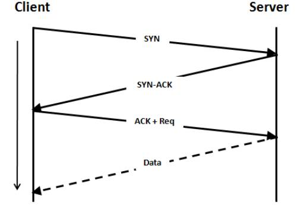

> Salut ! Ca va ?\
> Ca va ! Et toi ?\
> Ca va !\

What a useless proloque, right? Riiight?

Well, not exaclty. 

What if I told you that this quick chat is in fact useful, and probably one of the most used, daily, worldwide? 

Remember of this bad boy? This is him now :)

This is this same kind of exchange used in TCP to establish a connection between a client and a server. \
If you're not in tech, TCP is used by protocols such as HTTP(S) to help you use internet. 

So, why is this dead-simple design used both for human communication and IT? \
Well, first because it works, and secondly, because it's both resilient and self explanatory. 

Of course this has been simplified for the network part, but the main idea is here, if someone greets you and you don't answer, it's because you don't want to talk, or because you didn't hear what they said. Both ways, this first message/packet/word can be sent again by the sender if they really want to talk with you, and the client can ignore it again or respond, depending on their intentions. \
Wonderful, isn't it?

Well, that's all for today, I really wanted to have a short, yet understandable way to explain that "No, salut_ca_va isn't useless".\
Feel free to use this link for the next person you're arguing with over a meaningless debate!

Anyway, now it's on the internet, so it must be true.
