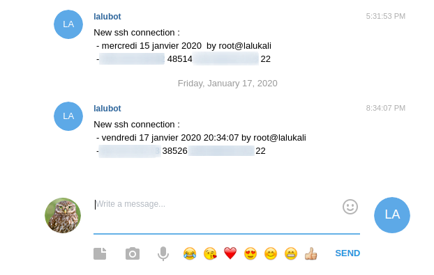

## The root cause

While casually chatting with a colleague, he told me about the sshrc feature of sshd. He explained to me that he was using telegram's API to get ssh login notifications on his phone. My first thought was "Yeah, sure, but it's just a `.rc` file (custom settings), it's usually quite easy to bypass with the right option...

While saying that, I had in mind the trick with `bash --noprofile --norc` that can allow a new bash process to be spawned without using any configuration file. I had to use that two years ago when I... F*cked up my own .bashrc and couldn't use bash anymore, at that time I wasn't aware of the real `sh` or other alternative shells. 

After some reading, I found out that : 


### Man ssh

-  Commands in this file are executed by ssh when the user logs in, just before the user's shell (or command) is started.  See the sshd(8) manual page for more information. 


### Man sshd

-  Similar to $HOME/.ssh/rc. This can be used to specify machine-specific login-time initializations globally. This file should be writable only by root, and should be world-readable.


### Random stackexchange user `#SoItMustBeTrue`

-  It's a security feature: the ~/.ssh/rc file may do things that the client must not be able to bypass (although that's not a common use).


## Telegram API

Ok, so we're good sshd-wise. Now let's read some doc ! \
It's pretty well written, what one can do and how. \
Create the bot, get the api key, chat id, say hi to the.. BotFather?! Pretty uncommon, I like that!

https://core.telegram.org/bots


## Content of /etc/ssh/sshrc

```bash
#!/bin/bash
bash /etc/ssh/ssh_notifier.sh &
```

Pretty simple : "Please execute that ssh_notifier script. "


## Content of /etc/ssh/ssh_notifier.sh

```bash
#!/bin/bash

TOKEN=<CENSORED_BOT_ID>:<CENSORED_TOKEN>
CHAT_ID=<CENSORED_CHAT_ID>
DATE=$(date | cut -d, -f1 | tr "\n" " " && curl -s https://www.worldtimeserver.com/time-zones/cet/ | grep --color=never -oE "[0-9]{2}:[0-9]{2}:[0-9]{2}" | tail -n 1)
HOST=$(hostname)
MESSAGE="New ssh connection :
 - $DATE by $USER@$HOST
 - $SSH_CONNECTION"
URL="https://api.telegram.org/bot$TOKEN/sendMessage"

curl -s -X POST $URL -d chat_id="$CHAT_ID" -d text="$MESSAGE" &>/dev/null
```

A bit less tivial, an short bash script that gets some useful informations about the new logged in used, who, when, from where, etc...




And Voilà, you now have your free and real-time notification forwarder! 

PS1: If you wonder why I used `worldtimeserver` instead of `NTP` or my local time, here's why : I'm just lazy af, it was fast and easy so it's the path I took ! =]

PS2: Yeah, I enabled root login on my bounce, because it's a kali image and I was ALSO too lazy to setup a new user. Wanna fight about it ? Sure ! 

```bash
while read argument; 
do
  unset $argument;
done
```

Seeya ! ;)