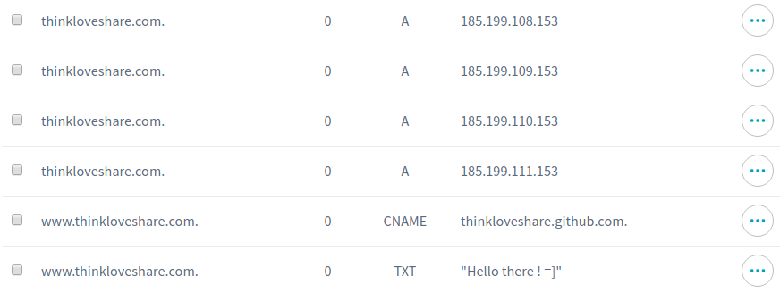
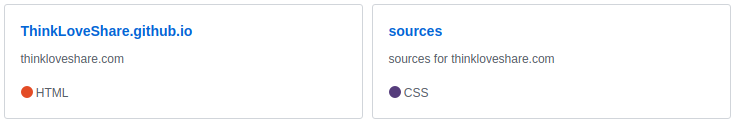
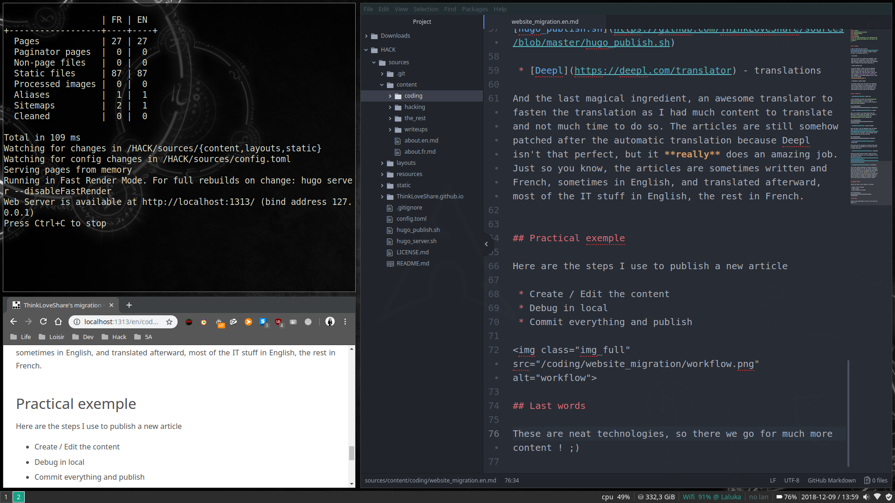
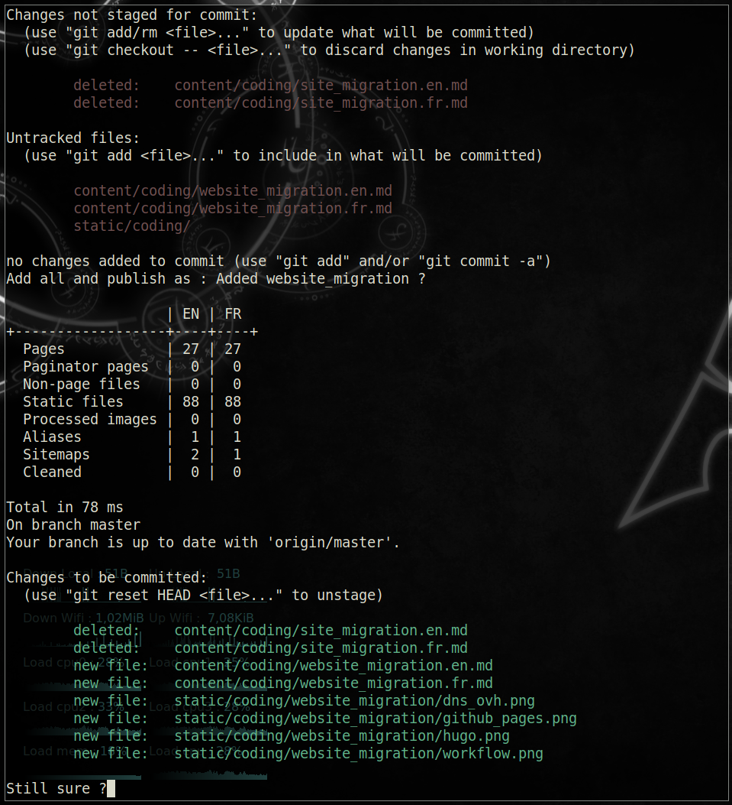

## Why change ?

I used to write from time to time on thinkloveshare.blogspot.com which will soon be retired, replaced by [thinkloveshare.com](https://thinkloveshare.com). I decided to change for quite a few reasons, here's the story:

 * Code format

 There was no easy way to display code snippets. I could have added some js beautifier / pretty printers, but I lacked time, so instead of that was just putting screenshots which is... Probably the worst choice possible... =]

 * Hosting various files

 For the pwn series, I wanted to host the vulnerable binaries but wasn't able so store them on the blog itself. Using external links means that some day that can (will) expire, and I don't like that. I already lost days searching for *that one old tool / sample* that isn't available on the internet anymore, and all I could find was dead links.\
 **GRLANKHJDAKNKBJAFHLIFAJK** :@

 * Flexibility & Content Manager

 The content manager wasn't that bad, but It definitely wasn't really pleasant to use either. Also, there were only some basic features on the web interface... The website structure wasn't easily customizable, so this whole solution was sort of OK, but only temporary.

## New technologies

 * [OVH](https://www.ovh.com) - domain name

Step one, register the domain name `thinkloveshare.com` at OVH and configure it to make it point at `thinkloveshare.github.io` and use the github servers to resolve the domain name.

 * [Github Pages](https://pages.github.com/) - hosting

Step two, create a new github account (named `thinkloveshare` as it'll used in the default website URL) that will contain the website sources and content. The website is then served at `thinkloveshare.github.io` and `thinkloveshare.com` but has no content yet.

 * [Hugo](https://gohugo.io/) - website generator

Step three, use the templates, rules and content (here [toml](https://github.com/toml-lang/toml) and [markdown](https://github.com/adam-p/markdown-here/wiki/Markdown-Cheatsheet)) to generate a fully functional static website (html5, css3, js, ...) with Hugo.

 * [Hyde-Hyde](https://github.com/htr3n/hyde-hyde) - website theme

Step four, spend quite some time adjusting the Hyde-Hyde theme which is really clean and functional out of the box. Their team made an awesome work there !

 * [Bash](https://www.gnu.org/software/bash/) - automating

Step five, create two helpers script in order to fasten the debug and publishing process. I'm not a 'good' developer, but hey, they sure do the job !\
[hugo_server.sh](https://github.com/ThinkLoveShare/sources/blob/master/hugo_server.sh) &
[hugo_publish.sh](https://github.com/ThinkLoveShare/sources/blob/master/hugo_publish.sh)

 * [Deepl](https://deepl.com/translator) - translations

and last but not least, the magical ingredient, an awesome translator to fasten the translation as I had much content to translate and not much time to do so. The articles are still somehow patched after the automatic translation because Deepl isn't that perfect, but it **really** does an amazing job.

Just so you know, the articles are written in French or English depending on the subject, and translated afterward. Most of the IT stuff in English, the rest in French.

## Practical example

Here are the steps I use to publish a new article

 * Create / Edit the content
 * Debug in local

 * Commit everything and publish

## Last words

These are neat technologies, so there we go for much more fun and more content! ;)\
If you have any question or remark, feel free to use the comment system offered by [disqus](https://disqus.com/)!\
Also, I track you using [Google analytics](https://analytics.google.com/)...\
Sorry! `¯\_(ツ)_/¯`

<h2 id="fr">French version</h2>

## Pourquoi changer ?

J'écrivais de temps en temps sur thinkloveshare.blogspot.com qui sera bientôt mis hors ligne, remplacé par [thinkloveshare.com](https://thinkloveshare.com). J'ai décidé de changer pour plusieurs raisons, en voici l'histoire :

 * Format du code

 Il n'y avait pas de moyen facile d'afficher des extraits de code. J'aurais pu ajouter quelques pretty printers, mais je manquais de temps, donc au lieu de cela, je mettais juste des captures d'écran, ce qui est... Probablement le pire choix possible... =]

 * Hébergement de fichiers divers

 Pour la série sur le pwn, je voulais héberger les binaires vulnérables mais je n'ai pas pu les stocker sur le blog directement. L'utilisation de liens externes signifie qu'un jour ils peuvent (vont) expirer, et je n'aime pas trop ça. J'ai déjà perdu des jours à chercher *ce bon vieil outil / sample* qui n'est plus disponible sur internet, et tout ce qui reste trouvable est une poignée de liens morts.\
 **GRLANKHJDAKNKBJAFHLIFAJK** :@

 * Flexibilité et Gestionnaire de contenu

 Le gestionnaire de contenu n'était pas si mauvais, mais ce n'était pas vraiment agréable à utiliser non plus. De plus, il n'y avait que quelques fonctionnalités de base sur l'interface web... La structure du site n'était pas facilement personnalisable, donc toute cette solution était potable, mais seulement temporaire.

## Nouvelles technologies

 * [OVH](https://www.ovh.com) - nom de domaine

Première étape, enregistrer le nom de domaine `thinkloveshare.com` chez OVH et le configurer pour qu'il pointe sur `thinkloveshare.github.io`, puis utiliser les serveurs github pour résoudre le nom de domaine.

 * [Github Pages](https://pages.github.com/) - hébergement

Ensuite, créer un nouveau compte github (`thinkloveshare`, vu que le nom sera utilisé dans l'URL du site par défaut) qui contiendra les sources et le contenu du site. Le site Web est alors servi à `thinkloveshare.github.io` et `thinkloveshare.com` mais n'a pas encore de contenu.

 * [Hugo](https://gohugo.io/) - générateur de site web

Troisième étape, utilisez les templates, les règles et le contenu (ici [toml](https://github.com/toml-lang/toml) et [markdown](https://github.com/adam-p/markdown-here/wiki/Markdown-Cheatsheet)) pour générer un site Web statique fonctionnel (html5, css3, js, ...) avec Hugo.

 * [Hyde-Hyde](https://github.com/htr3n/hyde-hyde) - thème du site web

Quatrième étape, passer du temps à ajuster le thème Hyde-Hyde qui est vraiment clean et fonctionnel, prêt à l'emploi out of the box. Leur team a vraiment fait un super taff !

 * [Bash](https://www.gnu.org/software/bash/) - automatisation

Cinquième étape, créer deux scripts bash afin d'automatiser le processus de débug et de publication. Je ne suis pas un 'bon' développeur, mais ils font le taff !
[hugo_server.sh](https://github.com/ThinkLoveShare/sources/blob/master/hugo_server.sh) &
[hugo_publish.sh](https://github.com/ThinkLoveShare/sources/blob/master/hugo_publish.sh)

 * [Deepl](https://deepl.com/translator) - traductions

Et enfin, l'ingrédient magique, un super traducteur pour accéléter la traduction, car j'avais beaucoup de contenu à traduire et peu de temps pour le faire. Les articles sont toujours corrigés après la traduction automatique parce que Deepl n'est pas infaillible, mais il fait **vraiment** un taff incroyable.

Petite info, les articles sont rédigés en français ou en anglais selon le sujet et traduits par la suite. La plupart des articles informatique en anglais, le reste en français.

## Exemple pratique

Voici les étapes à suivre pour publier un nouvel article

 * Créer / Modifier le contenu
 * Débug en local

 * Commit et publier

## Derniers mots

Ce sont des technologies vraiment bien faites et agréables à utiliser, donc plus de fun et de contenu à venir ! ;)\
Si vous avez des questions ou des remarques, n'hésitez pas à utiliser le système de commentaires proposé par [disqus](https://disqus.com/)!\
Au fait, je vous traque en utilisant [Google analytics](https://analytics.google.com/)...\
Désolé ! `¯\_(ツ)_/¯`
